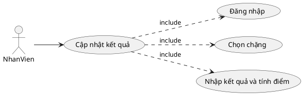
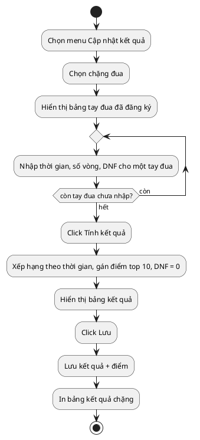
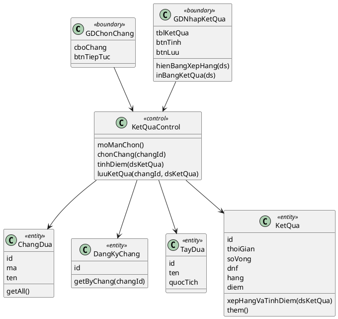
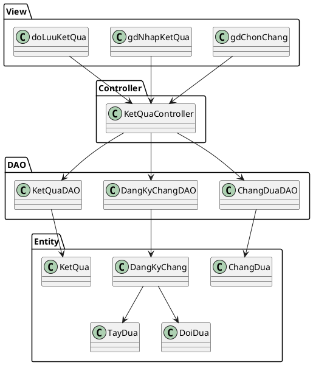
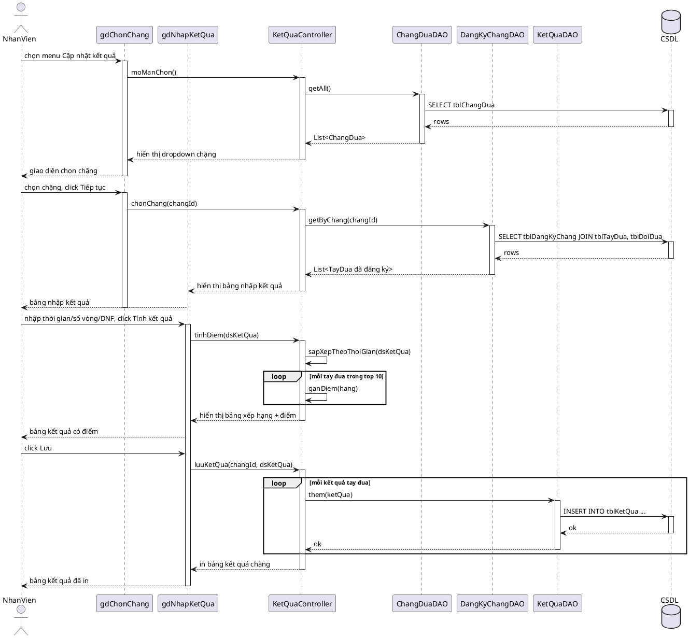

# Module 3 — Cập nhật kết quả và tính điểm chặng đua — Nội dung chi tiết

> Nội dung chữ do Claude dựng. Việc của bạn: mở Visual Paradigm, vẽ theo các blueprint/PlantUML bên dưới, export ảnh vào `hinh/`, rồi ghép vào báo cáo.

---

## 1. Biểu đồ UC chi tiết

Chức năng "Cập nhật kết quả" có các giao diện tương tác với nhân viên ⇒ tách use case con:
- Đăng nhập → UC `Đăng nhập`
- Chọn chặng → UC `Chọn chặng`
- Nhập kết quả và tính điểm → UC `Nhập kết quả và tính điểm`

Quan hệ: `Cập nhật kết quả` **include** {Đăng nhập, Chọn chặng, Nhập kết quả và tính điểm}.

## 2. Đặc tả Use Case

| Mục | Nội dung |
|---|---|
| **Use case** | Cập nhật kết quả và tính điểm chặng đua |
| **Actor** | Nhân viên |
| **Tiền điều kiện** | Nhân viên đã đăng nhập; chặng đua đã có tay đua đăng ký |
| **Hậu điều kiện** | Kết quả và điểm của từng tay đua trong chặng được lưu và in bảng kết quả |
| **Kịch bản chính** | 1. Nhân viên chọn menu "Cập nhật kết quả". 2. Hệ thống hiển thị giao diện chọn chặng đua. 3. Nhân viên chọn chặng đua. 4. Hệ thống hiển thị bảng các tay đua đã đăng ký, mỗi dòng có ô nhập thời gian về đích, số vòng, ô tick DNF. 5. Nhân viên nhập kết quả cho các tay đua, click Tính kết quả. 6. Hệ thống xếp hạng theo thời gian về đích (DNF xếp cuối), gán điểm top 10 theo 25/18/15/12/10/8/6/4/2/1 (DNF nhận 0 điểm), hiển thị bảng kết quả. 7. Nhân viên kiểm tra, click Lưu → hệ thống lưu kết quả + điểm và in bảng kết quả chặng. |
| **Ngoại lệ** | 5a. Tay đua chưa tick DNF nhưng bỏ trống hoặc nhập sai định dạng thời gian → báo lỗi, yêu cầu nhập lại. 7a. Chặng đã có kết quả từ trước → cảnh báo ghi đè trước khi lưu. |

## 3. Biểu đồ hoạt động (Activity)

## 4. Biểu đồ lớp phân tích (Boundary / Control / Entity)

- **Boundary:** `GDChonChang` (cboChang, btnTiepTuc), `GDNhapKetQua` (tblKetQua: thoiGian/soVong/chkDNF, btnTinh, btnLuu)
- **Control:** `KetQuaControl` điều phối luồng và tính điểm
- **Entity (kèm phương thức nghiệp vụ):** `ChangDua`, `DangKyChang`, `TayDua`, `KetQua`

> Quy tắc tính điểm (cài trong `xepHangVaTinhDiem`): sắp xếp tăng dần theo thời gian, tay đua DNF đẩy xuống cuối; bảng điểm `[25,18,15,12,10,8,6,4,2,1]` gán cho hạng 1..10; DNF hoặc hạng > 10 nhận 0 điểm.

## 5. Thiết kế giao diện

**Màn Chọn chặng:** danh sách thả xuống [Chặng đua] + nút [Tiếp tục].

**Màn Nhập kết quả:** bảng các tay đua đã đăng ký (cột Tay đua, Đội, ô nhập [Thời gian], ô nhập [Số vòng], checkbox [DNF]); nút [Tính kết quả] → sau khi tính, bảng bổ sung cột Hạng và Điểm, sắp xếp theo hạng; nút [Lưu]. Sau khi lưu → in bảng kết quả chặng.

> Vẽ 2 mockup này trong VP và export vào `hinh/gd-*.png`.

## 6. Biểu đồ lớp thiết kế (MVC)

- **View (jsp):** `gdChonChang.jsp`, `gdNhapKetQua.jsp`, `doLuuKetQua.jsp`
- **Controller:** `KetQuaController`
- **DAO:** `ChangDuaDAO` (getAll), `DangKyChangDAO` (getByChang), `KetQuaDAO` (getByChang, insert/update)
- **Entity:** `ChangDua`, `DangKyChang`, `TayDua`, `DoiDua`, `KetQua`

## 7. Biểu đồ tuần tự (Sequence) — luồng chính

> Chỉ vẽ luồng chính. Ngoại lệ (thiếu thời gian, ghi đè kết quả cũ) mô tả trong đặc tả UC mục 2. Có 2 khối `loop`: một khi tính điểm cho từng tay đua, một khi lưu từng kết quả.

## 8. Test case

| ID | Mục tiêu | Tiền điều kiện | Dữ liệu vào | Các bước | Kết quả mong đợi |
|---|---|---|---|---|---|
| TC1 | Tính điểm top 10 đúng | Chặng R có ≥10 tay đua đăng ký | Thời gian tăng dần cho các tay đua | Chọn R → nhập thời gian → Tính | Hạng 1=25đ, hạng 2=18đ, …, hạng 10=1đ; lưu + in |
| TC2 | DNF nhận 0 điểm | Chặng R, tay đua A về nhì theo thời gian nhưng DNF | A tick DNF | Nhập kết quả → Tính | A bị đẩy xuống cuối, điểm = 0 |
| TC3 | Chặn thiếu thời gian | Chặng R | Tay đua B không DNF, bỏ trống thời gian | Nhập thiếu → Tính | Báo lỗi thiếu thời gian, không tính |
| TC4 | Cảnh báo ghi đè | Chặng R đã có kết quả | Nhập lại kết quả mới | Chọn R → nhập → Lưu | Hệ thống cảnh báo ghi đè trước khi lưu |
