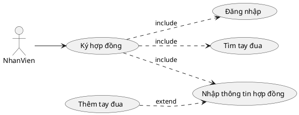
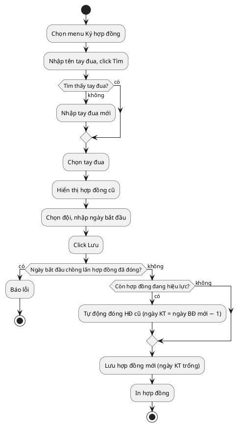
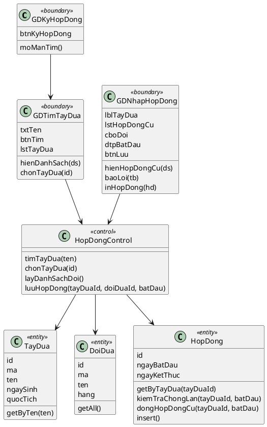
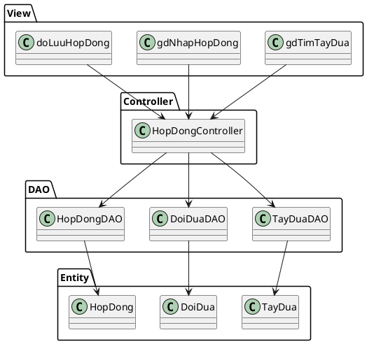
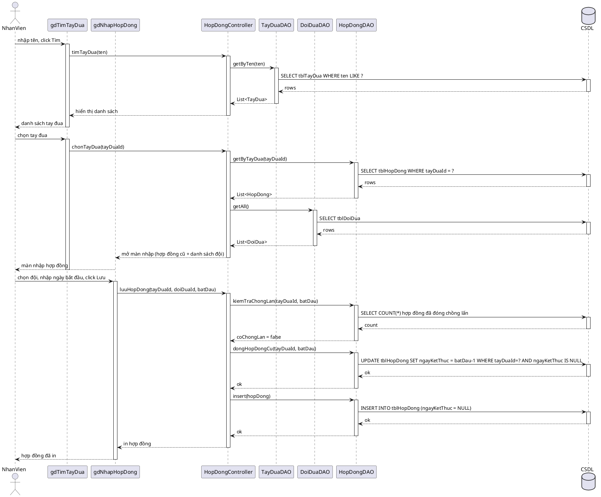

# Module 1 — Ký hợp đồng tay đua với đội đua — Nội dung chi tiết

> Nội dung chữ do Claude dựng. Việc của bạn: mở Visual Paradigm, vẽ theo các blueprint/PlantUML bên dưới, export ảnh vào `hinh/`, rồi ghép vào báo cáo.

## 0. Danh sách ảnh cần export (đặt vào `hinh/`)

| Tên file | Biểu đồ (mục) |
|---|---|
| `m1-uc-chitiet.png` | UC chi tiết (mục 1) |
| `m1-hoatdong.png` | Biểu đồ hoạt động (mục 3) |
| `m1-lop-phantich.png` | Biểu đồ lớp phân tích (mục 4) |
| `m1-giaodien-timtaydua.png` | Giao diện tìm tay đua (mục 5) |
| `m1-giaodien-nhaphopdong.png` | Giao diện nhập hợp đồng (mục 5) |
| `m1-lop-mvc.png` | Biểu đồ lớp thiết kế MVC (mục 6) |
| `m1-tuantu.png` | Biểu đồ tuần tự (mục 7) |

> **Quy tắc tên:** `m<số module>-<tên biểu đồ>.png` — chữ thường, không dấu, ngăn cách bằng `-`.

---

## 1. Biểu đồ UC chi tiết

Chức năng "Ký hợp đồng" có các giao diện tương tác với nhân viên ⇒ tách use case con:
- Đăng nhập → UC `Đăng nhập`
- Tìm tay đua → UC `Tìm tay đua`
- Nhập thông tin hợp đồng (chọn đội, ngày, lưu) → UC `Nhập thông tin hợp đồng`
- (mở rộng) Thêm tay đua mới khi không tìm thấy → UC `Thêm tay đua`

Quan hệ: `Ký hợp đồng` **include** {Đăng nhập, Tìm tay đua, Nhập thông tin hợp đồng}; `Nhập thông tin hợp đồng` **extend** bởi `Thêm tay đua` (chỉ khi tay đua chưa có).

## 2. Đặc tả Use Case

| Mục | Nội dung |
|---|---|
| **Use case** | Ký hợp đồng tay đua với đội đua |
| **Actor** | Nhân viên |
| **Tiền điều kiện** | Nhân viên đã đăng nhập thành công |
| **Hậu điều kiện** | Một hợp đồng mới hợp lệ được lưu vào hệ thống và in ra |
| **Kịch bản chính** | 1. Nhân viên chọn menu "Ký hợp đồng". 2. Hệ thống hiển thị giao diện tìm tay đua. 3. Nhân viên nhập tên tay đua và click Tìm. 4. Hệ thống hiển thị danh sách tay đua có tên chứa từ khóa. 5. Nhân viên chọn đúng tay đua. 6. Hệ thống hiển thị chi tiết tay đua và danh sách hợp đồng cũ (đội, ngày bắt đầu, ngày kết thúc — dòng có **ngày kết thúc trống là hợp đồng đang hiệu lực**). 7. Nhân viên chọn đội đua, **chỉ nhập ngày bắt đầu hiệu lực**, click Lưu. 8. Hệ thống: nếu tay đua còn hợp đồng đang hiệu lực thì **tự động đóng** hợp đồng cũ (đặt ngày kết thúc = ngày liền trước ngày bắt đầu mới); sau đó lưu hợp đồng mới (ngày kết thúc để trống) và in ra hợp đồng. |
| **Ngoại lệ** | 4a. Không tìm thấy tay đua → hệ thống cho phép nhập tay đua mới (UC Thêm tay đua) rồi quay lại bước 6. 8a. Ngày bắt đầu mới chồng lấn khoảng thời gian của một hợp đồng **đã đóng** (lịch sử) → báo lỗi "Tay đua đã có hợp đồng trong khoảng thời gian này", yêu cầu nhập lại. |

## 3. Biểu đồ hoạt động (Activity)

## 4. Biểu đồ lớp phân tích (Boundary / Control / Entity)

- **Boundary (1 lớp/màn hình):** `GDKyHopDong` (menu), `GDTimTayDua`, `GDNhapHopDong`
- **Control:** `HopDongControl` điều phối toàn bộ luồng
- **Entity (kèm phương thức nghiệp vụ gán trong pha phân tích):** `TayDua`, `DoiDua`, `HopDong`

## 5. Thiết kế giao diện

**Màn 1 — Tìm tay đua:** ô nhập "Tên tay đua" + nút [Tìm]; bảng kết quả (Mã, Tên, Ngày sinh, Quốc tịch) mỗi dòng có nút [Chọn]; nút [+ Thêm tay đua mới].

**Màn 2 — Nhập hợp đồng:** phần trên hiển thị thông tin tay đua đã chọn + bảng "Hợp đồng cũ" (Đội, Ngày bắt đầu, Ngày kết thúc — dòng ngày kết thúc trống là hợp đồng đang hiệu lực); phần dưới form: combobox [Đội đua], date [Ngày bắt đầu], nút [Lưu]. **Không nhập ngày kết thúc** — hợp đồng mở, ngày kết thúc để trống = đang hiệu lực (hệ thống tự đóng khi ký hợp đồng mới). Khi lưu lỗi → hiện thông báo đỏ dưới form.

> Vẽ 2 mockup này trong VP và export: màn tìm tay đua → `hinh/m1-giaodien-timtaydua.png`, màn nhập hợp đồng → `hinh/m1-giaodien-nhaphopdong.png`.

## 6. Biểu đồ lớp thiết kế (MVC)

- **View (jsp):** `gdTimTayDua.jsp`, `gdNhapHopDong.jsp`, `doLuuHopDong.jsp`
- **Controller:** `HopDongController`
- **DAO:** `TayDuaDAO` (getByTen), `DoiDuaDAO` (getAll), `HopDongDAO` (getByTayDua, kiemTraChongLan, dongHopDongCu, insert)
- **Entity:** `TayDua`, `DoiDua`, `HopDong`

## 7. Biểu đồ tuần tự (Sequence) — luồng chính

> Chỉ vẽ **luồng chính (thành công)**: 8 lifeline (có lifeline CSDL), mũi tên return, activation. Luồng chính thể hiện trường hợp tay đua chuyển đội (còn HĐ hiệu lực → hệ thống tự đóng HĐ cũ rồi tạo HĐ mới). Các ngoại lệ (không tìm thấy tay đua, chồng lấn khoảng đã đóng) đã mô tả trong đặc tả UC ở mục 2, không đưa vào sequence.

## 8. Test case

| ID | Mục tiêu | Tiền điều kiện | Dữ liệu vào | Các bước | Kết quả mong đợi |
|---|---|---|---|---|---|
| TC1 | Ký hợp đồng mới (hợp đồng mở) | Đã đăng nhập; tay đua A chưa có hợp đồng | Tay đua A, Đội X, từ 01/01/2026 (ngày kết thúc để trống) | Tìm A → chọn → chọn X, nhập ngày bắt đầu → Lưu | Lưu thành công (ngày kết thúc trống = đang hiệu lực), in hợp đồng |
| TC2 | Chặn chồng lấn lịch sử | Tay đua A có HĐ **đã đóng** với Đội Y 01/06/2025–31/12/2025 | Tay đua A, Đội X, từ 01/09/2025 | Tìm A → chọn → nhập ngày bắt đầu rơi vào khoảng đã đóng → Lưu | Báo lỗi "đã có hợp đồng trong khoảng thời gian này", không lưu |
| TC3 | Thêm tay đua khi không tìm thấy | Đã đăng nhập | Tên "Zzz" (chưa có) | Tìm "Zzz" → không có → Thêm mới | Hiện form thêm tay đua, thêm xong quay lại ký HĐ |
| TC4 | Tự động đóng HĐ cũ khi chuyển đội | Tay đua A đang có HĐ **hiệu lực** với Đội Y (từ 01/01/2026, ngày kết thúc trống) | Tay đua A, Đội X, từ 01/07/2026 | Tìm A → chọn → chọn X, nhập ngày bắt đầu → Lưu | Hệ thống tự đóng HĐ Y (ngày kết thúc = 30/06/2026), lưu HĐ X mới, in hợp đồng |
