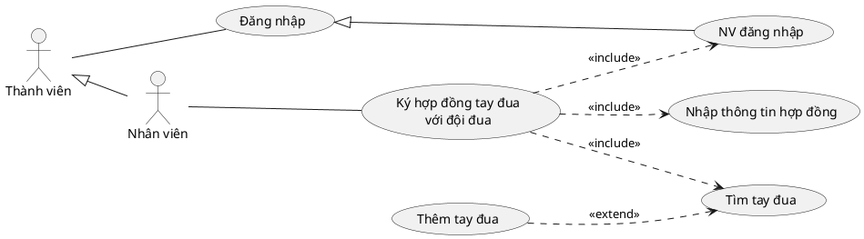
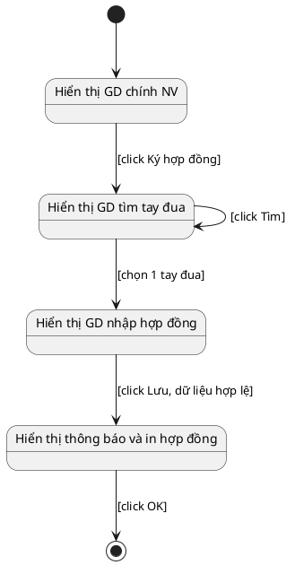
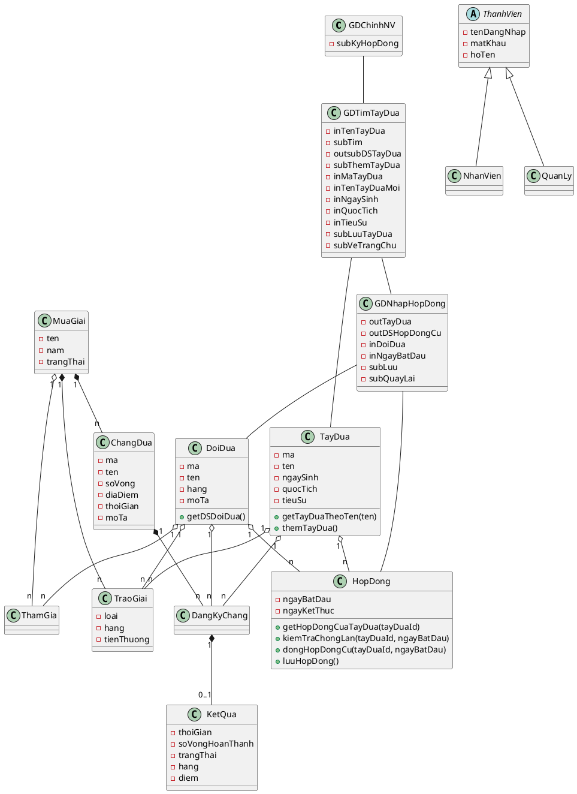
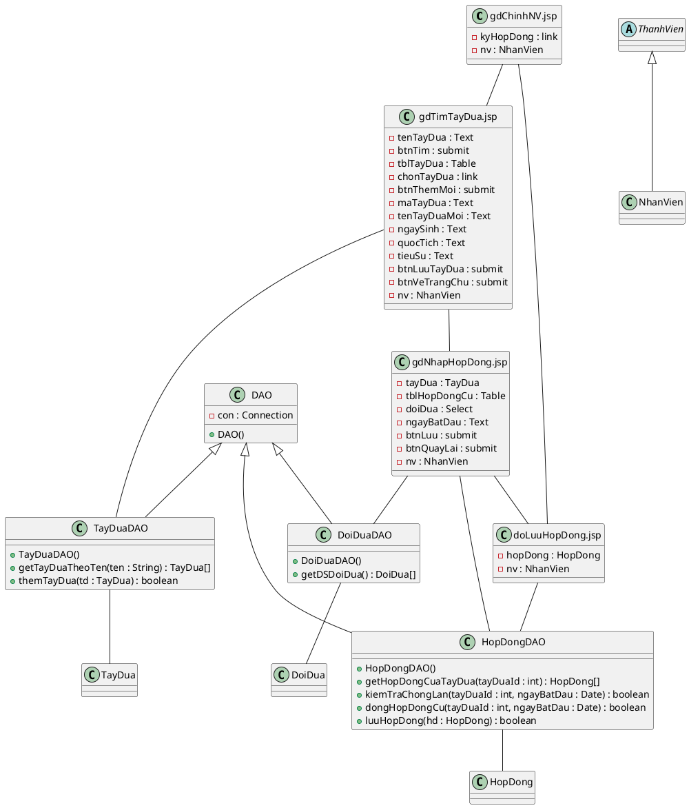
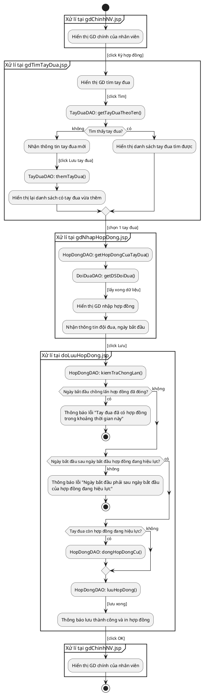
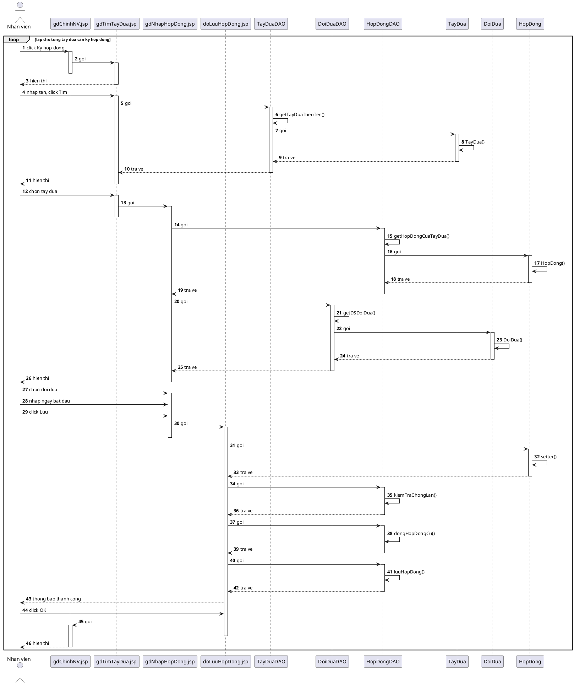

# Module 1 — Ký hợp đồng tay đua với đội đua — Nội dung chi tiết

> Tài liệu chi tiết của module. Việc của người phụ trách: mở Visual Paradigm, vẽ theo các blueprint/PlantUML bên dưới, export ảnh vào `hinh/`, rồi ghép vào báo cáo.

## 0. Danh sách ảnh cần export (đặt vào `hinh/`)

| Tên file | Biểu đồ (mục) |
|---|---|
| `m1-uc-chitiet.png` | Biểu đồ UC chi tiết (mục 1) |
| `m1-trangthai.png` | Biểu đồ trạng thái (mục 3) |
| `m1-lop-phantich.png` | Biểu đồ lớp phân tích (mục 4) |
| `m1-lop-mvc.png` | Biểu đồ lớp thiết kế: view (.jsp) / DAO / model (mục 5) |
| `m1-hoatdong.png` | Biểu đồ hoạt động pha thiết kế (mục 6) — **vẽ lại** |
| `m1-tuantu.png` | Biểu đồ tuần tự (mục 7) |

> Giao diện **không cần vẽ và không cần xuất ảnh** — đã trình bày dạng phác thảo xen giữa các bước của Kịch bản chính ở mục 2.

> Module 1 có **2 màn hình hiển thị riêng**, tương ứng 2 lớp biên `GDTimTayDua` / `GDNhapHopDong` và 2 trang `.jsp` hiển thị. Trang `doLuuHopDong.jsp` là trang xử lý, không phải màn hình hiển thị nên không sinh UC con và không sinh lớp biên. Trang chính `gdChinhNV.jsp` (lớp biên `GDChinhNV`) là trang chủ chung của hệ thống: có mặt trong biểu đồ lớp phân tích, lớp thiết kế và biểu đồ tuần tự nhưng **không sinh UC con**. UC con `Đăng nhập` dùng giao diện đăng nhập chung của toàn hệ thống nên cũng không được phác thảo riêng trong module.

> **Ghi chú cho người vẽ (mẫu hình trong giáo trình BG HP TTTN 2 CNPM — PDF):** biểu đồ trạng thái vẽ theo mẫu **Hình 3.9/3.11** (máy trạng thái đơn giản, nhãn cung `[hành động]`); biểu đồ hoạt động vẽ theo mẫu **Hình 4.9** (khung "Xử lí tại gdXxx.jsp", node DAO ghi rõ tên hàm); biểu đồ lớp thiết kế vẽ theo mẫu **Hình 4.4** (3 tầng jsp/DAO/entity, DAO kế thừa `DAO`, chữ ký đầy đủ); biểu đồ tuần tự vẽ theo mẫu **Hình 4.10/4.12** (đánh số message, trang chính mở đầu + kết thúc, luồng lưu có `setter()`).

> **Quy tắc tên:** `m<số module>-<tên biểu đồ>.png` — chữ thường, không dấu, ngăn cách bằng `-`.

---

## 1. Biểu đồ UC chi tiết

Mỗi giao diện tương tác với người dùng được đề xuất thành một use case con. Module 1 có 2 màn hình hiển thị nên có 2 UC con quan hệ `include`:

- Màn hình **Tìm tay đua** → UC con `Tìm tay đua` (include)
- Màn hình **Nhập hợp đồng** → UC con `Nhập thông tin hợp đồng` (include)

Ngoài ra có 1 UC mở rộng: khi nhân viên tìm mà không thấy tay đua trong hệ thống, nhân viên được phép thêm tay đua mới ngay trên **màn hình Tìm tay đua**. Vì vậy `Thêm tay đua` là quan hệ **extend của `Tìm tay đua`** (không phải của `Nhập thông tin hợp đồng`), và nó dùng lại chính lớp biên `GDTimTayDua` chứ không sinh thêm màn hình mới.

Đăng nhập là chức năng dùng chung của toàn hệ thống nên biểu đồ tách thành use case `Đăng nhập` gắn với actor cha **Thành viên**, còn use case `NV đăng nhập` **kế thừa** `Đăng nhập` cho vai trò Nhân viên; use case chính **include** `NV đăng nhập`. Module không tạo lớp biên, trang `.jsp` hay lifeline riêng cho đăng nhập; kịch bản vẫn mở đầu "sau khi đăng nhập" và dòng **Tiền điều kiện** của bảng đặc tả giữ nguyên "nhân viên đã đăng nhập". Trang chính `gdChinhNV.jsp` là trang chủ chung của hệ thống nên **không sinh use case con**.

```plantuml
@startuml
left to right direction

actor "Thành viên" as TV
actor "Nhân viên" as NV
TV <|-- NV

usecase "Đăng nhập" as DN
usecase "NV đăng nhập" as NVDN
usecase "Ký hợp đồng tay đua\nvới đội đua" as UC
usecase "Tìm tay đua" as TIM
usecase "Nhập thông tin hợp đồng" as NHAP
usecase "Thêm tay đua" as THEM

TV -- DN
NV -- UC

DN <|-- NVDN
UC ..> NVDN : <<include>>
UC ..> TIM : <<include>>
UC ..> NHAP : <<include>>
THEM ..> TIM : <<extend>>
@enduml
```

> Lưu ý khi vẽ trong Visual Paradigm: liên kết giữa actor và use case là **đường kẻ trơn**, không có mũi tên định hướng. Quan hệ `include` / `extend` vẽ bằng **mũi tên nét đứt** kèm stereotype tương ứng. Kiểm tra điều kiện "mọi UC phải có đường đi tới actor": `Nhân viên — Ký hợp đồng tay đua với đội đua` → include tới `Đăng nhập`, `Tìm tay đua` và `Nhập thông tin hợp đồng`; `Thêm tay đua` đi ngược chiều extend về `Tìm tay đua` rồi về actor.

## 2. Đặc tả Use Case

| Mục | Nội dung |
|---|---|
| **Use case** | Ký hợp đồng tay đua với đội đua |
| **Actor** | Nhân viên |
| **Tiền điều kiện** | Nhân viên đã đăng nhập thành công vào hệ thống; danh mục đội đua của mùa giải 2025 đã được khai báo |
| **Hậu điều kiện** | Một hợp đồng mới hợp lệ được lưu vào hệ thống với ngày kết thúc để trống (đang hiệu lực); hợp đồng cũ đang hiệu lực của tay đua (nếu có) được đóng lại; hợp đồng mới được in ra |

> Phác thảo giao diện đặt ngay dưới bước mà hệ thống hiển thị màn hình tương ứng. Module có **2 màn hình hiển thị riêng** (`gdTimTayDua.jsp`, `gdNhapHopDong.jsp`); trang chính `gdChinhNV.jsp` và màn hình đăng nhập dùng chung cho toàn hệ thống nên không phác thảo lại ở đây.

**Kịch bản chính**

1. Nhân viên (đã đăng nhập) chọn menu **Ký hợp đồng** trên trang chính `gdChinhNV.jsp`.
2. Hệ thống hiển thị màn hình **Tìm tay đua** (`gdTimTayDua.jsp`): ô nhập "Tên tay đua" đang rỗng, nút [Tìm] luôn active, nút [+ Thêm tay đua mới]; bảng kết quả đang rỗng và form thêm tay đua chưa hiện.

   **Màn hình *Tìm tay đua* (`gdTimTayDua.jsp`)**

   | Thành phần | Kiểu | Trạng thái khi mới mở màn |
   |---|---|---|
   | Tên tay đua | ô nhập | rỗng, con trỏ đặt sẵn |
   | [Tìm] | nút | active |
   | [+ Thêm tay đua mới] | nút | active |
   | [Về trang chủ] | nút | active |
   | Kết quả tìm kiếm | bảng | rỗng — nội dung hiện ở bước 4, mỗi dòng có nút [Chọn] |
   | Mã, Tên, Ngày sinh, Quốc tịch, Tiểu sử (form thêm tay đua) | ô nhập | chưa hiện, chỉ hiện khi click [+ Thêm tay đua mới] |
   | [Lưu tay đua] | nút | chưa hiện; khi hiện thì chưa active cho tới khi nhập đủ mã, tên, ngày sinh, quốc tịch |

3. Nhân viên nhập tên `Hamilton` và click [Tìm].
4. Hệ thống hiển thị bảng kết quả tìm kiếm, mỗi dòng có nút [Chọn]; cột "Đội hiện tại" lấy từ hợp đồng có ngày kết thúc trống của tay đua:

   | TT | Mã | Tên | Ngày sinh | Quốc tịch | Đội hiện tại | Thao tác |
   |---|---|---|---|---|---|---|
   | 1 | HAM | Lewis Hamilton | 07/01/1985 | Anh | Mercedes | [Chọn] |

5. Nhân viên click [Chọn] ở dòng `HAM`.
6. Hệ thống hiển thị màn hình **Nhập hợp đồng** (`gdNhapHopDong.jsp`): vùng chỉ đọc ghi `HAM — Lewis Hamilton — 07/01/1985 — Anh`; ô chọn "Đội đua" (danh sách thả xuống gồm Ferrari, Red Bull, McLaren, Mercedes, Aston Martin, Williams) và ô "Ngày bắt đầu" đang rỗng; màn hình **không có ô nhập Ngày kết thúc** — hợp đồng mới luôn được lưu ở trạng thái mở, hệ thống tự đóng khi tay đua ký hợp đồng tiếp theo; nút [Lưu] **chưa được active**.

   **Màn hình *Nhập hợp đồng* (`gdNhapHopDong.jsp`)**

   | Thành phần | Kiểu | Trạng thái khi mới mở màn |
   |---|---|---|
   | Tay đua | vùng chỉ đọc | `HAM — Lewis Hamilton — 07/01/1985 — Anh` |
   | Hợp đồng cũ | bảng | nội dung ở bảng ngay dưới |
   | Đội đua | danh sách thả xuống | `-- chọn đội đua --`; 6 đội của mùa giải |
   | Ngày bắt đầu | ô nhập | rỗng |
   | Ngày kết thúc | — | không có trên màn hình — hợp đồng mới luôn lưu ở trạng thái mở |
   | [Lưu] | nút | chưa active cho tới khi chọn đủ đội đua và ngày bắt đầu |
   | [Quay lại] | nút | active |

   Bảng "Hợp đồng cũ" của tay đua `HAM — Lewis Hamilton` lúc mới mở màn hình — **dòng có ngày kết thúc trống là hợp đồng đang hiệu lực**:

   | TT | Đội đua | Ngày bắt đầu | Ngày kết thúc |
   |---|---|---|---|
   | 1 | Mercedes | 01/01/2013 | (trống) |

7. Nhân viên chọn `Ferrari` trong ô "Đội đua" và nhập "Ngày bắt đầu" = `01/01/2025`; nút [Lưu] **chuyển sang active**.
8. Nhân viên click [Lưu]; màn hình gửi dữ liệu sang trang xử lý `doLuuHopDong.jsp`.
9. Hệ thống kiểm tra ngày `01/01/2025` không rơi vào khoảng thời gian của bất kỳ hợp đồng đã đóng nào của Lewis Hamilton.
10. Hệ thống tự động đóng hợp đồng đang hiệu lực với Mercedes: đặt ngày kết thúc = `31/12/2024` (ngày liền trước ngày bắt đầu mới).
11. Hệ thống lưu hợp đồng mới: `Lewis Hamilton — Ferrari — 01/01/2025 — ngày kết thúc để trống`.
12. Hệ thống hiển thị thông báo màu xanh "Lưu hợp đồng thành công" kèm bản in hợp đồng; bảng "Hợp đồng cũ" nạp lại thành 2 dòng:

    | TT | Đội đua | Ngày bắt đầu | Ngày kết thúc |
    |---|---|---|---|
    | 1 | Mercedes | 01/01/2013 | 31/12/2024 |
    | 2 | Ferrari | 01/01/2025 | (trống) |

13. Nhân viên click [OK]; hệ thống quay về trang chính của nhân viên.

*(Lặp lại từ bước 1 cho từng tay đua cần ký hợp đồng, cho đến khi nhân viên ký xong toàn bộ.)*

**Ngoại lệ**

- **4a.** Không tìm thấy tay đua nào khớp từ khóa (ví dụ nhập `Antonelli`) → hệ thống hiển thị dòng "Không tìm thấy tay đua nào", nút [+ Thêm tay đua mới] vẫn hiển thị; nhân viên click [+ Thêm tay đua mới] để mở form thêm ngay trên màn hình này, nhập Mã `ANT`, Tên `Andrea Kimi Antonelli`, Ngày sinh `25/08/2006`, Quốc tịch `Ý`, Tiểu sử rồi click [Lưu tay đua] — nút [Lưu tay đua] **chỉ chuyển sang active** khi đã nhập đủ mã, tên, ngày sinh và quốc tịch; lưu xong form đóng lại và hệ thống quay lại bước 4 với bảng kết quả có 1 dòng `ANT`, `Andrea Kimi Antonelli`, `25/08/2006`, `Ý`, `(chưa có)`.
- **7a.** Nhân viên chưa chọn đội đua hoặc chưa nhập ngày bắt đầu → nút [Lưu] vẫn **chưa được active**, không thể chuyển sang bước 8.
- **9a.** Ngày bắt đầu rơi vào khoảng thời gian của một hợp đồng **đã đóng** (ví dụ Carlos Sainz có hợp đồng Ferrari `01/01/2021–31/12/2024`, nhân viên nhập ngày bắt đầu `01/06/2023`) → hệ thống hiện thông báo lỗi màu đỏ ngay dưới form: "Tay đua đã có hợp đồng trong khoảng thời gian này", không lưu, màn hình giữ nguyên dữ liệu đã nhập và quay lại bước 7.
- **9b.** Ngày bắt đầu mới nhỏ hơn hoặc bằng ngày bắt đầu của hợp đồng đang hiệu lực (ví dụ nhập `01/01/2010` trong khi hợp đồng Mercedes bắt đầu `01/01/2013`) → hệ thống báo lỗi "Ngày bắt đầu phải sau ngày bắt đầu của hợp đồng đang hiệu lực", không lưu, quay lại bước 7.
- **10a.** Tay đua chưa có hợp đồng nào đang hiệu lực (ví dụ Oscar Piastri) → bảng "Hợp đồng cũ" ở bước 6 rỗng; hệ thống bỏ qua bước 10 và chuyển thẳng sang bước 11.

> **Ánh xạ sang lớp biên:** màn *Tìm tay đua* (`GDTimTayDua`) — ô "Tên tay đua" = `-inTenTayDua`, nút [Tìm] = `-subTim`, bảng kết quả vừa hiện vừa cho chọn = `-outsubDSTayDua`, nút [+ Thêm tay đua mới] = `-subThemTayDua`, nút [Về trang chủ] = `-subVeTrangChu`; các ô của form thêm tay đua = `-inMaTayDua`, `-inTenTayDuaMoi`, `-inNgaySinh`, `-inQuocTich`, `-inTieuSu` và nút [Lưu tay đua] = `-subLuuTayDua`. Màn *Nhập hợp đồng* (`GDNhapHopDong`) — vùng thông tin tay đua đã chọn = `-outTayDua`, bảng "Hợp đồng cũ" = `-outDSHopDongCu`, ô chọn "Đội đua" = `-inDoiDua`, ô "Ngày bắt đầu" = `-inNgayBatDau`, nút [Lưu] = `-subLuu`, nút [Quay lại] = `-subQuayLai`.

> Luồng chuyển màn: **Trang chính → Tìm tay đua → Nhập hợp đồng → (lưu) → Trang chính**.

## 3. Phân tích hoạt động — biểu đồ trạng thái

Mỗi trạng thái ứng với một lần hệ thống hiển thị một giao diện và chờ người dùng tương tác; cung chuyển trạng thái là hành động của người dùng, nhãn viết trong ngoặc vuông `[…]`. Biểu đồ bắt đầu từ trạng thái hiển thị **giao diện chính của nhân viên** và kết thúc sau khi nhân viên xác nhận thông báo lưu thành công:

- `Hiển thị GD chính NV` —`[click Ký hợp đồng]`→ `Hiển thị GD tìm tay đua`
- `Hiển thị GD tìm tay đua` có **cung tự quay** `[click Tìm]` (nhân viên tìm nhiều lần đến khi thấy tay đua cần ký)
- `Hiển thị GD tìm tay đua` —`[chọn 1 tay đua]`→ `Hiển thị GD nhập hợp đồng`
- `Hiển thị GD nhập hợp đồng` —`[click Lưu, dữ liệu hợp lệ]`→ `Hiển thị thông báo và in hợp đồng`
- `Hiển thị thông báo và in hợp đồng` —`[click OK]`→ Kết thúc

Ảnh export: `hinh/m1-trangthai.png` — vẽ theo mẫu **Hình 3.9/3.11** của giáo trình PDF.

```plantuml
@startuml
state "Hiển thị GD chính NV" as S1
state "Hiển thị GD tìm tay đua" as S2
state "Hiển thị GD nhập hợp đồng" as S3
state "Hiển thị thông báo và in hợp đồng" as S4
[*] --> S1
S1 --> S2 : [click Ký hợp đồng]
S2 --> S2 : [click Tìm]
S2 --> S3 : [chọn 1 tay đua]
S3 --> S4 : [click Lưu, dữ liệu hợp lệ]
S4 --> [*] : [click OK]
@enduml
```

> Luồng xử lý chi tiết theo từng trang (kèm các node quyết định cho từng ràng buộc nghiệp vụ `4a`, `9a`, `9b`, `10a` ở mục 2) được thể hiện ở **biểu đồ hoạt động pha thiết kế** (mục 6).

## 4. Biểu đồ lớp phân tích

Biểu đồ lớp phân tích của module chỉ có **2 tầng**: lớp biên và lớp thực thể. **Không có lớp Control** — mọi hành động nghiệp vụ được gán thẳng cho lớp thực thể phù hợp. Hộp lớp để trơn, **không dùng stereotype**. Quan hệ chỉ dùng **đường kẻ trơn**, hình thoi rỗng ◇, hình thoi đặc ♦ và tam giác rỗng ▷ — **không có mũi tên định hướng**.

**Lớp biên (mỗi màn hình → 1 lớp biên, chỉ có thuộc tính, không có phương thức):** ngoài 2 lớp biên của 2 màn hình riêng, module có thêm lớp biên **trang chính của nhân viên** `GDChinhNV` — trang chủ chung của hệ thống, không sinh UC con — nối bằng đường kẻ trơn sang lớp biên đầu tiên của module (`GDTimTayDua`).

| Lớp biên | Thuộc tính | Ý nghĩa |
|---|---|---|
| `GDChinhNV` | `-subKyHopDong` | liên kết "Ký hợp đồng" trên trang chính (trang chủ chung của hệ thống) |
| `GDTimTayDua` | `-inTenTayDua` | ô nhập tên tay đua |
| | `-subTim` | nút [Tìm] |
| | `-outsubDSTayDua` | bảng kết quả vừa hiện vừa cho chọn |
| | `-subThemTayDua` | nút [+ Thêm tay đua mới] |
| | `-inMaTayDua` | ô nhập mã tay đua mới (form thêm tay đua) |
| | `-inTenTayDuaMoi` | ô nhập tên tay đua mới (form thêm tay đua) |
| | `-inNgaySinh` | ô nhập ngày sinh (form thêm tay đua) |
| | `-inQuocTich` | ô nhập quốc tịch (form thêm tay đua) |
| | `-inTieuSu` | ô nhập tiểu sử (form thêm tay đua) |
| | `-subLuuTayDua` | nút [Lưu tay đua] (form thêm tay đua) |
| | `-subVeTrangChu` | nút [Về trang chủ] |
| `GDNhapHopDong` | `-outTayDua` | vùng hiện thông tin tay đua đã chọn |
| | `-outDSHopDongCu` | bảng hiện danh sách hợp đồng cũ |
| | `-inDoiDua` | ô chọn đội đua |
| | `-inNgayBatDau` | ô nhập ngày bắt đầu |
| | `-subLuu` | nút [Lưu] |
| | `-subQuayLai` | nút [Quay lại] |

**Phương thức nghiệp vụ gán cho lớp thực thể:**

| Chức năng ở tầng dưới giao diện | Gán cho lớp thực thể | Phương thức |
|---|---|---|
| Tìm tay đua theo tên | `TayDua` | `getTayDuaTheoTen(ten)` |
| Thêm tay đua mới | `TayDua` | `themTayDua()` |
| Lấy danh sách đội đua để chọn | `DoiDua` | `getDSDoiDua()` |
| Lấy hợp đồng cũ của tay đua | `HopDong` | `getHopDongCuaTayDua(tayDuaId)` |
| Kiểm tra chồng lấn thời gian | `HopDong` | `kiemTraChongLan(tayDuaId, ngayBatDau)` |
| Đóng hợp đồng cũ đang hiệu lực | `HopDong` | `dongHopDongCu(tayDuaId, ngayBatDau)` |
| Lưu hợp đồng mới | `HopDong` | `luuHopDong()` |

Sáu thuộc tính `-inMaTayDua`, `-inTenTayDuaMoi`, `-inNgaySinh`, `-inQuocTich`, `-inTieuSu`, `-subLuuTayDua` thuộc **form thêm tay đua** — form này nằm ngay trên màn hình **Tìm tay đua** (use case mở rộng `Thêm tay đua` extend từ `Tìm tay đua`), không phải một màn hình riêng, nên các thành phần của nó là thuộc tính của chính lớp biên `GDTimTayDua`. Nguyên tắc áp dụng: mỗi thành phần nhận dữ liệu vào / hiện dữ liệu ra / submit trên một màn hình đều phải có đúng một thuộc tính tương ứng ở lớp biên của màn hình đó.

Ở pha phân tích, lớp thực thể **chưa có thuộc tính `id`** và **chưa khai báo kiểu dữ liệu**. Toàn bộ quan hệ giữa các lớp thực thể được giữ **thống nhất với biểu đồ lớp thực thể chung của nhóm** (`docs/03`), kể cả những lớp không tham gia trực tiếp vào module 1. Về phương thức, biểu đồ **chỉ vẽ những phương thức nghiệp vụ mà module 1 sử dụng**; các phương thức khác của cùng những lớp thực thể này (ví dụ `HopDong.getTayDuaHieuLuc()` của module 2, `KetQua.xepHangVaTinhDiem()` của module 3, `KetQua.tongHopCaNhan()` của module 4) được vẽ ở biểu đồ của module tương ứng — danh sách đầy đủ xem `docs/03`.

```plantuml
@startuml
class GDChinhNV {
  -subKyHopDong
}
class GDTimTayDua {
  -inTenTayDua
  -subTim
  -outsubDSTayDua
  -subThemTayDua
  -inMaTayDua
  -inTenTayDuaMoi
  -inNgaySinh
  -inQuocTich
  -inTieuSu
  -subLuuTayDua
  -subVeTrangChu
}
class GDNhapHopDong {
  -outTayDua
  -outDSHopDongCu
  -inDoiDua
  -inNgayBatDau
  -subLuu
  -subQuayLai
}

class MuaGiai {
  -ten
  -nam
  -trangThai
}
class DoiDua {
  -ma
  -ten
  -hang
  -moTa
  +getDSDoiDua()
}
class TayDua {
  -ma
  -ten
  -ngaySinh
  -quocTich
  -tieuSu
  +getTayDuaTheoTen(ten)
  +themTayDua()
}
class ChangDua {
  -ma
  -ten
  -soVong
  -diaDiem
  -thoiGian
  -moTa
}
class ThamGia {
}
class HopDong {
  -ngayBatDau
  -ngayKetThuc
  +getHopDongCuaTayDua(tayDuaId)
  +kiemTraChongLan(tayDuaId, ngayBatDau)
  +dongHopDongCu(tayDuaId, ngayBatDau)
  +luuHopDong()
}
class DangKyChang {
}
class KetQua {
  -thoiGian
  -soVongHoanThanh
  -trangThai
  -hang
  -diem
}
class TraoGiai {
  -loai
  -hang
  -tienThuong
}
abstract class ThanhVien {
  -tenDangNhap
  -matKhau
  -hoTen
}
class NhanVien {
}
class QuanLy {
}

GDChinhNV -- GDTimTayDua
GDTimTayDua -- TayDua
GDTimTayDua -- GDNhapHopDong
GDNhapHopDong -- DoiDua
GDNhapHopDong -- HopDong

MuaGiai "1" *-- "n" ChangDua
MuaGiai "1" o-- "n" ThamGia
DoiDua "1" o-- "n" ThamGia
TayDua "1" o-- "n" HopDong
DoiDua "1" o-- "n" HopDong
ChangDua "1" *-- "n" DangKyChang
TayDua "1" o-- "n" DangKyChang
DoiDua "1" o-- "n" DangKyChang
DangKyChang "1" *-- "0..1" KetQua
MuaGiai "1" *-- "n" TraoGiai
TayDua "1" o-- "n" TraoGiai
DoiDua "1" o-- "n" TraoGiai
ThanhVien <|-- NhanVien
ThanhVien <|-- QuanLy
@enduml
```

## 5. Biểu đồ lớp thiết kế (view / DAO / model)

Kiến trúc phân tầng theo mô hình MVC, trong đó **M** là các lớp thực thể (`model`), **V** là các trang `.jsp` (`view`), **C** là **các lớp `XxxDAO`** đóng vai trò tầng điều khiển / truy xuất dữ liệu. **Không có lớp `XxxController` riêng.** Các lớp `XxxDAO` đều **kế thừa lớp cha `DAO`** để dùng chung cơ chế kết nối cơ sở dữ liệu. Quan hệ giữa các lớp vẽ bằng **đường kẻ trơn**, không có mũi tên định hướng; riêng kế thừa dùng tam giác rỗng ▷.

- **View (jsp):** `gdChinhNV.jsp` (trang chính của nhân viên), `gdTimTayDua.jsp` (màn hình hiển thị), `gdNhapHopDong.jsp` (màn hình hiển thị), `doLuuHopDong.jsp` (trang xử lý, không hiển thị)
- **DAO:** lớp cha `DAO`; các lớp con `TayDuaDAO`, `DoiDuaDAO`, `HopDongDAO`
- **Model:** `TayDua`, `DoiDua`, `HopDong`, `ThanhVien`, `NhanVien` (đối tượng phiên của các trang jsp)

Mỗi lớp view có **thuộc tính kèm kiểu control** (`Select` — danh sách thả xuống, `Table` — bảng, `link` — liên kết/click dòng, `submit` — nút, `Text` — ô nhập, `Reset` — nút xóa nhập) và **thuộc tính ẩn**: đối tượng phiên (`-nv : NhanVien`) và dữ liệu truyền giữa các trang (`-tayDua : TayDua`, `-hopDong : HopDong`). Mỗi lớp `XxxDAO` có **constructor** và các phương thức với **chữ ký đầy đủ** (tham số : kiểu, kiểu trả về — mảng `Xxx[]` cho thao tác đọc, `boolean` cho thao tác ghi); tất cả kế thừa lớp cha `DAO` để dùng chung kết nối cơ sở dữ liệu.

```plantuml
@startuml
class "gdChinhNV.jsp" as gdChinhNV {
  -kyHopDong : link
  -nv : NhanVien
}
class "gdTimTayDua.jsp" as gdTimTayDua {
  -tenTayDua : Text
  -btnTim : submit
  -tblTayDua : Table
  -chonTayDua : link
  -btnThemMoi : submit
  -maTayDua : Text
  -tenTayDuaMoi : Text
  -ngaySinh : Text
  -quocTich : Text
  -tieuSu : Text
  -btnLuuTayDua : submit
  -btnVeTrangChu : submit
  -nv : NhanVien
}
class "gdNhapHopDong.jsp" as gdNhapHopDong {
  -tayDua : TayDua
  -tblHopDongCu : Table
  -doiDua : Select
  -ngayBatDau : Text
  -btnLuu : submit
  -btnQuayLai : submit
  -nv : NhanVien
}
class "doLuuHopDong.jsp" as doLuuHopDong {
  -hopDong : HopDong
  -nv : NhanVien
}
class DAO {
  -con : Connection
  +DAO()
}
class TayDuaDAO {
  +TayDuaDAO()
  +getTayDuaTheoTen(ten : String) : TayDua[]
  +themTayDua(td : TayDua) : boolean
}
class DoiDuaDAO {
  +DoiDuaDAO()
  +getDSDoiDua() : DoiDua[]
}
class HopDongDAO {
  +HopDongDAO()
  +getHopDongCuaTayDua(tayDuaId : int) : HopDong[]
  +kiemTraChongLan(tayDuaId : int, ngayBatDau : Date) : boolean
  +dongHopDongCu(tayDuaId : int, ngayBatDau : Date) : boolean
  +luuHopDong(hd : HopDong) : boolean
}
class TayDua
class DoiDua
class HopDong

abstract class ThanhVien
class NhanVien
ThanhVien <|-- NhanVien
DAO <|-- TayDuaDAO
DAO <|-- DoiDuaDAO
DAO <|-- HopDongDAO
gdChinhNV -- gdTimTayDua
gdTimTayDua -- TayDuaDAO
gdTimTayDua -- gdNhapHopDong
gdNhapHopDong -- DoiDuaDAO
gdNhapHopDong -- HopDongDAO
gdNhapHopDong -- doLuuHopDong
doLuuHopDong -- gdChinhNV
doLuuHopDong -- HopDongDAO
TayDuaDAO -- TayDua
DoiDuaDAO -- DoiDua
HopDongDAO -- HopDong
@enduml
```

> Ghi chú: mỗi `XxxDAO` **chỉ vẽ những phương thức mà module 1 sử dụng**. Ví dụ `HopDongDAO.getTayDuaHieuLuc(doiDuaId, thoiGianChang)` do Module 2 sử dụng nên được vẽ ở biểu đồ lớp thiết kế của Module 2, không vẽ lại ở đây; danh sách đầy đủ phương thức của từng lớp xem `docs/03-lop-thuc-the-va-csdl.md`. Các thuộc tính `-maTayDua` … `-btnLuuTayDua` của `gdTimTayDua.jsp` thuộc **form thêm tay đua** đặt ngay trên trang tìm (UC mở rộng `Thêm tay đua` extend từ `Tìm tay đua`), không phải trang riêng.

## 6. Biểu đồ hoạt động (pha thiết kế)

Mỗi hành động trong biểu đồ hoạt động tương ứng một phương thức đã thiết kế trong biểu đồ lớp (mục 5). Các hành động được gom thành từng khung (partition) **"Xử lí tại gdXxx.jsp"** theo trang thực hiện — kể cả trang chính `gdChinhNV.jsp` và trang xử lý `doLuuHopDong.jsp`; lời gọi tầng dưới là **node riêng đặt NGOÀI khung**, ghi `XxxDAO: tenHam()`, nối bằng mũi tên từ hành động gọi nó; điều kiện chuyển ghi trong ngoặc vuông (`[click Lưu]`, `[lấy xong dữ liệu]`, `[lưu xong]`); các ràng buộc nghiệp vụ (`9a`, `9b`, `10a` ở mục 2) được kiểm tra bằng **node quyết định** trong khung của trang xử lý `doLuuHopDong.jsp`; ràng buộc `4a` (không tìm thấy tay đua → thêm mới) là node quyết định trong khung `gdTimTayDua.jsp`. Biểu đồ có node Bắt đầu và Kết thúc. Khung `gdChinhNV.jsp` xuất hiện ở **đầu** (mở chức năng) và **cuối** (quay về trang chính sau khi nhân viên click [OK] trên thông báo lưu thành công) — khớp với thuyết minh bước 44–46 và biểu đồ tuần tự ở mục 7.

Ảnh export: `hinh/m1-hoatdong.png` — **vẽ lại** theo mẫu **Hình 4.9** của giáo trình PDF (khung "Xử lí tại gdXxx.jsp", node DAO ghi rõ tên hàm).

```plantuml
@startuml
start
partition "Xử lí tại gdChinhNV.jsp" {
  :Hiển thị GD chính của nhân viên;
}
-> [click Ký hợp đồng];
partition "Xử lí tại gdTimTayDua.jsp" {
  :Hiển thị GD tìm tay đua;
  -> [click Tìm];
  :TayDuaDAO: getTayDuaTheoTen();
  if (Tìm thấy tay đua?) then (không)
    :Nhận thông tin tay đua mới;
    -> [click Lưu tay đua];
    :TayDuaDAO: themTayDua();
    :Hiển thị lại danh sách có tay đua vừa thêm;
  else (có)
    :Hiển thị danh sách tay đua tìm được;
  endif
}
-> [chọn 1 tay đua];
partition "Xử lí tại gdNhapHopDong.jsp" {
  :HopDongDAO: getHopDongCuaTayDua();
  :DoiDuaDAO: getDSDoiDua();
  -> [lấy xong dữ liệu];
  :Hiển thị GD nhập hợp đồng;
  :Nhận thông tin đội đua, ngày bắt đầu;
}
-> [click Lưu];
partition "Xử lí tại doLuuHopDong.jsp" {
  :HopDongDAO: kiemTraChongLan();
  if (Ngày bắt đầu chồng lấn hợp đồng đã đóng?) then (có)
    :Thông báo lỗi "Tay đua đã có hợp đồng
trong khoảng thời gian này";
    stop
  else (không)
  endif
  if (Ngày bắt đầu sau ngày bắt đầu hợp đồng đang hiệu lực?) then (không)
    :Thông báo lỗi "Ngày bắt đầu phải sau ngày bắt đầu
của hợp đồng đang hiệu lực";
    stop
  else (có)
  endif
  if (Tay đua còn hợp đồng đang hiệu lực?) then (có)
    :HopDongDAO: dongHopDongCu();
  else (không)
  endif
  :HopDongDAO: luuHopDong();
  -> [lưu xong];
  :Thông báo lưu thành công và in hợp đồng;
}
-> [click OK];
partition "Xử lí tại gdChinhNV.jsp " {
  :Hiển thị GD chính của nhân viên;
}
stop
@enduml
```

## 7. Thuyết minh (kịch bản phiên bản 3) và biểu đồ tuần tự

### 7.1. Thuyết minh (kịch bản phiên bản 3)

Kịch bản dưới đây là luồng chính (thành công) của trường hợp tay đua chuyển đội: Lewis Hamilton đang có hợp đồng hiệu lực với Mercedes, ký hợp đồng mới với Ferrari từ `01/01/2025`. Luồng mở đầu và kết thúc tại **trang chính của nhân viên** `gdChinhNV.jsp`; **luồng lưu**: lớp thực thể `HopDong` tự gọi `setter()` đóng gói dữ liệu nhập **trước**, sau đó trang xử lý mới gọi các hàm của `HopDongDAO` (không gọi constructor thực thể ở luồng lưu). Mỗi dòng thuyết minh tương ứng đúng một message trong biểu đồ tuần tự ở mục 7.2.

1. Nhân viên click [Ký hợp đồng] trên trang chính `gdChinhNV.jsp`.
2. Trang `gdChinhNV.jsp` gọi trang `gdTimTayDua.jsp`.
3. Trang `gdTimTayDua.jsp` hiển thị màn hình tìm tay đua cho nhân viên.
4. Nhân viên nhập tên `Hamilton` và click [Tìm] trên trang `gdTimTayDua.jsp`.
5. Trang `gdTimTayDua.jsp` gọi lớp `TayDuaDAO` yêu cầu tìm tay đua theo tên.
6. Lớp `TayDuaDAO` gọi hàm `getTayDuaTheoTen()`.
7. Hàm `getTayDuaTheoTen()` gọi lớp `TayDua` để đóng gói thông tin.
8. Lớp `TayDua` đóng gói thông tin thực thể.
9. Lớp `TayDua` trả kết quả về cho hàm `getTayDuaTheoTen()`.
10. Hàm `getTayDuaTheoTen()` trả kết quả cho trang `gdTimTayDua.jsp`.
11. Trang `gdTimTayDua.jsp` hiển thị danh sách tay đua tìm được cho nhân viên.
12. Nhân viên chọn tay đua `Lewis Hamilton` trên trang `gdTimTayDua.jsp`.
13. Trang `gdTimTayDua.jsp` gọi trang `gdNhapHopDong.jsp`.
14. Trang `gdNhapHopDong.jsp` gọi lớp `HopDongDAO` yêu cầu tìm danh sách hợp đồng cũ của tay đua.
15. Lớp `HopDongDAO` gọi hàm `getHopDongCuaTayDua()`.
16. Hàm `getHopDongCuaTayDua()` gọi lớp `HopDong` để đóng gói thông tin.
17. Lớp `HopDong` đóng gói thông tin thực thể.
18. Lớp `HopDong` trả kết quả về cho hàm `getHopDongCuaTayDua()`.
19. Hàm `getHopDongCuaTayDua()` trả kết quả cho trang `gdNhapHopDong.jsp`.
20. Trang `gdNhapHopDong.jsp` gọi lớp `DoiDuaDAO` yêu cầu tìm danh sách đội đua.
21. Lớp `DoiDuaDAO` gọi hàm `getDSDoiDua()`.
22. Hàm `getDSDoiDua()` gọi lớp `DoiDua` để đóng gói thông tin.
23. Lớp `DoiDua` đóng gói thông tin thực thể.
24. Lớp `DoiDua` trả kết quả về cho hàm `getDSDoiDua()`.
25. Hàm `getDSDoiDua()` trả kết quả cho trang `gdNhapHopDong.jsp`.
26. Trang `gdNhapHopDong.jsp` hiển thị màn hình nhập hợp đồng cho nhân viên.
27. Nhân viên chọn đội đua `Ferrari` trên trang `gdNhapHopDong.jsp`.
28. Nhân viên nhập ngày bắt đầu `01/01/2025` trên trang `gdNhapHopDong.jsp`.
29. Nhân viên click [Lưu] trên trang `gdNhapHopDong.jsp`.
30. Trang `gdNhapHopDong.jsp` gọi trang `doLuuHopDong.jsp`.
31. Trang `doLuuHopDong.jsp` gọi lớp `HopDong` để đóng gói dữ liệu hợp đồng vừa nhập.
32. Lớp `HopDong` gọi hàm `setter()` tự đóng gói dữ liệu (tay đua, đội đua, ngày bắt đầu).
33. Lớp `HopDong` trả đối tượng đã đóng gói về cho trang `doLuuHopDong.jsp`.
34. Trang `doLuuHopDong.jsp` gọi lớp `HopDongDAO` yêu cầu kiểm tra chồng lấn thời gian hợp đồng.
35. Lớp `HopDongDAO` gọi hàm `kiemTraChongLan()`.
36. Hàm `kiemTraChongLan()` trả kết quả kiểm tra cho trang `doLuuHopDong.jsp`.
37. Trang `doLuuHopDong.jsp` gọi lớp `HopDongDAO` yêu cầu đóng hợp đồng cũ đang hiệu lực.
38. Lớp `HopDongDAO` gọi hàm `dongHopDongCu()`.
39. Hàm `dongHopDongCu()` trả kết quả cho trang `doLuuHopDong.jsp`.
40. Trang `doLuuHopDong.jsp` gọi lớp `HopDongDAO` yêu cầu lưu hợp đồng mới.
41. Lớp `HopDongDAO` gọi hàm `luuHopDong()` lưu đối tượng hợp đồng đã đóng gói.
42. Hàm `luuHopDong()` trả kết quả cho trang `doLuuHopDong.jsp`.
43. Trang `doLuuHopDong.jsp` thông báo lưu hợp đồng thành công (kèm bản in hợp đồng) cho nhân viên.
44. Nhân viên click [OK] trên thông báo của trang `doLuuHopDong.jsp`.
45. Trang `doLuuHopDong.jsp` gọi trang chính `gdChinhNV.jsp`.
46. Trang `gdChinhNV.jsp` hiển thị trang chính cho nhân viên.

*(Lặp lại các bước 1–46 cho đến khi nhân viên ký xong hợp đồng cho tất cả tay đua cần ký.)*

### 7.2. Biểu đồ tuần tự (Sequence) — luồng chính

> Lifeline gồm: actor **Nhân viên** + 4 trang `.jsp` (kể cả trang chính `gdChinhNV.jsp` — lifeline **đầu và cuối** của biểu đồ) + 3 lớp `XxxDAO` + 3 lớp thực thể. **Không có lifeline CSDL, không có lifeline Controller, không có câu lệnh SQL trong message.** Nhãn message để cực ngắn (`goi`, `tra ve`, `hien thi`, `chon ...`, `click ...`); chỉ **self-call** mới ghi tên hàm. Message được đánh số tự động. **Luồng đọc** giữ chuỗi 7 message (DAO self-call + Entity constructor); **luồng lưu**: Entity self-call `setter()` đóng gói trước, sau đó DAO self-call `kiemTraChongLan()` / `dongHopDongCu()` / `luuHopDong()` — không gọi Entity constructor. Kết thúc theo mẫu trang chính: `thong bao thanh cong` → `click OK` → `goi` → `hien thi`. Chỉ vẽ luồng chính; các ngoại lệ đã mô tả ở mục 2 và mục 6, không đưa vào biểu đồ tuần tự.

```plantuml
@startuml
autonumber
actor "Nhan vien" as NV
participant "gdChinhNV.jsp" as V0
participant "gdTimTayDua.jsp" as V1
participant "gdNhapHopDong.jsp" as V2
participant "doLuuHopDong.jsp" as V3
participant "TayDuaDAO" as TDAO
participant "DoiDuaDAO" as DDAO
participant "HopDongDAO" as HDAO
participant "TayDua" as ETD
participant "DoiDua" as EDD
participant "HopDong" as EHD

loop lap cho tung tay dua can ky hop dong
NV -> V0 : click Ky hop dong
activate V0
V0 -> V1 : goi
activate V1
deactivate V0
V1 --> NV : hien thi
deactivate V1

NV -> V1 : nhap ten, click Tim
activate V1
V1 -> TDAO : goi
activate TDAO
TDAO -> TDAO : getTayDuaTheoTen()
TDAO -> ETD : goi
activate ETD
ETD -> ETD : TayDua()
ETD --> TDAO : tra ve
deactivate ETD
TDAO --> V1 : tra ve
deactivate TDAO
V1 --> NV : hien thi
deactivate V1

NV -> V1 : chon tay dua
activate V1
V1 -> V2 : goi
activate V2
deactivate V1
V2 -> HDAO : goi
activate HDAO
HDAO -> HDAO : getHopDongCuaTayDua()
HDAO -> EHD : goi
activate EHD
EHD -> EHD : HopDong()
EHD --> HDAO : tra ve
deactivate EHD
HDAO --> V2 : tra ve
deactivate HDAO
V2 -> DDAO : goi
activate DDAO
DDAO -> DDAO : getDSDoiDua()
DDAO -> EDD : goi
activate EDD
EDD -> EDD : DoiDua()
EDD --> DDAO : tra ve
deactivate EDD
DDAO --> V2 : tra ve
deactivate DDAO
V2 --> NV : hien thi
deactivate V2

NV -> V2 : chon doi dua
activate V2
NV -> V2 : nhap ngay bat dau
NV -> V2 : click Luu
V2 -> V3 : goi
activate V3
deactivate V2
V3 -> EHD : goi
activate EHD
EHD -> EHD : setter()
EHD --> V3 : tra ve
deactivate EHD
V3 -> HDAO : goi
activate HDAO
HDAO -> HDAO : kiemTraChongLan()
HDAO --> V3 : tra ve
deactivate HDAO
V3 -> HDAO : goi
activate HDAO
HDAO -> HDAO : dongHopDongCu()
HDAO --> V3 : tra ve
deactivate HDAO
V3 -> HDAO : goi
activate HDAO
HDAO -> HDAO : luuHopDong()
HDAO --> V3 : tra ve
deactivate HDAO
V3 --> NV : thong bao thanh cong
NV -> V3 : click OK
V3 -> V0 : goi
activate V0
deactivate V3
V0 --> NV : hien thi
deactivate V0
end
@enduml
```

## 8. Test case

> Xây dựng theo quy trình 4 bước. Test case gom trong **một bảng 4 cột** `Mã trường hợp kiểm thử | Mục đích kiểm thử | Các bước thực hiện | Kết quả mong muốn`, chia 3 nhóm bằng dòng tiêu đề nhóm in đậm giữa bảng: **Giao diện** (2 ca/màn hình), **Chức năng** (2 ca/màn hình — kết quả mong muốn đối chiếu trực tiếp các bảng `tblXxx`), **Luồng nghiệp vụ** (end-to-end, dữ liệu thật F1 2025, kết quả mong muốn ghi cả hiệu ứng lên CSDL). Mã test case: `KHD_n` (Ký hợp đồng).

### 8.1. Data test (bước 3 quy trình test)

Dữ liệu được nạp sẵn vào CSDL trước khi chạy test, là **tiền đề chung cho nhóm Luồng nghiệp vụ** ở bảng 8.2.

`tblTayDua`

| id | ma | ten | ngaySinh | quocTich | tieuSu |
|---|---|---|---|---|---|
| 1 | LEC | Charles Leclerc | 16/10/1997 | Monaco | Trưởng thành từ học viện Ferrari |
| 2 | HAM | Lewis Hamilton | 07/01/1985 | Anh | Bảy lần vô địch thế giới |
| 5 | NOR | Lando Norris | 13/11/1999 | Anh | Lên F1 từ mùa 2019 |
| 6 | PIA | Oscar Piastri | 06/04/2001 | Úc | Vô địch F2 mùa 2021 |
| 12 | SAI | Carlos Sainz | 01/09/1994 | Tây Ban Nha | Từng thi đấu cho Ferrari |

> Bảng chỉ trích các dòng liên quan tới test case; số `id` giữ đúng bộ dữ liệu mẫu dùng chung của nhóm (`docs/03` mục 5) nên có khoảng trống giữa các giá trị.

`tblDoiDua`

| id | ma | ten | hang | moTa |
|---|---|---|---|---|
| 1 | FER | Ferrari | Ferrari | Đội đua lâu đời nhất |
| 2 | RBR | Red Bull | Honda RBPT | Trụ sở tại Milton Keynes |
| 3 | MCL | McLaren | Mercedes | Trụ sở tại Woking |
| 4 | MER | Mercedes | Mercedes | Nhà vô địch giai đoạn 2014-2021 |
| 5 | AST | Aston Martin | Mercedes | Đội đua của hãng xe Anh |
| 6 | WIL | Williams | Mercedes | Đội đua tư nhân của Anh |

`tblHopDong`

| id | tblTayDuaid | tblDoiDuaid | ngayBatDau | ngayKetThuc |
|---|---|---|---|---|
| 1 | 2 (HAM) | 4 (Mercedes) | 01/01/2013 | (trống) |
| 2 | 1 (LEC) | 1 (Ferrari) | 01/01/2019 | (trống) |
| 3 | 5 (NOR) | 3 (McLaren) | 01/01/2019 | (trống) |
| 4 | 12 (SAI) | 1 (Ferrari) | 01/01/2021 | 31/12/2024 |

> Tay đua `PIA — Oscar Piastri` (id = 6) chưa có dòng nào trong `tblHopDong`; trong `tblTayDua` không có tay đua nào tên chứa `Antonelli`.

### 8.2. Bảng test case

| Mã trường hợp kiểm thử | Mục đích kiểm thử | Các bước thực hiện | Kết quả mong muốn |
|---|---|---|---|
| | **Giao diện — màn Tìm tay đua** | | |
| | **Nhóm 1 — Giao diện** | | |
| KHD_1 | Kiểm tra tổng thể giao diện màn Tìm tay đua | 1. Mở màn Tìm tay đua. 2. Kiểm tra bố cục, font chữ, cỡ chữ, màu chữ và chính tả. | Các label và ô nhập cùng font chữ, cỡ chữ; căn lề, độ rộng, khoảng cách đồng đều, không xô lệch; không có lỗi chính tả, cấu trúc câu, ngữ pháp trên màn hình; form được bố trí hợp lý và dễ sử dụng |
| KHD_2 | Kiểm tra bố cục màn Tìm tay đua | 1. Kiểm tra title của màn hình. 2. Kiểm tra focus của con trỏ. 3. Kiểm tra hiển thị các trường, button và liên kết trên màn hình. | 1. Hiển thị title `Ký hợp đồng tay đua với đội đua — Bước 1: Tìm tay đua`. 2. Focus được đặt vào ô nhập "Tên tay đua". 3. Hiển thị đầy đủ các trường: Tên tay đua (ô nhập) · Bảng kết quả tìm kiếm (bảng: TT, Mã, Tên, Ngày sinh, Quốc tịch, Đội hiện tại, Thao tác) · Form thêm tay đua gồm Mã, Tên, Ngày sinh, Quốc tịch, Tiểu sử (ô nhập, ban đầu ẩn). 4. Button: [Tìm], [+ Thêm tay đua mới], [Lưu tay đua] (trong form thêm), [Về trang chủ]. 5. Liên kết click được: nút [Chọn] trên từng dòng bảng kết quả. |
| KHD_3 | Kiểm tra màn Tìm tay đua khi thu nhỏ, phóng to | 1. Nhấn Ctrl -. 2. Nhấn Ctrl +. | Màn hình thu nhỏ, phóng to tương ứng và không bị vỡ giao diện; các bảng vẫn hiển thị đủ cột, không tràn ngang |
| KHD_4 | Kiểm tra thứ tự phím Tab màn Tìm tay đua | 1. Focus vào màn Tìm tay đua. 2. Nhấn Tab liên tục. | Con trỏ di chuyển lần lượt theo thứ tự từ trái qua phải, từ trên xuống dưới, đi hết các trường nhập rồi tới các button |
| KHD_5 | Kiểm tra thứ tự phím Shift-Tab màn Tìm tay đua | 1. Focus vào màn Tìm tay đua. 2. Nhấn Shift-Tab liên tục. | Con trỏ di chuyển ngược lại theo thứ tự từ dưới lên trên, từ phải qua trái |
| KHD_6 | Kiểm tra phím Enter màn Tìm tay đua | 1. Không focus vào button nào, nhấn Enter. 2. Focus vào một button, nhấn Enter. | 1. Thực hiện đúng chức năng của button chính của màn hình. 2. Thực hiện đúng chức năng của button đang được focus |
| | **Giao diện — màn Nhập hợp đồng** | | |
| KHD_7 | Kiểm tra tổng thể giao diện màn Nhập hợp đồng | 1. Mở màn Nhập hợp đồng. 2. Kiểm tra bố cục, font chữ, cỡ chữ, màu chữ và chính tả. | Các label và ô nhập cùng font chữ, cỡ chữ; căn lề, độ rộng, khoảng cách đồng đều, không xô lệch; không có lỗi chính tả, cấu trúc câu, ngữ pháp trên màn hình; form được bố trí hợp lý và dễ sử dụng |
| KHD_8 | Kiểm tra bố cục màn Nhập hợp đồng | 1. Kiểm tra title của màn hình. 2. Kiểm tra focus của con trỏ. 3. Kiểm tra hiển thị các trường, button và liên kết trên màn hình. | 1. Hiển thị title `Ký hợp đồng tay đua với đội đua — Bước 2: Nhập thông tin hợp đồng`. 2. Focus được đặt vào ô chọn "Đội đua". 3. Hiển thị đầy đủ các trường: Tay đua (vùng chỉ đọc) · Bảng "Hợp đồng cũ" (bảng: TT, Đội đua, Ngày bắt đầu, Ngày kết thúc) · Đội đua (danh sách thả xuống) · Ngày bắt đầu (ô nhập); màn hình không có ô nhập Ngày kết thúc. 4. Button: [Lưu], [Quay lại]. |
| KHD_9 | Kiểm tra màn Nhập hợp đồng khi thu nhỏ, phóng to | 1. Nhấn Ctrl -. 2. Nhấn Ctrl +. | Màn hình thu nhỏ, phóng to tương ứng và không bị vỡ giao diện; các bảng vẫn hiển thị đủ cột, không tràn ngang |
| KHD_10 | Kiểm tra thứ tự phím Tab màn Nhập hợp đồng | 1. Focus vào màn Nhập hợp đồng. 2. Nhấn Tab liên tục. | Con trỏ di chuyển lần lượt theo thứ tự từ trái qua phải, từ trên xuống dưới, đi hết các trường nhập rồi tới các button |
| KHD_11 | Kiểm tra thứ tự phím Shift-Tab màn Nhập hợp đồng | 1. Focus vào màn Nhập hợp đồng. 2. Nhấn Shift-Tab liên tục. | Con trỏ di chuyển ngược lại theo thứ tự từ dưới lên trên, từ phải qua trái |
| KHD_12 | Kiểm tra phím Enter màn Nhập hợp đồng | 1. Không focus vào button nào, nhấn Enter. 2. Focus vào một button, nhấn Enter. | 1. Thực hiện đúng chức năng của button chính của màn hình. 2. Thực hiện đúng chức năng của button đang được focus |
| | **Nhóm 2 — Chức năng** | | |
| KHD_13 | Màn Tìm tay đua hiển thị đúng khi CSDL có dữ liệu | 1. Nhập `Hamilton`, click [Tìm]. | Danh sách khớp các bản ghi trong `tblTayDua` có tên chứa `Hamilton`: 1 dòng `HAM \| Lewis Hamilton \| 07/01/1985 \| Anh \| Mercedes`; cột "Đội hiện tại" đối chiếu đúng dòng `tblHopDong` có `ngayKetThuc` trống của tay đua |
| KHD_14 | Màn Tìm tay đua khi không có dữ liệu khớp | 1. Nhập `Schumacher`, click [Tìm]. | Bảng kết quả hiện dòng "Không tìm thấy tay đua nào" (trong `tblTayDua` không có bản ghi tên chứa `Schumacher`); nút [+ Thêm tay đua mới] vẫn hiển thị |
| KHD_15 | Màn Nhập hợp đồng hiển thị đúng dữ liệu tay đua có hợp đồng | 1. Tìm và chọn `HAM`. | Bảng "Hợp đồng cũ" khớp các bản ghi trong `tblHopDong` của tay đua id = 2: 1 dòng `Mercedes \| 01/01/2013 \| (trống)`; ô chọn "Đội đua" chứa đủ 6 đội khớp `tblDoiDua` (Ferrari, Red Bull, McLaren, Mercedes, Aston Martin, Williams) |
| KHD_16 | Màn Nhập hợp đồng khi tay đua chưa có hợp đồng | 1. Tìm và chọn `PIA`. | Bảng "Hợp đồng cũ" **rỗng** (trong `tblHopDong` không có bản ghi nào của tay đua id = 6); hai ô nhập rỗng; nút [Lưu] chưa được active |
| | **Nhóm 3 — Luồng nghiệp vụ** | | |
| KHD_17 | Ký hợp đồng mới cho tay đua tự do — chưa có hợp đồng nào (ca chuẩn) | 1. Tại trang chính click [Ký hợp đồng]. 2. Nhập `Piastri`, click [Tìm] — bảng hiện 1 dòng `PIA \| Oscar Piastri \| 06/04/2001 \| Úc \| (chưa có)`. 3. Click [Chọn] ở dòng `PIA` — bảng "Hợp đồng cũ" rỗng, nút [Lưu] chưa active. 4. Chọn đội đua `McLaren`, nhập ngày bắt đầu `01/01/2025` — nút [Lưu] chuyển sang active. 5. Click [Lưu]. | Thông báo xanh "Lưu hợp đồng thành công" kèm bản in hợp đồng `Oscar Piastri — McLaren — từ 01/01/2025`; bảng "Hợp đồng cũ" nạp lại 1 dòng `McLaren \| 01/01/2025 \| (trống)`. **CSDL:** `tblHopDong` thêm bản ghi mới `id = 5 \| 6 (PIA) \| 3 (McLaren) \| 01/01/2025 \| (trống)`; `tblTayDua`, `tblDoiDua` không thay đổi |
| KHD_18 | Ký hợp đồng khi tay đua đang có hợp đồng hiệu lực — hệ thống tự đóng hợp đồng cũ | 1. Nhập `Hamilton`, click [Tìm], click [Chọn] ở dòng `HAM` — bảng "Hợp đồng cũ" có 1 dòng `Mercedes \| 01/01/2013 \| (trống)`. 2. Chọn đội đua `Ferrari`, nhập ngày bắt đầu `01/01/2025`. 3. Click [Lưu]. | Thông báo "Lưu hợp đồng thành công" kèm bản in `Lewis Hamilton — Ferrari — từ 01/01/2025`; bảng "Hợp đồng cũ" nạp lại 2 dòng. **CSDL:** `tblHopDong`: hợp đồng cũ id = 1 (HAM — Mercedes) được tự động đóng với `ngayKetThuc = 31/12/2024`; thêm bản ghi mới `HAM — Ferrari — 01/01/2025 — (trống)` |
| KHD_19 | Ngày bắt đầu chồng lấn hợp đồng đã đóng — báo lỗi, không lưu | 1. Nhập `Sainz`, click [Tìm], click [Chọn] ở dòng `SAI` — bảng "Hợp đồng cũ" có 1 dòng `Ferrari \| 01/01/2021 \| 31/12/2024`. 2. Chọn đội đua `Williams`, nhập ngày bắt đầu `01/06/2023`. 3. Click [Lưu]. | Thông báo lỗi màu đỏ ngay dưới form: "Tay đua đã có hợp đồng trong khoảng thời gian này"; dữ liệu đã nhập giữ nguyên trên form để sửa lại. **CSDL: không bảng nào thay đổi** — `tblHopDong` vẫn giữ đúng 4 bản ghi như Data test |
| KHD_20 | Không tìm thấy tay đua — thêm tay đua mới rồi ký hợp đồng | 1. Nhập `Antonelli`, click [Tìm] — hiện "Không tìm thấy tay đua nào". 2. Click [+ Thêm tay đua mới] — form thêm tay đua hiện ra, nút [Lưu tay đua] chưa active. 3. Nhập Mã `ANT`, Tên `Andrea Kimi Antonelli`, Ngày sinh `25/08/2006`, Quốc tịch `Ý`, Tiểu sử `Tay đua trẻ của học viện Mercedes`, click [Lưu tay đua]. 4. Bảng kết quả nạp lại dòng `ANT`; click [Chọn]. 5. Chọn đội đua `Mercedes`, nhập ngày bắt đầu `01/01/2025`, click [Lưu]. | Sau bước 3: tay đua mới được lưu, bảng kết quả có 1 dòng `ANT \| Andrea Kimi Antonelli \| 25/08/2006 \| Ý \| (chưa có)`. Sau bước 5: thông báo "Lưu hợp đồng thành công" kèm bản in `Andrea Kimi Antonelli — Mercedes — từ 01/01/2025`. **CSDL:** `tblTayDua` thêm bản ghi mới `ANT — Andrea Kimi Antonelli — 25/08/2006 — Ý`; `tblHopDong` thêm bản ghi mới `ANT — Mercedes — 01/01/2025 — (trống)` |
