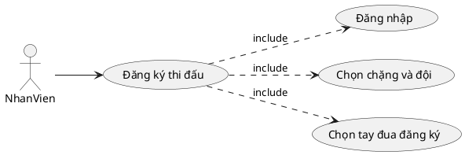
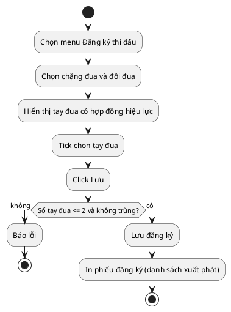
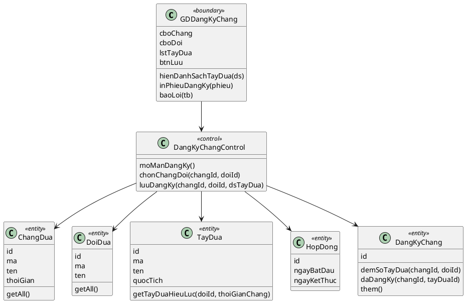
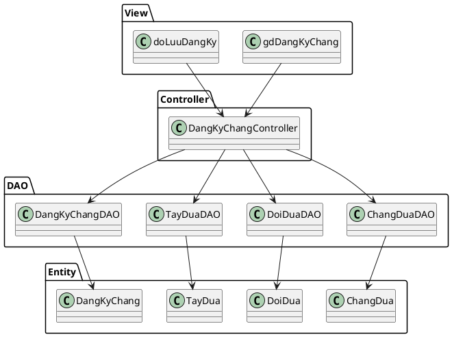
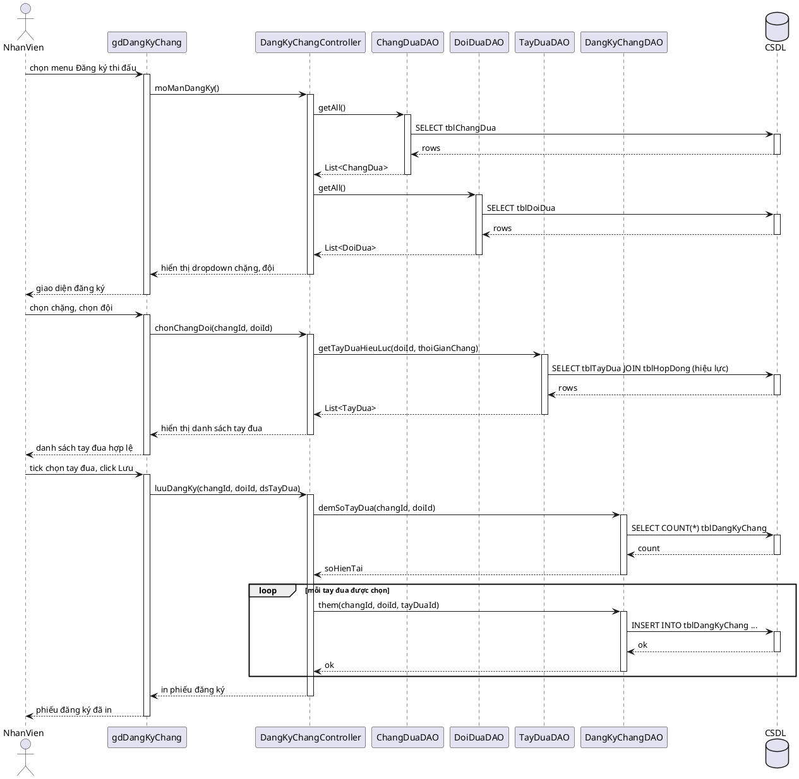

# Module 2 — Đăng ký tay đua tham gia chặng đua — Nội dung chi tiết

> Nội dung chữ do Claude dựng. Việc của bạn: mở Visual Paradigm, vẽ theo các blueprint/PlantUML bên dưới, export ảnh vào `hinh/`, rồi ghép vào báo cáo.

## 0. Danh sách ảnh cần export (đặt vào `hinh/`)

| Tên file | Biểu đồ (mục) |
|---|---|
| `m2-uc-chitiet.png` | UC chi tiết (mục 1) |
| `m2-hoatdong.png` | Biểu đồ hoạt động (mục 3) |
| `m2-lop-phantich.png` | Biểu đồ lớp phân tích (mục 4) |
| `m2-giaodien-dangky.png` | Giao diện đăng ký (mục 5) |
| `m2-lop-mvc.png` | Biểu đồ lớp thiết kế MVC (mục 6) |
| `m2-tuantu.png` | Biểu đồ tuần tự (mục 7) |

> **Quy tắc tên:** `m<số module>-<tên biểu đồ>.png` — chữ thường, không dấu, ngăn cách bằng `-`.

---

## 1. Biểu đồ UC chi tiết

Chức năng "Đăng ký thi đấu" có các giao diện tương tác với nhân viên ⇒ tách use case con:
- Đăng nhập → UC `Đăng nhập`
- Chọn chặng và đội → UC `Chọn chặng và đội`
- Chọn tay đua + lưu → UC `Chọn tay đua đăng ký`

Quan hệ: `Đăng ký thi đấu` **include** {Đăng nhập, Chọn chặng và đội, Chọn tay đua đăng ký}.

## 2. Đặc tả Use Case

| Mục | Nội dung |
|---|---|
| **Use case** | Đăng ký tay đua tham gia chặng đua |
| **Actor** | Nhân viên |
| **Tiền điều kiện** | Nhân viên đã đăng nhập; chặng đua và đội đua đã tồn tại |
| **Hậu điều kiện** | Danh sách đăng ký (tối đa 2 tay đua) của đội cho chặng được lưu và in phiếu |
| **Kịch bản chính** | 1. Nhân viên chọn menu "Đăng ký thi đấu". 2. Hệ thống hiển thị giao diện đăng ký (danh sách thả xuống chặng đua và đội đua). 3. Nhân viên chọn chặng đua và đội đua. 4. Hệ thống hiển thị danh sách tay đua đang có hợp đồng hiệu lực với đội tại thời điểm chặng. 5. Nhân viên tick chọn các tay đua theo yêu cầu của đội, click Lưu. 6. Hệ thống kiểm tra ràng buộc; nếu hợp lệ thì lưu đăng ký và in phiếu đăng ký (danh sách xuất phát). |
| **Ngoại lệ** | 4a. Đội không có tay đua nào có hợp đồng hiệu lực tại thời điểm chặng → thông báo, không đăng ký được. 5a. Chọn quá 2 tay đua → báo lỗi "Mỗi đội tối đa 2 tay đua trong một chặng", yêu cầu chọn lại. 5b. Tay đua đã được đăng ký chặng này (cho đội khác) → báo lỗi trùng đăng ký. |

## 3. Biểu đồ hoạt động (Activity)

## 4. Biểu đồ lớp phân tích (Boundary / Control / Entity)

- **Boundary:** `GDDangKyChang` (cboChang, cboDoi, lstTayDua có checkbox, btnLuu)
- **Control:** `DangKyChangControl` điều phối luồng
- **Entity (kèm phương thức nghiệp vụ):** `ChangDua`, `DoiDua`, `TayDua`, `HopDong`, `DangKyChang`

## 5. Thiết kế giao diện

**Màn Đăng ký thi đấu:** hàng trên có 2 danh sách thả xuống [Chặng đua] và [Đội đua]; bên dưới là bảng tay đua (cột checkbox chọn, Mã, Tên, Quốc tịch) — chỉ hiện tay đua có hợp đồng hiệu lực với đội đã chọn; dưới cùng nút [Lưu]. Sau khi lưu → in phiếu đăng ký (danh sách xuất phát) gồm: tên chặng, ngày đua, tên đội, danh sách tay đua đã đăng ký (mỗi tay đua một dòng).

> Vẽ mockup màn này trong VP và export → `hinh/m2-giaodien-dangky.png`.

## 6. Biểu đồ lớp thiết kế (MVC)

- **View (jsp):** `gdDangKyChang.jsp`, `doLuuDangKy.jsp`
- **Controller:** `DangKyChangController`
- **DAO:** `ChangDuaDAO` (getAll), `DoiDuaDAO` (getAll), `TayDuaDAO` (getTayDuaHieuLuc), `DangKyChangDAO` (demSoTayDua, daDangKy, insert)
- **Entity:** `ChangDua`, `DoiDua`, `TayDua`, `HopDong`, `DangKyChang`

## 7. Biểu đồ tuần tự (Sequence) — luồng chính

> Chỉ vẽ luồng chính. Ngoại lệ (không có tay đua hiệu lực, quá 2 tay đua, trùng đăng ký) mô tả trong đặc tả UC mục 2. Có khối `loop` khi lưu từng tay đua được chọn.

## 8. Test case

| ID | Mục tiêu | Tiền điều kiện | Dữ liệu vào | Các bước | Kết quả mong đợi |
|---|---|---|---|---|---|
| TC1 | Đăng ký 2 tay đua hợp lệ | Đội X có ≥2 tay đua hợp đồng hiệu lực; chưa đăng ký chặng R | Chặng R, Đội X, tay đua A và B | Chọn R, X → tick A, B → Lưu | Lưu thành công, in phiếu đăng ký 2 tay đua |
| TC2 | Chặn quá 2 tay đua | Đội X có ≥3 tay đua hiệu lực | Chặng R, Đội X, tick A, B, C | Chọn R, X → tick 3 người → Lưu | Báo lỗi "tối đa 2 tay đua", không lưu |
| TC3 | Chặn trùng đăng ký | Tay đua A đã đăng ký chặng R cho đội Y | Chặng R, Đội X, tick A | Chọn R, X → tick A → Lưu | Báo lỗi trùng đăng ký, không lưu |
| TC4 | Đội không có tay đua hiệu lực | Đội Z không có hợp đồng hiệu lực tại thời điểm R | Chặng R, Đội Z | Chọn R, Z | Thông báo không có tay đua, không đăng ký được |
