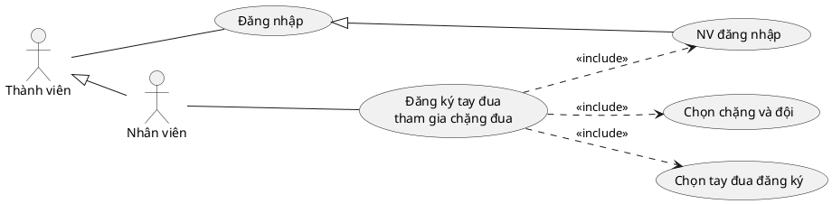
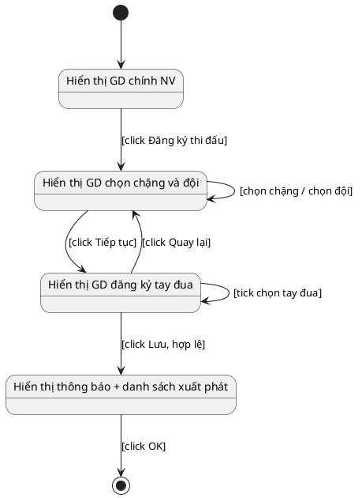
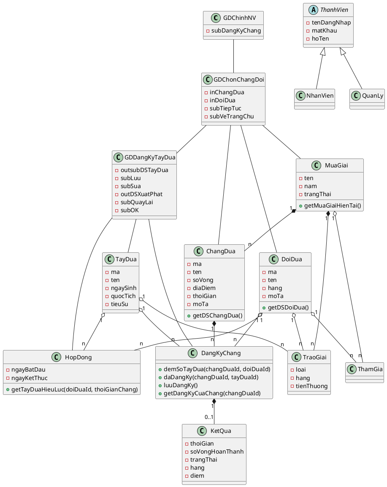
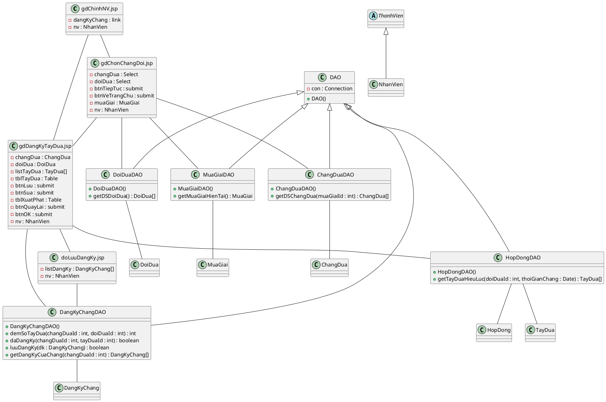
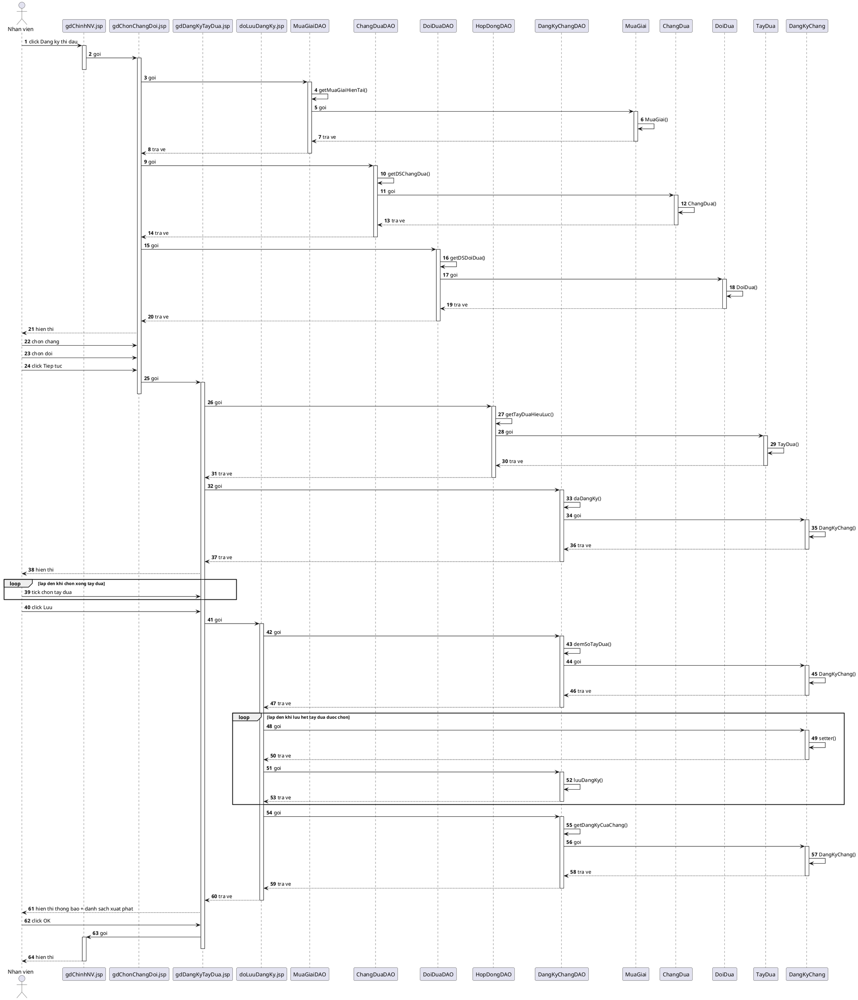

# Module 2 — Đăng ký tay đua tham gia chặng đua — Nội dung chi tiết

> Bản blueprint nội dung. Việc cần làm tiếp: mở Visual Paradigm, vẽ lại theo các khối PlantUML bên dưới, export ảnh vào `hinh/`, rồi ghép vào báo cáo.

## 0. Danh sách ảnh cần export (đặt vào `hinh/`)

| Tên file | Biểu đồ (mục) |
|---|---|
| `m2-uc-chitiet.png` | Biểu đồ UC chi tiết (mục 1) — có UC con `Đăng nhập` (include) |
| `m2-trangthai.png` | Biểu đồ trạng thái (mục 3) |
| `m2-lop-phantich.png` | Biểu đồ lớp phân tích (mục 4) — có lớp biên trang chính `GDChinhNV` |
| `m2-lop-mvc.png` | Biểu đồ lớp thiết kế (mục 5) |
| `m2-hoatdong.png` | Biểu đồ hoạt động pha thiết kế (mục 6) |
| `m2-tuantu.png` | Biểu đồ tuần tự (mục 7) |

> **Quy tắc tên:** `m<số module>-<tên biểu đồ>.png` — chữ thường, không dấu, ngăn cách bằng `-`.
>
> Giao diện **không cần vẽ và không cần xuất ảnh** — đã trình bày dạng phác thảo xen giữa các bước của Kịch bản chính ở mục 2.
>
> **Ghi chú cho người vẽ (mẫu hình trong giáo trình BG HP TTTN 2 CNPM — PDF):**
> - Biểu đồ trạng thái: vẽ theo mẫu **Hình 3.9/3.11** (máy trạng thái đơn giản, nhãn cung `[hành động]`).
> - Biểu đồ hoạt động: vẽ theo mẫu **Hình 4.9** (khung "Xử lí tại gdXxx.jsp" cho từng trang, node DAO tách riêng).
> - Biểu đồ lớp thiết kế: vẽ theo mẫu **Hình 4.4** (3 tầng jsp/DAO/entity, DAO kế thừa `DAO`, chữ ký đầy đủ).
> - Biểu đồ tuần tự: vẽ theo mẫu **Hình 4.10/4.12** (đánh số message, trang chính mở đầu + kết thúc, luồng lưu có `setter()`).

---

## 1. Biểu đồ UC chi tiết

Use case chính của module là **`Đăng ký tay đua tham gia chặng đua`**, do actor **Nhân viên** thực hiện. Trước khi thực hiện chức năng, nhân viên phải đăng nhập thành công, nên UC chính **include** use case dùng chung `Đăng nhập`. Đăng nhập là giao diện dùng chung của toàn hệ thống, không phải màn hình riêng của module.

Theo quy tắc "mỗi giao diện tương tác với người dùng đề xuất thành một use case con", module có 2 màn hình hiển thị nên tách thành 2 use case con giao diện:

| Màn hình | Use case con | Quan hệ với UC chính |
|---|---|---|
| (dùng chung toàn hệ thống) | `NV đăng nhập` — kế thừa `Đăng nhập` | include |
| Chọn chặng và đội | `Chọn chặng và đội` | include |
| Đăng ký tay đua | `Chọn tay đua đăng ký` | include |

Ghi chú:
- Use case `NV đăng nhập` dùng lại giao diện đăng nhập chung nên **không** tạo lớp biên / trang `.jsp` / lifeline riêng trong module này; đặc tả vẫn giữ "đã đăng nhập" ở Tiền điều kiện và kịch bản mở đầu sau khi đăng nhập.
- Trang chính `gdChinhNV.jsp` là trang chủ chung của hệ thống, **không** sinh use case con.
- Trang xử lý `doLuuDangKy.jsp` không hiển thị giao diện cho người dùng nên **không** sinh use case con.

```plantuml
@startuml
left to right direction

actor "Thành viên" as TV
actor "Nhân viên" as NV
TV <|-- NV

usecase "Đăng nhập" as DN
usecase "NV đăng nhập" as NVDN
usecase "Đăng ký tay đua\ntham gia chặng đua" as UC
usecase "Chọn chặng và đội" as UC1
usecase "Chọn tay đua đăng ký" as UC2

TV -- DN
NV -- UC

DN <|-- NVDN
UC ..> NVDN : <<include>>
UC ..> UC1 : <<include>>
UC ..> UC2 : <<include>>
@enduml
```

---

## 2. Đặc tả Use Case

| Mục | Nội dung |
|---|---|
| **Use case** | Đăng ký tay đua tham gia chặng đua |
| **Actor** | Nhân viên |
| **Tiền điều kiện** | Nhân viên đã đăng nhập hệ thống. Mùa giải 2025 đang ở trạng thái "Đang diễn ra". Chặng đua và đội đua đã có trong danh mục. Hợp đồng giữa tay đua và đội đua đã được nhập ở module "Ký hợp đồng tay đua với đội đua". |
| **Hậu điều kiện** | Danh sách đăng ký (tối đa 2 tay đua) của đội cho chặng đua được lưu vào CSDL; hệ thống hiển thị lại danh sách xuất phát của chặng để nhân viên đối soát và in cho ban tổ chức. |

Module có **2 màn hình hiển thị**, nối tiếp nhau theo luồng **Chọn chặng và đội → Đăng ký tay đua**; phác thảo của mỗi màn đặt ngay dưới bước hệ thống hiển thị màn đó. Điểm vào của luồng là trang chính `gdChinhNV.jsp` (lớp biên `GDChinhNV`) chứa liên kết "Đăng ký thi đấu"; trang này dùng chung cho mọi module nên không phác thảo lại ở đây.

**Kịch bản chính**

1. Nhân viên (sau khi đăng nhập) đang ở trang chính `gdChinhNV.jsp` của hệ thống, click chức năng "Đăng ký thi đấu".
2. Hệ thống hiển thị màn hình **Chọn chặng và đội** (trang `gdChonChangDoi.jsp`): ô chọn "Chặng đua" đang rỗng, ô chọn "Đội đua" đang rỗng, nút [Tiếp tục] **chưa được active** — nút chỉ chuyển sang active khi cả hai ô chọn đã có giá trị.

   **Màn hình *Chọn chặng và đội* (`gdChonChangDoi.jsp`)**

   | Thành phần | Kiểu | Trạng thái khi mới mở màn |
   |---|---|---|
   | Chặng đua | danh sách thả xuống | chưa chọn giá trị nào; nội dung ở bảng ngay dưới |
   | Đội đua | danh sách thả xuống | chưa chọn giá trị nào; nội dung ở bảng ngay dưới |
   | [Tiếp tục] | nút | chưa active, chỉ active khi cả hai ô chọn đã có giá trị |
   | [Về trang chủ] | nút | active |

   Nội dung danh sách thả xuống **Chặng đua** — chỉ lấy chặng của mùa giải đang diễn ra (2025), sắp xếp tăng dần theo thời gian, mỗi dòng hiển thị dạng `Mã - Tên chặng - Địa điểm - Thời gian`:

   | TT | Mã | Tên chặng | Địa điểm | Thời gian |
   |---|---|---|---|---|
   | 1 | R01 | Australian Grand Prix | Melbourne | 16/03/2025 |
   | 2 | R02 | Chinese Grand Prix | Thượng Hải | 23/03/2025 |
   | 3 | R06 | Monaco Grand Prix | Monte Carlo | 25/05/2025 |
   | 4 | R10 | British Grand Prix | Silverstone | 06/07/2025 |
   | 5 | R16 | Italian Grand Prix | Monza | 07/09/2025 |
   | 6 | R24 | Abu Dhabi Grand Prix | Yas Marina | 07/12/2025 |

   Nội dung danh sách thả xuống **Đội đua** — liệt kê theo đúng thứ tự `id` của `tblDoiDua`, mỗi dòng hiển thị dạng `Tên đội (Hãng)`:

   | TT | Tên đội | Hãng | Dòng hiển thị |
   |---|---|---|---|
   | 1 | Ferrari | Ferrari | Ferrari (Ferrari) |
   | 2 | Red Bull | Honda RBPT | Red Bull (Honda RBPT) |
   | 3 | McLaren | Mercedes | McLaren (Mercedes) |
   | 4 | Mercedes | Mercedes | Mercedes (Mercedes) |
   | 5 | Aston Martin | Mercedes | Aston Martin (Mercedes) |
   | 6 | Williams | Mercedes | Williams (Mercedes) |

3. Nhân viên chọn chặng `R06 - Monaco Grand Prix - Monte Carlo - 25/05/2025` và chọn đội `Red Bull (Honda RBPT)`; nút [Tiếp tục] **chuyển sang active**.
4. Nhân viên click [Tiếp tục]; hệ thống chuyển sang màn hình tiếp theo, mang theo chặng và đội vừa chọn.
5. Hệ thống hiển thị màn hình **Đăng ký tay đua** (trang `gdDangKyTayDua.jsp`) với tiêu đề `Chặng R06 - Monaco Grand Prix - 25/05/2025 — Đội Red Bull`; bảng tay đua gồm 6 cột **Chọn**, **Mã**, **Tên**, **Ngày sinh**, **Quốc tịch**, **Trạng thái đăng ký**, chỉ liệt kê tay đua đang có hợp đồng hiệu lực với Red Bull tại ngày 25/05/2025 và **sắp xếp tăng dần theo alphabet của cột Tên** (`Max Verstappen` trước `Yuki Tsunoda`); lúc mới vào màn mọi ô tick đều trống, cột Trạng thái đăng ký ghi `Chưa đăng ký`, bảng danh sách xuất phát chưa hiện, nút [Lưu] và nút [Sửa] đều **chưa được active**, nút [OK] **chưa hiện**.

   **Màn hình *Đăng ký tay đua* (`gdDangKyTayDua.jsp`)**

   | Thành phần | Kiểu | Trạng thái khi mới mở màn |
   |---|---|---|
   | Tiêu đề chặng và đội | vùng chỉ đọc | `Chặng R06 - Monaco Grand Prix - 25/05/2025 — Đội Red Bull` |
   | Danh sách tay đua | bảng có ô tick | nội dung ở bảng 1 dưới đây; mọi ô tick đang trống, cột Trạng thái đăng ký ghi `Chưa đăng ký` |
   | Danh sách xuất phát của chặng | bảng | chưa hiện, chỉ hiện sau khi lưu thành công |
   | [Quay lại] | nút | active |
   | [Sửa] | nút | chưa active |
   | [Lưu] | nút | chưa active, chỉ active khi có ít nhất một dòng được tick |
   | [OK] | nút | chưa hiện, chỉ hiện cùng thông báo lưu thành công |

   Bảng 1 — **Danh sách tay đua** của đội Red Bull có hợp đồng hiệu lực tại ngày 25/05/2025, sắp xếp A → Z theo cột Tên; minh hoạ trạng thái sau khi nhân viên đã tick chọn 2 tay đua ở bước 6–7 — đây cũng là **số lượng tối đa** được phép tick:

   | Chọn | Mã | Tên | Ngày sinh | Quốc tịch | Trạng thái đăng ký |
   |---|---|---|---|---|---|
   | [x] | VER | Max Verstappen | 30/09/1997 | Hà Lan | Chưa đăng ký |
   | [x] | TSU | Yuki Tsunoda | 11/05/2000 | Nhật Bản | Chưa đăng ký |

   Cột **Trạng thái đăng ký** nhận một trong ba giá trị `Chưa đăng ký`, `Đã đăng ký (<tên đội đang xem>)` hoặc `Đã đăng ký (<tên đội khác>)` — giá trị cuối là cảnh báo trực quan cho ràng buộc trùng đăng ký.

6. Nhân viên tick chọn dòng `VER - Max Verstappen`; nút [Lưu] **chuyển sang active** (nút [Lưu] active ngay khi có ít nhất một dòng được tick).
7. Nhân viên tick chọn dòng `TSU - Yuki Tsunoda`.

   *(Lặp lại bước 6–7 cho đến khi tick xong các tay đua mà đội yêu cầu, nhiều nhất 2 tay đua.)*

8. Nhân viên click [Lưu]; dữ liệu được gửi sang trang xử lý `doLuuDangKy.jsp`.
9. Hệ thống kiểm tra lần lượt: số tay đua được tick là 2 (≤ 2 — hợp lệ); `Max Verstappen` và `Yuki Tsunoda` đều chưa đăng ký chặng R06 cho đội nào khác (hợp lệ); ngày hiện tại 20/05/2025 vẫn trước thời gian diễn ra chặng 25/05/2025 (hợp lệ).
10. Hệ thống lưu 2 dòng đăng ký vào CSDL rồi **quay lại chính màn hình Đăng ký tay đua**: cột **Trạng thái đăng ký** của 2 dòng vừa lưu đổi thành `Đã đăng ký (Red Bull)`; phía dưới hiện bảng 2 — **danh sách xuất phát** của chặng R06 gồm 3 cột **Đội**, **Tay đua 1**, **Tay đua 2** — kèm thông báo "Đã lưu đăng ký cho đội Red Bull ở chặng R06"; nút [Sửa] **chuyển sang active**, nút [OK] **hiện ra** cùng thông báo.

    | Đội | Tay đua 1 | Tay đua 2 |
    |---|---|---|
    | Red Bull | Max Verstappen | Yuki Tsunoda |

11. Nhân viên đối soát danh sách xuất phát, in gửi ban tổ chức rồi click [OK]; hệ thống quay về trang chính `gdChinhNV.jsp`.

**Ngoại lệ**

- **5a.** Đội được chọn không có tay đua nào có hợp đồng hiệu lực tại thời điểm chặng (ví dụ chọn `R06 - Monaco Grand Prix` và đội `Aston Martin` khi chưa nhập hợp đồng nào cho đội này) → bảng tay đua rỗng, hệ thống hiển thị thông báo "Đội Aston Martin không có tay đua nào có hợp đồng hiệu lực tại thời điểm chặng R06", nút [Lưu] vẫn chưa được active; nhân viên click [Quay lại] để trở về màn hình Chọn chặng và đội, hệ thống giữ nguyên chặng đang chọn để nhân viên chọn đội khác.
- **5b.** Chặng và đội được chọn đã có đăng ký từ trước (ví dụ `R06` + `Red Bull` đã đăng ký `Max Verstappen`, `Yuki Tsunoda`) → hệ thống hiển thị bảng tay đua với các tay đua đang đăng ký **được tick sẵn**, cột Trạng thái đăng ký ghi `Đã đăng ký (Red Bull)`; nút [Sửa] **đang active** (nút [Sửa] chỉ active khi chặng và đội đang xem đã có đăng ký trong CSDL). Nhân viên click [Sửa] để mở khoá các ô tick, bỏ tick `Yuki Tsunoda` (chấn thương), rồi click [Lưu] để lưu lại danh sách mới — đây là luồng thay tay đua trước ngày đua.
- **9a.** Số tay đua được tick lớn hơn 2 (ví dụ tại chặng `R10 - British Grand Prix - 06/07/2025`, đội `Ferrari` có 3 tay đua hợp đồng hiệu lực là `Charles Leclerc`, `Lewis Hamilton` và `Carlos Sainz` — Sainz vừa ký hợp đồng mới với Ferrari giữa mùa — nhân viên tick cả 3) → trang xử lý `doLuuDangKy.jsp` báo lỗi "Mỗi đội chỉ được đăng ký tối đa 2 tay đua trong một chặng", không ghi dòng nào, giữ nguyên màn hình để nhân viên bỏ bớt tick rồi lưu lại.
- **9b.** Một tay đua được tick đã được đăng ký chặng này cho đội khác (ví dụ `Carlos Sainz` đã được đăng ký chặng `R10` cho `Williams` trước khi chuyển sang `Ferrari`, nhân viên vẫn tick `Carlos Sainz` ở màn đăng ký của đội `Ferrari`) → hệ thống báo lỗi "Tay đua Carlos Sainz đã được đăng ký cho đội Williams ở chặng R10", không lưu dòng nào.
- **9c.** Ngày hiện tại đã qua thời gian diễn ra chặng (ví dụ sửa đăng ký chặng `R01 - 16/03/2025` vào ngày 20/05/2025) → hệ thống báo lỗi "Chặng đã diễn ra, không được thay đổi danh sách đăng ký", không lưu.

> **Ánh xạ sang lớp biên:** trang chính `gdChinhNV.jsp` (`GDChinhNV`) — liên kết "Đăng ký thi đấu" = `-subDangKyChang`. Màn *Chọn chặng và đội* (`GDChonChangDoi`) — ô chọn "Chặng đua" = `-inChangDua`, ô chọn "Đội đua" = `-inDoiDua`, nút [Tiếp tục] = `-subTiepTuc`, nút [Về trang chủ] = `-subVeTrangChu`. Màn *Đăng ký tay đua* (`GDDangKyTayDua`) — bảng 1 danh sách tay đua (vừa hiển thị dữ liệu vừa nhận tick chọn) = `-outsubDSTayDua`, bảng 2 danh sách xuất phát = `-outDSXuatPhat`, nút [Lưu] = `-subLuu`, nút [Sửa] = `-subSua`, nút [Quay lại] = `-subQuayLai`, nút [OK] của thông báo lưu thành công = `-subOK`.

> Luồng chuyển màn: **Trang chính → Chọn chặng và đội → Đăng ký tay đua → (lưu qua `doLuuDangKy.jsp`) → Đăng ký tay đua (hiển thị lại kèm danh sách xuất phát) → Trang chính**.

---

## 3. Phân tích hoạt động — biểu đồ trạng thái

Mỗi trạng thái = một lần hệ thống hiển thị một giao diện và chờ tương tác của người dùng; cung chuyển trạng thái = hành động của người dùng, ghi trong nhãn `[…]`. Biểu đồ bắt đầu từ trạng thái hiển thị **giao diện chính** của nhân viên (ảnh `m2-trangthai.png`, vẽ theo mẫu Hình 3.9/3.11 giáo trình PDF).

Các ràng buộc nghiệp vụ (tối đa 2 tay đua, trùng đăng ký, chỉ lưu trước ngày đua…) không xuất hiện ở đây — chúng được thể hiện bằng các node quyết định trong **biểu đồ hoạt động pha thiết kế** (mục 6).

```plantuml
@startuml
state "Hiển thị GD chính NV" as S0
state "Hiển thị GD chọn chặng và đội" as S1
state "Hiển thị GD đăng ký tay đua" as S2
state "Hiển thị thông báo + danh sách xuất phát" as S3

[*] --> S0
S0 --> S1 : [click Đăng ký thi đấu]
S1 --> S1 : [chọn chặng / chọn đội]
S1 --> S2 : [click Tiếp tục]
S2 --> S2 : [tick chọn tay đua]
S2 --> S1 : [click Quay lại]
S2 --> S3 : [click Lưu, hợp lệ]
S3 --> [*] : [click OK]
@enduml
```

---

## 4. Biểu đồ lớp phân tích

Biểu đồ chỉ gồm **hai tầng**: lớp biên và lớp thực thể. Không có lớp điều khiển; nghiệp vụ được gán thẳng cho lớp thực thể.

**Lớp biên** (mỗi màn hình một lớp, chỉ có thuộc tính, đặt tên theo chức năng dữ liệu `in / out / inout / sub / outsub`):

| Lớp biên | Màn hình | Thuộc tính |
|---|---|---|
| `GDChinhNV` | Trang chính của nhân viên (trang chủ chung hệ thống) | `-subDangKyChang` |
| `GDChonChangDoi` | Chọn chặng và đội | `-inChangDua`, `-inDoiDua`, `-subTiepTuc`, `-subVeTrangChu` |
| `GDDangKyTayDua` | Đăng ký tay đua | `-outsubDSTayDua`, `-subLuu`, `-subSua`, `-outDSXuatPhat`, `-subQuayLai`, `-subOK` |

Lớp biên `GDChinhNV` là **giao diện chính** của actor Nhân viên: chỉ có nút/liên kết `-subDangKyChang` dẫn vào chức năng của module, nối `--` sang lớp biên đầu tiên `GDChonChangDoi`. Trang chính là trang chủ chung của hệ thống nên không sinh UC con và không phác thảo lại trong module này.

Ba thuộc tính `-outDSXuatPhat`, `-subQuayLai` và `-subOK` tương ứng với bảng **danh sách xuất phát** (hiện ra sau khi lưu, các cột Đội | Tay đua 1 | Tay đua 2), nút **[Quay lại]** và nút **[OK]** của thông báo lưu thành công trên màn hình Đăng ký tay đua — mọi thành phần hiện dữ liệu ra hoặc submit trên màn hình đều phải có đúng một thuộc tính tương ứng ở lớp biên (xem phác thảo ở mục 2).

**Phương thức nghiệp vụ gán cho lớp thực thể:**

| Chức năng cần thực hiện dưới tầng giao diện | Gán cho lớp | Phương thức |
|---|---|---|
| Lấy danh sách chặng đua của mùa giải | `ChangDua` | `getDSChangDua()` |
| Lấy danh sách đội đua | `DoiDua` | `getDSDoiDua()` |
| Tìm tay đua có hợp đồng hiệu lực với đội tại thời điểm chặng | `HopDong` | `getTayDuaHieuLuc(doiDuaId, thoiGianChang)` |
| Đếm số tay đua đội đã đăng ký trong chặng (ràng buộc ≤ 2) | `DangKyChang` | `demSoTayDua(changDuaId, doiDuaId)` |
| Kiểm tra tay đua đã đăng ký chặng này chưa (ràng buộc trùng) | `DangKyChang` | `daDangKy(changDuaId, tayDuaId)` |
| Lưu một dòng đăng ký | `DangKyChang` | `luuDangKy()` |
| Lấy danh sách xuất phát của chặng | `DangKyChang` | `getDangKyCuaChang(changDuaId)` |

Biểu đồ giữ nguyên toàn bộ quan hệ giữa các lớp thực thể như ở biểu đồ lớp thực thể chung của nhóm, kể cả các lớp không liên quan trực tiếp tới module. Ở pha phân tích, lớp thực thể **chưa có thuộc tính `id`** và **chưa khai báo kiểu dữ liệu**.

```plantuml
@startuml
class GDChinhNV {
  -subDangKyChang
}

class GDChonChangDoi {
  -inChangDua
  -inDoiDua
  -subTiepTuc
  -subVeTrangChu
}

class GDDangKyTayDua {
  -outsubDSTayDua
  -subLuu
  -subSua
  -outDSXuatPhat
  -subQuayLai
  -subOK
}

class MuaGiai {
  -ten
  -nam
  -trangThai
  +getMuaGiaiHienTai()
}

class ChangDua {
  -ma
  -ten
  -soVong
  -diaDiem
  -thoiGian
  -moTa
  +getDSChangDua()
}

class DoiDua {
  -ma
  -ten
  -hang
  -moTa
  +getDSDoiDua()
}

class TayDua {
  -ma
  -ten
  -ngaySinh
  -quocTich
  -tieuSu
}

class HopDong {
  -ngayBatDau
  -ngayKetThuc
  +getTayDuaHieuLuc(doiDuaId, thoiGianChang)
}

class DangKyChang {
  +demSoTayDua(changDuaId, doiDuaId)
  +daDangKy(changDuaId, tayDuaId)
  +luuDangKy()
  +getDangKyCuaChang(changDuaId)
}

class ThamGia {
}

class KetQua {
  -thoiGian
  -soVongHoanThanh
  -trangThai
  -hang
  -diem
}

class TraoGiai {
  -loai
  -hang
  -tienThuong
}

abstract class ThanhVien {
  -tenDangNhap
  -matKhau
  -hoTen
}

class NhanVien {
}

class QuanLy {
}

GDChinhNV -- GDChonChangDoi
GDChonChangDoi -- GDDangKyTayDua
GDChonChangDoi -- MuaGiai
GDChonChangDoi -- ChangDua
GDChonChangDoi -- DoiDua
GDDangKyTayDua -- HopDong
GDDangKyTayDua -- TayDua
GDDangKyTayDua -- DangKyChang

MuaGiai "1" *-- "n" ChangDua
MuaGiai "1" o-- "n" ThamGia
DoiDua "1" o-- "n" ThamGia
TayDua "1" o-- "n" HopDong
DoiDua "1" o-- "n" HopDong
ChangDua "1" *-- "n" DangKyChang
TayDua "1" o-- "n" DangKyChang
DoiDua "1" o-- "n" DangKyChang
DangKyChang "1" *-- "0..1" KetQua
MuaGiai "1" *-- "n" TraoGiai
TayDua "1" o-- "n" TraoGiai
DoiDua "1" o-- "n" TraoGiai
ThanhVien <|-- NhanVien
ThanhVien <|-- QuanLy
@enduml
```

---

## 5. Biểu đồ lớp thiết kế (jsp / DAO / model)

Kiến trúc gồm ba tầng. Tầng điều khiển của mô hình chính là **các lớp DAO** (lớp truy xuất dữ liệu), **không có lớp `Controller` riêng**. 

- **Tầng view** — các trang jsp: `gdChinhNV.jsp` (trang chính), `gdChonChangDoi.jsp` (màn hình 1), `gdDangKyTayDua.jsp` (màn hình 2), `doLuuDangKy.jsp` (trang xử lý lưu, không hiển thị giao diện). Mỗi trang có thuộc tính **kèm kiểu control** (`Select` — danh sách thả xuống, `Table` — bảng, `link` — liên kết, `submit` — nút bấm) và các **thuộc tính ẩn**: đối tượng phiên `-nv : NhanVien` và dữ liệu truyền giữa các trang (`-changDua : ChangDua`, `-doiDua : DoiDua`, `-listTayDua : TayDua[]`, `-listDangKy : DangKyChang[]`).
- **Tầng dao** — lớp cha `DAO` giữ kết nối CSDL dùng chung (`-con : Connection`); các lớp `ChangDuaDAO`, `DoiDuaDAO`, `HopDongDAO`, `DangKyChangDAO` **kế thừa** lớp `DAO`, mỗi lớp có **constructor** và các phương thức ghi **đầy đủ chữ ký** (tham số : kiểu, kiểu trả về — mảng `Xxx[]` cho thao tác đọc danh sách, `boolean` cho thao tác ghi).
- **Tầng model** — các lớp thực thể: `MuaGiai`, `ChangDua`, `DoiDua`, `TayDua`, `HopDong`, `DangKyChang`, `ThanhVien`, `NhanVien` (đối tượng phiên của các trang jsp).

Ghi chú: module không cần `TayDuaDAO` riêng — danh sách tay đua hợp lệ được lấy qua `HopDongDAO.getTayDuaHieuLuc()` (lọc theo hợp đồng còn hiệu lực tại thời điểm chặng) rồi đóng gói bằng lớp `TayDua`, nên `HopDongDAO` gắn với cả hai lớp model `HopDong` và `TayDua`.

```plantuml
@startuml
class "gdChinhNV.jsp" as gdChinhNV {
  -dangKyChang : link
  -nv : NhanVien
}
class "gdChonChangDoi.jsp" as gdChonChangDoi {
  -changDua : Select
  -doiDua : Select
  -btnTiepTuc : submit
  -btnVeTrangChu : submit
  -muaGiai : MuaGiai
  -nv : NhanVien
}
class "gdDangKyTayDua.jsp" as gdDangKyTayDua {
  -changDua : ChangDua
  -doiDua : DoiDua
  -listTayDua : TayDua[]
  -tblTayDua : Table
  -btnLuu : submit
  -btnSua : submit
  -tblXuatPhat : Table
  -btnQuayLai : submit
  -btnOK : submit
  -nv : NhanVien
}
class "doLuuDangKy.jsp" as doLuuDangKy {
  -listDangKy : DangKyChang[]
  -nv : NhanVien
}

class DAO {
  -con : Connection
  +DAO()
}
class MuaGiaiDAO {
  +MuaGiaiDAO()
  +getMuaGiaiHienTai() : MuaGiai
}
class ChangDuaDAO {
  +ChangDuaDAO()
  +getDSChangDua(muaGiaiId : int) : ChangDua[]
}
class DoiDuaDAO {
  +DoiDuaDAO()
  +getDSDoiDua() : DoiDua[]
}
class HopDongDAO {
  +HopDongDAO()
  +getTayDuaHieuLuc(doiDuaId : int, thoiGianChang : Date) : TayDua[]
}
class DangKyChangDAO {
  +DangKyChangDAO()
  +demSoTayDua(changDuaId : int, doiDuaId : int) : int
  +daDangKy(changDuaId : int, tayDuaId : int) : boolean
  +luuDangKy(dk : DangKyChang) : boolean
  +getDangKyCuaChang(changDuaId : int) : DangKyChang[]
}

class MuaGiai
class ChangDua
class DoiDua
class TayDua
class HopDong
class DangKyChang
abstract class ThanhVien
class NhanVien
ThanhVien <|-- NhanVien

DAO <|-- MuaGiaiDAO
DAO <|-- ChangDuaDAO
DAO <|-- DoiDuaDAO
DAO <|-- HopDongDAO
DAO <|-- DangKyChangDAO

gdChinhNV -- gdChonChangDoi
gdChonChangDoi -- gdDangKyTayDua
gdDangKyTayDua -- doLuuDangKy
gdDangKyTayDua -- gdChinhNV

gdChonChangDoi -- MuaGiaiDAO
gdChonChangDoi -- ChangDuaDAO
gdChonChangDoi -- DoiDuaDAO
gdDangKyTayDua -- HopDongDAO
gdDangKyTayDua -- DangKyChangDAO
doLuuDangKy -- DangKyChangDAO

MuaGiaiDAO -- MuaGiai
ChangDuaDAO -- ChangDua
DoiDuaDAO -- DoiDua
HopDongDAO -- HopDong
HopDongDAO -- TayDua
DangKyChangDAO -- DangKyChang
@enduml
```

---

## 6. Biểu đồ hoạt động (pha thiết kế)

Mỗi hành động tương ứng một phương thức đã thiết kế trong biểu đồ lớp (mục 5). Các hành động được nhóm theo khung `Xử lí tại gdXxx.jsp` cho **từng trang jsp** (kể cả trang xử lý `doLuuDangKy.jsp` và trang chính `gdChinhNV.jsp`); lời gọi DAO là **node riêng đặt NGOÀI khung**, ghi `XxxDAO: tenHam()`, nối bằng mũi tên từ hành động gọi nó; guard trên cung chuyển ghi `[click …]`, `[lưu xong]`… Các nhánh kiểm tra ràng buộc nghiệp vụ là node quyết định đặt trong khung của trang xử lý tương ứng, phủ đủ 5 ngoại lệ ở đặc tả: 5a, 5b (tại `gdDangKyTayDua.jsp`) và 9a, 9b, 9c (tại `doLuuDangKy.jsp`). Ảnh `m2-hoatdong.png` — **vẽ lại theo mẫu Hình 4.9 giáo trình PDF**.

```plantuml
@startuml
start
partition "Xử lí tại gdChinhNV.jsp" {
  :Hiển thị GD chính của nhân viên;
}
-> [click Đăng ký thi đấu];
partition "Xử lí tại gdChonChangDoi.jsp" {
  :Lấy mùa giải đang diễn ra\n(MuaGiaiDAO: getMuaGiaiHienTai());
  :Lấy danh sách chặng đua\n(ChangDuaDAO: getDSChangDua());
  :Lấy danh sách đội đua\n(DoiDuaDAO: getDSDoiDua());
  :Hiển thị GD chọn chặng và đội;
  :Nhận thông tin chặng và đội được chọn;
}
-> [click Tiếp tục];
partition "Xử lí tại gdDangKyTayDua.jsp" {
  :Lấy danh sách tay đua có hợp đồng hiệu lực\n(HopDongDAO: getTayDuaHieuLuc());
  if (Đội có tay đua hợp đồng hiệu lực?) then ([không])
    :Thông báo "Đội không có tay đua\nhợp đồng hiệu lực tại thời điểm chặng";
    stop
  else ([có])
  endif
  :Lấy trạng thái đăng ký từng tay đua\n(DangKyChangDAO: daDangKy());
  if (Chặng và đội đã có đăng ký?) then ([rồi])
    :Tick sẵn tay đua đang đăng ký,\nkích hoạt nút Sửa;
  else ([chưa])
  endif
  :Hiển thị bảng tay đua sắp xếp\ntheo alphabet của cột Tên;
  :Nhận thông tin tick chọn tay đua;
}
-> [click Lưu];
partition "Xử lí tại doLuuDangKy.jsp" {
  :Đếm số tay đua đăng ký của đội trong chặng\n(DangKyChangDAO: demSoTayDua());
  if (Số tay đua được tick <= 2?) then ([không])
    :Báo lỗi "Mỗi đội tối đa 2 tay đua\ntrong một chặng";
    stop
  else ([có])
  endif
  if (Tay đua được tick đã đăng ký chặng này cho đội khác?) then ([rồi])
    :Báo lỗi "Tay đua đã được đăng ký\ncho đội khác ở chặng này";
    stop
  else ([chưa])
  endif
  if (Ngày hiện tại trước thời gian diễn ra chặng?) then ([không])
    :Báo lỗi "Chặng đã diễn ra, không được\nthay đổi danh sách đăng ký";
    stop
  else ([có])
  endif
  :Đóng gói từng dòng đăng ký\n(DangKyChang: setter());
  :Lưu từng dòng đăng ký\n(DangKyChangDAO: luuDangKy());
  :Lấy danh sách xuất phát của chặng\n(DangKyChangDAO: getDangKyCuaChang());
}
-> [lưu xong];
partition "Xử lí tại gdDangKyTayDua.jsp (hiển thị lại)" {
  :Hiển thị thông báo thành công\nvà danh sách xuất phát;
}
-> [click OK];
partition "Xử lí tại gdChinhNV.jsp (kết thúc)" {
  :Hiển thị GD chính của nhân viên;
}
stop
@enduml
```

> Ba nhánh báo lỗi 9a, 9b, 9c kết thúc bằng `stop` cho gọn hình. Trên thực tế, sau khi hệ thống báo lỗi, nhân viên chỉnh lại tick rồi thực hiện lại từ hành động "Nhận thông tin tick chọn tay đua".

---

## 7. Thuyết minh và biểu đồ tuần tự

### 7.1. Thuyết minh (kịch bản phiên bản 3)

Kịch bản dưới đây chỉ mô tả **luồng chính**; các ngoại lệ đã nêu ở đặc tả use case mục 2. Mỗi dòng tương ứng với một message trong biểu đồ tuần tự ở mục 7.2 (64 dòng — 64 message). Luồng **đọc** dữ liệu giữ chuỗi 7 message (DAO self-call tên hàm + Entity self-call constructor); luồng **lưu**: lớp thực thể tự đóng gói dữ liệu nhập bằng `setter()` **trước**, rồi trang xử lý mới gọi DAO lưu (DAO không gọi lại Entity nữa).

1. Nhân viên (sau khi đăng nhập) đang ở trang chính gdChinhNV.jsp, click chức năng "Đăng ký thi đấu".
2. Trang gdChinhNV.jsp gọi trang gdChonChangDoi.jsp.
3. Trang gdChonChangDoi.jsp gọi lớp MuaGiaiDAO yêu cầu lấy mùa giải đang diễn ra.
4. Lớp MuaGiaiDAO gọi hàm getMuaGiaiHienTai().
5. Hàm getMuaGiaiHienTai() gọi lớp MuaGiai để đóng gói thông tin.
6. Lớp MuaGiai đóng gói thông tin thực thể.
7. Lớp MuaGiai trả kết quả về cho hàm getMuaGiaiHienTai().
8. Hàm getMuaGiaiHienTai() trả kết quả cho trang gdChonChangDoi.jsp.
9. Trang gdChonChangDoi.jsp gọi lớp ChangDuaDAO yêu cầu lấy danh sách chặng đua của mùa giải đang diễn ra.
10. Lớp ChangDuaDAO gọi hàm getDSChangDua().
11. Hàm getDSChangDua() gọi lớp ChangDua để đóng gói thông tin.
12. Lớp ChangDua đóng gói thông tin thực thể.
13. Lớp ChangDua trả kết quả về cho hàm getDSChangDua().
14. Hàm getDSChangDua() trả kết quả cho trang gdChonChangDoi.jsp.
15. Trang gdChonChangDoi.jsp gọi lớp DoiDuaDAO yêu cầu lấy danh sách đội đua.
16. Lớp DoiDuaDAO gọi hàm getDSDoiDua().
17. Hàm getDSDoiDua() gọi lớp DoiDua để đóng gói thông tin.
18. Lớp DoiDua đóng gói thông tin thực thể.
19. Lớp DoiDua trả kết quả về cho hàm getDSDoiDua().
20. Hàm getDSDoiDua() trả kết quả cho trang gdChonChangDoi.jsp.
21. Trang gdChonChangDoi.jsp hiển thị hai danh sách thả xuống cho nhân viên.
22. Nhân viên chọn chặng đua "R06 - Monaco Grand Prix - 25/05/2025".
23. Nhân viên chọn đội đua "Red Bull".
24. Nhân viên click nút [Tiếp tục].
25. Trang gdChonChangDoi.jsp gọi trang gdDangKyTayDua.jsp.
26. Trang gdDangKyTayDua.jsp gọi lớp HopDongDAO yêu cầu tìm các tay đua có hợp đồng hiệu lực với đội tại thời điểm chặng.
27. Lớp HopDongDAO gọi hàm getTayDuaHieuLuc().
28. Hàm getTayDuaHieuLuc() gọi lớp TayDua để đóng gói thông tin.
29. Lớp TayDua đóng gói thông tin thực thể.
30. Lớp TayDua trả kết quả về cho hàm getTayDuaHieuLuc().
31. Hàm getTayDuaHieuLuc() trả kết quả cho trang gdDangKyTayDua.jsp.
32. Trang gdDangKyTayDua.jsp gọi lớp DangKyChangDAO yêu cầu kiểm tra trạng thái đăng ký của từng tay đua trong chặng.
33. Lớp DangKyChangDAO gọi hàm daDangKy().
34. Hàm daDangKy() gọi lớp DangKyChang để đóng gói thông tin.
35. Lớp DangKyChang đóng gói thông tin thực thể.
36. Lớp DangKyChang trả kết quả về cho hàm daDangKy().
37. Hàm daDangKy() trả kết quả cho trang gdDangKyTayDua.jsp.
38. Trang gdDangKyTayDua.jsp hiển thị bảng tay đua (sắp xếp theo alphabet của cột Tên) cho nhân viên.
39. Nhân viên tick chọn một tay đua (lặp lại cho đến khi chọn xong các tay đua đội yêu cầu, nhiều nhất 2).
40. Nhân viên click nút [Lưu].
41. Trang gdDangKyTayDua.jsp gọi trang doLuuDangKy.jsp.
42. Trang doLuuDangKy.jsp gọi lớp DangKyChangDAO yêu cầu đếm số tay đua mà đội đã đăng ký trong chặng.
43. Lớp DangKyChangDAO gọi hàm demSoTayDua().
44. Hàm demSoTayDua() gọi lớp DangKyChang để đóng gói thông tin.
45. Lớp DangKyChang đóng gói thông tin thực thể.
46. Lớp DangKyChang trả kết quả về cho hàm demSoTayDua().
47. Hàm demSoTayDua() trả kết quả cho trang doLuuDangKy.jsp.
48. Trang doLuuDangKy.jsp gọi lớp DangKyChang yêu cầu đóng gói dữ liệu một dòng đăng ký (lặp lại các bước 48–53 cho từng tay đua được chọn).
49. Lớp DangKyChang gọi hàm setter() tự đóng gói dữ liệu đăng ký vừa nhập.
50. Lớp DangKyChang trả về cho trang doLuuDangKy.jsp.
51. Trang doLuuDangKy.jsp gọi lớp DangKyChangDAO yêu cầu lưu dòng đăng ký.
52. Lớp DangKyChangDAO gọi hàm luuDangKy().
53. Hàm luuDangKy() trả kết quả cho trang doLuuDangKy.jsp.
54. Trang doLuuDangKy.jsp gọi lớp DangKyChangDAO yêu cầu lấy danh sách xuất phát của chặng.
55. Lớp DangKyChangDAO gọi hàm getDangKyCuaChang().
56. Hàm getDangKyCuaChang() gọi lớp DangKyChang để đóng gói thông tin.
57. Lớp DangKyChang đóng gói thông tin thực thể.
58. Lớp DangKyChang trả kết quả về cho hàm getDangKyCuaChang().
59. Hàm getDangKyCuaChang() trả kết quả cho trang doLuuDangKy.jsp.
60. Trang doLuuDangKy.jsp trả kết quả kèm thông báo thành công cho trang gdDangKyTayDua.jsp.
61. Trang gdDangKyTayDua.jsp hiển thị thông báo thành công và danh sách xuất phát cho nhân viên đối soát.
62. Nhân viên click nút [OK].
63. Trang gdDangKyTayDua.jsp gọi trang gdChinhNV.jsp.
64. Trang gdChinhNV.jsp hiển thị cho nhân viên.

### 7.2. Biểu đồ tuần tự (Sequence) — luồng chính

> Lifeline gồm: actor Nhân viên + trang chính `gdChinhNV.jsp` (mở đầu và kết thúc) + 3 trang jsp của module + 4 lớp DAO + 4 lớp thực thể. Không có lifeline CSDL, không có lifeline điều khiển, không có câu lệnh SQL trong nhãn message. Dùng `autonumber` để đánh số message tự động. Luồng **đọc** là chuỗi 7 message (`goi` → self-call tên hàm ở DAO → `goi` → self-call hàm khởi tạo ở lớp thực thể → `tra ve` → `tra ve` → `hien thi`); luồng **lưu**: Entity self-call `setter()` đóng gói trước, rồi DAO self-call `luuDangKy()` — không gọi lại Entity. Kết thúc: thông báo thành công kèm danh sách xuất phát hiển thị trên `gdDangKyTayDua.jsp` để nhân viên đối soát (mục 2), click OK → gọi trang chính → hiển thị.

```plantuml
@startuml
autonumber
actor "Nhan vien" as NV
participant "gdChinhNV.jsp" as V0
participant "gdChonChangDoi.jsp" as V1
participant "gdDangKyTayDua.jsp" as V2
participant "doLuuDangKy.jsp" as V3
participant "MuaGiaiDAO" as MDAO
participant "ChangDuaDAO" as CDAO
participant "DoiDuaDAO" as DDAO
participant "HopDongDAO" as HDAO
participant "DangKyChangDAO" as KDAO
participant "MuaGiai" as MG
participant "ChangDua" as CD
participant "DoiDua" as DD
participant "TayDua" as TD
participant "DangKyChang" as DKC

NV -> V0 : click Dang ky thi dau
activate V0
V0 -> V1 : goi
activate V1
deactivate V0

V1 -> MDAO : goi
activate MDAO
MDAO -> MDAO : getMuaGiaiHienTai()
MDAO -> MG : goi
activate MG
MG -> MG : MuaGiai()
MG --> MDAO : tra ve
deactivate MG
MDAO --> V1 : tra ve
deactivate MDAO

V1 -> CDAO : goi
activate CDAO
CDAO -> CDAO : getDSChangDua()
CDAO -> CD : goi
activate CD
CD -> CD : ChangDua()
CD --> CDAO : tra ve
deactivate CD
CDAO --> V1 : tra ve
deactivate CDAO

V1 -> DDAO : goi
activate DDAO
DDAO -> DDAO : getDSDoiDua()
DDAO -> DD : goi
activate DD
DD -> DD : DoiDua()
DD --> DDAO : tra ve
deactivate DD
DDAO --> V1 : tra ve
deactivate DDAO

V1 --> NV : hien thi

NV -> V1 : chon chang
NV -> V1 : chon doi
NV -> V1 : click Tiep tuc

V1 -> V2 : goi
activate V2
deactivate V1

V2 -> HDAO : goi
activate HDAO
HDAO -> HDAO : getTayDuaHieuLuc()
HDAO -> TD : goi
activate TD
TD -> TD : TayDua()
TD --> HDAO : tra ve
deactivate TD
HDAO --> V2 : tra ve
deactivate HDAO

V2 -> KDAO : goi
activate KDAO
KDAO -> KDAO : daDangKy()
KDAO -> DKC : goi
activate DKC
DKC -> DKC : DangKyChang()
DKC --> KDAO : tra ve
deactivate DKC
KDAO --> V2 : tra ve
deactivate KDAO

V2 --> NV : hien thi

loop lap den khi chon xong tay dua
  NV -> V2 : tick chon tay dua
end

NV -> V2 : click Luu

V2 -> V3 : goi
activate V3

V3 -> KDAO : goi
activate KDAO
KDAO -> KDAO : demSoTayDua()
KDAO -> DKC : goi
activate DKC
DKC -> DKC : DangKyChang()
DKC --> KDAO : tra ve
deactivate DKC
KDAO --> V3 : tra ve
deactivate KDAO

loop lap den khi luu het tay dua duoc chon
  V3 -> DKC : goi
  activate DKC
  DKC -> DKC : setter()
  DKC --> V3 : tra ve
  deactivate DKC
  V3 -> KDAO : goi
  activate KDAO
  KDAO -> KDAO : luuDangKy()
  KDAO --> V3 : tra ve
  deactivate KDAO
end

V3 -> KDAO : goi
activate KDAO
KDAO -> KDAO : getDangKyCuaChang()
KDAO -> DKC : goi
activate DKC
DKC -> DKC : DangKyChang()
DKC --> KDAO : tra ve
deactivate DKC
KDAO --> V3 : tra ve
deactivate KDAO

V3 --> V2 : tra ve
deactivate V3
V2 --> NV : hien thi thong bao + danh sach xuat phat

NV -> V2 : click OK
V2 -> V0 : goi
activate V0
deactivate V2
V0 --> NV : hien thi
deactivate V0
@enduml
```

---

## 8. Test case

> **Xây dựng theo quy trình 4 bước và mẫu Bảng 6.7, giáo trình BG HP TTTN 2 CNPM, mục 6.2**: (1) lập checklist trường hợp cần kiểm thử; (2) viết test case; (3) chuẩn bị data test; (4) chạy và ghi nhận kết quả. Toàn bộ test case gom vào **một bảng 4 cột** `Mã trường hợp kiểm thử | Mục đích kiểm thử | Các bước thực hiện | Kết quả mong muốn`, chia 3 nhóm: **Giao diện** (2 ca/màn), **Chức năng** (2 ca/màn — kết quả đối chiếu các bảng `tblXxx`), **Luồng nghiệp vụ** (end-to-end, kết quả ghi cả hiệu ứng CSDL). Mã ca: `DKC_n`.

### 8.1. Data test (bước 3 quy trình test)

Toàn bộ các ca dùng chung bộ dữ liệu mùa giải F1 2025 đã thống nhất của nhóm (docs/03 mục 5); đây là tiền đề chung cho nhóm **Luồng nghiệp vụ**.

`tblMuaGiai`

| id | ten | nam | trangThai |
|---|---|---|---|
| 1 | FIA Formula One World Championship | 2025 | Đang diễn ra |

`tblDoiDua`

| id | ma | ten | hang | moTa |
|---|---|---|---|---|
| 1 | FER | Ferrari | Ferrari | Scuderia Ferrari |
| 2 | RBR | Red Bull | Honda RBPT | Oracle Red Bull Racing |
| 3 | MCL | McLaren | Mercedes | McLaren Formula 1 Team |
| 4 | MER | Mercedes | Mercedes | Mercedes-AMG Petronas F1 Team |
| 5 | AST | Aston Martin | Mercedes | Aston Martin Aramco F1 Team |
| 6 | WIL | Williams | Mercedes | Williams Racing |

`tblTayDua`

| id | ma | ten | ngaySinh | quocTich | tieuSu |
|---|---|---|---|---|---|
| 1 | LEC | Charles Leclerc | 16/10/1997 | Monaco | (…) |
| 2 | HAM | Lewis Hamilton | 07/01/1985 | Anh | (…) |
| 3 | VER | Max Verstappen | 30/09/1997 | Hà Lan | (…) |
| 4 | TSU | Yuki Tsunoda | 11/05/2000 | Nhật Bản | (…) |
| 5 | NOR | Lando Norris | 13/11/1999 | Anh | (…) |
| 6 | PIA | Oscar Piastri | 06/04/2001 | Úc | (…) |
| 7 | RUS | George Russell | 15/02/1998 | Anh | (…) |
| 8 | ANT | Andrea Kimi Antonelli | 25/08/2006 | Ý | (…) |
| 9 | ALO | Fernando Alonso | 29/07/1981 | Tây Ban Nha | (…) |
| 10 | STR | Lance Stroll | 29/10/1998 | Canada | (…) |
| 11 | ALB | Alexander Albon | 23/03/1996 | Thái Lan | (…) |
| 12 | SAI | Carlos Sainz | 01/09/1994 | Tây Ban Nha | (…) |

`tblChangDua`

| id | ma | ten | soVong | diaDiem | thoiGian | moTa | tblMuaGiaiid |
|---|---|---|---|---|---|---|---|
| 1 | R01 | Australian Grand Prix | 58 | Melbourne | 16/03/2025 | (…) | 1 |
| 2 | R02 | Chinese Grand Prix | 56 | Thượng Hải | 23/03/2025 | (…) | 1 |
| 3 | R06 | Monaco Grand Prix | 78 | Monte Carlo | 25/05/2025 | (…) | 1 |
| 4 | R10 | British Grand Prix | 52 | Silverstone | 06/07/2025 | (…) | 1 |
| 5 | R16 | Italian Grand Prix | 53 | Monza | 07/09/2025 | (…) | 1 |
| 6 | R24 | Abu Dhabi Grand Prix | 58 | Yas Marina | 07/12/2025 | (…) | 1 |

`tblHopDong`

| id | tblTayDuaid | tblDoiDuaid | ngayBatDau | ngayKetThuc |
|---|---|---|---|---|
| 1 | 1 (LEC) | 1 (Ferrari) | 01/01/2019 | (trống) |
| 2 | 2 (HAM) | 4 (Mercedes) | 01/01/2013 | 31/12/2024 |
| 3 | 2 (HAM) | 1 (Ferrari) | 01/01/2025 | (trống) |
| 4 | 3 (VER) | 2 (Red Bull) | 01/01/2016 | (trống) |
| 5 | 4 (TSU) | 2 (Red Bull) | 01/01/2025 | (trống) |
| 6 | 5 (NOR) | 3 (McLaren) | 01/01/2019 | (trống) |
| 7 | 6 (PIA) | 3 (McLaren) | 01/01/2023 | (trống) |
| 8 | 7 (RUS) | 4 (Mercedes) | 01/01/2022 | (trống) |
| 9 | 8 (ANT) | 4 (Mercedes) | 01/01/2025 | (trống) |
| 10 | 11 (ALB) | 6 (Williams) | 01/01/2022 | (trống) |
| 11 | 12 (SAI) | 6 (Williams) | 01/01/2025 | (trống) |

> Đội `Aston Martin` (id 5) chưa có hợp đồng nào trong hệ thống (hai tay đua `Fernando Alonso` và `Lance Stroll` mới chỉ được nhập vào danh mục tay đua) — dữ liệu này dùng cho các ca DKC_16 và DKC_20.

`tblDangKyChang`

| id | tblChangDuaid | tblTayDuaid | tblDoiDuaid |
|---|---|---|---|
| *(bảng rỗng)* | | | |

Ngày hệ thống mặc định khi chạy test: **20/05/2025** (ca nào dùng ngày khác sẽ ghi rõ trong cột Các bước thực hiện).

**Data test bổ sung — giả định chuyển nhượng giữa mùa (dùng cho DKC_18, DKC_19):** ngày `02/07/2025`, `Carlos Sainz` ký hợp đồng mới với `Ferrari` hiệu lực từ `02/07/2025`; theo đúng luồng của Module 1, hệ thống **tự đóng** hợp đồng cũ của Sainz với `Williams` (dòng id 11 nhận `ngayKetThuc = 01/07/2025`), nên tại mọi thời điểm Sainz vẫn chỉ thuộc một đội — không phá ràng buộc "một tay đua tại một thời điểm chỉ thuộc một đội". Kết quả: tại chặng `R10 - British Grand Prix - Silverstone - 06/07/2025`, đội `Ferrari` có **3 tay đua hợp đồng hiệu lực**: `Charles Leclerc`, `Lewis Hamilton`, `Carlos Sainz`; đội `Williams` chỉ còn `Alexander Albon`. Riêng `DKC_19` thêm tiền đề: ngày `01/07/2025` — **trước khi** Sainz chuyển đội — nhân viên đã đăng ký đội `Williams` cho chặng `R10` gồm `Alexander Albon` và `Carlos Sainz`, nên `tblDangKyChang` đã có 2 dòng `(4 - R10, 11 - ALB, 6 - Williams)` và `(4 - R10, 12 - SAI, 6 - Williams)`; ở màn đăng ký của Ferrari, Sainz vừa có hợp đồng hiệu lực tại thời điểm chặng, vừa **đã bị đội cũ đăng ký** cho chính chặng đó.

> Giả định chuyển nhượng này **chỉ áp dụng cho DKC_18 và DKC_19**; các ca còn lại và các module khác vẫn dùng đội hình gốc (Sainz thuộc Williams cả mùa).

### 8.2. Bảng test case

| Mã trường hợp kiểm thử | Mục đích kiểm thử | Các bước thực hiện | Kết quả mong muốn |
|---|---|---|---|
| | **Giao diện — màn Chọn chặng và đội** | | |
| | **Nhóm 1 — Giao diện** | | |
| DKC_1 | Kiểm tra tổng thể giao diện màn Chọn chặng và đội | 1. Mở màn Chọn chặng và đội. 2. Kiểm tra bố cục, font chữ, cỡ chữ, màu chữ và chính tả. | Các label và ô nhập cùng font chữ, cỡ chữ; căn lề, độ rộng, khoảng cách đồng đều, không xô lệch; không có lỗi chính tả, cấu trúc câu, ngữ pháp trên màn hình; form được bố trí hợp lý và dễ sử dụng |
| DKC_2 | Kiểm tra bố cục màn Chọn chặng và đội | 1. Kiểm tra title của màn hình. 2. Kiểm tra focus của con trỏ. 3. Kiểm tra hiển thị các trường, button và liên kết trên màn hình. | 1. Hiển thị title `Đăng ký tay đua tham gia chặng đua — Bước 1: Chọn chặng và đội`. 2. Focus được đặt vào ô chọn "Chặng đua". 3. Hiển thị đầy đủ các trường: Chặng đua (danh sách thả xuống) · Đội đua (danh sách thả xuống). 4. Button: [Tiếp tục], [Về trang chủ]. |
| DKC_3 | Kiểm tra màn Chọn chặng và đội khi thu nhỏ, phóng to | 1. Nhấn Ctrl -. 2. Nhấn Ctrl +. | Màn hình thu nhỏ, phóng to tương ứng và không bị vỡ giao diện; các bảng vẫn hiển thị đủ cột, không tràn ngang |
| DKC_4 | Kiểm tra thứ tự phím Tab màn Chọn chặng và đội | 1. Focus vào màn Chọn chặng và đội. 2. Nhấn Tab liên tục. | Con trỏ di chuyển lần lượt theo thứ tự từ trái qua phải, từ trên xuống dưới, đi hết các trường nhập rồi tới các button |
| DKC_5 | Kiểm tra thứ tự phím Shift-Tab màn Chọn chặng và đội | 1. Focus vào màn Chọn chặng và đội. 2. Nhấn Shift-Tab liên tục. | Con trỏ di chuyển ngược lại theo thứ tự từ dưới lên trên, từ phải qua trái |
| DKC_6 | Kiểm tra phím Enter màn Chọn chặng và đội | 1. Không focus vào button nào, nhấn Enter. 2. Focus vào một button, nhấn Enter. | 1. Thực hiện đúng chức năng của button chính của màn hình. 2. Thực hiện đúng chức năng của button đang được focus |
| | **Giao diện — màn Đăng ký tay đua** | | |
| DKC_7 | Kiểm tra tổng thể giao diện màn Đăng ký tay đua | 1. Mở màn Đăng ký tay đua. 2. Kiểm tra bố cục, font chữ, cỡ chữ, màu chữ và chính tả. | Các label và ô nhập cùng font chữ, cỡ chữ; căn lề, độ rộng, khoảng cách đồng đều, không xô lệch; không có lỗi chính tả, cấu trúc câu, ngữ pháp trên màn hình; form được bố trí hợp lý và dễ sử dụng |
| DKC_8 | Kiểm tra bố cục màn Đăng ký tay đua | 1. Kiểm tra title của màn hình. 2. Kiểm tra focus của con trỏ. 3. Kiểm tra hiển thị các trường, button và liên kết trên màn hình. | 1. Hiển thị title `Đăng ký tay đua tham gia chặng đua — Bước 2: Đăng ký tay đua`. 2. Focus được đặt vào ô tick của dòng đầu tiên trong bảng tay đua. 3. Hiển thị đầy đủ các trường: Tiêu đề chặng và đội (vùng chỉ đọc) · Bảng tay đua (bảng: Chọn, Mã, Tên, Ngày sinh, Quốc tịch, Trạng thái đăng ký) · Bảng danh sách xuất phát (bảng: Đội, Tay đua 1, Tay đua 2 — ban đầu chưa hiện). 4. Button: [Quay lại], [Sửa], [Lưu], [OK] (chỉ hiện cùng thông báo lưu thành công). 5. Liên kết click được: ô tick chọn trên từng dòng bảng tay đua. |
| DKC_9 | Kiểm tra màn Đăng ký tay đua khi thu nhỏ, phóng to | 1. Nhấn Ctrl -. 2. Nhấn Ctrl +. | Màn hình thu nhỏ, phóng to tương ứng và không bị vỡ giao diện; các bảng vẫn hiển thị đủ cột, không tràn ngang |
| DKC_10 | Kiểm tra thứ tự phím Tab màn Đăng ký tay đua | 1. Focus vào màn Đăng ký tay đua. 2. Nhấn Tab liên tục. | Con trỏ di chuyển lần lượt theo thứ tự từ trái qua phải, từ trên xuống dưới, đi hết các trường nhập rồi tới các button |
| DKC_11 | Kiểm tra thứ tự phím Shift-Tab màn Đăng ký tay đua | 1. Focus vào màn Đăng ký tay đua. 2. Nhấn Shift-Tab liên tục. | Con trỏ di chuyển ngược lại theo thứ tự từ dưới lên trên, từ phải qua trái |
| DKC_12 | Kiểm tra phím Enter màn Đăng ký tay đua | 1. Không focus vào button nào, nhấn Enter. 2. Focus vào một button, nhấn Enter. | 1. Thực hiện đúng chức năng của button chính của màn hình. 2. Thực hiện đúng chức năng của button đang được focus |
| | **Nhóm 2 — Chức năng** | | |
| DKC_13 | Màn Chọn chặng và đội hiển thị đúng dữ liệu | 1. Mở màn Chọn chặng và đội. 2. Mở lần lượt hai danh sách thả xuống. | Danh sách "Chặng đua" có 6 dòng **khớp các bản ghi trong `tblChangDua`** thuộc mùa 2025, sắp xếp tăng dần theo `thoiGian` (R01 → R24); danh sách "Đội đua" có 6 dòng **khớp các bản ghi trong `tblDoiDua`** (hiển thị dạng `Tên đội (Hãng)`) |
| DKC_14 | Màn Chọn chặng và đội khi không có dữ liệu | 1. Data test riêng: xóa/chuyển các dòng `tblChangDua` sao cho mùa giải đang diễn ra không còn chặng nào. 2. Mở màn Chọn chặng và đội. | Danh sách "Chặng đua" rỗng, kèm thông báo "Chưa có chặng đua của mùa giải"; nút [Tiếp tục] không thể chuyển sang active |
| DKC_15 | Màn Đăng ký tay đua hiển thị đúng dữ liệu | 1. Chọn chặng `R06`, đội `Red Bull (Honda RBPT)`, click [Tiếp tục]. | Bảng tay đua có đúng 2 dòng VER, TSU — **khớp các bản ghi `tblHopDong` còn hiệu lực tại 25/05/2025** của đội id 2, thông tin từng dòng đối chiếu đúng `tblTayDua`; cột Trạng thái đăng ký khớp `tblDangKyChang` (đang rỗng → tất cả `Chưa đăng ký`) |
| DKC_16 | Màn Đăng ký tay đua khi không có dữ liệu | 1. Chọn chặng `R06`, đội `Aston Martin (Mercedes)` — đội chưa có bản ghi nào trong `tblHopDong`, click [Tiếp tục]. | Bảng tay đua rỗng (chỉ còn dòng tiêu đề); thông báo "Đội Aston Martin không có tay đua nào có hợp đồng hiệu lực tại thời điểm chặng R06"; [Lưu], [Sửa] chưa active |
| | **Precond:** nhân viên đã đăng nhập; CSDL đúng trạng thái Data test mục 8.1; ngày hệ thống 20/05/2025 (ca nào dùng ngày/data khác sẽ ghi rõ ở bước 1). | | |
| | **Nhóm 3 — Luồng nghiệp vụ** | | |
| DKC_17 | Đăng ký 2 tay đua hợp lệ cho chặng chưa có đăng ký (ca chuẩn) | 1. Tại trang chính click "Đăng ký thi đấu". 2. Chọn chặng `R06 - Monaco Grand Prix - Monte Carlo - 25/05/2025`, chọn đội `Red Bull (Honda RBPT)`, click [Tiếp tục]. 3. Tick dòng `VER - Max Verstappen`, tick dòng `TSU - Yuki Tsunoda`. 4. Click [Lưu]. 5. Đối soát danh sách xuất phát, click [OK]. | Bước 4: hệ thống kiểm tra 3 ràng buộc đều hợp lệ (2 ≤ 2 tay đua; VER, TSU chưa đăng ký R06 cho đội khác; 20/05/2025 trước 25/05/2025), thông báo "Đã lưu đăng ký cho đội Red Bull ở chặng R06"; cột Trạng thái đăng ký của VER, TSU đổi thành `Đã đăng ký (Red Bull)`; danh sách xuất phát hiện 1 dòng `Red Bull \| Max Verstappen \| Yuki Tsunoda`; nút [Sửa] chuyển sang active. **CSDL:** `tblDangKyChang` thêm 2 bản ghi `(3 - R06, 3 - VER, 2 - Red Bull)`, `(3 - R06, 4 - TSU, 2 - Red Bull)`; các bảng khác không đổi. Bước 5: hệ thống quay về trang chính |
| DKC_18 | Tick chọn quá 2 tay đua cho một đội trong một chặng → báo lỗi | 1. Áp data test chuyển nhượng giữa mùa (mục 8.1); ngày hệ thống 04/07/2025. 2. Chọn chặng `R10 - British Grand Prix - Silverstone - 06/07/2025`, đội `Ferrari (Ferrari)`, click [Tiếp tục]. 3. Tick cả 3 dòng SAI, LEC, HAM. 4. Click [Lưu]. 5. Bỏ tick dòng `SAI - Carlos Sainz`, click [Lưu]. | Bước 2: bảng hiện 3 dòng theo alphabet của Tên: `Carlos Sainz`, `Charles Leclerc`, `Lewis Hamilton`. Bước 4: báo lỗi "Mỗi đội chỉ được đăng ký tối đa 2 tay đua trong một chặng"; **CSDL:** không dòng nào được ghi vào `tblDangKyChang`; màn hình giữ nguyên 3 ô tick. Bước 5: lưu thành công; danh sách xuất phát hiện `Ferrari \| Charles Leclerc \| Lewis Hamilton`. **CSDL:** `tblDangKyChang` thêm 2 bản ghi `(4 - R10, 1 - LEC, 1 - Ferrari)`, `(4 - R10, 2 - HAM, 1 - Ferrari)` |
| DKC_19 | Tick chọn tay đua đã được đội khác đăng ký ở chính chặng đó → báo lỗi | 1. Áp data test chuyển nhượng + 2 dòng đăng ký Williams tại R10 (mục 8.1); ngày hệ thống 04/07/2025. 2. Chọn chặng `R10`, đội `Ferrari (Ferrari)`, click [Tiếp tục]. 3. Tick dòng `LEC - Charles Leclerc` và dòng `SAI - Carlos Sainz`, click [Lưu]. 4. Bỏ tick SAI, tick dòng `HAM - Lewis Hamilton`, click [Lưu]. | Bước 2: dòng SAI hiện Trạng thái đăng ký `Đã đăng ký (Williams)` — cảnh báo trực quan ràng buộc trùng. Bước 3: báo lỗi "Tay đua Carlos Sainz đã được đăng ký cho đội Williams ở chặng R10"; **CSDL:** không dòng nào được ghi vào `tblDangKyChang` (kể cả dòng của Leclerc). Bước 4: lưu thành công. **CSDL:** `tblDangKyChang` giữ nguyên 2 dòng Williams (ALB, SAI) và thêm 2 dòng `(4 - R10, 1 - LEC, 1 - Ferrari)`, `(4 - R10, 2 - HAM, 1 - Ferrari)` |
| DKC_20 | Chọn đội không có tay đua hợp đồng hiệu lực tại thời điểm chặng → thông báo | 1. Chọn chặng `R06 - Monaco Grand Prix - Monte Carlo - 25/05/2025`, đội `Aston Martin (Mercedes)` — chưa có dòng nào trong `tblHopDong`, click [Tiếp tục]. 2. Click [Quay lại]. | Bước 1: bảng tay đua rỗng, thông báo "Đội Aston Martin không có tay đua nào có hợp đồng hiệu lực tại thời điểm chặng R06"; [Lưu], [Sửa] chưa active. Bước 2: hệ thống trở về màn Chọn chặng và đội, giữ nguyên chặng R06 để nhân viên chọn đội khác. **CSDL:** không bảng nào thay đổi |
| DKC_21 | Thay tay đua trước ngày đua (sửa danh sách đã đăng ký) | 1. Tiền đề: CSDL sau khi chạy DKC_17 — `tblDangKyChang` có 2 dòng VER, TSU của Red Bull tại R06; ngày hệ thống 22/05/2025. 2. Chọn chặng `R06`, đội `Red Bull (Honda RBPT)`, click [Tiếp tục]. 3. Click [Sửa], bỏ tick dòng `TSU - Yuki Tsunoda` (tay đua chấn thương). 4. Click [Lưu]. 5. Đặt ngày hệ thống 26/05/2025 (sau ngày đua), lặp lại bước 2–4. | Bước 2: 2 dòng được **tick sẵn**, Trạng thái `Đã đăng ký (Red Bull)`; [Sửa] đang active, [Lưu] chưa active. Bước 3: các ô tick được mở khóa, [Lưu] chuyển sang active. Bước 4: kiểm tra hợp lệ (1 ≤ 2; 22/05/2025 trước 25/05/2025), thông báo "Đã cập nhật đăng ký cho đội Red Bull ở chặng R06"; danh sách xuất phát đổi thành `Red Bull \| Max Verstappen \| (trống)`; Trạng thái của dòng TSU đổi lại `Chưa đăng ký`. **CSDL:** `tblDangKyChang` chỉ còn dòng `(3 - R06, 3 - VER, 2 - Red Bull)`, dòng của TSU bị xóa. Bước 5: báo lỗi "Chặng đã diễn ra, không được thay đổi danh sách đăng ký"; **CSDL:** `tblDangKyChang` không đổi |
| DKC_22 | Danh sách tay đua sắp xếp đúng thứ tự alphabet của Tên (đề gốc: "sorted by their alphabetic order of name") | 1. Chọn chặng `R06`, đội `Mercedes (Mercedes)`, click [Tiếp tục]. 2. Click [Quay lại], đổi đội sang `Williams (Mercedes)`, click [Tiếp tục]. | Bước 1: bảng hiện đúng 2 dòng — dòng đầu `ANT - Andrea Kimi Antonelli`, dòng thứ hai `RUS - George Russell` — theo alphabet của Tên (`Andrea` trước `George`), **không** theo thứ tự id trong `tblTayDua` (RUS id 7 nhập trước, ANT id 8 nhập sau). Bước 2: dòng đầu `ALB - Alexander Albon`, dòng thứ hai `SAI - Carlos Sainz` (`Alexander` trước `Carlos`). **CSDL:** không bảng nào thay đổi (ca chỉ xem) |

### 8.3. Ghi chú về cách trình bày

- Nhóm **Giao diện** và **Chức năng** có 2 ca cho mỗi màn hình (bố cục + hành vi phím; có dữ liệu + không có dữ liệu). Nhóm **Luồng nghiệp vụ** gồm 6 ca end-to-end phủ đủ các ràng buộc của đặc tả (5a, 5b, 9a, 9b, 9c) và yêu cầu sắp xếp alphabet của đề gốc.
- Hiệu ứng lên cơ sở dữ liệu của mỗi ca ghi ngay trong cột Kết quả mong muốn (phần in đậm **CSDL:**).
- Các ca có thể chạy nối tiếp trên cùng một CSDL nếu khôi phục trạng thái Data test (mục 8.1) trước mỗi ca; riêng DKC_21 chủ ý dùng lại trạng thái CSDL sau khi chạy DKC_17.
