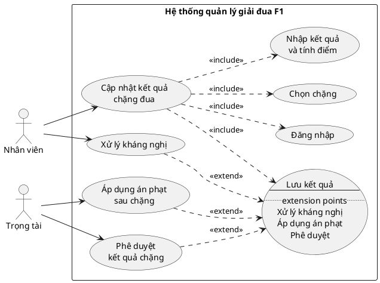
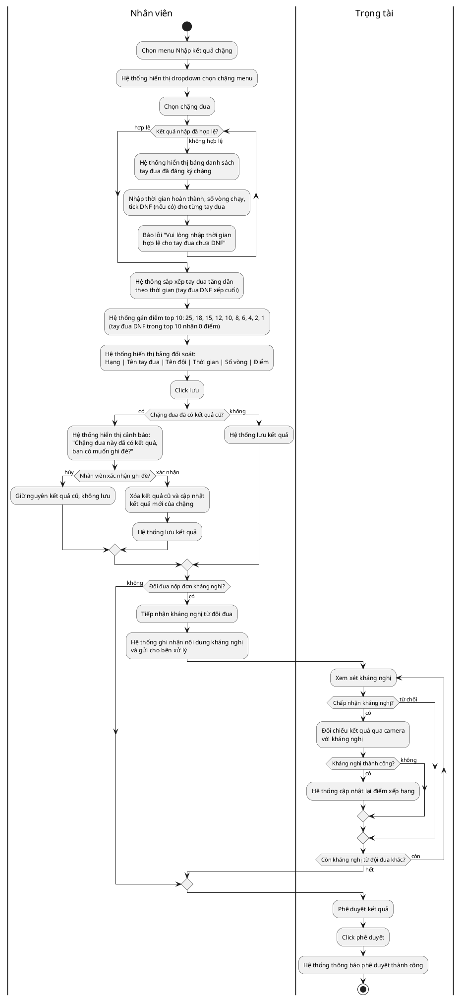
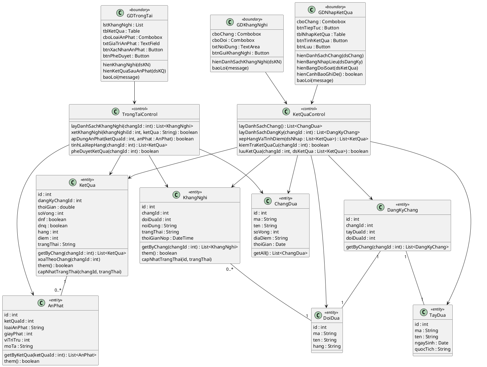
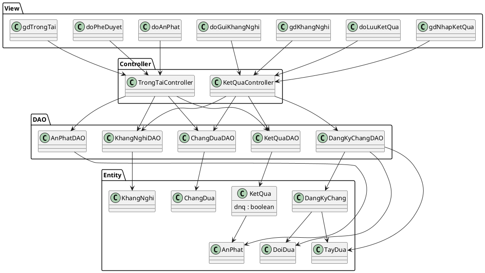
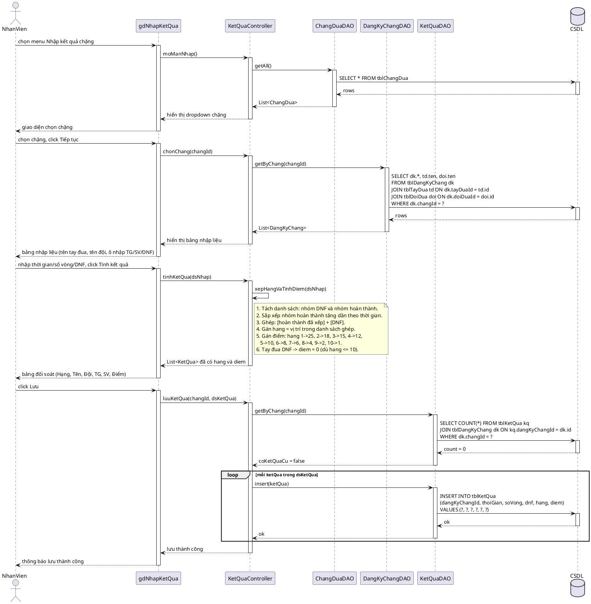
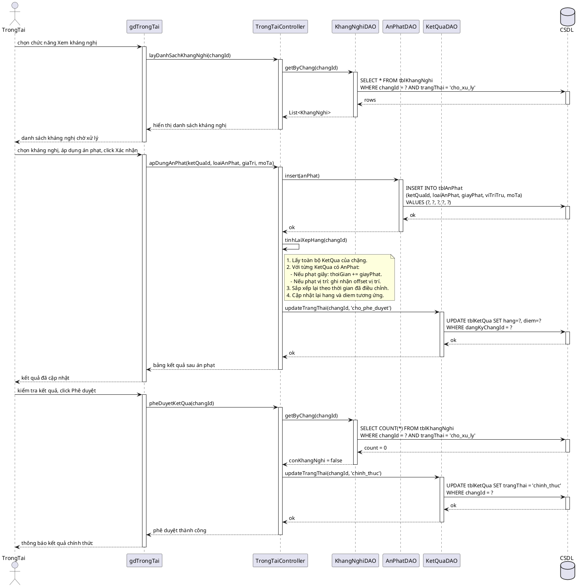

# Module 3 — BẢN MỞ RỘNG CỦA KIET (chưa chuẩn hoá) — LƯU TRỮ, KHÔNG DÙNG TRỰC TIẾP

> **File này là gì:** bản `noi-dung.md` Kiet viết trên nhánh remote (commit `bf8866b`, `20a0238`, `b80b6d4`),
> được giữ lại nguyên vẹn khi merge với bản chuẩn hoá theo giáo trình.
> Bản đang dùng chính thức là `Module 3 - Kiet/noi-dung.md`.
>
> **Phần NGHIỆP VỤ Kiet thêm (đáng giá, chưa có trong bản chính):**
> - Actor thứ hai: **Trọng tài**
> - 3 use case mở rộng: `Xử lý kháng nghị`, `Áp dụng án phạt sau chặng`, `Phê duyệt kết quả chặng`
> - 2 thực thể mới: `KhangNghi`, `AnPhat`; `KetQua` thêm `trangThai` (chờ phê duyệt / chính thức)
> - Sequence 7B cho luồng trọng tài; 5 test case TC5–TC9
>
> **Vì sao chưa gộp thẳng vào bản chính:** phần này viết theo mẫu cũ (có lớp `Control`,
> `Controller`, stereotype `<<boundary>>`, lifeline CSDL + SQL trong sequence, test case bảng 6 cột)
> — đều là những thứ giáo trình của thầy KHÔNG dùng (xem `docs/05-doi-chieu-chuan-thay.md`).
> Ngoài ra kháng nghị / án phạt không có trong đề bài gốc (`SE-list-of-project.pdf` project 10).
>
> **Nhóm cần quyết:** (a) bỏ phần mở rộng, giữ M3 đúng đề — hoặc (b) giữ phần mở rộng
> nhưng viết lại theo chuẩn thầy (bỏ Control, lớp biên chỉ thuộc tính, sequence jsp→DAO→entity,
> test case Bảng 6.7) và bổ sung `KhangNghi`/`AnPhat` vào `docs/03` + UC tổng quát + báo cáo.

---

# Module 3 — Cập nhật kết quả và tính điểm chặng đua — Nội dung chi tiết

> Nội dung chữ do Claude dựng. Việc của bạn: mở Visual Paradigm, vẽ theo các blueprint/PlantUML bên dưới, export ảnh vào `hinh/`, rồi ghép vào báo cáo.

## 0. Danh sách ảnh cần export (đặt vào `hinh/`)

| Tên file | Biểu đồ (mục) |
|---|---|
| `m3-uc-chitiet.png` | UC chi tiết (mục 1) |
| `m3-hoatdong.png` | Biểu đồ hoạt động (mục 3) |
| `m3-lop-phantich.png` | Biểu đồ lớp phân tích (mục 4) |
| `m3-giaodien-nhapketqua.png` | Giao diện nhập kết quả + đối soát (mục 5) |
| `m3-lop-mvc.png` | Biểu đồ lớp thiết kế MVC (mục 6) |
| `m3-tuantu.png` | Biểu đồ tuần tự (mục 7) |

> **Quy tắc tên:** `m<số module>-<tên biểu đồ>.png` — chữ thường, không dấu, ngăn cách bằng `-`.

---

## 1. Biểu đồ UC chi tiết

Module 3 có **hai actor**: Nhân viên (nhập kết quả, xử lý kháng nghị) và Trọng tài (áp dụng án phạt, phê duyệt kết quả chính thức).

- **Nhân viên** thực hiện UC chính `Cập nhật kết quả chặng đua`, include {Đăng nhập, Chọn chặng, Nhập kết quả và tính điểm, Lưu kết quả}.
- `Lưu kết quả` có extension points:
  - **extend** bởi `Xử lý kháng nghị` (Nhân viên) — khi đội đua nộp kháng nghị sau khi kết quả được lưu.
  - **extend** bởi `Áp dụng án phạt sau chặng` (Trọng tài) — khi trọng tài xác nhận vi phạm.
  - **extend** bởi `Phê duyệt kết quả chặng` (Trọng tài) — khi trọng tài xác nhận kết quả chính thức.

## 2. Đặc tả Use Case

### 2.1 UC chính — Cập nhật kết quả chặng đua

| Mục | Nội dung |
|---|---|
| **Use case** | Cập nhật kết quả và tính điểm chặng đua |
| **Actor chính** | Nhân viên |
| **Actor phụ** | Trọng tài |
| **Tiền điều kiện** | Nhân viên đã đăng nhập thành công; chặng đua đã có danh sách tay đua đăng ký từ Module 2 |
| **Hậu điều kiện** | Kết quả (hạng, thời gian, số vòng, điểm) của từng tay đua trong chặng được lưu vào CSDL và được trọng tài phê duyệt chính thức |
| **Kịch bản chính** | 1. Nhân viên chọn menu "Nhập kết quả chặng". 2. Hệ thống hiển thị giao diện nhập kết quả: danh sách thả xuống chọn chặng đua. 3. Nhân viên chọn chặng đua từ dropdown và bấm **Tiếp tục**. 4. Hệ thống hiển thị bảng danh sách các tay đua đã đăng ký chặng đó (lấy từ Module 2), mỗi dòng gồm: STT, Tên tay đua, Tên đội, và ba ô nhập: **Thời gian hoàn thành (hh:mm:ss.xxx)**, **Số vòng chạy được**, **DNF ☑ (bỏ cuộc/tai nạn)**. 5. Nhân viên nhập đủ kết quả cho tất cả tay đua và click **Tính kết quả**. 6. Hệ thống kiểm tra tính hợp lệ: tay đua không tick DNF bắt buộc phải có thời gian hợp lệ. Nếu hợp lệ, hệ thống tự động xếp hạng tăng dần theo thời gian về đích (tay đua DNF xếp cuối cùng); gán điểm cho top 10 theo thứ tự 25, 18, 15, 12, 10, 8, 6, 4, 2, 1; tay đua nằm trong top 10 nhưng DNF nhận 0 điểm; sau đó hiển thị bảng kết quả đối soát gồm: Hạng, Tên tay đua, Tên đội, Thời gian, Số vòng, Điểm. 7. Nhân viên kiểm tra bảng đối soát và click **Lưu**. 8. Hệ thống lưu kết quả sơ bộ vào CSDL (trạng thái: *chờ phê duyệt*). |
| **Ngoại lệ** | **5a.** Tay đua không tick DNF nhưng để trống hoặc nhập sai định dạng Thời gian → hệ thống báo lỗi "Vui lòng nhập thời gian hợp lệ cho tay đua chưa DNF", không cho tính kết quả. **8a.** Chặng đã có kết quả từ trước → hiển thị hộp thoại cảnh báo "Chặng đua này đã có kết quả, bạn có muốn ghi đè?". Nếu nhân viên chọn **Hủy** → không lưu, giữ nguyên kết quả cũ. Nếu chọn **Đồng ý** → xóa kết quả cũ, lưu kết quả mới, tính lại điểm toàn bộ chặng. |

### 2.2 UC5 — Xử lý kháng nghị *(extend UC4)*

| Mục | Nội dung |
|---|---|
| **Use case** | Xử lý kháng nghị |
| **Actor** | Nhân viên |
| **Điểm mở rộng** | Sau khi Lưu kết quả (UC4) — khi có đội đua nộp kháng nghị |
| **Tiền điều kiện** | Kết quả chặng đã được lưu (trạng thái *chờ phê duyệt*) |
| **Hậu điều kiện** | Kháng nghị được ghi nhận vào CSDL với trạng thái (chờ xử lý / chấp nhận / từ chối) |
| **Kịch bản** | 1. Nhân viên chọn chức năng "Ghi nhận kháng nghị". 2. Hệ thống hiển thị form: chọn chặng, chọn đội đua nộp kháng nghị, nhập nội dung kháng nghị. 3. Nhân viên điền đầy đủ và click **Gửi kháng nghị**. 4. Hệ thống lưu kháng nghị (trạng thái: *chờ xử lý*) và chuyển cho trọng tài xem xét. |
| **Ngoại lệ** | Đội đua không được nộp kháng nghị quá 30 phút sau khi kết quả được công bố → báo lỗi "Hết thời hạn nộp kháng nghị". |

### 2.3 UC6 — Áp dụng án phạt sau chặng *(extend UC4)*

| Mục | Nội dung |
|---|---|
| **Use case** | Áp dụng án phạt sau chặng |
| **Actor** | Trọng tài |
| **Điểm mở rộng** | Sau khi Lưu kết quả (UC4) — khi trọng tài xác nhận vi phạm (từ kháng nghị hoặc quan sát trực tiếp) |
| **Tiền điều kiện** | Kết quả chặng đã được lưu (trạng thái *chờ phê duyệt*) |
| **Hậu điều kiện** | Án phạt được ghi nhận; xếp hạng và điểm của tay đua bị phạt được tính lại |
| **Kịch bản** | 1. Trọng tài đăng nhập và chọn chức năng "Áp dụng án phạt". 2. Hệ thống hiển thị danh sách chặng đang ở trạng thái *chờ phê duyệt*. 3. Trọng tài chọn chặng, chọn tay đua bị phạt, nhập loại án phạt (phạt giây: cộng thêm X giây vào thời gian; hoặc phạt vị trí: lùi Y vị trí), nhập mô tả lý do. 4. Trọng tài click **Xác nhận án phạt**. 5. Hệ thống lưu án phạt vào CSDL, tính lại xếp hạng và điểm cho toàn bộ chặng sau khi áp dụng án phạt, hiển thị bảng kết quả đã cập nhật. |
| **Ngoại lệ** | Trọng tài nhập số giây âm hoặc số vị trí âm → báo lỗi "Giá trị án phạt không hợp lệ". |

### 2.4 UC7 — Phê duyệt kết quả chặng *(extend UC4)*

| Mục | Nội dung |
|---|---|
| **Use case** | Phê duyệt kết quả chặng |
| **Actor** | Trọng tài |
| **Điểm mở rộng** | Sau khi Lưu kết quả (UC4) — khi trọng tài xác nhận kết quả là chính thức |
| **Tiền điều kiện** | Kết quả chặng đã được lưu; tất cả kháng nghị và án phạt đã được xử lý xong |
| **Hậu điều kiện** | Kết quả chặng chuyển trạng thái sang *chính thức*; điểm được ghi nhận vào bảng xếp hạng mùa giải |
| **Kịch bản** | 1. Trọng tài chọn chức năng "Phê duyệt kết quả". 2. Hệ thống hiển thị bảng kết quả chặng (sau khi đã áp dụng tất cả án phạt nếu có). 3. Trọng tài kiểm tra và click **Phê duyệt**. 4. Hệ thống cập nhật trạng thái kết quả chặng thành *chính thức* và thông báo phê duyệt thành công. |
| **Ngoại lệ** | Còn kháng nghị chưa xử lý → hệ thống báo lỗi "Còn kháng nghị chưa xử lý, không thể phê duyệt", từ chối phê duyệt. |

## 3. Biểu đồ hoạt động (Activity)

## 4. Biểu đồ lớp phân tích (Boundary / Control / Entity)

- **Boundary:**
  - `GDNhapKetQua` — màn hình Nhân viên: chọn chặng → nhập kết quả → đối soát → lưu
  - `GDKhangNghi` — màn hình Nhân viên: ghi nhận kháng nghị từ đội đua
  - `GDTrongTai` — màn hình Trọng tài: xem xét kháng nghị, áp dụng án phạt, phê duyệt kết quả
- **Control:**
  - `KetQuaControl` — điều phối luồng nhập kết quả, xếp hạng, tính điểm
  - `TrongTaiControl` — điều phối luồng xử lý kháng nghị, án phạt, phê duyệt
- **Entity:** `ChangDua`, `DangKyChang`, `TayDua`, `DoiDua`, `KetQua`, `KhangNghi`, `AnPhat`

## 5. Thiết kế giao diện

**Màn hình duy nhất — Nhập kết quả chặng (`m3-giaodien-nhapketqua.png`):**

Giao diện gồm hai phần hiển thị tuần tự trên cùng một màn hình:

**Phần A — Chọn chặng (hiển thị ban đầu):**
- Tiêu đề: "CẬP NHẬT KẾT QUẢ VÀ TÍNH ĐIỂM CHẶNG ĐUA"
- Combobox **[Chọn chặng đua]** liệt kê tất cả các chặng trong mùa.
- Nút **[Tiếp tục]**.

**Phần B — Nhập liệu và đối soát (hiện ra sau khi chọn chặng):**
- Thông tin chặng đã chọn: Tên chặng, Địa điểm, Tổng số vòng đua.
- **Bảng nhập liệu** — danh sách tay đua đã đăng ký chặng:

| STT | Tên tay đua | Tên đội | Thời gian (hh:mm:ss.xxx) | Số vòng | DNF ☑ |
|---|---|---|---|---|---|
| 1 | Lewis Hamilton | Mercedes | [_____] | [__] | ☐ |
| 2 | Max Verstappen | Red Bull | [_____] | [__] | ☐ |
| … | … | … | … | … | … |

- Nút **[Tính kết quả]**: hệ thống kiểm tra hợp lệ → xếp hạng + tính điểm, bảng bên dưới chuyển thành bảng đối soát có thêm cột Hạng và Điểm.
- **Bảng đối soát** (hiện sau khi bấm Tính kết quả):

| Hạng | Tên tay đua | Tên đội | Thời gian | Số vòng | Điểm |
|---|---|---|---|---|---|
| 1 | … | … | … | … | 25 |
| 2 | … | … | … | … | 18 |
| … | … | … | … | … | … |

- Nút **[Lưu]**: lưu vào CSDL (cảnh báo ghi đè nếu chặng đã có kết quả cũ).

> Vẽ mockup trong VP và export: `hinh/m3-giaodien-nhapketqua.png`.

## 6. Biểu đồ lớp thiết kế (MVC)

- **View (jsp):** `gdNhapKetQua.jsp`, `doLuuKetQua.jsp`, `gdKhangNghi.jsp`, `doGuiKhangNghi.jsp`, `gdTrongTai.jsp`, `doAnPhat.jsp`, `doPheDuyet.jsp`
- **Controller:** `KetQuaController`, `TrongTaiController`
- **DAO:**
  - `ChangDuaDAO` — `getAll()`
  - `DangKyChangDAO` — `getByChang(changId)` (JOIN `tblTayDua`, `tblDoiDua`)
  - `KetQuaDAO` — `getByChang()`, `deleteByChang()`, `insert()`, `updateTrangThai()`
  - `KhangNghiDAO` — `getByChang()`, `insert()`, `updateTrangThai()`
  - `AnPhatDAO` — `getByKetQua()`, `insert()`
- **Entity:** `ChangDua`, `DangKyChang`, `TayDua`, `DoiDua`, `KetQua`, `KhangNghi`, `AnPhat`

## 7. Biểu đồ tuần tự (Sequence)

> Có **hai sequence riêng**: 7A cho Nhân viên (nhập kết quả → lưu) và 7B cho Trọng tài (xử lý kháng nghị → án phạt → phê duyệt). Ngoại lệ (nhập sai TG, ghi đè) đã mô tả trong mục 2+3.

### 7A — Luồng Nhân viên: Nhập và lưu kết quả (chặng chưa có kết quả cũ)

### 7B — Luồng Trọng tài: Xử lý kháng nghị → Áp dụng án phạt → Phê duyệt

## 8. Test case

| ID | Mục tiêu | Tiền điều kiện | Dữ liệu vào | Các bước | Kết quả mong đợi |
|---|---|---|---|---|---|
| **TC1** | Xếp hạng và tính điểm đúng cho top 10 khi không có DNF | Chặng R có 12 tay đua đăng ký; chưa có kết quả lưu | 12 tay đua có thời gian về đích khác nhau, không ai DNF | 1. Chọn chặng R → Tiếp tục. 2. Nhập thời gian cho 12 tay đua. 3. Click Tính kết quả. 4. Click Lưu. | Bảng đối soát xếp hạng tăng dần theo thời gian. Hạng 1–10 nhận điểm `25, 18, 15, 12, 10, 8, 6, 4, 2, 1`; hạng 11 và 12 nhận `0` điểm. Lưu thành công (trạng thái: chờ phê duyệt). |
| **TC2** | Tay đua DNF xếp cuối và nhận 0 điểm dù thời gian nhanh | Chặng R có 10 tay đua đăng ký | Tay đua A có thời gian nhanh thứ 2 nhưng tick DNF | 1. Chọn chặng R → Tiếp tục. 2. Nhập thời gian; tick DNF ở dòng tay đua A. 3. Click Tính kết quả. | Tay đua A bị xếp xuống vị trí cuối bảng và nhận `0` điểm, không ảnh hưởng đến xếp hạng 9 tay đua còn lại. |
| **TC3** | Chặn tính kết quả khi thiếu thời gian bắt buộc | Chặng R có tay đua đăng ký | Tay đua B không tick DNF nhưng để trống cột Thời gian | 1. Chọn chặng R → Tiếp tục. 2. Nhập đủ kết quả các tay đua khác, riêng tay đua B để trống Thời gian và không tick DNF. 3. Click Tính kết quả. | Hệ thống báo lỗi "Vui lòng nhập thời gian hợp lệ cho tay đua chưa DNF". Không thực hiện xếp hạng, không cho phép Lưu. |
| **TC4** | Cảnh báo và ghi đè khi chặng đã có kết quả cũ | Chặng R đã có kết quả lưu trong CSDL | Nhập bộ thời gian mới cho các tay đua của chặng R | 1. Chọn chặng R → Tiếp tục. 2. Nhập kết quả mới → Tính kết quả. 3. Click Lưu. | Hệ thống hiển thị cảnh báo "Chặng đua này đã có kết quả, bạn có muốn ghi đè?". Khi chọn **Đồng ý**: xóa kết quả cũ, lưu kết quả mới, tính lại điểm toàn bộ chặng. Khi chọn **Hủy**: giữ nguyên kết quả cũ, không thay đổi. |
| **TC5** | Ghi nhận kháng nghị hợp lệ từ đội đua | Kết quả chặng R đã được lưu (trạng thái: chờ phê duyệt) | Đội Mercedes kháng nghị về vị trí của tay đua Hamilton | 1. Nhân viên chọn "Ghi nhận kháng nghị". 2. Chọn chặng R, chọn đội Mercedes, nhập nội dung. 3. Click Gửi kháng nghị. | Kháng nghị được lưu (trạng thái: chờ xử lý). Trọng tài thấy kháng nghị mới trong danh sách. |
| **TC6** | Chặn nộp kháng nghị quá hạn | Chặng R đã kết thúc hơn 30 phút | Đội Red Bull nộp kháng nghị sau 35 phút | 1. Nhân viên chọn "Ghi nhận kháng nghị". 2. Điền thông tin → Click Gửi. | Hệ thống báo lỗi "Hết thời hạn nộp kháng nghị". Kháng nghị không được lưu. |
| **TC7** | Trọng tài áp dụng án phạt giây → xếp hạng thay đổi | Chặng R đã có kết quả; tay đua Verstappen hạng 1 | Phạt Verstappen +5 giây → thời gian mới đẩy xuống hạng 2 | 1. Trọng tài chọn chặng R. 2. Chọn tay đua Verstappen, chọn loại phạt giây, nhập 5. 3. Click Xác nhận án phạt. | Hệ thống tính lại: Verstappen xuống hạng 2 (mất 18đ → 25đ), tay đua hạng 2 cũ lên hạng 1. Bảng xếp hạng cập nhật đúng. |
| **TC8** | Chặn phê duyệt khi còn kháng nghị chưa xử lý | Chặng R có 1 kháng nghị (trạng thái: chờ xử lý) | — | 1. Trọng tài chọn chặng R → Click Phê duyệt. | Hệ thống báo lỗi "Còn kháng nghị chưa xử lý, không thể phê duyệt". Kết quả vẫn ở trạng thái chờ phê duyệt. |
| **TC9** | Phê duyệt thành công sau khi xử lý hết kháng nghị | Chặng R đã lưu kết quả; tất cả kháng nghị đã xử lý xong | — | 1. Trọng tài chọn chặng R → Click Phê duyệt. | Trạng thái kết quả chặng R chuyển thành *chính thức*. Thông báo phê duyệt thành công. |
