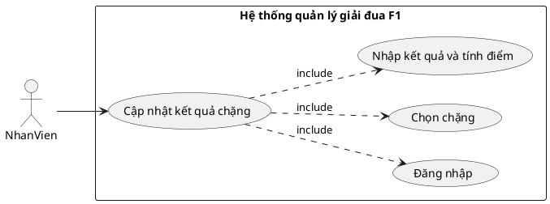
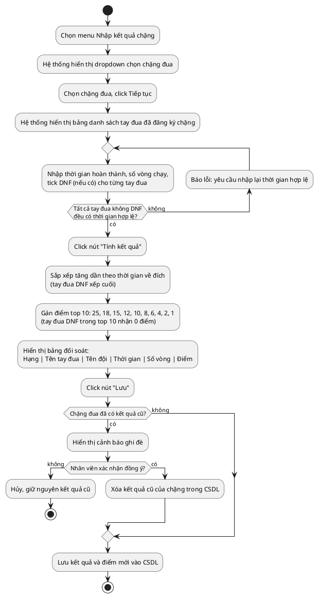
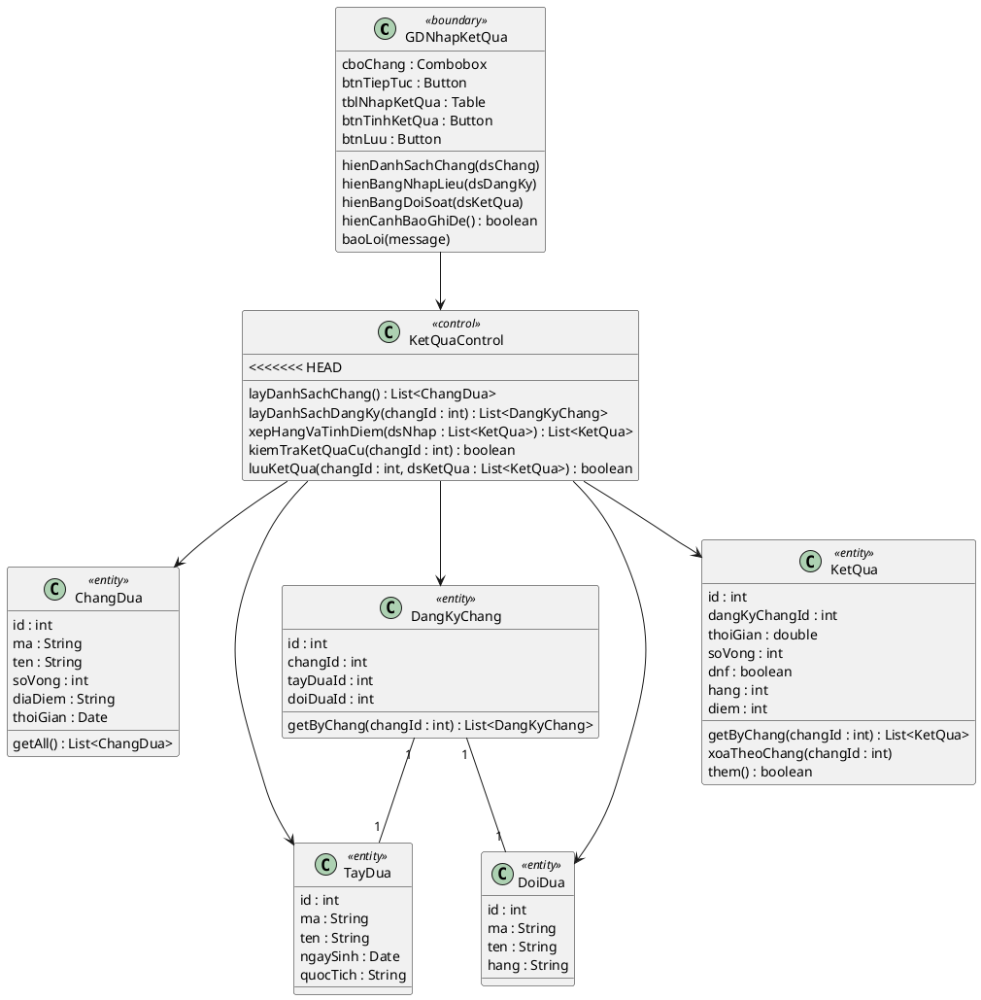
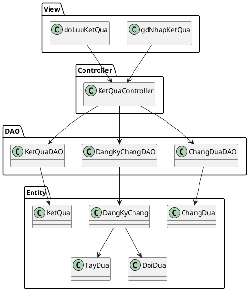
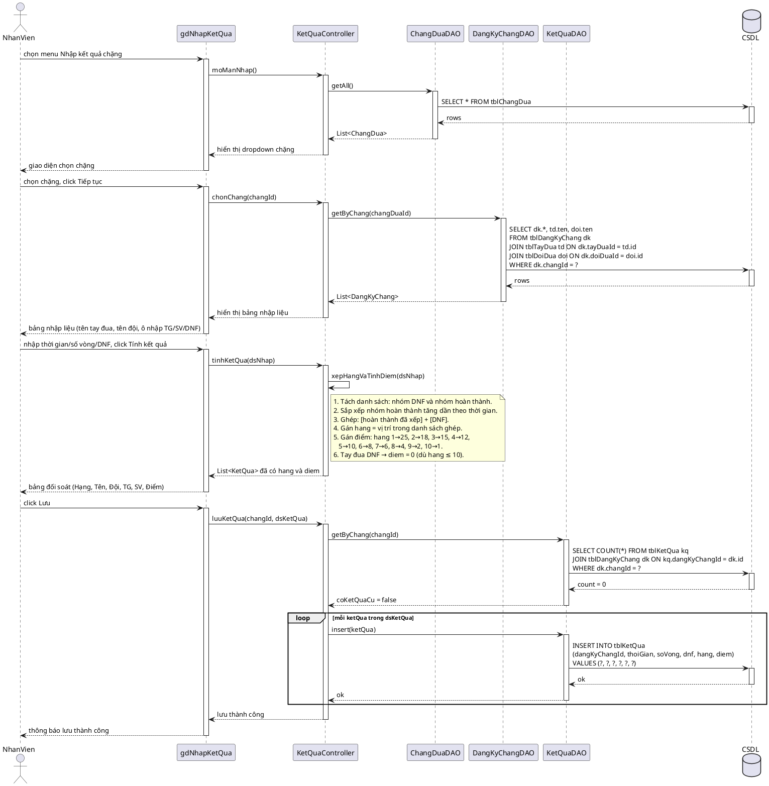

# Module 3 — Cập nhật kết quả và tính điểm chặng đua — Nội dung chi tiết

> Nội dung chữ do Claude dựng. Việc của bạn: mở Visual Paradigm, vẽ theo các blueprint/PlantUML bên dưới, export ảnh vào `hinh/`, rồi ghép vào báo cáo.

## 0. Danh sách ảnh cần export (đặt vào `hinh/`)

| Tên file | Biểu đồ (mục) |
|---|---|
| `m3-uc-chitiet.png` | UC chi tiết (mục 1) |
| `m3-hoatdong.png` | Biểu đồ hoạt động (mục 3) |
| `m3-lop-phantich.png` | Biểu đồ lớp phân tích (mục 4) |
| `m3-giaodien-nhapketqua.png` | Giao diện nhập kết quả + đối soát (mục 5) |
| `m3-lop-mvc.png` | Biểu đồ lớp thiết kế MVC (mục 6) |
| `m3-tuantu.png` | Biểu đồ tuần tự (mục 7) |

> **Quy tắc tên:** `m<số module>-<tên biểu đồ>.png` — chữ thường, không dấu, ngăn cách bằng `-`.

---

## 1. Biểu đồ UC chi tiết

Chức năng "Cập nhật kết quả và tính điểm chặng" có các giao diện tương tác với nhân viên ⇒ tách use case con:
- Đăng nhập → UC `Đăng nhập`
- Chọn chặng → UC `Chọn chặng`
- Nhập kết quả, tính điểm, đối soát và lưu → UC `Nhập kết quả và tính điểm`

Quan hệ: `Cập nhật kết quả` **include** {Đăng nhập, Chọn chặng, Nhập kết quả và tính điểm}.

## 2. Đặc tả Use Case

| Mục | Nội dung |
|---|---|
| **Use case** | Cập nhật kết quả và tính điểm chặng đua |
| **Actor** | Nhân viên |
| **Tiền điều kiện** | Nhân viên đã đăng nhập thành công; chặng đua đã có danh sách tay đua đăng ký từ Module 2 |
| **Hậu điều kiện** | Kết quả (hạng, thời gian, số vòng, điểm) của từng tay đua trong chặng được lưu vào CSDL |
| **Kịch bản chính** | 1. Nhân viên chọn menu "Nhập kết quả chặng". 2. Hệ thống hiển thị giao diện nhập kết quả: danh sách thả xuống chọn chặng đua. 3. Nhân viên chọn chặng đua từ dropdown và bấm **Tiếp tục**. 4. Hệ thống hiển thị bảng danh sách các tay đua đã đăng ký chặng đó (lấy từ Module 2), mỗi dòng gồm: STT, Tên tay đua, Tên đội, và ba ô nhập: **Thời gian hoàn thành (hh:mm:ss.xxx)**, **Số vòng chạy được**, **DNF ☑ (bỏ cuộc/tai nạn)**. 5. Nhân viên nhập đủ kết quả cho tất cả tay đua và click **Tính kết quả**. 6. Hệ thống tự động xếp hạng tăng dần theo thời gian về đích (tay đua DNF xếp cuối cùng); gán điểm cho top 10 theo thứ tự 25, 18, 15, 12, 10, 8, 6, 4, 2, 1; tay đua nằm trong top 10 nhưng DNF nhận 0 điểm; sau đó hiển thị bảng kết quả đối soát gồm: Hạng, Tên tay đua, Tên đội, Thời gian, Số vòng, Điểm. 7. Nhân viên kiểm tra bảng đối soát và click **Lưu**. 8. Hệ thống kiểm tra: nếu chặng chưa có kết quả → lưu trực tiếp. Nếu chặng đã có kết quả cũ → hiển thị cảnh báo ghi đè; khi nhân viên xác nhận, hệ thống xóa kết quả cũ, lưu kết quả mới và tính lại điểm toàn bộ chặng. |
| **Ngoại lệ** | **5a.** Tay đua không tick DNF nhưng để trống hoặc nhập sai định dạng Thời gian → hệ thống báo lỗi "Vui lòng nhập thời gian hợp lệ cho tay đua chưa DNF", không cho tính kết quả. **8a.** Chặng đã có kết quả từ trước → hiển thị hộp thoại cảnh báo "Chặng đua này đã có kết quả, bạn có muốn ghi đè?". Nếu nhân viên chọn **Hủy** → không lưu, giữ nguyên kết quả cũ. Nếu chọn **Đồng ý** → xóa kết quả cũ, lưu kết quả mới, tính lại điểm toàn bộ chặng. |

## 3. Biểu đồ hoạt động (Activity)

## 4. Biểu đồ lớp phân tích (Boundary / Control / Entity)

- **Boundary:**
  - `GDNhapKetQua` (màn hình duy nhất: chọn chặng → nhập kết quả → đối soát → lưu)
- **Control:** `KetQuaControl` điều phối toàn bộ luồng và thực hiện logic xếp hạng, tính điểm
- **Entity:** `ChangDua`, `DangKyChang`, `TayDua`, `DoiDua`, `KetQua`

## 5. Thiết kế giao diện

**Màn hình duy nhất — Nhập kết quả chặng (`m3-giaodien-nhapketqua.png`):**

Giao diện gồm hai phần hiển thị tuần tự trên cùng một màn hình:

**Phần A — Chọn chặng (hiển thị ban đầu):**
- Tiêu đề: "CẬP NHẬT KẾT QUẢ VÀ TÍNH ĐIỂM CHẶNG ĐUA"
- Combobox **[Chọn chặng đua]** liệt kê tất cả các chặng trong mùa.
- Nút **[Tiếp tục]**.

**Phần B — Nhập liệu và đối soát (hiện ra sau khi chọn chặng):**
- Thông tin chặng đã chọn: Tên chặng, Địa điểm, Tổng số vòng đua.
- **Bảng nhập liệu** — danh sách tay đua đã đăng ký chặng:

| STT | Tên tay đua | Tên đội | Thời gian (hh:mm:ss.xxx) | Số vòng | DNF ☑ |
|---|---|---|---|---|---|
| 1 | Lewis Hamilton | Mercedes | [_____] | [__] | ☐ |
| 2 | Max Verstappen | Red Bull | [_____] | [__] | ☐ |
| … | … | … | … | … | … |

- Nút **[Tính kết quả]**: hệ thống xếp hạng + tính điểm, bảng bên dưới chuyển thành bảng đối soát có thêm cột Hạng và Điểm.
- **Bảng đối soát** (hiện sau khi bấm Tính kết quả):

| Hạng | Tên tay đua | Tên đội | Thời gian | Số vòng | Điểm |
|---|---|---|---|---|---|
| 1 | … | … | … | … | 25 |
| 2 | … | … | … | … | 18 |
| … | … | … | … | … | … |

- Nút **[Lưu]**: lưu vào CSDL (cảnh báo ghi đè nếu chặng đã có kết quả cũ).

> Vẽ mockup trong VP và export: `hinh/m3-giaodien-nhapketqua.png`.

## 6. Biểu đồ lớp thiết kế (MVC)

- **View (jsp):** `gdNhapKetQua.jsp`, `doLuuKetQua.jsp`
- **Controller:** `KetQuaController`
- **DAO:**
  - `ChangDuaDAO` — `getAll()`
  - `DangKyChangDAO` — `getByChang(changId)`
  - `KetQuaDAO` — `getByChang(changId)`, `deleteByChang(changId)`, `insert(ketQua)`
- **Entity:** `ChangDua`, `DangKyChang`, `TayDua`, `DoiDua`, `KetQua`

## 7. Biểu đồ tuần tự (Sequence) — luồng chính

> Chỉ vẽ **luồng chính (thành công, chặng chưa có kết quả cũ)**. Các ngoại lệ (nhập sai thời gian, ghi đè) đã mô tả trong đặc tả UC ở mục 2, không đưa vào sequence.

## 8. Test case

| ID | Mục tiêu | Tiền điều kiện | Dữ liệu vào | Các bước | Kết quả mong đợi |
|---|---|---|---|---|---|
| **TC1** | Xếp hạng và tính điểm đúng cho top 10 khi không có DNF | Chặng R có 12 tay đua đăng ký; chưa có kết quả lưu | 12 tay đua có thời gian về đích khác nhau, không ai DNF | 1. Chọn chặng R → Tiếp tục. 2. Nhập thời gian cho 12 tay đua. 3. Click Tính kết quả. 4. Click Lưu. | Bảng đối soát xếp hạng tăng dần theo thời gian. Hạng 1–10 nhận điểm `25, 18, 15, 12, 10, 8, 6, 4, 2, 1`; hạng 11 và 12 nhận `0` điểm. Lưu thành công. |
| **TC2** | Tay đua DNF xếp cuối và nhận 0 điểm dù thời gian nhanh | Chặng R có 10 tay đua đăng ký | Tay đua A có thời gian nhanh thứ 2 nhưng tick DNF | 1. Chọn chặng R → Tiếp tục. 2. Nhập thời gian; tick DNF ở dòng tay đua A. 3. Click Tính kết quả. | Tay đua A bị xếp xuống vị trí cuối bảng và nhận `0` điểm, không ảnh hưởng đến xếp hạng 9 tay đua còn lại. |
| **TC3** | Chặn tính kết quả khi thiếu thời gian bắt buộc | Chặng R có tay đua đăng ký | Tay đua B không tick DNF nhưng để trống cột Thời gian | 1. Chọn chặng R → Tiếp tục. 2. Nhập đủ kết quả các tay đua khác, riêng tay đua B để trống Thời gian và không tick DNF. 3. Click Tính kết quả. | Hệ thống báo lỗi "Vui lòng nhập thời gian hợp lệ cho tay đua chưa DNF". Không thực hiện xếp hạng, không cho phép Lưu. |
| **TC4** | Cảnh báo và ghi đè khi chặng đã có kết quả cũ | Chặng R đã có kết quả lưu trong CSDL | Nhập bộ thời gian mới cho các tay đua của chặng R | 1. Chọn chặng R → Tiếp tục. 2. Nhập kết quả mới → Tính kết quả. 3. Click Lưu. | Hệ thống hiển thị cảnh báo "Chặng đua này đã có kết quả, bạn có muốn ghi đè?". Khi chọn **Đồng ý**: xóa kết quả cũ, lưu kết quả mới, tính lại điểm toàn bộ chặng. Khi chọn **Hủy**: giữ nguyên kết quả cũ, không thay đổi. |
