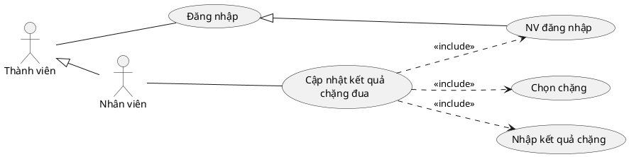
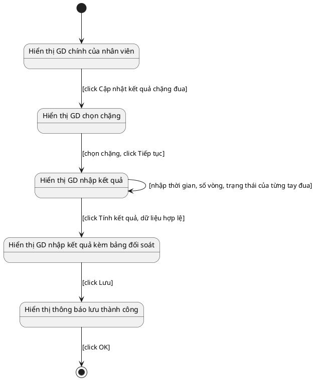
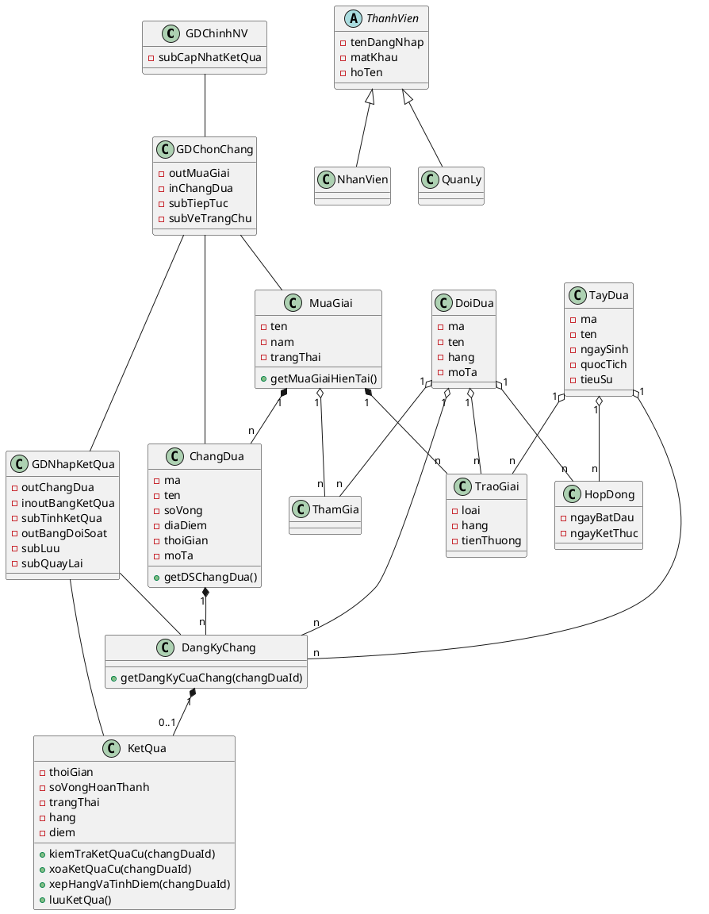
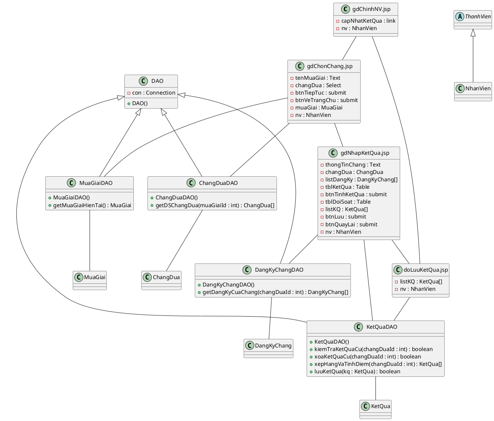
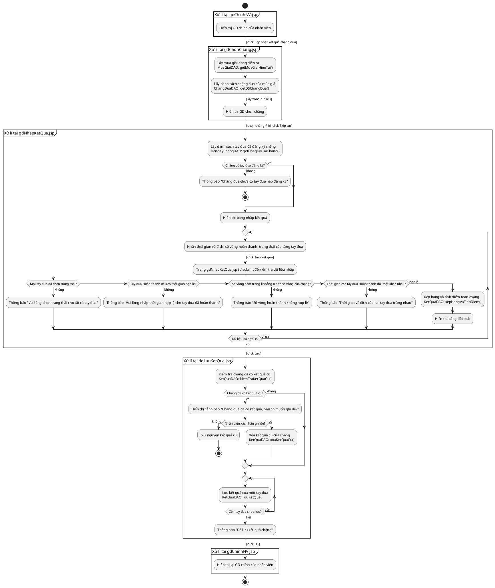
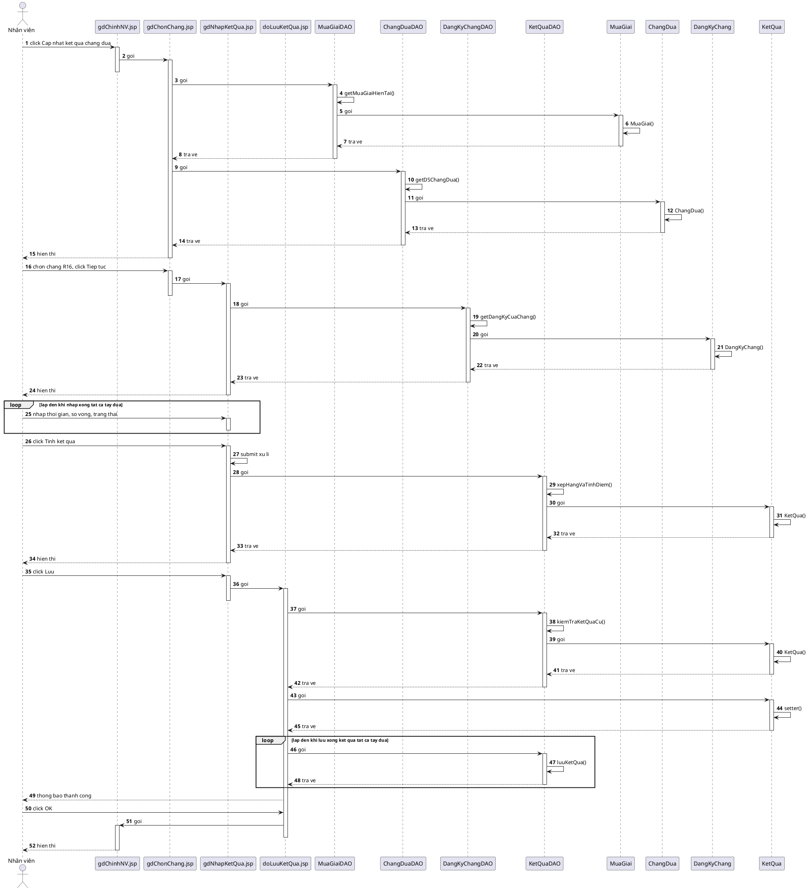

# Module 3 — Cập nhật kết quả chặng đua — Nội dung chi tiết

> Nội dung chữ đã dựng sẵn làm blueprint. Việc của bạn: mở Visual Paradigm, vẽ lại theo các khối PlantUML bên dưới, export ảnh vào `hinh/`, rồi ghép vào báo cáo.

## 0. Danh sách ảnh cần export (đặt vào `hinh/`)

| Tên file | Biểu đồ (mục) |
|---|---|
| `m3-uc-chitiet.png` | Biểu đồ UC chi tiết (mục 1) |
| `m3-trangthai.png` | Biểu đồ trạng thái — phân tích hoạt động (mục 3) |
| `m3-lop-phantich.png` | Biểu đồ lớp phân tích (mục 4) |
| `m3-lop-mvc.png` | Biểu đồ lớp thiết kế — view / dao / model (mục 5) |
| `m3-hoatdong.png` | Biểu đồ hoạt động — pha thiết kế (mục 6) |
| `m3-tuantu.png` | Biểu đồ tuần tự (mục 7) |

> **Quy tắc tên:** `m<số module>-<tên biểu đồ>.png` — chữ thường, không dấu, ngăn cách bằng `-`.
>
> Giao diện **không cần vẽ và không cần xuất ảnh** — phác thảo giao diện được đặt xen ngay giữa các bước của Kịch bản chính trong mục 2 ; nhóm **không** có mục "Thiết kế giao diện" riêng.
>
> **Ghi chú cho người vẽ (mẫu hình trong giáo trình PDF `BG HP TTTN 2 CNPM 2020 final.pdf`):**
> - Biểu đồ trạng thái: vẽ theo mẫu **Hình 3.9/3.11** (máy trạng thái đơn giản, nhãn cung `[hành động]`).
> - Biểu đồ hoạt động: vẽ theo mẫu **Hình 4.9** (khung "Xử lí tại gdXxx.jsp", node DAO tách riêng).
> - Biểu đồ lớp thiết kế: vẽ theo mẫu **Hình 4.4** (3 tầng jsp/DAO/entity, DAO kế thừa `DAO`, chữ ký đầy đủ).
> - Biểu đồ tuần tự: vẽ theo mẫu **Hình 4.10/4.12** (đánh số message, trang chính mở đầu và kết thúc, luồng lưu có setter()).

---

## 1. Biểu đồ UC chi tiết

Use case chính của module là **`Cập nhật kết quả chặng đua`** — tên use case là động từ chỉ hành động của actor, không phải hành động của hệ thống.

Theo nguyên tắc "mỗi giao diện tương tác với người dùng đề xuất thành một use case con", module có **2 màn hình** nên tách thành **2 use case con**; ngoài ra use case chính **include** use case `NV đăng nhập` — use case này **kế thừa** use case dùng chung `Đăng nhập` gắn với actor cha **Thành viên**:

| Màn hình | Use case con | Quan hệ với UC chính |
|---|---|---|
| (dùng chung toàn hệ thống) | `NV đăng nhập` — kế thừa `Đăng nhập` | include |
| Chọn chặng | `Chọn chặng` | include |
| Nhập kết quả | `Nhập kết quả chặng` | include |

Trang xử lý `doLuuKetQua.jsp` chỉ làm nhiệm vụ ghi dữ liệu, không phải màn hình hiển thị nên **không sinh use case con**.

Use case `NV đăng nhập` dùng lại giao diện đăng nhập chung của hệ thống nên module **không** tạo lớp biên, trang jsp hay lifeline riêng cho nó — kịch bản của module vẫn mở đầu "sau khi đăng nhập", và "nhân viên đã đăng nhập" vẫn được ghi ở **Tiền điều kiện** của đặc tả use case.

```plantuml
@startuml
left to right direction

actor "Thành viên" as TV
actor "Nhân viên" as NV
TV <|-- NV

usecase "Đăng nhập" as DN
usecase "NV đăng nhập" as NVDN
usecase "Cập nhật kết quả\nchặng đua" as UC
usecase "Chọn chặng" as CC
usecase "Nhập kết quả chặng" as NK

TV -- DN
NV -- UC

DN <|-- NVDN
UC ..> NVDN : <<include>>
UC ..> CC : <<include>>
UC ..> NK : <<include>>
@enduml
```

> Ghi chú khi vẽ trong Visual Paradigm: actor nối use case bằng **đường kẻ trơn** (association), quan hệ include vẽ bằng **mũi tên nét đứt** kèm nhãn `<<include>>`. Từ actor luôn tồn tại đường đi tới các use case con theo chiều của quan hệ include.

## 2. Đặc tả Use Case

| Mục | Nội dung |
|---|---|
| **Use case** | Cập nhật kết quả chặng đua |
| **Actor** | Nhân viên |
| **Tiền điều kiện** | Nhân viên đã đăng nhập thành công vào hệ thống; chặng đua cần cập nhật đã diễn ra và đã có danh sách tay đua đăng ký (do use case "Đăng ký tay đua tham gia chặng đua" sinh ra) |
| **Hậu điều kiện** | Kết quả của từng tay đua trong chặng (thời gian về đích, số vòng hoàn thành, trạng thái, hạng, điểm) được lưu vào cơ sở dữ liệu. Nếu chặng đã có kết quả cũ thì kết quả cũ bị xóa và thay bằng kết quả mới |

Phác thảo của mỗi màn đặt ngay dưới bước mà hệ thống hiển thị màn đó. Module có **2 màn hình hiển thị riêng**, đúng bằng số use case con giao diện; trang chính `gdChinhNV.jsp` (lớp biên `GDChinhNV`) dùng chung cho toàn hệ thống nên không phác thảo lại ở đây.

**Kịch bản chính**

1. Nhân viên (đã đăng nhập) chọn menu **Cập nhật kết quả chặng đua** trên trang chính `gdChinhNV.jsp`.
2. Hệ thống hiển thị màn hình **Chọn chặng** (trang `gdChonChang.jsp`, lớp biên `GDChonChang`): nhãn mùa giải là **vùng chỉ đọc** ghi `2025 — FIA Formula One World Championship`, lấy từ `MuaGiai` đang hoạt động; ô chọn "Chặng đua" đang rỗng; nút [Tiếp tục] **chưa được active**.

   **Màn hình *Chọn chặng* (`gdChonChang.jsp`)**

   | Thành phần | Kiểu | Trạng thái khi mới mở màn |
   |---|---|---|
   | Mùa giải | vùng chỉ đọc | `2025 — FIA Formula One World Championship` |
   | Chặng đua | danh sách thả xuống | chưa chọn giá trị nào; nội dung ở bảng ngay dưới |
   | [Tiếp tục] | nút | chưa active, chỉ active khi đã chọn chặng |
   | [Về trang chủ] | nút | active |

   Ô chọn chặng đua đổ đủ **6 chặng** của mùa giải 2025 theo thứ tự thời gian, mỗi mục hiển thị dạng `Mã - Tên chặng (Địa điểm)`:

   | TT | Mã | Tên chặng | Địa điểm | Ngày đua | Hiển thị trong ô chọn |
   |---|---|---|---|---|---|
   | 1 | R01 | Australian Grand Prix | Melbourne | 16/03/2025 | R01 - Australian Grand Prix (Melbourne) |
   | 2 | R02 | Chinese Grand Prix | Thượng Hải | 23/03/2025 | R02 - Chinese Grand Prix (Thượng Hải) |
   | 3 | R06 | Monaco Grand Prix | Monte Carlo | 25/05/2025 | R06 - Monaco Grand Prix (Monte Carlo) |
   | 4 | R10 | British Grand Prix | Silverstone | 06/07/2025 | R10 - British Grand Prix (Silverstone) |
   | 5 | R16 | Italian Grand Prix | Monza | 07/09/2025 | R16 - Italian Grand Prix (Monza) |
   | 6 | R24 | Abu Dhabi Grand Prix | Yas Marina | 07/12/2025 | R24 - Abu Dhabi Grand Prix (Yas Marina) |

3. Nhân viên chọn chặng `R16 - Italian Grand Prix (Monza)`; nút [Tiếp tục] **chuyển sang active**; nhân viên click [Tiếp tục].
4. Hệ thống hiển thị màn hình **Nhập kết quả** (trang `gdNhapKetQua.jsp`, lớp biên `GDNhapKetQua`): dòng thông tin chặng là **vùng chỉ đọc** ghi `R16 | Italian Grand Prix | Monza | 53 vòng | 07/09/2025`, lấy từ `ChangDua` được chọn ở bước 3; bảng nhập kết quả gồm các cột **STT | Mã | Tên tay đua | Đội đua | Thời gian về đích (hh:mm:ss.xxx) | Số vòng hoàn thành | Trạng thái**, có 12 dòng ứng với 12 tay đua đã đăng ký chặng, ba cột đầu là dữ liệu chỉ đọc lấy từ đăng ký chặng, ba cột cuối là ô nhập và ô chọn đang rỗng — dòng đầu là `1 | LEC | Charles Leclerc | Ferrari | (trống) | (trống) | (chưa chọn)`; bảng đối soát **chưa hiện**; nút [Lưu] **chưa được active**.

   **Màn hình *Nhập kết quả* (`gdNhapKetQua.jsp`)**

   | Thành phần | Kiểu | Trạng thái khi mới mở màn |
   |---|---|---|
   | Thông tin chặng | vùng chỉ đọc | `R16 - Italian Grand Prix - Monza - 53 vòng - 07/09/2025` |
   | Bảng nhập kết quả | bảng có ô nhập | 12 dòng theo danh sách đăng ký; ba cột đầu chỉ đọc, ba cột cuối đang rỗng |
   | [Tính kết quả] | nút | active |
   | Bảng đối soát | bảng | chưa hiện, chỉ hiện sau khi click [Tính kết quả] và dữ liệu hợp lệ |
   | [Lưu] | nút | chưa active, chỉ active sau khi bảng đối soát đã hiện |
   | [Quay lại] | nút | active |

5. Nhân viên nhập Thời gian về đích, Số vòng hoàn thành và chọn Trạng thái cho từng tay đua, ví dụ dòng của Max Verstappen: `1:13:24.325 | 53 | Hoàn thành`, dòng của Lando Norris: `1:13:27.019 | 53 | Hoàn thành`. Bảng nhập kết quả sau khi nhập:

   | STT | Mã | Tên tay đua | Đội đua | Thời gian về đích | Số vòng hoàn thành | Trạng thái |
   |---|---|---|---|---|---|---|
   | 1 | LEC | Charles Leclerc | Ferrari | `1:13:31.482` | `53` | [ Hoàn thành v ] |
   | 2 | HAM | Lewis Hamilton | Ferrari | `1:13:41.663` | `53` | [ Hoàn thành v ] |
   | 3 | VER | Max Verstappen | Red Bull | `1:13:24.325` | `53` | [ Hoàn thành v ] |
   | … | … | … | … | … | … | … |
   | 12 | SAI | Carlos Sainz | Williams | `1:13:58.520` | `53` | [ Hoàn thành v ] |

   Ô chọn ở cột **Trạng thái** là danh sách thả xuống dùng chung cho mọi dòng, gồm đúng ba giá trị:

   | Giá trị hiển thị trong ô chọn | Thời gian về đích | Vị trí khi xếp hạng | Điểm |
   |---|---|---|---|
   | `Hoàn thành` | bắt buộc nhập, định dạng `hh:mm:ss.xxx` | xếp trước, theo thời gian về đích tăng dần | theo thang 25/18/15/12/10/8/6/4/2/1 cho hạng 1–10 |
   | `DNF (bỏ cuộc, tai nạn)` | không bắt buộc, thường để trống | xếp xuống cuối bảng | 0 |
   | `DSQ (bị loại)` | không bắt buộc, có thể vẫn có thời gian | xếp xuống cuối bảng | 0 |

   Bộ dữ liệu mẫu ở trên minh hoạ **ca chuẩn** — cả 12 tay đua đều `Hoàn thành`, khớp kịch bản chính và test case CNKQ_17; hai ca `DNF` và `DSQ` được kiểm chứng riêng ở CNKQ_18 và CNKQ_19 (mục 8.2). *(Lặp lại bước 5 cho đến khi nhập xong kết quả của cả 12 tay đua.)*

6. Nhân viên click [Tính kết quả].
7. Hệ thống tách danh sách thành nhóm Hoàn thành và nhóm DNF/DSQ, sắp xếp nhóm Hoàn thành tăng dần theo thời gian về đích, xếp nhóm DNF/DSQ xuống cuối, gán hạng theo vị trí, gán điểm cho hạng 1 đến 10 theo thang `25, 18, 15, 12, 10, 8, 6, 4, 2, 1` và gán 0 điểm cho tay đua DNF/DSQ dù nằm trong top 10; sau đó hiển thị **bảng đối soát** (chỉ hiển thị, không nhập) gồm các cột **Hạng | Mã | Tên tay đua | Đội đua | Thời gian | Số vòng | Trạng thái | Điểm**, có 12 dòng, dòng đầu là `1 | VER | Max Verstappen | Red Bull | 1:13:24.325 | 53 | Hoàn thành | 25`, dòng cuối là `12 | STR | Lance Stroll | Aston Martin | 1:14:25.310 | 53 | Hoàn thành | 0`; nút [Lưu] chuyển sang **active**.

   | Hạng | Mã | Tên tay đua | Đội đua | Thời gian | Số vòng | Trạng thái | Điểm |
   |---|---|---|---|---|---|---|---|
   | 1 | VER | Max Verstappen | Red Bull | 1:13:24.325 | 53 | Hoàn thành | 25 |
   | 2 | NOR | Lando Norris | McLaren | 1:13:27.019 | 53 | Hoàn thành | 18 |
   | 3 | LEC | Charles Leclerc | Ferrari | 1:13:31.482 | 53 | Hoàn thành | 15 |
   | … | … | … | … | … | … | … | … |
   | 11 | TSU | Yuki Tsunoda | Red Bull | 1:14:18.902 | 53 | Hoàn thành | 0 |
   | 12 | STR | Lance Stroll | Aston Martin | 1:14:25.310 | 53 | Hoàn thành | 0 |

8. Nhân viên đối chiếu bảng đối soát với biên bản chính thức của Ban tổ chức rồi click [Lưu]; hệ thống gọi trang xử lý `doLuuKetQua.jsp` ghi dữ liệu.
9. Hệ thống kiểm tra thấy chặng chưa có kết quả cũ, lưu 12 dòng kết quả vào cơ sở dữ liệu và hiển thị thông báo "Đã lưu kết quả chặng R16 - Italian Grand Prix".
10. Nhân viên click [OK]; hệ thống quay về trang chính của nhân viên `gdChinhNV.jsp`.

**Ngoại lệ**

- **3a.** Chặng vừa chọn chưa có tay đua nào đăng ký → hệ thống báo "Chặng đua R24 - Abu Dhabi Grand Prix chưa có tay đua nào đăng ký, vui lòng chọn chặng khác", giữ nguyên màn hình Chọn chặng và không chuyển màn.
- **6a.** Còn tay đua chưa chọn Trạng thái → hệ thống báo "Vui lòng chọn trạng thái cho tất cả 12 tay đua", không tính kết quả, giữ nguyên dữ liệu đã nhập.
- **6b.** Tay đua có trạng thái Hoàn thành nhưng bỏ trống hoặc nhập sai định dạng Thời gian về đích (ví dụ dòng của Charles Leclerc để trống) → hệ thống báo "Vui lòng nhập thời gian hợp lệ theo định dạng hh:mm:ss.xxx cho tay đua đã hoàn thành", không tính kết quả. Tay đua DNF hoặc DSQ **không bắt buộc** nhập thời gian.
- **6c.** Số vòng hoàn thành bỏ trống, nhỏ hơn 0 hoặc lớn hơn số vòng của chặng → hệ thống báo "Số vòng hoàn thành phải nằm trong khoảng 0 đến 53", không tính kết quả.
- **6d.** Hai tay đua có trạng thái Hoàn thành nhập trùng thời gian về đích → hệ thống báo "Thời gian về đích của Lando Norris và Charles Leclerc trùng nhau, vui lòng kiểm tra lại", không tính kết quả.
- **8a.** Chặng đã có kết quả từ trước → hệ thống hiển thị hộp thoại "Chặng đua R16 - Italian Grand Prix đã có kết quả, bạn có muốn ghi đè?" ngay trên màn Nhập kết quả. Nếu nhân viên chọn [Hủy] → không lưu, giữ nguyên kết quả cũ. Nếu chọn [Đồng ý] → hệ thống xóa toàn bộ kết quả cũ của chặng, lưu kết quả mới và tính lại điểm của toàn chặng.

> **Ánh xạ sang lớp biên:** màn *Chọn chặng* (`GDChonChang`) — nhãn mùa giải (vùng chỉ đọc) = `-outMuaGiai`, ô chọn "Chặng đua" = `-inChangDua`, nút [Tiếp tục] = `-subTiepTuc`, nút [Về trang chủ] = `-subVeTrangChu`. Màn *Nhập kết quả* (`GDNhapKetQua`) — dòng thông tin chặng (vùng chỉ đọc) = `-outChangDua`, bảng nhập kết quả = `-inoutBangKetQua` (vừa hiển thị danh sách tay đua đã đăng ký, vừa nhận dữ liệu nhập vào), nút [Tính kết quả] = `-subTinhKetQua`, bảng đối soát = `-outBangDoiSoat` (ban đầu chưa hiện, chỉ hiện sau khi bấm [Tính kết quả] và dữ liệu nhập hợp lệ), nút [Lưu] = `-subLuu` (ban đầu chưa active, chỉ active sau khi bảng đối soát đã hiện), nút [Quay lại] = `-subQuayLai`. Mọi vùng hiện dữ liệu ra màn hình đều có đúng một thuộc tính lớp biên tương ứng; trang xử lý `doLuuKetQua.jsp` không hiển thị nên không sinh lớp biên.

> Luồng chuyển màn: **Trang chính → Chọn chặng → Nhập kết quả → (lưu) → Trang chính**.

## 3. Phân tích hoạt động — biểu đồ trạng thái

Mỗi trạng thái là một lần hệ thống hiển thị một giao diện và chờ người dùng tương tác; cung chuyển trạng thái là hành động của người dùng, nhãn đặt trong ngoặc vuông `[…]`. Biểu đồ bắt đầu từ trạng thái hiển thị **giao diện chính của nhân viên** và kết thúc sau khi nhân viên xác nhận thông báo lưu thành công.

Ảnh export: `m3-trangthai.png` (vẽ theo mẫu Hình 3.9/3.11 giáo trình PDF).

```plantuml
@startuml
state "Hiển thị GD chính của nhân viên" as S0
state "Hiển thị GD chọn chặng" as S1
state "Hiển thị GD nhập kết quả" as S2
state "Hiển thị GD nhập kết quả kèm bảng đối soát" as S3
state "Hiển thị thông báo lưu thành công" as S4

[*] --> S0
S0 --> S1 : [click Cập nhật kết quả chặng đua]
S1 --> S2 : [chọn chặng, click Tiếp tục]
S2 --> S2 : [nhập thời gian, số vòng, trạng thái của từng tay đua]
S2 --> S3 : [click Tính kết quả, dữ liệu hợp lệ]
S3 --> S4 : [click Lưu]
S4 --> [*] : [click OK]
@enduml
```

## 4. Biểu đồ lớp phân tích

Biểu đồ lớp phân tích của module chỉ có **hai tầng**: lớp biên và lớp thực thể (không có lớp điều khiển). Nghiệp vụ được gán thẳng cho lớp thực thể.

- **Lớp biên** — mỗi màn hình đề xuất thành một lớp biên, mỗi thành phần nhận/hiện/submit dữ liệu là một thuộc tính, **lớp biên không có phương thức**:
  - `GDChinhNV` — giao diện chính của nhân viên (trang chủ chung của hệ thống, không sinh use case con), chứa liên kết mở chức năng cập nhật kết quả
  - `GDChonChang` — màn hình Chọn chặng
  - `GDNhapKetQua` — màn hình Nhập kết quả và đối soát
  - Mỗi màn hình đều có nút rời màn: màn Chọn chặng có [Về trang chủ] (`-subVeTrangChu`), màn Nhập kết quả có [Quay lại] (`-subQuayLai`)
- **Lớp thực thể mang phương thức nghiệp vụ của module:**
  - `MuaGiai.getMuaGiaiHienTai()` — lấy mùa giải đang diễn ra để hiện lên nhãn mùa giải và làm căn cứ lọc danh sách chặng
  - `ChangDua.getDSChangDua()` — lấy danh sách chặng đua để đổ vào ô chọn
  - `DangKyChang.getDangKyCuaChang(changDuaId)` — lấy danh sách tay đua đã đăng ký chặng
  - `KetQua.xepHangVaTinhDiem(changDuaId)` — xếp hạng và tính điểm cho toàn chặng
  - `KetQua.kiemTraKetQuaCu(changDuaId)` — kiểm tra chặng đã có kết quả hay chưa
  - `KetQua.xoaKetQuaCu(changDuaId)` — xóa kết quả cũ khi nhân viên xác nhận ghi đè
  - `KetQua.luuKetQua()` — lưu kết quả của một tay đua
- Các lớp thực thể còn lại được giữ trên biểu đồ **cùng toàn bộ quan hệ** của chúng, để đồng bộ với biểu đồ lớp thực thể chung của nhóm (`docs/03`). Ở pha phân tích, thuộc tính **chưa có kiểu dữ liệu** và **chưa có `id`**.

```plantuml
@startuml
class GDChinhNV {
  -subCapNhatKetQua
}

class GDChonChang {
  -outMuaGiai
  -inChangDua
  -subTiepTuc
  -subVeTrangChu
}

class GDNhapKetQua {
  -outChangDua
  -inoutBangKetQua
  -subTinhKetQua
  -outBangDoiSoat
  -subLuu
  -subQuayLai
}

class MuaGiai {
  -ten
  -nam
  -trangThai
  +getMuaGiaiHienTai()
}

class ChangDua {
  -ma
  -ten
  -soVong
  -diaDiem
  -thoiGian
  -moTa
  +getDSChangDua()
}

class DoiDua {
  -ma
  -ten
  -hang
  -moTa
}

class TayDua {
  -ma
  -ten
  -ngaySinh
  -quocTich
  -tieuSu
}

class ThamGia {
}

class HopDong {
  -ngayBatDau
  -ngayKetThuc
}

class DangKyChang {
  +getDangKyCuaChang(changDuaId)
}

class KetQua {
  -thoiGian
  -soVongHoanThanh
  -trangThai
  -hang
  -diem
  +kiemTraKetQuaCu(changDuaId)
  +xoaKetQuaCu(changDuaId)
  +xepHangVaTinhDiem(changDuaId)
  +luuKetQua()
}

class TraoGiai {
  -loai
  -hang
  -tienThuong
}

abstract class ThanhVien {
  -tenDangNhap
  -matKhau
  -hoTen
}

class NhanVien {
}

class QuanLy {
}

GDChinhNV -- GDChonChang
GDChonChang -- GDNhapKetQua
GDChonChang -- MuaGiai
GDChonChang -- ChangDua
GDNhapKetQua -- DangKyChang
GDNhapKetQua -- KetQua

MuaGiai "1" *-- "n" ChangDua
MuaGiai "1" o-- "n" ThamGia
DoiDua "1" o-- "n" ThamGia
TayDua "1" o-- "n" HopDong
DoiDua "1" o-- "n" HopDong
ChangDua "1" *-- "n" DangKyChang
TayDua "1" o-- "n" DangKyChang
DoiDua "1" o-- "n" DangKyChang
DangKyChang "1" *-- "0..1" KetQua
MuaGiai "1" *-- "n" TraoGiai
TayDua "1" o-- "n" TraoGiai
DoiDua "1" o-- "n" TraoGiai
ThanhVien <|-- NhanVien
ThanhVien <|-- QuanLy
@enduml
```

> Khi vẽ trong Visual Paradigm: dùng **đường kẻ trơn** cho liên kết, **hình thoi rỗng** cho quan hệ hợp thành lỏng (`o--`), **hình thoi đặc** cho quan hệ hợp thành chặt (`*--`), **tam giác rỗng** cho kế thừa (`<|--`). Không dùng mũi tên định hướng, không dùng stereotype.

## 5. Biểu đồ lớp thiết kế (view / dao / model)

Kiến trúc gồm ba tầng. Tầng `dao` chính là tầng điều khiển truy xuất dữ liệu; **không có lớp Controller riêng**. Các lớp `XxxDAO` đều **kế thừa lớp cha `DAO`** — lớp này chứa cơ chế kết nối cơ sở dữ liệu dùng chung. Lớp view có thuộc tính **kèm kiểu control** (`Select`, `Table`, `link`, `submit`, `Text`, `Reset`) và **thuộc tính ẩn** (đối tượng phiên `-nv : NhanVien`, dữ liệu truyền giữa các trang); lớp DAO có **constructor** và **chữ ký đầy đủ** (tham số : kiểu, kiểu trả về).

- **View (jsp):**
  - `gdChinhNV.jsp` — trang chính của nhân viên (trang chủ chung của hệ thống), chứa liên kết mở chức năng cập nhật kết quả
  - `gdChonChang.jsp`, `gdNhapKetQua.jsp` — hai màn hình hiển thị của module
  - `doLuuKetQua.jsp` — trang xử lý ghi dữ liệu, không hiển thị
- **DAO:**
  - `DAO` (lớp cha) — `-con : Connection`, `+DAO()`: giữ kết nối cơ sở dữ liệu dùng chung cho mọi lớp con
  - `MuaGiaiDAO`, `ChangDuaDAO`, `DangKyChangDAO`, `KetQuaDAO` — nhận đúng các phương thức nghiệp vụ đã gán cho lớp thực thể tương ứng ở pha phân tích (mục 4), bổ sung chữ ký đầy đủ
- **Model:** `MuaGiai`, `ChangDua`, `DangKyChang`, `KetQua`, `ThanhVien`, `NhanVien` (thuộc tính và kiểu dữ liệu đầy đủ xem `docs/03-lop-thuc-the-va-csdl.md`).

```plantuml
@startuml
class "gdChinhNV.jsp" as gdChinhNV {
  -capNhatKetQua : link
  -nv : NhanVien
}
class "gdChonChang.jsp" as gdChonChang {
  -tenMuaGiai : Text
  -changDua : Select
  -btnTiepTuc : submit
  -btnVeTrangChu : submit
  -muaGiai : MuaGiai
  -nv : NhanVien
}
class "gdNhapKetQua.jsp" as gdNhapKetQua {
  -thongTinChang : Text
  -changDua : ChangDua
  -listDangKy : DangKyChang[]
  -tblKetQua : Table
  -btnTinhKetQua : submit
  -tblDoiSoat : Table
  -listKQ : KetQua[]
  -btnLuu : submit
  -btnQuayLai : submit
  -nv : NhanVien
}
class "doLuuKetQua.jsp" as doLuuKetQua {
  -listKQ : KetQua[]
  -nv : NhanVien
}

class DAO {
  -con : Connection
  +DAO()
}
class MuaGiaiDAO {
  +MuaGiaiDAO()
  +getMuaGiaiHienTai() : MuaGiai
}
class ChangDuaDAO {
  +ChangDuaDAO()
  +getDSChangDua(muaGiaiId : int) : ChangDua[]
}
class DangKyChangDAO {
  +DangKyChangDAO()
  +getDangKyCuaChang(changDuaId : int) : DangKyChang[]
}
class KetQuaDAO {
  +KetQuaDAO()
  +kiemTraKetQuaCu(changDuaId : int) : boolean
  +xoaKetQuaCu(changDuaId : int) : boolean
  +xepHangVaTinhDiem(changDuaId : int) : KetQua[]
  +luuKetQua(kq : KetQua) : boolean
}

class MuaGiai
class ChangDua
class DangKyChang
class KetQua
abstract class ThanhVien
class NhanVien
ThanhVien <|-- NhanVien

DAO <|-- MuaGiaiDAO
DAO <|-- ChangDuaDAO
DAO <|-- DangKyChangDAO
DAO <|-- KetQuaDAO

gdChinhNV -- gdChonChang
gdChonChang -- gdNhapKetQua
gdNhapKetQua -- doLuuKetQua
doLuuKetQua -- gdChinhNV

gdChonChang -- MuaGiaiDAO
gdChonChang -- ChangDuaDAO
gdNhapKetQua -- DangKyChangDAO
gdNhapKetQua -- KetQuaDAO
doLuuKetQua -- KetQuaDAO

MuaGiaiDAO -- MuaGiai
ChangDuaDAO -- ChangDua
DangKyChangDAO -- DangKyChang
KetQuaDAO -- KetQua
@enduml
```

## 6. Biểu đồ hoạt động (pha thiết kế)

Mỗi hành động tương ứng một phương thức đã thiết kế trong biểu đồ lớp ở mục 5; các hành động được gom vào khung `Xử lí tại gdXxx.jsp` theo từng trang (kể cả trang xử lý `doLuuKetQua.jsp` và trang chính `gdChinhNV.jsp`); lời gọi tầng dữ liệu là **node riêng đặt NGOÀI khung**, ghi `XxxDAO: tenHam()`, nối bằng mũi tên từ hành động gọi nó; guard trên cung chuyển dạng `[click …]`, `[lấy xong dữ liệu]`; các nhánh kiểm tra ràng buộc nghiệp vụ là node quyết định đặt trong khung của trang xử lý tương ứng (nút [Tính kết quả] do chính `gdNhapKetQua.jsp` tự submit xử lý; kiểm tra kết quả cũ do `doLuuKetQua.jsp` xử lý).

Ảnh export: `m3-hoatdong.png` (vẽ lại theo mẫu Hình 4.9 giáo trình PDF).

```plantuml
@startuml
start
partition "Xử lí tại gdChinhNV.jsp" {
  :Hiển thị GD chính của nhân viên;
}
-> [click Cập nhật kết quả chặng đua];
partition "Xử lí tại gdChonChang.jsp" {
  :Lấy mùa giải đang diễn ra
  MuaGiaiDAO: getMuaGiaiHienTai();
  :Lấy danh sách chặng đua của mùa giải
  ChangDuaDAO: getDSChangDua();
  -> [lấy xong dữ liệu];
  :Hiển thị GD chọn chặng;
}
-> [chọn chặng R16, click Tiếp tục];
partition "Xử lí tại gdNhapKetQua.jsp" {
  :Lấy danh sách tay đua đã đăng ký chặng
  DangKyChangDAO: getDangKyCuaChang();
  if (Chặng có tay đua đăng ký?) then (không)
    :Thông báo "Chặng đua chưa có tay đua nào đăng ký";
    stop
  else (có)
  endif
  :Hiển thị bảng nhập kết quả;
  repeat
    :Nhận thời gian về đích, số vòng hoàn thành, trạng thái của từng tay đua;
    -> [click Tính kết quả];
    :Trang gdNhapKetQua.jsp tự submit để kiểm tra dữ liệu nhập;
    if (Mọi tay đua đã chọn trạng thái?) then (không)
      :Thông báo "Vui lòng chọn trạng thái cho tất cả tay đua";
    elseif (Tay đua Hoàn thành đều có thời gian hợp lệ?) then (không)
      :Thông báo "Vui lòng nhập thời gian hợp lệ cho tay đua đã hoàn thành";
    elseif (Số vòng nằm trong khoảng 0 đến số vòng của chặng?) then (không)
      :Thông báo "Số vòng hoàn thành không hợp lệ";
    elseif (Thời gian các tay đua Hoàn thành đôi một khác nhau?) then (không)
      :Thông báo "Thời gian về đích của hai tay đua trùng nhau";
    else (hợp lệ)
      :Xếp hạng và tính điểm toàn chặng
      KetQuaDAO: xepHangVaTinhDiem();
      :Hiển thị bảng đối soát;
    endif
  repeat while (Dữ liệu đã hợp lệ?) is (chưa) not (rồi)
}
-> [click Lưu];
partition "Xử lí tại doLuuKetQua.jsp" {
  :Kiểm tra chặng đã có kết quả cũ
  KetQuaDAO: kiemTraKetQuaCu();
  if (Chặng đã có kết quả cũ?) then (có)
    :Hiển thị cảnh báo "Chặng đua đã có kết quả, bạn có muốn ghi đè?";
    if (Nhân viên xác nhận ghi đè?) then (không)
      :Giữ nguyên kết quả cũ;
      stop
    else (có)
      :Xóa kết quả cũ của chặng
      KetQuaDAO: xoaKetQuaCu();
    endif
  else (không)
  endif
  repeat
    :Lưu kết quả của một tay đua
    KetQuaDAO: luuKetQua();
  repeat while (Còn tay đua chưa lưu?) is (còn) not (hết)
  :Thông báo "Đã lưu kết quả chặng";
}
-> [click OK];
partition "Xử lí tại gdChinhNV.jsp " {
  :Hiển thị lại GD chính của nhân viên;
}
stop
@enduml
```

## 7. Thuyết minh và biểu đồ tuần tự

### 7.1. Thuyết minh (kịch bản phiên bản 3)

Chỉ thuyết minh **luồng chính** (chặng chưa có kết quả cũ, dữ liệu nhập hợp lệ). Mỗi dòng dưới đây ứng với một message trong biểu đồ tuần tự ở mục 7.2. Luồng mở đầu và kết thúc tại trang chính `gdChinhNV.jsp`; luồng lưu đóng gói dữ liệu bằng `setter()` của lớp thực thể trước khi gọi DAO ghi dữ liệu.

1. Nhân viên click "Cập nhật kết quả chặng đua" trên trang chính gdChinhNV.jsp.
2. Trang gdChinhNV.jsp gọi trang gdChonChang.jsp.
3. Trang gdChonChang.jsp gọi lớp MuaGiaiDAO yêu cầu lấy mùa giải đang diễn ra.
4. Lớp MuaGiaiDAO gọi hàm getMuaGiaiHienTai().
5. Hàm getMuaGiaiHienTai() gọi lớp MuaGiai để đóng gói thông tin.
6. Lớp MuaGiai đóng gói thông tin thực thể.
7. Lớp MuaGiai trả kết quả về cho hàm getMuaGiaiHienTai().
8. Hàm getMuaGiaiHienTai() trả kết quả cho trang gdChonChang.jsp.
9. Trang gdChonChang.jsp gọi lớp ChangDuaDAO yêu cầu lấy danh sách chặng đua của mùa giải.
10. Lớp ChangDuaDAO gọi hàm getDSChangDua().
11. Hàm getDSChangDua() gọi lớp ChangDua để đóng gói thông tin.
12. Lớp ChangDua đóng gói thông tin thực thể.
13. Lớp ChangDua trả kết quả về cho hàm getDSChangDua().
14. Hàm getDSChangDua() trả kết quả cho trang gdChonChang.jsp.
15. Trang gdChonChang.jsp hiển thị danh sách chặng đua cho nhân viên.
16. Nhân viên chọn chặng "R16 - Italian Grand Prix (Monza)" và click Tiếp tục.
17. Trang gdChonChang.jsp gọi trang gdNhapKetQua.jsp.
18. Trang gdNhapKetQua.jsp gọi lớp DangKyChangDAO yêu cầu lấy danh sách tay đua đã đăng ký chặng.
19. Lớp DangKyChangDAO gọi hàm getDangKyCuaChang().
20. Hàm getDangKyCuaChang() gọi lớp DangKyChang để đóng gói thông tin.
21. Lớp DangKyChang đóng gói thông tin thực thể.
22. Lớp DangKyChang trả kết quả về cho hàm getDangKyCuaChang().
23. Hàm getDangKyCuaChang() trả kết quả cho trang gdNhapKetQua.jsp.
24. Trang gdNhapKetQua.jsp hiển thị bảng nhập kết quả cho nhân viên.
25. Nhân viên nhập thời gian về đích, số vòng hoàn thành và chọn trạng thái cho từng tay đua. *(Lặp lại bước 25 cho đến khi nhập xong tất cả tay đua.)*
26. Nhân viên click Tính kết quả.
27. Trang gdNhapKetQua.jsp submit gọi chính nó xử lí.
28. Trang gdNhapKetQua.jsp gọi lớp KetQuaDAO yêu cầu xếp hạng và tính điểm cho chặng.
29. Lớp KetQuaDAO gọi hàm xepHangVaTinhDiem().
30. Hàm xepHangVaTinhDiem() gọi lớp KetQua để đóng gói thông tin.
31. Lớp KetQua đóng gói thông tin thực thể.
32. Lớp KetQua trả kết quả về cho hàm xepHangVaTinhDiem().
33. Hàm xepHangVaTinhDiem() trả kết quả cho trang gdNhapKetQua.jsp.
34. Trang gdNhapKetQua.jsp hiển thị bảng đối soát cho nhân viên.
35. Nhân viên click Lưu.
36. Trang gdNhapKetQua.jsp gọi trang doLuuKetQua.jsp.
37. Trang doLuuKetQua.jsp gọi lớp KetQuaDAO yêu cầu kiểm tra chặng đã có kết quả cũ hay chưa.
38. Lớp KetQuaDAO gọi hàm kiemTraKetQuaCu().
39. Hàm kiemTraKetQuaCu() gọi lớp KetQua để đóng gói thông tin.
40. Lớp KetQua đóng gói thông tin thực thể.
41. Lớp KetQua trả kết quả về cho hàm kiemTraKetQuaCu().
42. Hàm kiemTraKetQuaCu() trả kết quả cho trang doLuuKetQua.jsp.
43. Trang doLuuKetQua.jsp gọi lớp KetQua để đóng gói dữ liệu kết quả vừa nhập.
44. Lớp KetQua gọi hàm setter() đóng gói dữ liệu nhập.
45. Lớp KetQua trả kết quả về cho trang doLuuKetQua.jsp.
46. Trang doLuuKetQua.jsp gọi lớp KetQuaDAO yêu cầu lưu kết quả của một tay đua.
47. Lớp KetQuaDAO gọi hàm luuKetQua().
48. Hàm luuKetQua() trả kết quả cho trang doLuuKetQua.jsp. *(Lặp lại các bước 46–48 cho đến khi lưu xong kết quả của tất cả tay đua trong chặng.)*
49. Trang doLuuKetQua.jsp thông báo lưu thành công cho nhân viên.
50. Nhân viên click OK.
51. Trang doLuuKetQua.jsp gọi lại trang chính gdChinhNV.jsp.
52. Trang gdChinhNV.jsp hiển thị cho nhân viên.

### 7.2. Biểu đồ tuần tự (Sequence)

> Chỉ vẽ **luồng chính**. Các ngoại lệ (thiếu trạng thái, sai định dạng thời gian, số vòng không hợp lệ, trùng thời gian, ghi đè kết quả cũ) đã mô tả ở đặc tả use case mục 2, không đưa vào biểu đồ tuần tự.
>
> Message được đánh số tự động. Trang chính `gdChinhNV.jsp` là lifeline mở đầu và kết thúc; nút [Tính kết quả] do `gdNhapKetQua.jsp` tự submit xử lý (self-call `submit xu li`); luồng lưu đóng gói bằng `setter()` của lớp thực thể trước khi gọi DAO.

```plantuml
@startuml
autonumber
actor "Nhân viên" as NV
participant "gdChinhNV.jsp" as V0
participant "gdChonChang.jsp" as V1
participant "gdNhapKetQua.jsp" as V2
participant "doLuuKetQua.jsp" as V3
participant "MuaGiaiDAO" as D0
participant "ChangDuaDAO" as D1
participant "DangKyChangDAO" as D2
participant "KetQuaDAO" as D3
participant "MuaGiai" as E0
participant "ChangDua" as E1
participant "DangKyChang" as E2
participant "KetQua" as E3

NV -> V0 : click Cap nhat ket qua chang dua
activate V0
V0 -> V1 : goi
activate V1
deactivate V0
V1 -> D0 : goi
activate D0
D0 -> D0 : getMuaGiaiHienTai()
D0 -> E0 : goi
activate E0
E0 -> E0 : MuaGiai()
E0 --> D0 : tra ve
deactivate E0
D0 --> V1 : tra ve
deactivate D0
V1 -> D1 : goi
activate D1
D1 -> D1 : getDSChangDua()
D1 -> E1 : goi
activate E1
E1 -> E1 : ChangDua()
E1 --> D1 : tra ve
deactivate E1
D1 --> V1 : tra ve
deactivate D1
V1 --> NV : hien thi
deactivate V1

NV -> V1 : chon chang R16, click Tiep tuc
activate V1
V1 -> V2 : goi
activate V2
deactivate V1
V2 -> D2 : goi
activate D2
D2 -> D2 : getDangKyCuaChang()
D2 -> E2 : goi
activate E2
E2 -> E2 : DangKyChang()
E2 --> D2 : tra ve
deactivate E2
D2 --> V2 : tra ve
deactivate D2
V2 --> NV : hien thi
deactivate V2

loop lap den khi nhap xong tat ca tay dua
  NV -> V2 : nhap thoi gian, so vong, trang thai
  activate V2
  deactivate V2
end

NV -> V2 : click Tinh ket qua
activate V2
V2 -> V2 : submit xu li
V2 -> D3 : goi
activate D3
D3 -> D3 : xepHangVaTinhDiem()
D3 -> E3 : goi
activate E3
E3 -> E3 : KetQua()
E3 --> D3 : tra ve
deactivate E3
D3 --> V2 : tra ve
deactivate D3
V2 --> NV : hien thi
deactivate V2

NV -> V2 : click Luu
activate V2
V2 -> V3 : goi
activate V3
deactivate V2
V3 -> D3 : goi
activate D3
D3 -> D3 : kiemTraKetQuaCu()
D3 -> E3 : goi
activate E3
E3 -> E3 : KetQua()
E3 --> D3 : tra ve
deactivate E3
D3 --> V3 : tra ve
deactivate D3

V3 -> E3 : goi
activate E3
E3 -> E3 : setter()
E3 --> V3 : tra ve
deactivate E3

loop lap den khi luu xong ket qua tat ca tay dua
  V3 -> D3 : goi
  activate D3
  D3 -> D3 : luuKetQua()
  D3 --> V3 : tra ve
  deactivate D3
end

V3 --> NV : thong bao thanh cong
NV -> V3 : click OK
V3 -> V0 : goi
activate V0
deactivate V3
V0 --> NV : hien thi
deactivate V0
@enduml
```

## 8. Test case

> Xây dựng theo quy trình 4 bước và mẫu Bảng 6.7, giáo trình BG HP TTTN 2 CNPM, mục 6.2: (1) lập checklist các trường hợp cần kiểm thử; (2) viết test case theo bảng 4 cột `Mã | Mục đích kiểm thử | Các bước thực hiện | Kết quả mong muốn`, chia 3 nhóm **Giao diện / Chức năng / Luồng nghiệp vụ**; (3) chuẩn bị data test; (4) chạy và ghi nhận kết quả. Mã test case của module: `CNKQ_n`.

### 8.1. Data test (bước 3 quy trình test)

Bộ dữ liệu nền dưới đây (bộ dữ liệu F1 2025 thống nhất của nhóm, xem `docs/03` mục 5) là tiền đề chung cho nhóm **Luồng nghiệp vụ** và các ca Chức năng có dữ liệu.

`tblChangDua` (chặng của mùa giải 2025, `tblMuaGiaiid = 1`)

| id | ma | ten | soVong | diaDiem | thoiGian | tblMuaGiaiid |
|---|---|---|---|---|---|---|
| 1 | R01 | Australian Grand Prix | 58 | Melbourne | 16/03/2025 | 1 |
| 2 | R02 | Chinese Grand Prix | 56 | Thượng Hải | 23/03/2025 | 1 |
| 3 | R06 | Monaco Grand Prix | 78 | Monte Carlo | 25/05/2025 | 1 |
| 4 | R10 | British Grand Prix | 52 | Silverstone | 06/07/2025 | 1 |
| 5 | R16 | Italian Grand Prix | 53 | Monza | 07/09/2025 | 1 |
| 6 | R24 | Abu Dhabi Grand Prix | 58 | Yas Marina | 07/12/2025 | 1 |

`tblDoiDua`

| id | ma | ten | hang |
|---|---|---|---|
| 1 | FER | Ferrari | Ferrari |
| 2 | RBR | Red Bull | Honda RBPT |
| 3 | MCL | McLaren | Mercedes |
| 4 | MER | Mercedes | Mercedes |
| 5 | AST | Aston Martin | Mercedes |
| 6 | WIL | Williams | Mercedes |

`tblTayDua`

| id | ma | ten | ngaySinh | quocTich |
|---|---|---|---|---|
| 1 | LEC | Charles Leclerc | 16/10/1997 | Monaco |
| 2 | HAM | Lewis Hamilton | 07/01/1985 | Anh |
| 3 | VER | Max Verstappen | 30/09/1997 | Hà Lan |
| 4 | TSU | Yuki Tsunoda | 11/05/2000 | Nhật Bản |
| 5 | NOR | Lando Norris | 13/11/1999 | Anh |
| 6 | PIA | Oscar Piastri | 06/04/2001 | Úc |
| 7 | RUS | George Russell | 15/02/1998 | Anh |
| 8 | ANT | Andrea Kimi Antonelli | 25/08/2006 | Ý |
| 9 | ALO | Fernando Alonso | 29/07/1981 | Tây Ban Nha |
| 10 | STR | Lance Stroll | 29/10/1998 | Canada |
| 11 | ALB | Alexander Albon | 23/03/1996 | Thái Lan |
| 12 | SAI | Carlos Sainz | 01/09/1994 | Tây Ban Nha |

`tblDangKyChang` (đăng ký của chặng R16 — Monza)

| id | tblChangDuaid | tblTayDuaid | tblDoiDuaid |
|---|---|---|---|
| 41 | 5 | 1 (LEC) | 1 (Ferrari) |
| 42 | 5 | 2 (HAM) | 1 (Ferrari) |
| 43 | 5 | 3 (VER) | 2 (Red Bull) |
| 44 | 5 | 4 (TSU) | 2 (Red Bull) |
| 45 | 5 | 5 (NOR) | 3 (McLaren) |
| 46 | 5 | 6 (PIA) | 3 (McLaren) |
| 47 | 5 | 7 (RUS) | 4 (Mercedes) |
| 48 | 5 | 8 (ANT) | 4 (Mercedes) |
| 49 | 5 | 9 (ALO) | 5 (Aston Martin) |
| 50 | 5 | 10 (STR) | 5 (Aston Martin) |
| 51 | 5 | 11 (ALB) | 6 (Williams) |
| 52 | 5 | 12 (SAI) | 6 (Williams) |

`tblKetQua`

| id | tblDangKyChangid | thoiGian | soVongHoanThanh | trangThai | hang | diem |
|---|---|---|---|---|---|---|
| *(không có dòng nào của chặng R16)* | | | | | | |

> Cột `thoiGian` lưu tổng số giây (kiểu `float(10)`); giao diện hiển thị dạng `hh:mm:ss.xxx`. Ví dụ `4404.325` giây hiển thị là `1:13:24.325`.

### 8.2. Bảng test case

| Mã trường hợp kiểm thử | Mục đích kiểm thử | Các bước thực hiện | Kết quả mong muốn |
|---|---|---|---|
| **Giao diện** | | | |
| | **Giao diện — màn Chọn chặng** | | |
| | **Nhóm 1 — Giao diện** | | |
| CNKQ_1 | Kiểm tra tổng thể giao diện màn Chọn chặng | 1. Mở màn Chọn chặng. 2. Kiểm tra bố cục, font chữ, cỡ chữ, màu chữ và chính tả. | Các label và ô nhập cùng font chữ, cỡ chữ; căn lề, độ rộng, khoảng cách đồng đều, không xô lệch; không có lỗi chính tả, cấu trúc câu, ngữ pháp trên màn hình; form được bố trí hợp lý và dễ sử dụng |
| CNKQ_2 | Kiểm tra bố cục màn Chọn chặng | 1. Kiểm tra title của màn hình. 2. Kiểm tra focus của con trỏ. 3. Kiểm tra hiển thị các trường, button và liên kết trên màn hình. | 1. Hiển thị title `Cập nhật kết quả chặng đua — Bước 1: Chọn chặng`. 2. Focus được đặt vào ô chọn "Chặng đua". 3. Hiển thị đầy đủ các trường: Mùa giải (vùng chỉ đọc) · Chặng đua (danh sách thả xuống). 4. Button: [Tiếp tục], [Về trang chủ]. |
| CNKQ_3 | Kiểm tra màn Chọn chặng khi thu nhỏ, phóng to | 1. Nhấn Ctrl -. 2. Nhấn Ctrl +. | Màn hình thu nhỏ, phóng to tương ứng và không bị vỡ giao diện; các bảng vẫn hiển thị đủ cột, không tràn ngang |
| CNKQ_4 | Kiểm tra thứ tự phím Tab màn Chọn chặng | 1. Focus vào màn Chọn chặng. 2. Nhấn Tab liên tục. | Con trỏ di chuyển lần lượt theo thứ tự từ trái qua phải, từ trên xuống dưới, đi hết các trường nhập rồi tới các button |
| CNKQ_5 | Kiểm tra thứ tự phím Shift-Tab màn Chọn chặng | 1. Focus vào màn Chọn chặng. 2. Nhấn Shift-Tab liên tục. | Con trỏ di chuyển ngược lại theo thứ tự từ dưới lên trên, từ phải qua trái |
| CNKQ_6 | Kiểm tra phím Enter màn Chọn chặng | 1. Không focus vào button nào, nhấn Enter. 2. Focus vào một button, nhấn Enter. | 1. Thực hiện đúng chức năng của button chính của màn hình. 2. Thực hiện đúng chức năng của button đang được focus |
| | **Giao diện — màn Nhập kết quả** | | |
| CNKQ_7 | Kiểm tra tổng thể giao diện màn Nhập kết quả | 1. Mở màn Nhập kết quả. 2. Kiểm tra bố cục, font chữ, cỡ chữ, màu chữ và chính tả. | Các label và ô nhập cùng font chữ, cỡ chữ; căn lề, độ rộng, khoảng cách đồng đều, không xô lệch; không có lỗi chính tả, cấu trúc câu, ngữ pháp trên màn hình; form được bố trí hợp lý và dễ sử dụng |
| CNKQ_8 | Kiểm tra bố cục màn Nhập kết quả | 1. Kiểm tra title của màn hình. 2. Kiểm tra focus của con trỏ. 3. Kiểm tra hiển thị các trường, button và liên kết trên màn hình. | 1. Hiển thị title `Cập nhật kết quả chặng đua — Bước 2: Nhập kết quả`. 2. Focus được đặt vào ô "Thời gian về đích" của dòng đầu tiên. 3. Hiển thị đầy đủ các trường: Thông tin chặng (vùng chỉ đọc) · Bảng nhập kết quả (bảng: STT, Mã, Tên tay đua, Đội đua, Thời gian về đích, Số vòng hoàn thành, Trạng thái) · Bảng đối soát (bảng: Hạng, Mã, Tên tay đua, Đội đua, Thời gian, Số vòng, Trạng thái, Điểm — ban đầu chưa hiện). 4. Button: [Tính kết quả], [Lưu], [Quay lại]. |
| CNKQ_9 | Kiểm tra màn Nhập kết quả khi thu nhỏ, phóng to | 1. Nhấn Ctrl -. 2. Nhấn Ctrl +. | Màn hình thu nhỏ, phóng to tương ứng và không bị vỡ giao diện; các bảng vẫn hiển thị đủ cột, không tràn ngang |
| CNKQ_10 | Kiểm tra thứ tự phím Tab màn Nhập kết quả | 1. Focus vào màn Nhập kết quả. 2. Nhấn Tab liên tục. | Con trỏ di chuyển lần lượt theo thứ tự từ trái qua phải, từ trên xuống dưới, đi hết các trường nhập rồi tới các button |
| CNKQ_11 | Kiểm tra thứ tự phím Shift-Tab màn Nhập kết quả | 1. Focus vào màn Nhập kết quả. 2. Nhấn Shift-Tab liên tục. | Con trỏ di chuyển ngược lại theo thứ tự từ dưới lên trên, từ phải qua trái |
| CNKQ_12 | Kiểm tra phím Enter màn Nhập kết quả | 1. Không focus vào button nào, nhấn Enter. 2. Focus vào một button, nhấn Enter. | 1. Thực hiện đúng chức năng của button chính của màn hình. 2. Thực hiện đúng chức năng của button đang được focus |
| | **Nhóm 2 — Chức năng** | | |
| CNKQ_13 | Màn Chọn chặng hiển thị đúng danh sách chặng khi CSDL có dữ liệu | 1. Mở màn Chọn chặng. 2. Mở ô chọn chặng đua | Danh sách chặng khớp các bản ghi trong `tblChangDua` của mùa giải 2025: đúng 6 mục từ `R01 - Australian Grand Prix (Melbourne)` đến `R24 - Abu Dhabi Grand Prix (Yas Marina)`, xếp theo thứ tự thời gian |
| CNKQ_14 | Màn Chọn chặng khi mùa giải chưa có chặng đua | 1. Data test riêng: `tblChangDua` không có bản ghi nào của mùa giải 2025. 2. Mở màn Chọn chặng | Ô chọn chặng đua rỗng; hệ thống báo "Mùa giải chưa có chặng đua"; nút [Tiếp tục] không active |
| CNKQ_15 | Màn Nhập kết quả hiển thị đúng danh sách tay đua đã đăng ký | 1. Chọn chặng `R16 - Italian Grand Prix (Monza)`, click [Tiếp tục] | Bảng nhập hiện đúng 12 dòng khớp các bản ghi trong `tblDangKyChang` của chặng R16 (id 41–52); tên tay đua, đội đua khớp `tblTayDua`, `tblDoiDua`; ba cột Thời gian về đích, Số vòng hoàn thành, Trạng thái đang rỗng |
| CNKQ_16 | Màn Nhập kết quả khi chặng chưa có tay đua đăng ký | 1. Chọn chặng `R24 - Abu Dhabi Grand Prix (Yas Marina)` (không có bản ghi trong `tblDangKyChang`), click [Tiếp tục] | Hệ thống báo "Chặng đua R24 - Abu Dhabi Grand Prix chưa có tay đua nào đăng ký, vui lòng chọn chặng khác"; giữ nguyên màn Chọn chặng |
| **Luồng nghiệp vụ** | | | |
| | **Precond:** nhân viên đã đăng nhập; CSDL theo mục 8.1 — chặng R16 có 12 đăng ký (id 41–52), `tblKetQua` chưa có dòng nào của chặng R16 (riêng CNKQ_21 có precond khác, ghi ở bước 1) | | |
| | **Nhóm 3 — Luồng nghiệp vụ** | | |
| CNKQ_17 | Nhập đủ kết quả, hệ thống xếp hạng và tính điểm đúng (ca chuẩn) | 1. Tại trang chính click "Cập nhật kết quả chặng đua", chọn `R16 - Italian Grand Prix (Monza)`, click [Tiếp tục]. 2. Nhập 12 dòng: VER `1:13:24.325`/53, NOR `1:13:27.019`/53, LEC `1:13:31.482`/53, PIA `1:13:33.900`/53, RUS `1:13:39.245`/53, HAM `1:13:41.663`/53, ALB `1:13:52.117`/53, SAI `1:13:58.520`/53, ANT `1:14:04.031`/53, ALO `1:14:11.786`/53, TSU `1:14:18.902`/53, STR `1:14:25.310`/53 — tất cả Trạng thái `Hoàn thành`. 3. Click [Tính kết quả]. 4. Click [Lưu] | Bước 3: bảng đối soát 12 dòng xếp tăng dần theo thời gian: `1 \| VER \| 25`, `2 \| NOR \| 18`, `3 \| LEC \| 15`, `4 \| PIA \| 12`, `5 \| RUS \| 10`, `6 \| HAM \| 8`, `7 \| ALB \| 6`, `8 \| SAI \| 4`, `9 \| ANT \| 2`, `10 \| ALO \| 1`, `11 \| TSU \| 0`, `12 \| STR \| 0`; nút [Lưu] chuyển sang active. Bước 4: không hiện cảnh báo ghi đè, thông báo "Đã lưu kết quả chặng R16 - Italian Grand Prix". **CSDL:** `tblKetQua` thêm 12 dòng mới (id 101–112), dòng đầu `43 (VER) \| 4404.325 \| 53 \| HoanThanh \| 1 \| 25`, dòng cuối `50 (STR) \| 4465.310 \| 53 \| HoanThanh \| 12 \| 0` (cột `thoiGian` lưu tổng số giây) |
| CNKQ_18 | Tay đua DNF nhận 0 điểm và xếp cuối | 1. Mở màn Nhập kết quả chặng R16. 2. Nhập như CNKQ_17, riêng dòng Max Verstappen: Thời gian để trống, Số vòng `40`, Trạng thái `DNF (bỏ cuộc, tai nạn)`. 3. Click [Tính kết quả]. 4. Click [Lưu] | Bước 2: ô Thời gian trống của Verstappen không bị báo lỗi vì trạng thái là DNF. Bước 3: bảng đối soát: `1 \| NOR \| 25`, `2 \| LEC \| 18`, …, `12 \| VER \| — \| 40 \| DNF \| 0` — Verstappen xếp cuối, 0 điểm; 11 tay đua còn lại đôn lên một bậc so với CNKQ_17. Bước 4: thông báo lưu thành công. **CSDL:** `tblKetQua` thêm 12 dòng, dòng Verstappen `43 \| NULL \| 40 \| DNF \| 12 \| 0`, dòng Norris `45 \| 4407.019 \| 53 \| HoanThanh \| 1 \| 25` |
| CNKQ_19 | Tay đua DSQ nhận 0 điểm và xếp cuối | 1. Mở màn Nhập kết quả chặng R16. 2. Nhập như CNKQ_17, riêng dòng Lewis Hamilton giữ Thời gian `1:13:41.663`, Số vòng `53` nhưng đổi Trạng thái sang `DSQ (bị loại)`. 3. Click [Tính kết quả]. 4. Click [Lưu] | Bước 3: Hamilton tuy về đích thứ 6 nhưng bị xếp cuối hạng 12 với 0 điểm; Albon đôn từ hạng 7 lên hạng 6 nên nhận 8 điểm thay vì 6 điểm. Bước 4: thông báo lưu thành công. **CSDL:** `tblKetQua` thêm 12 dòng, dòng Hamilton `42 \| 4421.663 \| 53 \| DSQ \| 12 \| 0`, dòng Albon `51 \| 4432.117 \| 53 \| HoanThanh \| 6 \| 8` |
| CNKQ_20 | Tay đua Hoàn thành nhưng thiếu Thời gian về đích bị chặn | 1. Mở màn Nhập kết quả chặng R16. 2. Nhập đủ cho 11 tay đua như CNKQ_17; riêng Charles Leclerc để trống Thời gian, nhập Số vòng `53`, chọn Trạng thái `Hoàn thành`. 3. Click [Tính kết quả]. 4. Nhập `1:13:31.482` vào ô Thời gian của Leclerc rồi click [Tính kết quả] lần nữa | Bước 3: báo lỗi "Vui lòng nhập thời gian hợp lệ theo định dạng hh:mm:ss.xxx cho tay đua đã hoàn thành", con trỏ nhảy về ô Thời gian dòng Leclerc; bảng đối soát không hiện; nút [Lưu] chưa active; dữ liệu 11 tay đua kia giữ nguyên. **CSDL:** không bảng nào thay đổi (hệ thống chặn trước khi ghi). Bước 4: bảng đối soát hiện như CNKQ_17 |
| CNKQ_21 | Chặng đã có kết quả cũ: cảnh báo ghi đè và tính lại điểm | 1. Precond riêng: `tblKetQua` đã có 12 dòng id 101–112 của chặng R16 (kết quả sau CNKQ_17); Ban tổ chức phát hiện thời gian của Verstappen và Norris bị nhập nhầm cho nhau. 2. Mở màn Nhập kết quả chặng R16, nhập lại: NOR `1:13:24.325`/53/`Hoàn thành`, VER `1:13:27.019`/53/`Hoàn thành`, 10 tay đua còn lại như CNKQ_17. 3. Click [Tính kết quả]. 4. Click [Lưu] rồi chọn [Hủy]. 5. Click [Lưu] lần nữa rồi chọn [Đồng ý] | Bước 3: bảng đối soát: `1 \| NOR \| 25`, `2 \| VER \| 18`, các hạng 3–12 như CNKQ_17. Bước 4: hộp thoại "Chặng đua R16 - Italian Grand Prix đã có kết quả, bạn có muốn ghi đè?"; chọn [Hủy] → không lưu, kết quả cũ giữ nguyên (Verstappen vẫn hạng 1). Bước 5: hệ thống xóa kết quả cũ, lưu kết quả mới, tính lại điểm toàn chặng, thông báo "Đã cập nhật lại kết quả chặng R16 - Italian Grand Prix". **CSDL:** `tblKetQua` xóa 12 dòng id 101–112, thêm 12 dòng mới id 113–124: `45 (NOR) \| 4404.325 \| 53 \| HoanThanh \| 1 \| 25`, `43 (VER) \| 4407.019 \| 53 \| HoanThanh \| 2 \| 18`, các dòng còn lại giữ thời gian như CNKQ_17 với hạng 3–12 |
