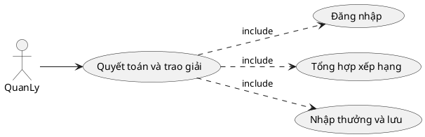
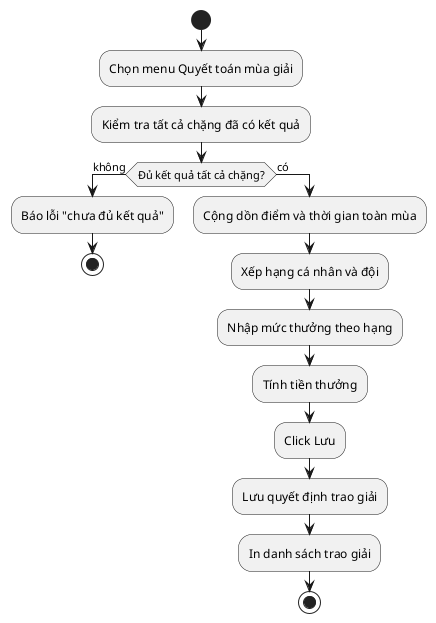
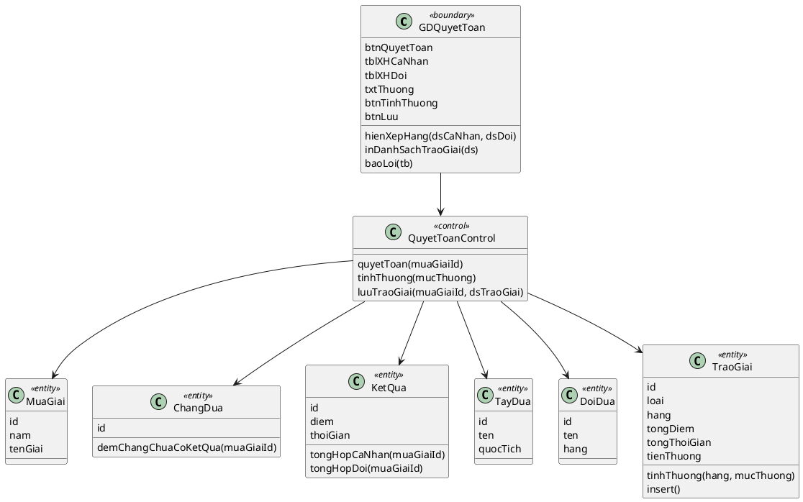
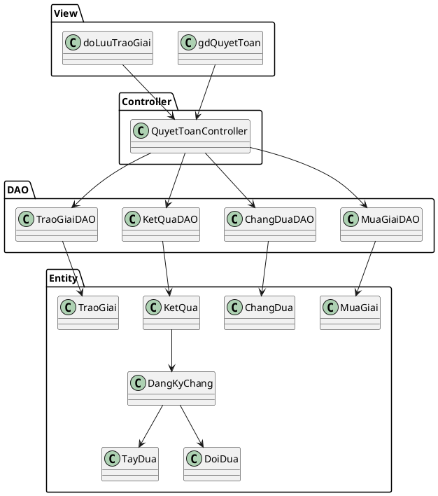
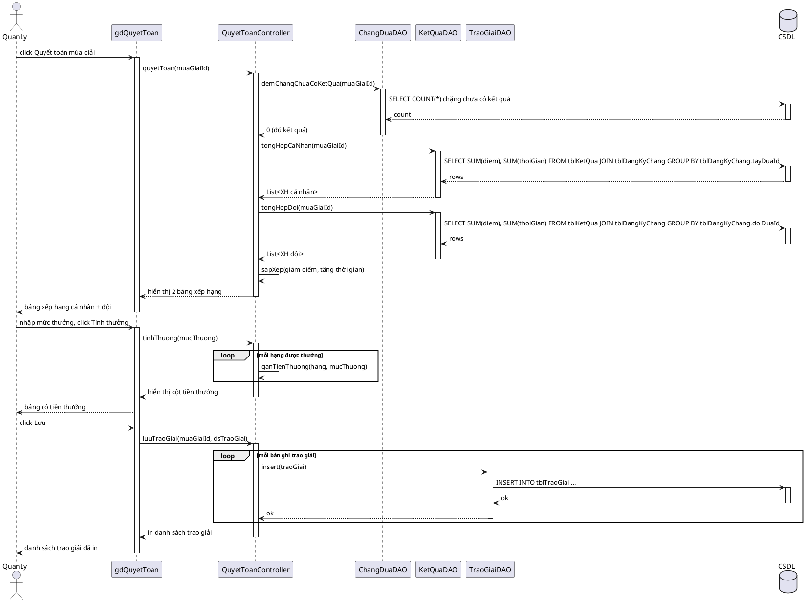

# Module 4 — Quyết toán và trao giải cuối mùa — Nội dung chi tiết

> Nội dung chữ do Claude dựng. Việc của bạn: mở Visual Paradigm, vẽ theo các blueprint/PlantUML bên dưới, export ảnh vào `hinh/`, rồi ghép vào báo cáo.

## 0. Danh sách ảnh cần export (đặt vào `hinh/`)

| Tên file | Biểu đồ (mục) |
|---|---|
| `m4-uc-chitiet.png` | UC chi tiết (mục 1) |
| `m4-hoatdong.png` | Biểu đồ hoạt động (mục 3) |
| `m4-lop-phantich.png` | Biểu đồ lớp phân tích (mục 4) |
| `m4-giaodien-quyettoan.png` | Giao diện quyết toán (mục 5) |
| `m4-lop-mvc.png` | Biểu đồ lớp thiết kế MVC (mục 6) |
| `m4-tuantu.png` | Biểu đồ tuần tự (mục 7) |

> **Quy tắc tên:** `m<số module>-<tên biểu đồ>.png` — chữ thường, không dấu, ngăn cách bằng `-`.

---

## 1. Biểu đồ UC chi tiết

Chức năng "Quyết toán và trao giải" có các giao diện tương tác với quản lý ⇒ tách use case con:
- Đăng nhập → UC `Đăng nhập`
- Tổng hợp xếp hạng cuối mùa → UC `Tổng hợp xếp hạng`
- Nhập thưởng và lưu → UC `Nhập thưởng và lưu`

Quan hệ: `Quyết toán và trao giải` **include** {Đăng nhập, Tổng hợp xếp hạng, Nhập thưởng và lưu}.

## 2. Đặc tả Use Case

| Mục | Nội dung |
|---|---|
| **Use case** | Quyết toán và trao giải cuối mùa |
| **Actor** | Quản lý |
| **Tiền điều kiện** | Quản lý đã đăng nhập; mùa giải đã kết thúc |
| **Hậu điều kiện** | Bảng xếp hạng cuối mùa và tiền thưởng được lưu và in danh sách trao giải |
| **Kịch bản chính** | 1. Quản lý chọn menu "Quyết toán mùa giải". 2. Hệ thống kiểm tra tất cả chặng trong mùa đã có kết quả. 3. Hệ thống cộng dồn điểm và thời gian từng tay đua và từng đội, xếp hạng cá nhân và đội (giảm dần tổng điểm, bằng điểm thì tăng dần tổng thời gian), hiển thị 2 bảng. 4. Quản lý nhập mức thưởng cho từng hạng (1, 2, 3 cá nhân và đội), click Tính thưởng. 5. Hệ thống tính tiền thưởng tương ứng cho từng tay đua/đội. 6. Quản lý kiểm tra, click Lưu → hệ thống lưu quyết định trao giải và in danh sách trao giải. |
| **Ngoại lệ** | 2a. Còn chặng chưa có kết quả → báo lỗi "Chưa đủ kết quả để quyết toán", dừng. |

## 3. Biểu đồ hoạt động (Activity)

## 4. Biểu đồ lớp phân tích (Boundary / Control / Entity)

- **Boundary:** `GDQuyetToan` (btnQuyetToan, tblXHCaNhan, tblXHDoi, txtThuongHang1..3, btnTinhThuong, btnLuu)
- **Control:** `QuyetToanControl` điều phối luồng, kiểm tra ràng buộc, cộng dồn và tính thưởng
- **Entity (kèm phương thức nghiệp vụ):** `MuaGiai`, `ChangDua`, `KetQua`, `TayDua`, `DoiDua`, `TraoGiai`

> Quy tắc xếp hạng (cài trong `tongHopCaNhan`/`tongHopDoi` + sắp xếp): cộng dồn tổng điểm và tổng thời gian qua tất cả chặng; sắp xếp giảm dần theo tổng điểm, nếu bằng điểm thì tăng dần theo tổng thời gian.
>
> **Lưu ý xếp hạng đội:** cộng dồn theo `DangKyChang.doiDuaId` — tức đội đã đăng ký tay đua ở TỪNG chặng, KHÔNG theo đội hiện tại của tay đua (một tay đua có thể đổi đội giữa mùa, nên điểm ở mỗi chặng phải thuộc về đội đã đăng ký tại chặng đó). Truy vết đề bài dòng 8, 11.

## 5. Thiết kế giao diện

**Màn Quyết toán:** nút [Quyết toán mùa giải] ở trên; sau khi bấm hiện 2 bảng — bảng Xếp hạng cá nhân (Hạng, Tay đua, Đội, Tổng điểm, Tổng thời gian) và bảng Xếp hạng đội (Hạng, Đội, Tổng điểm, Tổng thời gian); khu nhập mức thưởng cho hạng 1/2/3; nút [Tính thưởng] → bổ sung cột Tiền thưởng vào 2 bảng; nút [Lưu]. Sau khi lưu → in danh sách trao giải.

> Vẽ mockup màn này trong VP và export → `hinh/m4-giaodien-quyettoan.png`.

## 6. Biểu đồ lớp thiết kế (MVC)

- **View (jsp):** `gdQuyetToan.jsp`, `doLuuTraoGiai.jsp`
- **Controller:** `QuyetToanController`
- **DAO:** `MuaGiaiDAO` (getAll, getMuaGiaiHienTai — nạp `muaGiaiId` của mùa hiện hành), `ChangDuaDAO` (demChangChuaCoKetQua), `KetQuaDAO` (tongHopCaNhan, tongHopDoi), `TraoGiaiDAO` (insert)
- **Entity:** `MuaGiai`, `ChangDua`, `DangKyChang`, `KetQua`, `TayDua`, `DoiDua`, `TraoGiai`

## 7. Biểu đồ tuần tự (Sequence) — luồng chính

> Chỉ vẽ luồng chính (mùa giải đã đủ kết quả). Ngoại lệ (còn chặng chưa có kết quả) mô tả trong đặc tả UC mục 2. Có 2 khối `loop`: một khi tính thưởng theo hạng, một khi lưu từng bản ghi trao giải.

## 8. Test case

| ID | Mục tiêu | Tiền điều kiện | Dữ liệu vào | Các bước | Kết quả mong đợi |
|---|---|---|---|---|---|
| TC1 | Quyết toán hợp lệ | Tất cả chặng đã có kết quả | Mùa giải 2026 | Quyết toán → nhập thưởng → Lưu | Xếp hạng đúng, tính thưởng, lưu + in danh sách trao giải |
| TC2 | Chặn khi thiếu kết quả | Còn 1 chặng chưa có kết quả | Mùa giải 2026 | Click Quyết toán | Báo lỗi "chưa đủ kết quả", không quyết toán |
| TC3 | Tie-break bằng điểm | Tay đua A và B cùng tổng điểm, A có tổng thời gian nhỏ hơn | Mùa giải 2026 | Quyết toán | A xếp trên B |
| TC4 | Tính tiền thưởng theo hạng | Đã quyết toán, xếp hạng xong | Thưởng hạng 1 = 100tr | Nhập mức thưởng → Tính thưởng | Tay đua/đội hạng 1 nhận đúng 100tr |
