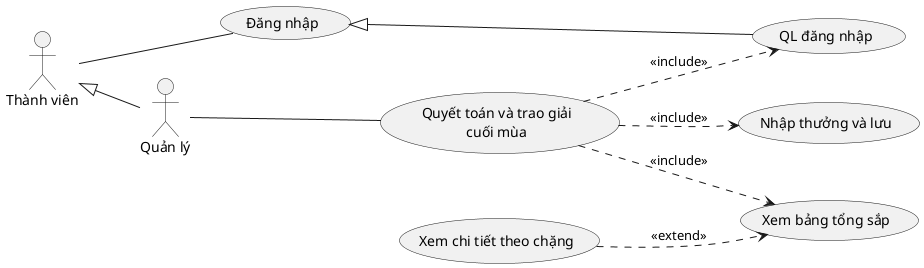
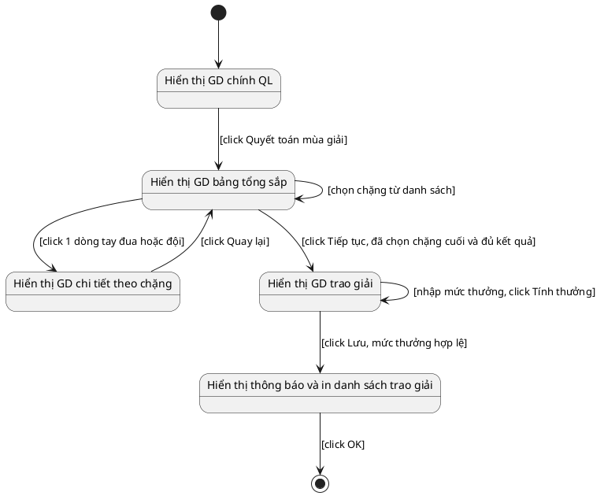
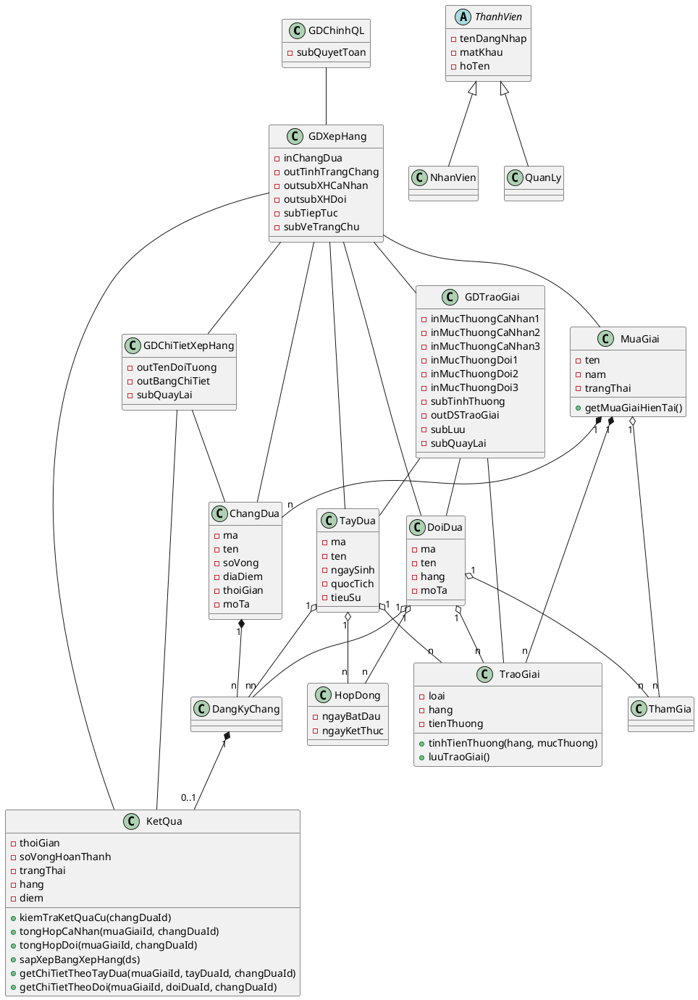
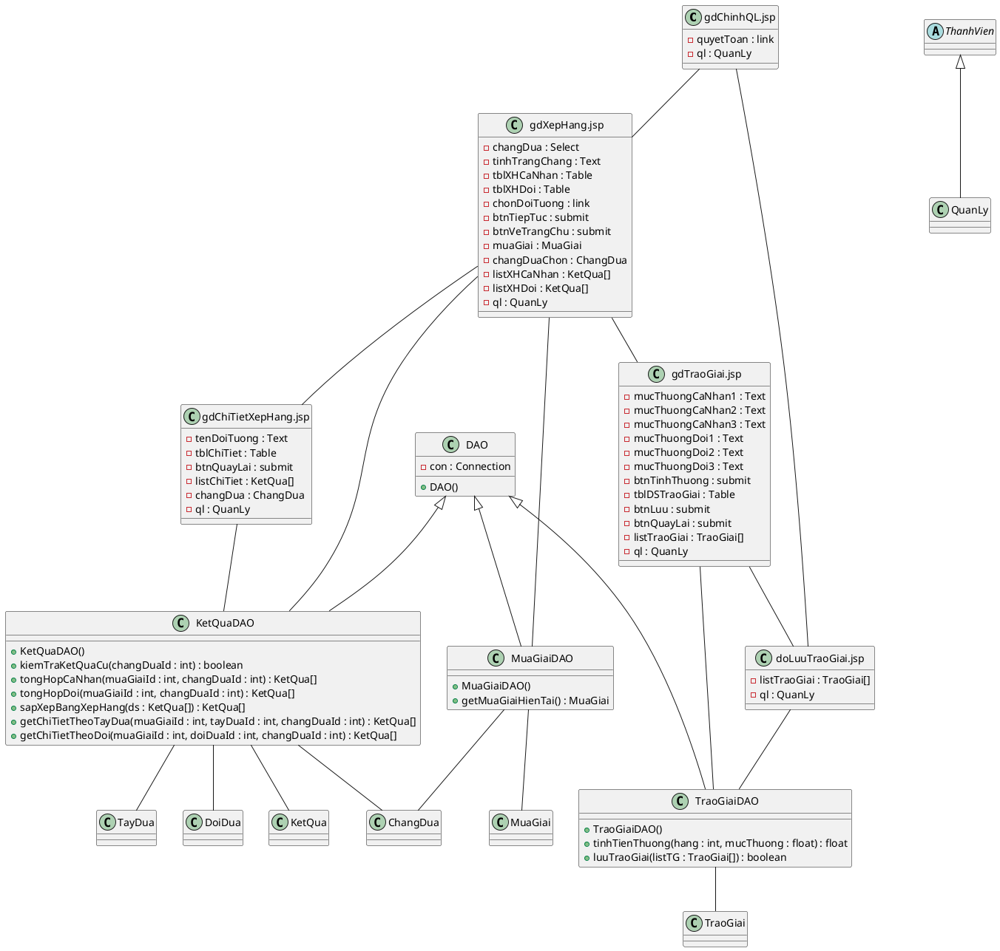
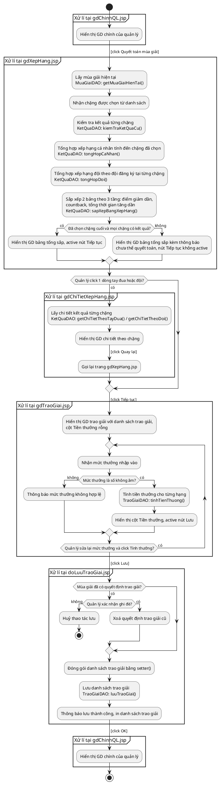
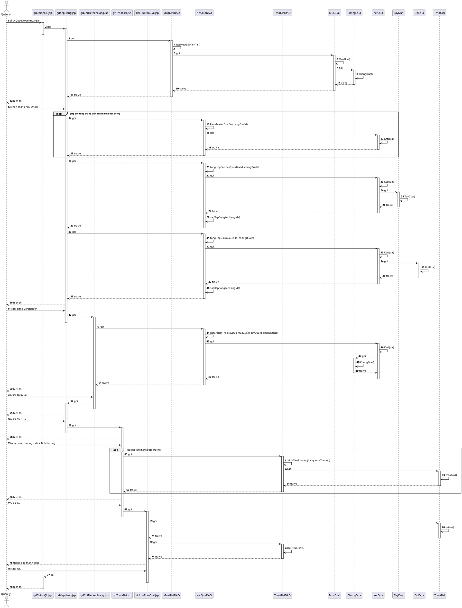

# Module 4 — Quyết toán và trao giải cuối mùa — Nội dung chi tiết

> Nội dung chữ đã chuẩn hoá theo chuẩn của thầy (B1/B2/B3) và giáo trình `BG HP TTTN 2 CNPM 2020` (PDF). Việc của bạn: mở Visual Paradigm, vẽ theo các blueprint/PlantUML bên dưới, export ảnh vào `hinh/`, rồi ghép vào báo cáo.

## 0. Danh sách ảnh cần export (đặt vào `hinh/`)

| Tên file | Biểu đồ (mục) |
|---|---|
| `m4-uc-chitiet.png` | UC chi tiết (mục 1) |
| `m4-trangthai.png` | Biểu đồ trạng thái (mục 3) |
| `m4-lop-phantich.png` | Biểu đồ lớp phân tích (mục 4) |
| `m4-lop-mvc.png` | Biểu đồ lớp thiết kế view/DAO/model (mục 5) |
| `m4-hoatdong.png` | Biểu đồ hoạt động — pha thiết kế (mục 6) |
| `m4-tuantu.png` | Biểu đồ tuần tự (mục 7) |

> **Quy tắc tên:** `m<số module>-<tên biểu đồ>.png` — chữ thường, không dấu, ngăn cách bằng `-`.
>
> **Lưu ý:** toàn bộ 6 ảnh vẽ mới theo blueprint PlantUML bên dưới; bản render tham chiếu có sẵn ở `hinh/ref/`.
>
> Giao diện **không cần vẽ và không cần xuất ảnh** — đã trình bày dạng phác thảo **xen ngay giữa các bước của Kịch bản chính** ở mục 2.
>
> **Ghi chú cho người vẽ (mẫu hình trong giáo trình PDF):**
> - Biểu đồ trạng thái: vẽ theo mẫu **Hình 3.9/3.11** (máy trạng thái đơn giản, nhãn cung `[hành động]`).
> - Biểu đồ hoạt động: vẽ theo mẫu **Hình 4.9** (khung "Xử lí tại gdXxx.jsp" cho từng trang, node gọi DAO tách riêng).
> - Biểu đồ lớp thiết kế: vẽ theo mẫu **Hình 4.4** (3 tầng jsp/DAO/entity, các `XxxDAO` kế thừa `DAO`, chữ ký phương thức đầy đủ).
> - Biểu đồ tuần tự: vẽ theo mẫu **Hình 4.10/4.12** (đánh số message, trang chính mở đầu và kết thúc, luồng lưu dùng `setter()`).

---

## 1. Biểu đồ UC chi tiết

UC chính: **`Quyết toán và trao giải cuối mùa`** (tên này dùng thống nhất ở mọi nơi: `docs/02`, báo cáo, các mục dưới).

Theo B1 và giáo trình PDF mục 3.1.3, UC chi tiết được phân rã theo 2 nguồn: (1) **mỗi giao diện tương tác với người dùng → 1 UC con** (quan hệ include/extend); (2) chức năng **Đăng nhập** được đề xuất thành UC con dùng chung — *"UC chính include UC đăng nhập"* — vì đăng nhập là giao diện dùng chung của toàn hệ thống, không thuộc riêng module nào nên **không** sinh lớp biên/jsp riêng trong module.

Module có 3 màn hình hiển thị nghiệp vụ (ngoài trang chính của quản lý — trang chủ chung, không sinh UC con):

| Màn hình | UC con | Quan hệ với UC chính | Lớp biên | Trang JSP |
|---|---|---|---|---|
| Trang chính quản lý (trang chủ chung) | — | — | `GDChinhQL` | `gdChinhQL.jsp` |
| Bảng tổng sắp (chọn chặng từ danh sách) | `Xem bảng tổng sắp` | include | `GDXepHang` | `gdXepHang.jsp` |
| Chi tiết theo chặng (drill-down 1 dòng) | `Xem chi tiết theo chặng` | **extend từ `Xem bảng tổng sắp`** | `GDChiTietXepHang` | `gdChiTietXepHang.jsp` |
| Trao giải | `Nhập thưởng và lưu` | include | `GDTraoGiai` | `gdTraoGiai.jsp` |
| — (dùng chung toàn hệ thống) | `QL đăng nhập` — kế thừa `Đăng nhập` | include | — | — |
| — (trang xử lý, không hiển thị tương tác) | — | — | — | `doLuuTraoGiai.jsp` |

UC con `Xem chi tiết theo chặng` là **extend**: chỉ xảy ra khi quản lý click vào 1 dòng tay đua/đội trên bảng tổng sắp (đề gốc bắt buộc có drill-down này). Tên UC cũ `Tổng hợp xếp hạng` bị **đổi thành `Xem bảng tổng sắp`**: "tổng hợp/xếp hạng" là hành động của **hệ thống**, còn tên UC bắt buộc phải là động từ chỉ hành động của **actor**.

```plantuml
@startuml
left to right direction

actor "Thành viên" as TV
actor "Quản lý" as QL
TV <|-- QL

usecase "Đăng nhập" as DN
usecase "QL đăng nhập" as QLDN
usecase "Quyết toán và trao giải\ncuối mùa" as UC
usecase "Xem bảng tổng sắp" as XH
usecase "Nhập thưởng và lưu" as NT
usecase "Xem chi tiết theo chặng" as CT

TV -- DN
QL -- UC

DN <|-- QLDN
UC ..> QLDN : <<include>>
UC ..> XH : <<include>>
UC ..> NT : <<include>>
CT ..> XH : <<extend>>
@enduml
```

> Actor nối use case bằng **đường kẻ trơn** `--` (không mũi tên). Quan hệ include/extend vẽ bằng mũi tên nét đứt `..>`. Đường đi từ actor tới các UC con tồn tại theo chiều include/extend, thoả yêu cầu "mỗi UC phải tương tác với ít nhất 1 actor". Kịch bản vẫn mở đầu "sau khi đăng nhập" và Tiền điều kiện giữ "đã đăng nhập".

## 2. Đặc tả Use Case

| Mục | Nội dung |
|---|---|
| **Use case** | Quyết toán và trao giải cuối mùa |
| **Actor** | Quản lý |
| **Tiền điều kiện** | Quản lý đã đăng nhập vào hệ thống; mùa giải `FIA Formula One World Championship 2025` đang ở trạng thái `Đã kết thúc` |
| **Hậu điều kiện** | Quyết định trao giải của mùa giải (giải cá nhân hạng 1–3, giải đồng đội hạng 1–3 kèm tiền thưởng) được lưu vào CSDL; danh sách trao giải được in ra |

> Phác thảo giao diện đặt ngay dưới bước mà hệ thống hiển thị màn hình tương ứng. Module có **3 màn hình hiển thị**, khớp 1-1 với 3 lớp biên ở mục 4; trang chính `gdChinhQL.jsp` dùng chung cho toàn hệ thống và trang xử lý `doLuuTraoGiai.jsp` không hiển thị tương tác nên không phác thảo. Nhãn chặng dùng thống nhất một dạng `Mã - Tên chặng (Địa điểm)`.

**Kịch bản chính**

1. Quản lý (đã đăng nhập) click chức năng **Quyết toán mùa giải** trên trang chính `gdChinhQL.jsp`.
2. Hệ thống lấy mùa giải hiện tại `FIA Formula One World Championship 2025` và hiển thị màn **Bảng tổng sắp** (`gdXepHang.jsp`): danh sách thả xuống **Chặng** gồm 6 chặng của mùa giải, vùng chỉ đọc hiện tình trạng mùa giải (`6/6 chặng đã có kết quả`), hai vùng bảng *Xếp hạng cá nhân* và *Xếp hạng đội* (mỗi dòng là một liên kết click được), nút [Tiếp tục] **chưa được active**.

   **Màn hình *Bảng tổng sắp* (`gdXepHang.jsp`)**

   | Thành phần | Kiểu | Trạng thái khi mới mở màn |
   |---|---|---|
   | Mùa giải | vùng chỉ đọc | `FIA Formula One World Championship 2025` |
   | Chặng | danh sách thả xuống | 6 chặng của mùa giải; nội dung ở bảng ngay dưới |
   | Tình trạng mùa giải | vùng chỉ đọc | `6/6 chặng đã có kết quả` |
   | Xếp hạng cá nhân | bảng, mỗi dòng là liên kết | nội dung ở bảng 1 của bước 4 |
   | Xếp hạng đội | bảng, mỗi dòng là liên kết | nội dung ở bảng 2 của bước 4 |
   | [Tiếp tục] | nút | chưa active, chỉ active khi chặng đang chọn là chặng cuối và đủ 6/6 chặng có kết quả |
   | [Về trang chủ] | nút | active |

   Nội dung danh sách thả xuống **Chặng** — 6 chặng của mùa giải 2025 sắp xếp tăng dần theo thời gian, mỗi mục hiển thị dạng `Mã - Tên chặng (Địa điểm)` (đúng các cột `ma`, `ten`, `diaDiem` của `tblChangDua` ở mục 8.1):

   | TT | Mã | Tên chặng | Địa điểm | Ngày đua | Hiển thị trong ô chọn |
   |---|---|---|---|---|---|
   | 1 | R01 | Australian Grand Prix | Melbourne | 16/03/2025 | R01 - Australian Grand Prix (Melbourne) |
   | 2 | R02 | Chinese Grand Prix | Thượng Hải | 23/03/2025 | R02 - Chinese Grand Prix (Thượng Hải) |
   | 3 | R06 | Monaco Grand Prix | Monte Carlo | 25/05/2025 | R06 - Monaco Grand Prix (Monte Carlo) |
   | 4 | R10 | British Grand Prix | Silverstone | 06/07/2025 | R10 - British Grand Prix (Silverstone) |
   | 5 | R16 | Italian Grand Prix | Monza | 07/09/2025 | R16 - Italian Grand Prix (Monza) |
   | 6 | R24 | Abu Dhabi Grand Prix | Yas Marina | 07/12/2025 | R24 - Abu Dhabi Grand Prix (Yas Marina) |

3. Quản lý chọn chặng `R24 - Abu Dhabi Grand Prix (Yas Marina)` — **chặng cuối** — trong danh sách.
4. Hệ thống kiểm tra cả 6/6 chặng đều đã có kết quả; cộng dồn điểm, tổng thời gian và số lần đạt từng thứ hạng của mỗi tay đua và mỗi đội **tính đến chặng đã chọn**, rồi sắp xếp theo **3 tầng**: (1) tổng điểm giảm dần; (2) bằng điểm → **countback** (so số lần về nhất, rồi về nhì, về ba…); (3) countback vẫn bằng → **tổng thời gian tăng dần**. Hệ thống hiển thị bảng *Xếp hạng cá nhân* đủ 12 dòng, trích 3 dòng đầu:

   | Hạng | Tên tay đua | Quốc tịch | Tên đội | Tổng điểm | Tổng thời gian |
   |---|---|---|---|---|---|
   | 1 | Lando Norris | Anh | McLaren | 119 | 9:03:19.885 |
   | 2 | Max Verstappen | Hà Lan | Red Bull | 119 | 9:03:12.418 |
   | 3 | Oscar Piastri | Úc | McLaren | 95 | 9:04:01.207 |

   và bảng *Xếp hạng đội* đủ 6 dòng, trích 3 dòng đầu:

   | Hạng | Tên đội | Hãng | Tổng điểm | Tổng thời gian |
   |---|---|---|---|---|
   | 1 | McLaren | Mercedes | 214 | 18:07:21.092 |
   | 2 | Ferrari | Ferrari | 132 | 18:10:03.757 |
   | 3 | Red Bull | Honda RBPT | 121 | 18:12:45.433 |

   Mỗi dòng của hai bảng là một liên kết click được. Hai dòng đầu bảng cá nhân bằng 119 điểm nên được tô nền nhạt kèm chú thích `Phân định bằng countback (số lần về nhất)`. Bảng xếp hạng luôn được tính **đến chặng đang chọn**, nên nếu quản lý đổi chặng trong danh sách thì hai bảng được tính lại. Nút [Tiếp tục] **chuyển sang active** vì chặng được chọn là chặng cuối và cả 6/6 chặng đều đã có kết quả.

5. Quản lý xem bảng tổng sắp và click [Tiếp tục].
6. Hệ thống hiển thị màn **Trao giải** (`gdTraoGiai.jsp`): 6 ô nhập mức thưởng (cá nhân hạng 1/2/3, đội hạng 1/2/3) **đang rỗng**; bảng *Danh sách trao giải* có 6 dòng (cá nhân hạng 1–3, đội hạng 1–3), 4 cột đầu đã có sẵn dữ liệu top 3 cá nhân và top 3 đội, **cột Tiền thưởng đang rỗng**; nút [Tính thưởng] đang active, nút [Lưu] **chưa được active**.

   **Màn hình *Trao giải* (`gdTraoGiai.jsp`)**

   | Thành phần | Kiểu | Trạng thái khi mới mở màn |
   |---|---|---|
   | Mức thưởng giải cá nhân hạng 1, 2, 3 | ô nhập | rỗng |
   | Mức thưởng giải đồng đội hạng 1, 2, 3 | ô nhập | rỗng |
   | [Tính thưởng] | nút | active |
   | Danh sách trao giải | bảng | 6 dòng (cá nhân hạng 1–3, đội hạng 1–3); 4 cột đầu đã có dữ liệu, cột Tiền thưởng đang rỗng |
   | [Lưu] | nút | chưa active, chỉ active sau khi cột Tiền thưởng đã được điền |
   | [Quay lại] | nút | active |

7. Quản lý nhập mức thưởng vào 6 ô: cá nhân hạng 1 = `5.000.000.000`, hạng 2 = `3.000.000.000`, hạng 3 = `2.000.000.000`; đội hạng 1 = `20.000.000.000`, hạng 2 = `12.000.000.000`, hạng 3 = `8.000.000.000` rồi click [Tính thưởng].
8. Hệ thống điền cột Tiền thưởng cho đủ 6 dòng của bảng *Danh sách trao giải*:

   | Loại giải | Hạng | Tay đua/Đội | Tổng điểm | Tiền thưởng |
   |---|---|---|---|---|
   | Cá nhân | 1 | Lando Norris | 119 | 5.000.000.000 |
   | Cá nhân | 2 | Max Verstappen | 119 | 3.000.000.000 |
   | Cá nhân | 3 | Oscar Piastri | 95 | 2.000.000.000 |
   | Đội | 1 | McLaren | 214 | 20.000.000.000 |
   | Đội | 2 | Ferrari | 132 | 12.000.000.000 |
   | Đội | 3 | Red Bull | 121 | 8.000.000.000 |

   Nút [Lưu] **chuyển sang active**.

   *(Lặp lại các bước 7–8 cho đến khi quản lý ưng ý với mức thưởng.)*

9. Quản lý kiểm tra danh sách trao giải và click [Lưu]; màn hình gửi dữ liệu sang **trang xử lý** `doLuuTraoGiai.jsp`.
10. Hệ thống lưu 6 bản ghi trao giải, in danh sách trao giải mùa giải 2025 và hiển thị thông báo `Đã lưu quyết định trao giải mùa giải FIA Formula One World Championship 2025`.
11. Quản lý click OK; hệ thống quay về trang chính của quản lý `gdChinhQL.jsp`.

**Ngoại lệ**

**2a.** Không có mùa giải nào ở trạng thái `Đã kết thúc` → hệ thống báo `Không có mùa giải nào đủ điều kiện quyết toán`, quay về trang chính, dừng.

**4a.** Quản lý click vào một dòng của bảng xếp hạng (ví dụ dòng `Max Verstappen` trên bảng xếp hạng cá nhân) → UC con **Xem chi tiết theo chặng** (quan hệ *extend*) được kích hoạt: hệ thống hiển thị màn **Chi tiết theo chặng** (`gdChiTietXepHang.jsp`) với tiêu đề `Max Verstappen — Red Bull`; đây là màn **chỉ đọc**, không có ô nhập nên nút [Quay lại] **luôn active** ngay khi vào màn:

   **Màn hình *Chi tiết theo chặng* (`gdChiTietXepHang.jsp`)**

   | Thành phần | Kiểu | Trạng thái khi mới mở màn |
   |---|---|---|
   | Tên đối tượng được click | vùng chỉ đọc | `Max Verstappen — Red Bull` |
   | Phạm vi dữ liệu | vùng chỉ đọc | `tính đến chặng R24 - Abu Dhabi Grand Prix (Yas Marina)` |
   | Kết quả từng chặng | bảng | nội dung ở bảng ngay dưới; màn chỉ đọc, không có ô nhập |
   | [Quay lại] | nút | active ngay khi vào màn |

   Bảng chi tiết khi click 1 dòng **tay đua** — 6 dòng, trích dòng đầu:

   | Tên chặng | Hạng về đích | Điểm | Thời gian về đích |
   |---|---|---|---|
   | Australian Grand Prix | 2 | 18 | 1:28:06.334 |

   Bảng chi tiết khi click 1 dòng **đội** (ví dụ `McLaren — Mercedes`) — 6 dòng, trích dòng đầu:

   | Tên chặng | Tổng điểm | Tổng thời gian của 2 tay đua |
   |---|---|---|
   | Australian Grand Prix | 35 | 2:56:36.414 |

   Số cột của bảng chi tiết đổi theo loại đối tượng được click: 4 cột với tay đua, 3 cột với đội. Phạm vi dữ liệu vẫn là "tính đến chặng đang chọn" ở màn Bảng tổng sắp, nên nếu chặng đang chọn là `R01 - Australian Grand Prix (Melbourne)` thì bảng chỉ còn 1 dòng. Quản lý click [Quay lại] → trở về màn **Bảng tổng sắp** ở bước 4, giữ nguyên chặng đang chọn.

**4b.** Quản lý chọn chặng **giữa mùa** (ví dụ `R10 - British Grand Prix (Silverstone)`) → hệ thống hiển thị 2 bảng xếp hạng **tính đến chặng đó**; nút [Tiếp tục] **chưa active** vì chưa phải chặng cuối.

**4c.** Mùa giải còn chặng chưa có kết quả (ví dụ `R24 - Abu Dhabi Grand Prix (Yas Marina)` chưa nhập) → hệ thống vẫn cho xem bảng xếp hạng tính đến chặng gần nhất đã có kết quả, nhưng vùng chỉ đọc tình trạng mùa giải chuyển thành `5/6 chặng đã có kết quả` kèm thông báo `Mùa giải 2025 còn 1 chặng chưa có kết quả (R24 - Abu Dhabi Grand Prix), chưa thể quyết toán`, nút [Tiếp tục] **chưa active**.

**4d.** Hai tay đua (hoặc hai đội) bằng tổng điểm → phân định bằng **countback**: `Lando Norris` và `Max Verstappen` cùng 119 điểm, Norris có 3 lần về nhất so với 2 của Verstappen nên Norris xếp trên (dù tổng thời gian của Verstappen nhỏ hơn).

**4e.** Countback vẫn không phân định được sau khi so hết các thứ hạng → hệ thống so **tổng thời gian tăng dần**: bên có tổng thời gian nhỏ hơn xếp trên (đúng mô tả bài toán).

**7a.** Ô mức thưởng bỏ trống, nhập chữ hoặc nhập số âm → hệ thống báo `Mức thưởng phải là số không âm`, giữ nguyên màn Trao giải, cột Tiền thưởng vẫn rỗng, nút [Lưu] vẫn chưa active.

**9a.** Mùa giải đã có quyết định trao giải trước đó → hệ thống cảnh báo `Mùa giải 2025 đã có quyết định trao giải, xác nhận ghi đè?`; chọn Có → xoá quyết định cũ rồi lưu bản mới; chọn Không → huỷ thao tác lưu, giữ nguyên màn Trao giải.

> **Ánh xạ sang lớp biên:** màn *Bảng tổng sắp* (`GDXepHang`) — danh sách thả xuống chọn chặng = `-inChangDua`, vùng chỉ đọc tình trạng mùa giải (`6/6 chặng đã có kết quả`) do hệ thống tính và hiển thị = `-outTinhTrangChang`, bảng *Xếp hạng cá nhân* (vừa hiện vừa cho click từng dòng) = `-outsubXHCaNhan`, bảng *Xếp hạng đội* = `-outsubXHDoi`, nút [Tiếp tục] = `-subTiepTuc`, nút [Về trang chủ] = `-subVeTrangChu`. Màn *Chi tiết theo chặng* (`GDChiTietXepHang`) — tiêu đề tên đối tượng = `-outTenDoiTuong`, bảng chi tiết = `-outBangChiTiet`, nút [Quay lại] = `-subQuayLai`. Màn *Trao giải* (`GDTraoGiai`) — sáu ô nhập mức thưởng là sáu thành phần nhận dữ liệu riêng biệt nên ứng với sáu thuộc tính `-inMucThuongCaNhan1`, `-inMucThuongCaNhan2`, `-inMucThuongCaNhan3`, `-inMucThuongDoi1`, `-inMucThuongDoi2`, `-inMucThuongDoi3` (mỗi thành phần nhập / hiện / submit trên màn hình có đúng một thuộc tính lớp biên), nút [Tính thưởng] = `-subTinhThuong`, bảng *Danh sách trao giải* = `-outDSTraoGiai`, nút [Lưu] = `-subLuu`, nút [Quay lại] = `-subQuayLai`. Trang chính (`GDChinhQL`) — liên kết [Quyết toán mùa giải] = `-subQuyetToan`. Trang xử lý `doLuuTraoGiai.jsp` không hiển thị tương tác ⇒ không sinh UC con và không sinh lớp biên.

> Luồng chuyển màn: **Trang chính → Bảng tổng sắp → (click 1 dòng) Chi tiết theo chặng → (Quay lại) Bảng tổng sắp → (Tiếp tục) Trao giải → (Lưu) → Trang chính**.

## 3. Phân tích hoạt động — biểu đồ trạng thái

Mỗi trạng thái = một lần hệ thống hiển thị 1 giao diện và chờ tương tác; cung chuyển trạng thái = hành động của người dùng, nhãn đặt trong `[…]`. Biểu đồ bắt đầu từ trạng thái hiển thị **giao diện chính** của quản lý.

```plantuml
@startuml
state "Hiển thị GD chính QL" as S0
state "Hiển thị GD bảng tổng sắp" as S1
state "Hiển thị GD chi tiết theo chặng" as S2
state "Hiển thị GD trao giải" as S3
state "Hiển thị thông báo và in danh sách trao giải" as S4
[*] --> S0
S0 --> S1 : [click Quyết toán mùa giải]
S1 --> S1 : [chọn chặng từ danh sách]
S1 --> S2 : [click 1 dòng tay đua hoặc đội]
S2 --> S1 : [click Quay lại]
S1 --> S3 : [click Tiếp tục, đã chọn chặng cuối và đủ kết quả]
S3 --> S3 : [nhập mức thưởng, click Tính thưởng]
S3 --> S4 : [click Lưu, mức thưởng hợp lệ]
S4 --> [*] : [click OK]
@enduml
```

> Export → `hinh/m4-trangthai.png`. Vẽ theo mẫu Hình 3.9/3.11 giáo trình PDF. Cung tự quay `[chọn chặng từ danh sách]` thể hiện việc xem bảng xếp hạng tính đến chặng bất kỳ; cung tự quay `[nhập mức thưởng, click Tính thưởng]` thể hiện việc tính lại tiền thưởng nhiều lần trước khi lưu. Biểu đồ hoạt động (pha thiết kế) xem mục 6.

## 4. Biểu đồ lớp phân tích

Theo B2: biểu đồ lớp phân tích của module chỉ có **2 tầng** — **lớp biên** và **lớp thực thể**, hộp class trơn (không stereotype), nối nhau bằng **đường kẻ trơn** (không mũi tên định hướng).

- **Lớp biên** (mỗi giao diện → 1 lớp biên, **chỉ có thuộc tính, không có phương thức**; tên thuộc tính theo prefix `in / out / inout / sub / outsub`):
  - `GDChinhQL` — trang chính của quản lý (trang chủ chung của hệ thống)
  - `GDXepHang` — màn Bảng tổng sắp (có chọn chặng; 2 bảng xếp hạng click được từng dòng)
  - `GDChiTietXepHang` — màn Chi tiết theo chặng (drill-down)
  - `GDTraoGiai` — màn Trao giải
- **Lớp thực thể** (mang phương thức nghiệp vụ; pha phân tích nên **không có `id`, không có kiểu dữ liệu**): `MuaGiai`, `ChangDua`, `DoiDua`, `TayDua`, `ThamGia`, `HopDong`, `DangKyChang`, `KetQua`, `TraoGiai`, `ThanhVien` (cha của `NhanVien`, `QuanLy`).
- **Không có lớp Control**: mọi hành động nghiệp vụ được gán thẳng cho lớp thực thể (B2 bước 3). `QuyetToanControl` cũ bị bỏ; các phương thức của nó ánh xạ về `MuaGiai.getMuaGiaiHienTai()`, `KetQua.tongHopCaNhan()/tongHopDoi()/sapXepBangXepHang()`, `TraoGiai.tinhTienThuong()/luuTraoGiai()`.

```plantuml
@startuml
class GDChinhQL {
  -subQuyetToan
}
class GDXepHang {
  -inChangDua
  -outTinhTrangChang
  -outsubXHCaNhan
  -outsubXHDoi
  -subTiepTuc
  -subVeTrangChu
}
class GDChiTietXepHang {
  -outTenDoiTuong
  -outBangChiTiet
  -subQuayLai
}
class GDTraoGiai {
  -inMucThuongCaNhan1
  -inMucThuongCaNhan2
  -inMucThuongCaNhan3
  -inMucThuongDoi1
  -inMucThuongDoi2
  -inMucThuongDoi3
  -subTinhThuong
  -outDSTraoGiai
  -subLuu
  -subQuayLai
}
class MuaGiai {
  -ten
  -nam
  -trangThai
  +getMuaGiaiHienTai()
}
class ChangDua {
  -ma
  -ten
  -soVong
  -diaDiem
  -thoiGian
  -moTa
}
class DoiDua {
  -ma
  -ten
  -hang
  -moTa
}
class TayDua {
  -ma
  -ten
  -ngaySinh
  -quocTich
  -tieuSu
}
class ThamGia
class HopDong {
  -ngayBatDau
  -ngayKetThuc
}
class DangKyChang
class KetQua {
  -thoiGian
  -soVongHoanThanh
  -trangThai
  -hang
  -diem
  +kiemTraKetQuaCu(changDuaId)
  +tongHopCaNhan(muaGiaiId, changDuaId)
  +tongHopDoi(muaGiaiId, changDuaId)
  +sapXepBangXepHang(ds)
  +getChiTietTheoTayDua(muaGiaiId, tayDuaId, changDuaId)
  +getChiTietTheoDoi(muaGiaiId, doiDuaId, changDuaId)
}
class TraoGiai {
  -loai
  -hang
  -tienThuong
  +tinhTienThuong(hang, mucThuong)
  +luuTraoGiai()
}
abstract class ThanhVien {
  -tenDangNhap
  -matKhau
  -hoTen
}
class NhanVien
class QuanLy

GDChinhQL -- GDXepHang
GDXepHang -- GDChiTietXepHang
GDXepHang -- GDTraoGiai
GDXepHang -- MuaGiai
GDXepHang -- ChangDua
GDXepHang -- KetQua
GDXepHang -- TayDua
GDXepHang -- DoiDua
GDChiTietXepHang -- KetQua
GDChiTietXepHang -- ChangDua
GDTraoGiai -- TraoGiai
GDTraoGiai -- TayDua
GDTraoGiai -- DoiDua

MuaGiai "1" *-- "n" ChangDua
MuaGiai "1" o-- "n" ThamGia
DoiDua "1" o-- "n" ThamGia
TayDua "1" o-- "n" HopDong
DoiDua "1" o-- "n" HopDong
ChangDua "1" *-- "n" DangKyChang
TayDua "1" o-- "n" DangKyChang
DoiDua "1" o-- "n" DangKyChang
DangKyChang "1" *-- "0..1" KetQua
MuaGiai "1" *-- "n" TraoGiai
TayDua "1" o-- "n" TraoGiai
DoiDua "1" o-- "n" TraoGiai
ThanhVien <|-- NhanVien
ThanhVien <|-- QuanLy
@enduml
```

> **Ghi chú 1 — quan hệ giữa các lớp thực thể** được giữ **y hệt** biểu đồ lớp thực thể chung của nhóm (`docs/03`), kể cả những lớp không tham gia trực tiếp vào module (`ThamGia`, `HopDong`, `ThanhVien`…), đúng yêu cầu B2: *"quan hệ giữa các lớp thực thể phải thống nhất, đồng bộ với biểu đồ lớp thực thể đã vẽ ở bước trước"*.
>
> **Ghi chú 2 — phương thức.** Ở đây chỉ vẽ những phương thức mà module 4 sử dụng. Các phương thức nghiệp vụ khác của cùng những lớp thực thể này (ví dụ `HopDong.kiemTraChongLan()` của module 1, `DangKyChang.luuDangKy()` của module 2, `KetQua.xepHangVaTinhDiem()` của module 3) được vẽ ở biểu đồ của module tương ứng; danh sách đầy đủ xem `docs/03`. Hai phương thức `getChiTietTheoTayDua` / `getChiTietTheoDoi` được gán cho `KetQua` theo quy tắc gán: **tham số đầu ra là danh sách `KetQua`** nên gán cho lớp `KetQua`.
>
> **Ghi chú 3 — quy tắc xếp hạng 3 tầng** (cài trong `tongHopCaNhan` / `tongHopDoi` / `sapXepBangXepHang`): cộng dồn tổng điểm và tổng thời gian qua các chặng tính đến chặng được chọn, đồng thời đếm số lần đạt mỗi thứ hạng. Sắp xếp: **(1) tổng điểm giảm dần; (2) bằng điểm → countback** — so số lần về nhất, vẫn bằng thì số lần về nhì, rồi về ba… (bổ sung theo luật FIA); **(3) countback vẫn bằng → tổng thời gian tăng dần** (theo mô tả bài toán). Tổng thời gian luôn được cộng dồn và **hiển thị trên bảng xếp hạng**.
>
> **Ghi chú 4 — xếp hạng đội:** cộng dồn theo đội đã đăng ký tay đua ở **từng chặng** (`DangKyChang` — đội tại thời điểm chặng), **không** theo đội hiện tại của tay đua; một tay đua có thể đổi đội giữa mùa nên điểm ở mỗi chặng phải thuộc về đội đã đăng ký tại chặng đó. Truy vết đề bài dòng 11 (một thời điểm chỉ thi đấu cho 1 đội) và dòng 13 (cộng dồn điểm và thời gian qua các chặng để trao giải cá nhân, đồng đội).

## 5. Biểu đồ lớp thiết kế (view / DAO / model)

Kiến trúc phân tầng theo B3 và giáo trình chương 8: **view** = các trang `.jsp`, **dao** = các lớp truy xuất dữ liệu (chính là "tầng điều khiển" của MVC), **model** = các lớp thực thể. **Không có lớp `XxxController`.** Các lớp `XxxDAO` đều **kế thừa lớp cha `DAO`** để dùng chung cơ chế kết nối CSDL.

Theo mẫu Hình 4.4 giáo trình PDF: lớp view có **thuộc tính kèm kiểu control** (`Select` — dropdown, `Table` — bảng, `link` — liên kết/click dòng, `submit` — nút, `Text` — ô nhập, `Reset`) và **thuộc tính ẩn** (đối tượng phiên `-ql : QuanLy`, dữ liệu truyền giữa trang kiểu entity/mảng); lớp DAO có **constructor** và các phương thức ghi **đầy đủ chữ ký** (tham số : kiểu, kiểu trả về).

- **View (jsp):** `gdChinhQL`, `gdXepHang`, `gdChiTietXepHang`, `gdTraoGiai`, `doLuuTraoGiai`
- **DAO:** `MuaGiaiDAO`, `KetQuaDAO`, `TraoGiaiDAO` (kế thừa `DAO`)
- **Model:** `MuaGiai`, `ChangDua`, `KetQua`, `TayDua`, `DoiDua`, `TraoGiai`, `ThanhVien`, `QuanLy`

```plantuml
@startuml
class "gdChinhQL.jsp" as gdChinhQL {
  -quyetToan : link
  -ql : QuanLy
}
class "gdXepHang.jsp" as gdXepHang {
  -changDua : Select
  -tinhTrangChang : Text
  -tblXHCaNhan : Table
  -tblXHDoi : Table
  -chonDoiTuong : link
  -btnTiepTuc : submit
  -btnVeTrangChu : submit
  -muaGiai : MuaGiai
  -changDuaChon : ChangDua
  -listXHCaNhan : KetQua[]
  -listXHDoi : KetQua[]
  -ql : QuanLy
}
class "gdChiTietXepHang.jsp" as gdChiTietXepHang {
  -tenDoiTuong : Text
  -tblChiTiet : Table
  -btnQuayLai : submit
  -listChiTiet : KetQua[]
  -changDua : ChangDua
  -ql : QuanLy
}
class "gdTraoGiai.jsp" as gdTraoGiai {
  -mucThuongCaNhan1 : Text
  -mucThuongCaNhan2 : Text
  -mucThuongCaNhan3 : Text
  -mucThuongDoi1 : Text
  -mucThuongDoi2 : Text
  -mucThuongDoi3 : Text
  -btnTinhThuong : submit
  -tblDSTraoGiai : Table
  -btnLuu : submit
  -btnQuayLai : submit
  -listTraoGiai : TraoGiai[]
  -ql : QuanLy
}
class "doLuuTraoGiai.jsp" as doLuuTraoGiai {
  -listTraoGiai : TraoGiai[]
  -ql : QuanLy
}
class DAO {
  -con : Connection
  +DAO()
}
class MuaGiaiDAO {
  +MuaGiaiDAO()
  +getMuaGiaiHienTai() : MuaGiai
}
class KetQuaDAO {
  +KetQuaDAO()
  +kiemTraKetQuaCu(changDuaId : int) : boolean
  +tongHopCaNhan(muaGiaiId : int, changDuaId : int) : KetQua[]
  +tongHopDoi(muaGiaiId : int, changDuaId : int) : KetQua[]
  +sapXepBangXepHang(ds : KetQua[]) : KetQua[]
  +getChiTietTheoTayDua(muaGiaiId : int, tayDuaId : int, changDuaId : int) : KetQua[]
  +getChiTietTheoDoi(muaGiaiId : int, doiDuaId : int, changDuaId : int) : KetQua[]
}
class TraoGiaiDAO {
  +TraoGiaiDAO()
  +tinhTienThuong(hang : int, mucThuong : float) : float
  +luuTraoGiai(listTG : TraoGiai[]) : boolean
}
class MuaGiai
class ChangDua
class KetQua
class TayDua
class DoiDua
class TraoGiai
abstract class ThanhVien
class QuanLy
ThanhVien <|-- QuanLy

DAO <|-- MuaGiaiDAO
DAO <|-- KetQuaDAO
DAO <|-- TraoGiaiDAO

gdChinhQL -- gdXepHang
gdXepHang -- gdChiTietXepHang
gdXepHang -- gdTraoGiai
gdTraoGiai -- doLuuTraoGiai
doLuuTraoGiai -- gdChinhQL
gdXepHang -- MuaGiaiDAO
gdXepHang -- KetQuaDAO
gdChiTietXepHang -- KetQuaDAO
gdTraoGiai -- TraoGiaiDAO
doLuuTraoGiai -- TraoGiaiDAO

MuaGiaiDAO -- MuaGiai
MuaGiaiDAO -- ChangDua
KetQuaDAO -- KetQua
KetQuaDAO -- ChangDua
KetQuaDAO -- TayDua
KetQuaDAO -- DoiDua
TraoGiaiDAO -- TraoGiai
@enduml
```

> Lớp cha `DAO` chỉ giữ cơ chế dùng chung (`-con : Connection`, constructor `+DAO()`), không mang nghiệp vụ. Mỗi `XxxDAO` mang **đúng** các phương thức nghiệp vụ đã gán cho lớp thực thể tương ứng ở mục 4 (quy tắc ánh xạ giáo trình 4.3.1 bước 3), kèm chữ ký đầy đủ: kiểu trả về là mảng `KetQua[]` cho thao tác đọc danh sách, `boolean` cho thao tác ghi. Thuộc tính ẩn `-ql : QuanLy` là đối tượng phiên đăng nhập; `-listXHCaNhan`, `-listChiTiet`, `-listTraoGiai` là dữ liệu truyền giữa các trang; `-muaGiai : MuaGiai` và `-changDua : ChangDua` lưu mùa giải và **chặng đang chọn** (phạm vi "tính đến chặng X") — chặng này được truyền từ màn Bảng tổng sắp sang màn Chi tiết theo chặng và là tham số `changDuaId` của các phương thức tổng hợp/chi tiết ở `KetQuaDAO`. Thuộc tính `-tenDoiTuong : Text` của `gdChiTietXepHang.jsp` hiển thị tiêu đề tên tay đua/đội đang xem, ứng 1-1 với `-outTenDoiTuong` của lớp biên phân tích `GDChiTietXepHang`. Quan hệ giữa các lớp vẽ bằng **đường kẻ trơn**, không mũi tên định hướng.

## 6. Biểu đồ hoạt động (pha thiết kế)

Vẽ theo phong cách **Hình 4.9 giáo trình PDF** (mục 4.3.2 bước 1): **mỗi hành động tương ứng một phương thức đã thiết kế** trong biểu đồ lớp ở mục 5; hoạt động nhóm theo khung `Xử lí tại gdXxx.jsp` cho **từng trang jsp** (kể cả trang xử lý `doLuuTraoGiai.jsp` và trang chính); lời gọi DAO là **node riêng đặt NGOÀI khung**, ghi `XxxDAO: tenHam()`, nối bằng mũi tên từ hành động gọi nó; guard trên cung là hành động người dùng `[click …]`; các nhánh kiểm tra ràng buộc nghiệp vụ là decision node đặt trong khung của trang xử lý tương ứng.

```plantuml
@startuml
start
partition "Xử lí tại gdChinhQL.jsp" {
  :Hiển thị GD chính của quản lý;
}
-> [click Quyết toán mùa giải];
partition "Xử lí tại gdXepHang.jsp" {
  :Lấy mùa giải hiện tại
  MuaGiaiDAO: getMuaGiaiHienTai();
  :Nhận chặng được chọn từ danh sách;
  :Kiểm tra kết quả từng chặng
  KetQuaDAO: kiemTraKetQuaCu();
  :Tổng hợp xếp hạng cá nhân tính đến chặng đã chọn
  KetQuaDAO: tongHopCaNhan();
  :Tổng hợp xếp hạng đội theo đội đăng ký tại từng chặng
  KetQuaDAO: tongHopDoi();
  :Sắp xếp 2 bảng theo 3 tầng: điểm giảm dần,
  countback, tổng thời gian tăng dần
  KetQuaDAO: sapXepBangXepHang();
  if (Đã chọn chặng cuối và mọi chặng có kết quả?) then (có)
    :Hiển thị GD bảng tổng sắp, active nút Tiếp tục;
  else (không)
    :Hiển thị GD bảng tổng sắp kèm thông báo
    chưa thể quyết toán, nút Tiếp tục không active;
  endif
}
if (Quản lý click 1 dòng tay đua hoặc đội?) then (có)
  partition "Xử lí tại gdChiTietXepHang.jsp" {
    :Lấy chi tiết kết quả từng chặng
    KetQuaDAO: getChiTietTheoTayDua() / getChiTietTheoDoi();
    :Hiển thị GD chi tiết theo chặng;
    -> [click Quay lại];
    :Gọi lại trang gdXepHang.jsp;
  }
endif
-> [click Tiếp tục];
partition "Xử lí tại gdTraoGiai.jsp" {
  :Hiển thị GD trao giải với danh sách trao giải,
  cột Tiền thưởng rỗng;
  repeat
    :Nhận mức thưởng nhập vào;
    if (Mức thưởng là số không âm?) then (không)
      :Thông báo mức thưởng không hợp lệ;
    else (có)
      :Tính tiền thưởng cho từng hạng
      TraoGiaiDAO: tinhTienThuong();
      :Hiển thị cột Tiền thưởng, active nút Lưu;
    endif
  repeat while (Quản lý sửa lại mức thưởng và click Tính thưởng?) is (có)
}
-> [click Lưu];
partition "Xử lí tại doLuuTraoGiai.jsp" {
  if (Mùa giải đã có quyết định trao giải?) then (có)
    if (Quản lý xác nhận ghi đè?) then (không)
      :Huỷ thao tác lưu;
      stop
    else (có)
      :Xoá quyết định trao giải cũ;
    endif
  endif
  :Đóng gói danh sách trao giải bằng setter();
  :Lưu danh sách trao giải
  TraoGiaiDAO: luuTraoGiai();
  :Thông báo lưu thành công, in danh sách trao giải;
}
-> [click OK];
partition "Xử lí tại gdChinhQL.jsp " {
  :Hiển thị GD chính của quản lý;
}
stop
@enduml
```

> Export → `hinh/m4-hoatdong.png` — **vẽ lại toàn bộ** theo mẫu Hình 4.9 giáo trình PDF (bản flowchart nghiệp vụ cũ bị thay). Trong VP: mỗi khung là một partition mang tên trang jsp; node gọi DAO tách riêng ghi `XxxDAO: tenHam()`; khung `gdChinhQL.jsp` xuất hiện ở đầu (mở chức năng) và cuối (quay về sau khi click OK).

## 7. Thuyết minh và biểu đồ tuần tự

### 7.1. Thuyết minh (kịch bản phiên bản 3)

1. Quản lý click chức năng "Quyết toán mùa giải" trên trang chính gdChinhQL.jsp.
2. Trang gdChinhQL.jsp gọi trang gdXepHang.jsp.
3. Trang gdXepHang.jsp gọi lớp MuaGiaiDAO yêu cầu lấy mùa giải hiện tại.
4. Lớp MuaGiaiDAO gọi hàm getMuaGiaiHienTai().
5. Hàm getMuaGiaiHienTai() gọi lớp MuaGiai để đóng gói thông tin.
6. Lớp MuaGiai đóng gói thông tin thực thể.
7. Lớp MuaGiai gọi lớp ChangDua để đóng gói danh sách chặng của mùa giải.
8. Lớp ChangDua đóng gói thông tin thực thể.
9. Lớp ChangDua trả kết quả về cho lớp MuaGiai.
10. Lớp MuaGiai trả kết quả về cho hàm getMuaGiaiHienTai().
11. Hàm getMuaGiaiHienTai() trả kết quả cho trang gdXepHang.jsp.
12. Trang gdXepHang.jsp hiển thị màn Bảng tổng sắp kèm danh sách chọn chặng cho quản lý.
13. Quản lý chọn chặng Abu Dhabi (chặng cuối) từ danh sách.
14. Trang gdXepHang.jsp gọi lớp KetQuaDAO yêu cầu kiểm tra một chặng đã có kết quả hay chưa.
15. Lớp KetQuaDAO gọi hàm kiemTraKetQuaCu().
16. Hàm kiemTraKetQuaCu() gọi lớp KetQua để đóng gói thông tin.
17. Lớp KetQua đóng gói thông tin thực thể.
18. Lớp KetQua trả kết quả về cho hàm kiemTraKetQuaCu().
19. Hàm kiemTraKetQuaCu() trả kết quả cho trang gdXepHang.jsp. *(Lặp lại các bước 14–19 cho từng chặng tính đến chặng được chọn.)*
20. Trang gdXepHang.jsp gọi lớp KetQuaDAO yêu cầu tổng hợp xếp hạng cá nhân của mùa giải.
21. Lớp KetQuaDAO gọi hàm tongHopCaNhan().
22. Hàm tongHopCaNhan() gọi lớp KetQua để đóng gói thông tin.
23. Lớp KetQua đóng gói thông tin thực thể.
24. Lớp KetQua gọi lớp TayDua để đóng gói thông tin tay đua cho từng dòng xếp hạng.
25. Lớp TayDua đóng gói thông tin thực thể.
26. Lớp TayDua trả kết quả về cho lớp KetQua.
27. Lớp KetQua trả kết quả về cho hàm tongHopCaNhan().
28. Lớp KetQuaDAO gọi hàm sapXepBangXepHang() sắp xếp bảng xếp hạng cá nhân theo 3 tầng: tổng điểm giảm dần, countback, tổng thời gian tăng dần.
29. Hàm tongHopCaNhan() trả kết quả cho trang gdXepHang.jsp.
30. Trang gdXepHang.jsp gọi lớp KetQuaDAO yêu cầu tổng hợp xếp hạng đội của mùa giải.
31. Lớp KetQuaDAO gọi hàm tongHopDoi().
32. Hàm tongHopDoi() gọi lớp KetQua để đóng gói thông tin.
33. Lớp KetQua đóng gói thông tin thực thể.
34. Lớp KetQua gọi lớp DoiDua để đóng gói thông tin đội đua cho từng dòng xếp hạng.
35. Lớp DoiDua đóng gói thông tin thực thể.
36. Lớp DoiDua trả kết quả về cho lớp KetQua.
37. Lớp KetQua trả kết quả về cho hàm tongHopDoi().
38. Lớp KetQuaDAO gọi hàm sapXepBangXepHang() sắp xếp bảng xếp hạng đội theo 3 tầng.
39. Hàm tongHopDoi() trả kết quả cho trang gdXepHang.jsp.
40. Trang gdXepHang.jsp hiển thị hai bảng xếp hạng cho quản lý.
41. Quản lý click vào dòng Max Verstappen trên bảng xếp hạng cá nhân.
42. Trang gdXepHang.jsp gọi trang gdChiTietXepHang.jsp.
43. Trang gdChiTietXepHang.jsp gọi lớp KetQuaDAO yêu cầu lấy chi tiết kết quả từng chặng của tay đua.
44. Lớp KetQuaDAO gọi hàm getChiTietTheoTayDua().
45. Hàm getChiTietTheoTayDua() gọi lớp KetQua để đóng gói thông tin.
46. Lớp KetQua đóng gói thông tin thực thể.
47. Lớp KetQua gọi lớp ChangDua để đóng gói tên chặng cho từng dòng chi tiết.
48. Lớp ChangDua đóng gói thông tin thực thể.
49. Lớp ChangDua trả kết quả về cho lớp KetQua.
50. Lớp KetQua trả kết quả về cho hàm getChiTietTheoTayDua().
51. Hàm getChiTietTheoTayDua() trả kết quả cho trang gdChiTietXepHang.jsp.
52. Trang gdChiTietXepHang.jsp hiển thị bảng chi tiết từng chặng cho quản lý. *(Khi quản lý click 1 dòng đội, luồng tương tự với hàm getChiTietTheoDoi().)*
53. Quản lý click nút Quay lại.
54. Trang gdChiTietXepHang.jsp gọi lại trang gdXepHang.jsp.
55. Trang gdXepHang.jsp hiển thị lại hai bảng xếp hạng cho quản lý.
56. Quản lý click nút Tiếp tục.
57. Trang gdXepHang.jsp gọi trang gdTraoGiai.jsp.
58. Trang gdTraoGiai.jsp hiển thị màn trao giải cho quản lý.
59. Quản lý nhập mức thưởng cho 6 hạng và click nút Tính thưởng.
60. Trang gdTraoGiai.jsp gọi lớp TraoGiaiDAO yêu cầu tính tiền thưởng cho một hạng.
61. Lớp TraoGiaiDAO gọi hàm tinhTienThuong().
62. Hàm tinhTienThuong() gọi lớp TraoGiai để đóng gói thông tin.
63. Lớp TraoGiai đóng gói thông tin thực thể.
64. Lớp TraoGiai trả kết quả về cho hàm tinhTienThuong().
65. Hàm tinhTienThuong() trả kết quả cho trang gdTraoGiai.jsp. *(Lặp lại các bước 60–65 cho từng hạng được thưởng.)*
66. Trang gdTraoGiai.jsp hiển thị danh sách trao giải kèm cột Tiền thưởng cho quản lý.
67. Quản lý click nút Lưu.
68. Trang gdTraoGiai.jsp gọi trang doLuuTraoGiai.jsp.
69. Trang doLuuTraoGiai.jsp gọi lớp TraoGiai yêu cầu đóng gói danh sách trao giải vừa nhập.
70. Lớp TraoGiai gọi hàm setter() để đóng gói dữ liệu.
71. Lớp TraoGiai trả về cho trang doLuuTraoGiai.jsp.
72. Trang doLuuTraoGiai.jsp gọi lớp TraoGiaiDAO yêu cầu lưu danh sách trao giải.
73. Lớp TraoGiaiDAO gọi hàm luuTraoGiai().
74. Hàm luuTraoGiai() trả kết quả cho trang doLuuTraoGiai.jsp.
75. Trang doLuuTraoGiai.jsp thông báo lưu thành công và in danh sách trao giải cho quản lý.
76. Quản lý click nút OK.
77. Trang doLuuTraoGiai.jsp gọi lại trang chính gdChinhQL.jsp.
78. Trang gdChinhQL.jsp hiển thị cho quản lý.

### 7.2. Biểu đồ tuần tự (Sequence) — luồng chính

> Chỉ vẽ **luồng chính** (mùa giải đã kết thúc và đủ kết quả tất cả các chặng), kèm nhánh drill-down xem chi tiết theo chặng. Các ngoại lệ còn lại đã mô tả ở đặc tả UC mục 2 và biểu đồ hoạt động mục 6, không đưa vào biểu đồ tuần tự. Số thứ tự message do `autonumber` sinh, khớp 1-1 với 78 dòng thuyết minh ở mục 7.1 (trong Visual Paradigm bật *Show sequence number*). **Luồng lưu dùng mẫu setter()** theo Hình 4.12 giáo trình PDF: Entity tự đóng gói dữ liệu nhập bằng `setter()` trước, rồi trang xử lý mới gọi DAO `luuTraoGiai()` — không gọi constructor Entity ở luồng lưu.

```plantuml
@startuml
autonumber
actor "Quản lý" as QL
participant "gdChinhQL.jsp" as V0
participant "gdXepHang.jsp" as V1
participant "gdChiTietXepHang.jsp" as VC
participant "gdTraoGiai.jsp" as V2
participant "doLuuTraoGiai.jsp" as V3
participant "MuaGiaiDAO" as MDAO
participant "KetQuaDAO" as KDAO
participant "TraoGiaiDAO" as TDAO
participant "MuaGiai" as E1
participant "ChangDua" as E2
participant "KetQua" as E3
participant "TayDua" as E4
participant "DoiDua" as E5
participant "TraoGiai" as E6

QL -> V0 : click Quyet toan mua giai
activate V0
V0 -> V1 : goi
activate V1
deactivate V0
V1 -> MDAO : goi
activate MDAO
MDAO -> MDAO : getMuaGiaiHienTai()
MDAO -> E1 : goi
activate E1
E1 -> E1 : MuaGiai()
E1 -> E2 : goi
activate E2
E2 -> E2 : ChangDua()
E2 --> E1 : tra ve
deactivate E2
E1 --> MDAO : tra ve
deactivate E1
MDAO --> V1 : tra ve
deactivate MDAO
V1 --> QL : hien thi
QL -> V1 : chon chang Abu Dhabi

loop lap cho tung chang tinh den chang duoc chon
  V1 -> KDAO : goi
  activate KDAO
  KDAO -> KDAO : kiemTraKetQuaCu(changDuaId)
  KDAO -> E3 : goi
  activate E3
  E3 -> E3 : KetQua()
  E3 --> KDAO : tra ve
  deactivate E3
  KDAO --> V1 : tra ve
  deactivate KDAO
end

V1 -> KDAO : goi
activate KDAO
KDAO -> KDAO : tongHopCaNhan(muaGiaiId, changDuaId)
KDAO -> E3 : goi
activate E3
E3 -> E3 : KetQua()
E3 -> E4 : goi
activate E4
E4 -> E4 : TayDua()
E4 --> E3 : tra ve
deactivate E4
E3 --> KDAO : tra ve
deactivate E3
KDAO -> KDAO : sapXepBangXepHang(ds)
KDAO --> V1 : tra ve
deactivate KDAO

V1 -> KDAO : goi
activate KDAO
KDAO -> KDAO : tongHopDoi(muaGiaiId, changDuaId)
KDAO -> E3 : goi
activate E3
E3 -> E3 : KetQua()
E3 -> E5 : goi
activate E5
E5 -> E5 : DoiDua()
E5 --> E3 : tra ve
deactivate E5
E3 --> KDAO : tra ve
deactivate E3
KDAO -> KDAO : sapXepBangXepHang(ds)
KDAO --> V1 : tra ve
deactivate KDAO
V1 --> QL : hien thi

QL -> V1 : click dong Verstappen
V1 -> VC : goi
activate VC
deactivate V1
VC -> KDAO : goi
activate KDAO
KDAO -> KDAO : getChiTietTheoTayDua(muaGiaiId, tayDuaId, changDuaId)
KDAO -> E3 : goi
activate E3
E3 -> E3 : KetQua()
E3 -> E2 : goi
activate E2
E2 -> E2 : ChangDua()
E2 --> E3 : tra ve
deactivate E2
E3 --> KDAO : tra ve
deactivate E3
KDAO --> VC : tra ve
deactivate KDAO
VC --> QL : hien thi
QL -> VC : click Quay lai
VC -> V1 : goi
activate V1
deactivate VC
V1 --> QL : hien thi

QL -> V1 : click Tiep tuc
V1 -> V2 : goi
activate V2
deactivate V1
V2 --> QL : hien thi
QL -> V2 : nhap muc thuong + click Tinh thuong
loop lap cho tung hang duoc thuong
  V2 -> TDAO : goi
  activate TDAO
  TDAO -> TDAO : tinhTienThuong(hang, mucThuong)
  TDAO -> E6 : goi
  activate E6
  E6 -> E6 : TraoGiai()
  E6 --> TDAO : tra ve
  deactivate E6
  TDAO --> V2 : tra ve
  deactivate TDAO
end
V2 --> QL : hien thi

QL -> V2 : click Luu
V2 -> V3 : goi
activate V3
deactivate V2
V3 -> E6 : goi
activate E6
E6 -> E6 : setter()
E6 --> V3 : tra ve
deactivate E6
V3 -> TDAO : goi
activate TDAO
TDAO -> TDAO : luuTraoGiai()
TDAO --> V3 : tra ve
deactivate TDAO
V3 --> QL : thong bao thanh cong
QL -> V3 : click OK
V3 -> V0 : goi
activate V0
deactivate V3
V0 --> QL : hien thi
deactivate V0
@enduml
```

> Lifeline gồm **actor + trang chính + các trang .jsp + các DAO + các lớp thực thể**; **không có lifeline CSDL, không có câu lệnh SQL trong message, không có lớp Controller**. Trang chính `gdChinhQL.jsp` là lifeline **mở đầu** (message 1–2) và **kết thúc** (click OK → goi → hien thi) theo mẫu Hình 4.10. Nhãn message giữ cực ngắn (`goi`, `tra ve`, `hien thi`, `click …`, `nhap …`, `chon …`); chỉ **self-call** mới ghi tên hàm. Luồng lưu (message 67–78): Entity `TraoGiai` tự đóng gói bằng `setter()` trước, rồi `TraoGiaiDAO.luuTraoGiai()` ghi cả danh sách 6 bản ghi — đúng mẫu Hình 4.12. Mọi cặp `activate` / `deactivate` đều cân bằng.

## 8. Test case

> **Xây dựng theo quy trình 4 bước:** (1) lập checklist theo 3 nhóm Giao diện / Chức năng / Luồng nghiệp vụ; (2) viết test case 4 cột; (3) chuẩn bị data test; (4) chạy và ghi pass/fail. Hiệu ứng lên cơ sở dữ liệu của mỗi ca ghi ngay trong cột Kết quả mong muốn.

### 8.1. Data test (bước 3 quy trình test)

Bộ dữ liệu nền dùng chung cho nhóm **Luồng nghiệp vụ** (và các ca Chức năng), lấy từ bộ dữ liệu mẫu mùa 2025 (`docs/03` mục 5). Hai ca `QTTG_27` (countback bằng → tổng thời gian) và `QTTG_30` (đổi đội giữa mùa) dùng **biến thể rút gọn** của bộ dữ liệu này — phần sửa đổi được mô tả ngay trong cột "Các bước thực hiện" của ca đó.

`tblMuaGiai`

| id | ten | nam | trangThai |
|---|---|---|---|
| 1 | FIA Formula One World Championship | 2025 | Đã kết thúc |

`tblChangDua`

| id | ma | ten | soVong | diaDiem | thoiGian | moTa | tblMuaGiaiid |
|---|---|---|---|---|---|---|---|
| 1 | R01 | Australian Grand Prix | 58 | Melbourne | 16/03/2025 | Chặng mở màn | 1 |
| 2 | R02 | Chinese Grand Prix | 56 | Thượng Hải | 23/03/2025 | | 1 |
| 3 | R06 | Monaco Grand Prix | 78 | Monte Carlo | 25/05/2025 | Đường phố | 1 |
| 4 | R10 | British Grand Prix | 52 | Silverstone | 06/07/2025 | | 1 |
| 5 | R16 | Italian Grand Prix | 53 | Monza | 07/09/2025 | | 1 |
| 6 | R24 | Abu Dhabi Grand Prix | 58 | Yas Marina | 07/12/2025 | Chặng kết mùa | 1 |

`tblDoiDua`

| id | ma | ten | hang | moTa |
|---|---|---|---|---|
| 1 | FER | Ferrari | Ferrari | |
| 2 | RBR | Red Bull | Honda RBPT | |
| 3 | MCL | McLaren | Mercedes | |
| 4 | MER | Mercedes | Mercedes | |
| 5 | AST | Aston Martin | Mercedes | |
| 6 | WIL | Williams | Mercedes | |

`tblTayDua`

| id | ma | ten | ngaySinh | quocTich | tieuSu |
|---|---|---|---|---|---|
| 1 | LEC | Charles Leclerc | 16/10/1997 | Monaco | |
| 2 | HAM | Lewis Hamilton | 07/01/1985 | Anh | |
| 3 | VER | Max Verstappen | 30/09/1997 | Hà Lan | |
| 4 | TSU | Yuki Tsunoda | 11/05/2000 | Nhật Bản | |
| 5 | NOR | Lando Norris | 13/11/1999 | Anh | |
| 6 | PIA | Oscar Piastri | 06/04/2001 | Úc | |
| 7 | RUS | George Russell | 15/02/1998 | Anh | |
| 8 | ANT | Andrea Kimi Antonelli | 25/08/2006 | Ý | |
| 9 | ALO | Fernando Alonso | 29/07/1981 | Tây Ban Nha | |
| 10 | STR | Lance Stroll | 29/10/1998 | Canada | |
| 11 | ALB | Alexander Albon | 23/03/1996 | Thái Lan | |
| 12 | SAI | Carlos Sainz | 01/09/1994 | Tây Ban Nha | |

`tblDangKyChang` — 72 dòng (6 chặng × 12 tay đua). Mỗi tay đua đăng ký cho đúng đội đang có hợp đồng hiệu lực ở cả 6 chặng: LEC, HAM → Ferrari; VER, TSU → Red Bull; NOR, PIA → McLaren; RUS, ANT → Mercedes; ALO, STR → Aston Martin; ALB, SAI → Williams. Trích 12 dòng của chặng R01:

| id | tblChangDuaid | tblTayDuaid | tblDoiDuaid |
|---|---|---|---|
| 1 | 1 | 1 (LEC) | 1 (Ferrari) |
| 2 | 1 | 2 (HAM) | 1 (Ferrari) |
| 3 | 1 | 3 (VER) | 2 (Red Bull) |
| 4 | 1 | 4 (TSU) | 2 (Red Bull) |
| 5 | 1 | 5 (NOR) | 3 (McLaren) |
| 6 | 1 | 6 (PIA) | 3 (McLaren) |
| 7 | 1 | 7 (RUS) | 4 (Mercedes) |
| 8 | 1 | 8 (ANT) | 4 (Mercedes) |
| 9 | 1 | 9 (ALO) | 5 (Aston Martin) |
| 10 | 1 | 10 (STR) | 5 (Aston Martin) |
| 11 | 1 | 11 (ALB) | 6 (Williams) |
| 12 | 1 | 12 (SAI) | 6 (Williams) |

`tblKetQua` — 72 dòng, tất cả `trangThai = HoanThanh`. Trích đầy đủ 12 dòng của chặng R01:

| id | tblDangKyChangid | thoiGian | soVongHoanThanh | trangThai | hang | diem |
|---|---|---|---|---|---|---|
| 1 | 5 (NOR) | 5284.512 | 58 | HoanThanh | 1 | 25 |
| 2 | 3 (VER) | 5286.334 | 58 | HoanThanh | 2 | 18 |
| 3 | 7 (RUS) | 5299.870 | 58 | HoanThanh | 3 | 15 |
| 4 | 1 (LEC) | 5304.115 | 58 | HoanThanh | 4 | 12 |
| 5 | 6 (PIA) | 5311.902 | 58 | HoanThanh | 5 | 10 |
| 6 | 2 (HAM) | 5327.663 | 58 | HoanThanh | 6 | 8 |
| 7 | 8 (ANT) | 5342.238 | 58 | HoanThanh | 7 | 6 |
| 8 | 11 (ALB) | 5355.407 | 58 | HoanThanh | 8 | 4 |
| 9 | 9 (ALO) | 5368.991 | 58 | HoanThanh | 9 | 2 |
| 10 | 12 (SAI) | 5384.126 | 58 | HoanThanh | 10 | 1 |
| 11 | 10 (STR) | 5398.775 | 58 | HoanThanh | 11 | 0 |
| 12 | 4 (TSU) | 5412.043 | 58 | HoanThanh | 12 | 0 |

> Cột `thoiGian` lưu **tổng số giây** (kiểu `float(10)` theo `docs/03` mục 4.4); giao diện mới hiển thị dạng `hh:mm:ss.xxx`. Ví dụ `5284.512` giây hiển thị là `1:28:04.512`. Cột `Tổng thời gian` trên hai bảng xếp hạng ở mục 2 cũng là giá trị cộng dồn từ cột này rồi định dạng lại khi hiển thị.

Nội dung **đầy đủ** hai cột `hang` / `diem` của cả 72 dòng `tblKetQua`, trình bày dạng ma trận `hạng (điểm)` cho gọn:

| Tay đua | R01 | R02 | R06 | R10 | R16 | R24 | Tổng điểm |
|---|---|---|---|---|---|---|---|
| NOR | 1 (25) | 2 (18) | 2 (18) | 1 (25) | 1 (25) | 6 (8) | **119** |
| VER | 2 (18) | 3 (15) | 1 (25) | 2 (18) | 2 (18) | 1 (25) | **119** |
| PIA | 5 (10) | 1 (25) | 4 (12) | 3 (15) | 3 (15) | 2 (18) | 95 |
| LEC | 4 (12) | 4 (12) | 3 (15) | 5 (10) | 4 (12) | 3 (15) | 76 |
| RUS | 3 (15) | 5 (10) | 6 (8) | 6 (8) | 5 (10) | 4 (12) | 63 |
| HAM | 6 (8) | 6 (8) | 5 (10) | 4 (12) | 6 (8) | 5 (10) | 56 |
| ANT | 7 (6) | 7 (6) | 9 (2) | 7 (6) | 8 (4) | 7 (6) | 30 |
| ALB | 8 (4) | 8 (4) | 8 (4) | 10 (1) | 7 (6) | 9 (2) | 21 |
| ALO | 9 (2) | 9 (2) | 7 (6) | 8 (4) | 9 (2) | 8 (4) | 20 |
| SAI | 10 (1) | 11 (0) | 10 (1) | 11 (0) | 10 (1) | 10 (1) | 4 |
| TSU | 12 (0) | 12 (0) | 12 (0) | 9 (2) | 11 (0) | 12 (0) | 2 |
| STR | 11 (0) | 10 (1) | 11 (0) | 12 (0) | 12 (0) | 11 (0) | 1 |

`tblTraoGiai` — **rỗng** (chưa có dòng nào).

> `tblTraoGiai` **không** lưu `tongDiem` và `tongThoiGian`: đây là thuộc tính dẫn xuất, tính lại được từ `tblKetQua` tại thời điểm hiển thị (B3 — thiết kế CSDL bước 5). Các cột `loai`, `hang`, `tienThuong` được giữ vì là **quyết định trao giải đã chốt sổ**, không phải giá trị tính lại được.

### 8.2. Bảng test case (mẫu Bảng 6.7)

| Mã trường hợp kiểm thử | Mục đích kiểm thử | Các bước thực hiện | Kết quả mong muốn |
|---|---|---|---|
| | **Giao diện — màn Bảng tổng sắp** | | |
| | **Nhóm 1 — Giao diện** | | |
| QTTG_1 | Kiểm tra tổng thể giao diện màn Bảng tổng sắp | 1. Mở màn Bảng tổng sắp. 2. Kiểm tra bố cục, font chữ, cỡ chữ, màu chữ và chính tả. | Các label và ô nhập cùng font chữ, cỡ chữ; căn lề, độ rộng, khoảng cách đồng đều, không xô lệch; không có lỗi chính tả, cấu trúc câu, ngữ pháp trên màn hình; form được bố trí hợp lý và dễ sử dụng |
| QTTG_2 | Kiểm tra bố cục màn Bảng tổng sắp | 1. Kiểm tra title của màn hình. 2. Kiểm tra focus của con trỏ. 3. Kiểm tra hiển thị các trường, button và liên kết trên màn hình. | 1. Hiển thị title `Bảng tổng sắp — FIA Formula One World Championship 2025`. 2. Focus được đặt vào ô chọn "Chặng". 3. Hiển thị đầy đủ các trường: Mùa giải (vùng chỉ đọc) · Chặng (danh sách thả xuống) · Tình trạng mùa giải (vùng chỉ đọc) · Bảng Xếp hạng cá nhân (bảng: Hạng, Tên tay đua, Quốc tịch, Tên đội, Tổng điểm, Tổng thời gian) · Bảng Xếp hạng đội (bảng: Hạng, Tên đội, Hãng, Tổng điểm, Tổng thời gian). 4. Button: [Tiếp tục], [Về trang chủ]. 5. Liên kết click được: từng dòng của hai bảng xếp hạng (mở màn Chi tiết theo chặng). |
| QTTG_3 | Kiểm tra màn Bảng tổng sắp khi thu nhỏ, phóng to | 1. Nhấn Ctrl -. 2. Nhấn Ctrl +. | Màn hình thu nhỏ, phóng to tương ứng và không bị vỡ giao diện; các bảng vẫn hiển thị đủ cột, không tràn ngang |
| QTTG_4 | Kiểm tra thứ tự phím Tab màn Bảng tổng sắp | 1. Focus vào màn Bảng tổng sắp. 2. Nhấn Tab liên tục. | Con trỏ di chuyển lần lượt theo thứ tự từ trái qua phải, từ trên xuống dưới, đi hết các trường nhập rồi tới các button |
| QTTG_5 | Kiểm tra thứ tự phím Shift-Tab màn Bảng tổng sắp | 1. Focus vào màn Bảng tổng sắp. 2. Nhấn Shift-Tab liên tục. | Con trỏ di chuyển ngược lại theo thứ tự từ dưới lên trên, từ phải qua trái |
| QTTG_6 | Kiểm tra phím Enter màn Bảng tổng sắp | 1. Không focus vào button nào, nhấn Enter. 2. Focus vào một button, nhấn Enter. | 1. Thực hiện đúng chức năng của button chính của màn hình. 2. Thực hiện đúng chức năng của button đang được focus |
| | **Giao diện — màn Chi tiết theo chặng** | | |
| QTTG_7 | Kiểm tra tổng thể giao diện màn Chi tiết theo chặng | 1. Mở màn Chi tiết theo chặng. 2. Kiểm tra bố cục, font chữ, cỡ chữ, màu chữ và chính tả. | Các label và ô nhập cùng font chữ, cỡ chữ; căn lề, độ rộng, khoảng cách đồng đều, không xô lệch; không có lỗi chính tả, cấu trúc câu, ngữ pháp trên màn hình; form được bố trí hợp lý và dễ sử dụng |
| QTTG_8 | Kiểm tra bố cục màn Chi tiết theo chặng | 1. Kiểm tra title của màn hình. 2. Kiểm tra focus của con trỏ. 3. Kiểm tra hiển thị các trường, button và liên kết trên màn hình. | 1. Hiển thị title `Chi tiết theo chặng — <tên tay đua hoặc tên đội>`. 2. Focus được đặt vào button [Quay lại] (màn chỉ đọc, không có ô nhập). 3. Hiển thị đầy đủ các trường: Tên đối tượng (vùng chỉ đọc) · Phạm vi dữ liệu (vùng chỉ đọc) · Bảng chi tiết từng chặng (4 cột với tay đua, 3 cột với đội). 4. Button: [Quay lại]. |
| QTTG_9 | Kiểm tra màn Chi tiết theo chặng khi thu nhỏ, phóng to | 1. Nhấn Ctrl -. 2. Nhấn Ctrl +. | Màn hình thu nhỏ, phóng to tương ứng và không bị vỡ giao diện; các bảng vẫn hiển thị đủ cột, không tràn ngang |
| QTTG_10 | Kiểm tra thứ tự phím Tab màn Chi tiết theo chặng | 1. Focus vào màn Chi tiết theo chặng. 2. Nhấn Tab liên tục. | Con trỏ di chuyển lần lượt theo thứ tự từ trái qua phải, từ trên xuống dưới, đi hết các trường nhập rồi tới các button |
| QTTG_11 | Kiểm tra thứ tự phím Shift-Tab màn Chi tiết theo chặng | 1. Focus vào màn Chi tiết theo chặng. 2. Nhấn Shift-Tab liên tục. | Con trỏ di chuyển ngược lại theo thứ tự từ dưới lên trên, từ phải qua trái |
| QTTG_12 | Kiểm tra phím Enter màn Chi tiết theo chặng | 1. Không focus vào button nào, nhấn Enter. 2. Focus vào một button, nhấn Enter. | 1. Thực hiện đúng chức năng của button chính của màn hình. 2. Thực hiện đúng chức năng của button đang được focus |
| | **Giao diện — màn Trao giải** | | |
| QTTG_13 | Kiểm tra tổng thể giao diện màn Trao giải | 1. Mở màn Trao giải. 2. Kiểm tra bố cục, font chữ, cỡ chữ, màu chữ và chính tả. | Các label và ô nhập cùng font chữ, cỡ chữ; căn lề, độ rộng, khoảng cách đồng đều, không xô lệch; không có lỗi chính tả, cấu trúc câu, ngữ pháp trên màn hình; form được bố trí hợp lý và dễ sử dụng |
| QTTG_14 | Kiểm tra bố cục màn Trao giải | 1. Kiểm tra title của màn hình. 2. Kiểm tra focus của con trỏ. 3. Kiểm tra hiển thị các trường, button và liên kết trên màn hình. | 1. Hiển thị title `Trao giải mùa giải — FIA Formula One World Championship 2025`. 2. Focus được đặt vào ô "Giải cá nhân — Hạng 1". 3. Hiển thị đầy đủ các trường: Sáu ô nhập mức thưởng: cá nhân hạng 1/2/3 và đội hạng 1/2/3 (ô nhập) · Bảng Danh sách trao giải (bảng: Loại giải, Hạng, Tay đua/Đội, Tổng điểm, Tiền thưởng). 4. Button: [Tính thưởng], [Lưu], [Quay lại]. |
| QTTG_15 | Kiểm tra màn Trao giải khi thu nhỏ, phóng to | 1. Nhấn Ctrl -. 2. Nhấn Ctrl +. | Màn hình thu nhỏ, phóng to tương ứng và không bị vỡ giao diện; các bảng vẫn hiển thị đủ cột, không tràn ngang |
| QTTG_16 | Kiểm tra thứ tự phím Tab màn Trao giải | 1. Focus vào màn Trao giải. 2. Nhấn Tab liên tục. | Con trỏ di chuyển lần lượt theo thứ tự từ trái qua phải, từ trên xuống dưới, đi hết các trường nhập rồi tới các button |
| QTTG_17 | Kiểm tra thứ tự phím Shift-Tab màn Trao giải | 1. Focus vào màn Trao giải. 2. Nhấn Shift-Tab liên tục. | Con trỏ di chuyển ngược lại theo thứ tự từ dưới lên trên, từ phải qua trái |
| QTTG_18 | Kiểm tra phím Enter màn Trao giải | 1. Không focus vào button nào, nhấn Enter. 2. Focus vào một button, nhấn Enter. | 1. Thực hiện đúng chức năng của button chính của màn hình. 2. Thực hiện đúng chức năng của button đang được focus |
| | **Nhóm 2 — Chức năng** | | |
| QTTG_19 | Màn Bảng tổng sắp hiển thị đúng dữ liệu khi CSDL có dữ liệu | 1. CSDL như mục 8.1. 2. Mở màn Bảng tổng sắp, chọn chặng `R24 - Abu Dhabi Grand Prix (Yas Marina)`. | Bảng cá nhân đủ 12 dòng — danh sách **khớp** kết quả tổng hợp từ 72 bản ghi trong `tblKetQua` và 12 bản ghi trong `tblTayDua`; bảng đội đủ 6 dòng khớp 6 bản ghi trong `tblDoiDua`; tổng điểm 2 bảng đều bằng 606 = 101 điểm × 6 chặng |
| QTTG_20 | Màn Bảng tổng sắp — ca không có dữ liệu | 1. Sửa data test: `tblKetQua` rỗng (mùa chưa đua chặng nào). 2. Mở màn Bảng tổng sắp. | Hai bảng xếp hạng không có dòng nào, hiển thị thông báo `Mùa giải chưa có kết quả chặng nào`; nút [Tiếp tục] **không active**; `tblTraoGiai` không phát sinh bản ghi |
| QTTG_21 | Màn Chi tiết theo chặng hiển thị đúng dữ liệu tay đua | 1. CSDL như mục 8.1. 2. Chọn chặng `R24 - Abu Dhabi Grand Prix (Yas Marina)`, click dòng `Max Verstappen`. | Bảng chi tiết đủ 6 dòng — **khớp** 6 bản ghi của Verstappen trong `tblKetQua`; dòng đầu `Australian Grand Prix \| 2 \| 18 \| 1:28:06.334` (= 5286.334 giây); tổng cột Điểm của 6 dòng = 119 đúng bằng Tổng điểm trên bảng tổng sắp |
| QTTG_22 | Màn Chi tiết theo chặng hiển thị đúng dữ liệu đội và phạm vi chặng | 1. CSDL như mục 8.1. 2. Chọn chặng `R24 - Abu Dhabi Grand Prix (Yas Marina)`, click dòng đội `McLaren`. 3. Quay lại, chọn chặng `R01 - Australian Grand Prix (Melbourne)`, click lại dòng `McLaren`. | Bước 2: bảng chi tiết đội đủ 6 dòng cột `Tên chặng \| Tổng điểm \| Tổng thời gian của 2 tay đua`, dòng đầu `Australian Grand Prix \| 35 \| 2:56:36.414` (NOR 25 + PIA 10; 5284.512 + 5311.902 giây), tổng điểm 6 dòng = 214. Bước 3: bảng chỉ còn **1 dòng** (phạm vi tính đến chặng R01); đối tượng không có kết quả trong phạm vi lọc hiển thị `Không có dữ liệu` |
| QTTG_23 | Màn Trao giải hiển thị đúng danh sách top 3 | 1. CSDL như mục 8.1. 2. Chọn chặng cuối, click [Tiếp tục]. | Bảng Danh sách trao giải đúng 6 dòng khớp kết quả tổng hợp từ `tblKetQua`: `Cá nhân \| 1 \| Lando Norris \| 119`, `Cá nhân \| 2 \| Max Verstappen \| 119`, `Cá nhân \| 3 \| Oscar Piastri \| 95`, `Đội \| 1 \| McLaren \| 214`, `Đội \| 2 \| Ferrari \| 132`, `Đội \| 3 \| Red Bull \| 121`; từ hạng 4 trở xuống (`Charles Leclerc`, đội `Mercedes`) **không** xuất hiện |
| QTTG_24 | Màn Trao giải — ca chưa có dữ liệu trao giải | 1. CSDL như mục 8.1 (`tblTraoGiai` rỗng). 2. Mở màn Trao giải. | Cột Tiền thưởng của cả 6 dòng **rỗng**, 6 ô nhập mức thưởng rỗng, nút [Lưu] **chưa active** (khớp `tblTraoGiai` chưa có bản ghi nào của mùa giải) |
| | **Nhóm 3 — Luồng nghiệp vụ** | | |
| QTTG_25 | Quyết toán mùa giải đủ kết quả — luồng chuẩn end-to-end | 1. Click "Quyết toán mùa giải" trên trang chính. 2. Chọn chặng `R24 - Abu Dhabi Grand Prix (Yas Marina)` (chặng cuối) từ danh sách. 3. Đối chiếu bảng cá nhân: `1 \| Lando Norris \| Anh \| McLaren \| 119 \| 9:03:19.885`; `2 \| Max Verstappen \| Hà Lan \| Red Bull \| 119 \| 9:03:12.418`; `3 \| Oscar Piastri \| 95`; `4 \| Charles Leclerc \| 76`; `5 \| George Russell \| 63`; `6 \| Lewis Hamilton \| 56`; `7 \| Antonelli \| 30`; `8 \| Albon \| 21`; `9 \| Alonso \| 20`; `10 \| Sainz \| 4`; `11 \| Tsunoda \| 2`; `12 \| Stroll \| 1`. 4. Đối chiếu bảng đội: `McLaren 214, Ferrari 132, Red Bull 121, Mercedes 93, Williams 25, Aston Martin 21`. 5. Click [Tiếp tục]; nhập mức thưởng cá nhân `5.000.000.000 / 3.000.000.000 / 2.000.000.000`, đội `20.000.000.000 / 12.000.000.000 / 8.000.000.000`; click [Tính thưởng]. 6. Click [Lưu], click OK ở thông báo. | Hai bảng xếp hạng đúng thứ tự như bước 3–4; cột Tiền thưởng điền đúng 6 dòng, [Lưu] chuyển active; thông báo `Đã lưu quyết định trao giải mùa giải FIA Formula One World Championship 2025` rồi quay về trang chính. **Hiệu ứng CSDL:** `tblTraoGiai` thêm đúng 6 bản ghi mới `(CaNhan, NOR, hang 1, 5.000.000.000)`, `(CaNhan, VER, 2, 3.000.000.000)`, `(CaNhan, PIA, 3, 2.000.000.000)`, `(Doi, MCL, 1, 20.000.000.000)`, `(Doi, FER, 2, 12.000.000.000)`, `(Doi, RBR, 3, 8.000.000.000)`; các bảng khác giữ nguyên |
| QTTG_26 | Bằng tổng điểm → phân định bằng countback (tầng 2) | 1. Mở màn Bảng tổng sắp, chọn chặng `R24 - Abu Dhabi Grand Prix (Yas Marina)`. 2. Đối chiếu 2 dòng đầu bảng cá nhân: Norris và Verstappen cùng **119** điểm; theo `tblKetQua`, Norris có 3 lần hạng 1 (R01, R10, R16), Verstappen có 2 lần (R06, R24). | `1 \| Lando Norris \| 119 \| 9:03:19.885`; `2 \| Max Verstappen \| 119 \| 9:03:12.418` — Norris xếp trên nhờ countback (3 lần về nhất so với 2) **dù tổng thời gian của Norris lớn hơn** ⇒ tầng 3 tổng thời gian chưa được dùng khi countback đã phân định; kèm chú thích `Phân định bằng countback (số lần về nhất)`. CSDL không thay đổi |
| QTTG_27 | Countback vẫn bằng → phân định bằng tổng thời gian tăng dần (tầng 3) | 1. Sửa data test: mùa rút gọn còn 2 chặng `R01 - Australian Grand Prix (Melbourne)`, `R02 - Chinese Grand Prix (Thượng Hải)`; `tblKetQua` sửa chặng R02: Verstappen hạng 1 (`thoiGian = 5430.000` giây), Norris hạng 2 (`5433.906` giây); chặng R01 giữ nguyên: Norris hạng 1 (`5284.512`), Verstappen hạng 2 (`5286.334`). 2. Mở màn Bảng tổng sắp, chọn chặng `R02 - Chinese Grand Prix (Thượng Hải)` (chặng cuối của mùa rút gọn). 3. Đối chiếu 2 dòng đầu bảng cá nhân. | Norris và Verstappen cùng **43** điểm (25 + 18), cùng 1 lần hạng 1 và 1 lần hạng 2 ⇒ countback không phân định ⇒ so **tổng thời gian tăng dần**: Verstappen 10716.334 giây (`2:58:36.334`) nhỏ hơn Norris 10718.418 giây (`2:58:38.418`) ⇒ `1 \| Max Verstappen \| 43 \| 2:58:36.334`; `2 \| Lando Norris \| 43 \| 2:58:38.418`. CSDL không thay đổi |
| QTTG_28 | Drill-down xem chi tiết theo chặng của tay đua và đội | 1. Mở màn Bảng tổng sắp, chọn chặng `R24 - Abu Dhabi Grand Prix (Yas Marina)`. 2. Click dòng `Max Verstappen`. 3. Click [Quay lại]. 4. Click dòng đội `McLaren`. 5. Click [Quay lại]. | Bước 2: màn Chi tiết `Max Verstappen — Red Bull`, 6 dòng khớp `tblKetQua` (dòng đầu `Australian Grand Prix \| 2 \| 18 \| 1:28:06.334`, cột Điểm cộng lại = 119). Bước 3: về màn Bảng tổng sắp, chặng đang chọn giữ nguyên. Bước 4: màn Chi tiết `McLaren — Mercedes` với cột `Tên chặng \| Tổng điểm \| Tổng thời gian của 2 tay đua`, 6 dòng (dòng đầu `Australian Grand Prix \| 35 \| 2:56:36.414`), tổng điểm = 214. CSDL không thay đổi |
| QTTG_29 | Tính tiền thưởng: kiểm tra ràng buộc và tính lại nhiều lần | 1. Vào màn Trao giải (qua QTTG_25 bước 1–5, chưa nhập mức thưởng). 2. Bỏ trống cả 6 ô, click [Tính thưởng]. 3. Nhập mức thưởng cá nhân hạng 1 = `-5.000.000`, click [Tính thưởng]. 4. Nhập đủ 6 mức như QTTG_25 bước 5, click [Tính thưởng]. 5. Sửa cá nhân hạng 1 thành `6.000.000.000`, click [Tính thưởng] lần 2. 6. Click [Lưu], click OK. | Bước 2, 3: báo `Mức thưởng phải là số không âm`, cột Tiền thưởng rỗng, [Lưu] **chưa active**. Bước 4: 6 dòng điền đúng tiền thưởng theo hạng và loại giải, [Lưu] active; hạng 4 trở xuống không được tính. Bước 5: dòng Norris cập nhật `6.000.000.000`, 5 dòng còn lại giữ nguyên. **Hiệu ứng CSDL:** `tblTraoGiai` có 6 bản ghi mới theo lần tính **cuối cùng** — dòng `(CaNhan, NOR, 1)` có `tienThuong = 6.000.000.000` |
| QTTG_30 | Tay đua đổi đội giữa mùa → điểm đội cộng theo đội tại thời điểm chặng | 1. Sửa data test: mùa rút gọn còn 2 chặng `R01 - Australian Grand Prix (Melbourne)`, `R06 - Monaco Grand Prix (Monte Carlo)`; `tblDangKyChang` sửa: Hamilton đăng ký cho **Mercedes** ở R01 (`tblDoiDuaid = 4`) và cho **Ferrari** ở R06 (`tblDoiDuaid = 1`); kết quả 2 chặng giữ nguyên cột R01, R06 của ma trận điểm (Hamilton hạng 6 = 8 điểm ở R01, hạng 5 = 10 điểm ở R06); hợp đồng hiệu lực hiện tại của Hamilton là Ferrari. 2. Mở màn Bảng tổng sắp, chọn chặng `R06 - Monaco Grand Prix (Monte Carlo)` (chặng cuối của mùa rút gọn). 3. Kiểm tra dòng Hamilton ở bảng cá nhân. 4. Kiểm tra điểm đội Mercedes và Ferrari ở bảng đội. 5. Click [Tiếp tục], nhập mức thưởng như QTTG_25, click [Tính thưởng], click [Lưu]. | Bước 3: `Lewis Hamilton \| Anh \| Ferrari \| 18` (8 + 10; cột Tên đội hiển thị đội hiện tại). Bước 4: **Mercedes = 39** = RUS (15 + 8) + ANT (6 + 2) + Hamilton tại R01 (8); **Ferrari = 37** = LEC (12 + 15) + Hamilton tại R06 (10) — điểm cộng theo `tblDangKyChang.tblDoiDuaid` (đội tại thời điểm chặng), không cộng cả 18 điểm cho Ferrari; tổng 6 đội = 202 = 101 × 2 chặng (không mất, không nhân đôi). **Hiệu ứng CSDL:** `tblTraoGiai` thêm 6 bản ghi mới theo bảng xếp hạng của mùa rút gọn |

> Nhóm Giao diện 6 ca (2 ca/màn × 3 màn), nhóm Chức năng 6 ca (2 ca/màn), nhóm Luồng nghiệp vụ 6 ca — tổng 18 ca, mã `QTTG_1`–`QTTG_30`. Test case này kiểm chứng đủ: luồng chuẩn, tie-break 3 tầng (countback tầng 2 — `QTTG_26`, tổng thời gian tầng 3 — `QTTG_27`), drill-down (`QTTG_28`), tính thưởng (`QTTG_29`) và ràng buộc quan trọng nhất của module — điểm đội cộng dồn theo đội tại thời điểm chặng (`QTTG_30`).
