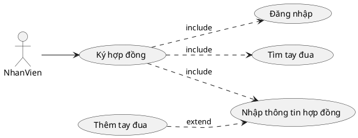
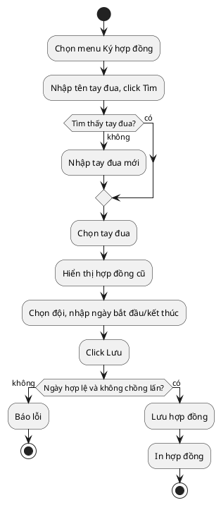
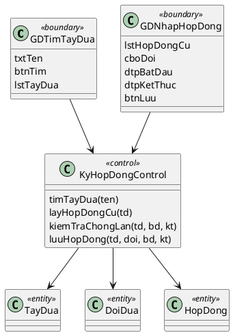
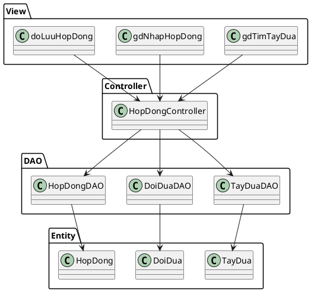
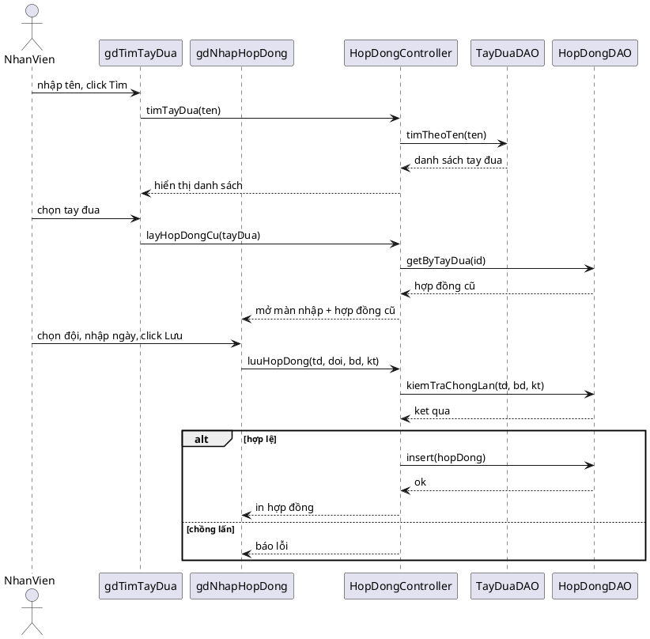

# Module 1 — Ký hợp đồng tay đua với đội đua — Nội dung chi tiết

> Nội dung chữ do Claude dựng. Việc của bạn: mở Visual Paradigm, vẽ theo các blueprint/PlantUML bên dưới, export ảnh vào `hinh/`, rồi ghép vào báo cáo.

---

## 1. Biểu đồ UC chi tiết

Chức năng "Ký hợp đồng" có các giao diện tương tác với nhân viên ⇒ tách use case con:
- Đăng nhập → UC `Đăng nhập`
- Tìm tay đua → UC `Tìm tay đua`
- Nhập thông tin hợp đồng (chọn đội, ngày, lưu) → UC `Nhập thông tin hợp đồng`
- (mở rộng) Thêm tay đua mới khi không tìm thấy → UC `Thêm tay đua`

Quan hệ: `Ký hợp đồng` **include** {Đăng nhập, Tìm tay đua, Nhập thông tin hợp đồng}; `Nhập thông tin hợp đồng` **extend** bởi `Thêm tay đua` (chỉ khi tay đua chưa có).

## 2. Đặc tả Use Case

| Mục | Nội dung |
|---|---|
| **Use case** | Ký hợp đồng tay đua với đội đua |
| **Actor** | Nhân viên |
| **Tiền điều kiện** | Nhân viên đã đăng nhập thành công |
| **Hậu điều kiện** | Một hợp đồng mới hợp lệ được lưu vào hệ thống và in ra |
| **Kịch bản chính** | 1. Nhân viên chọn menu "Ký hợp đồng". 2. Hệ thống hiển thị giao diện tìm tay đua. 3. Nhân viên nhập tên tay đua và click Tìm. 4. Hệ thống hiển thị danh sách tay đua có tên chứa từ khóa. 5. Nhân viên chọn đúng tay đua. 6. Hệ thống hiển thị chi tiết tay đua và danh sách hợp đồng cũ (đội, ngày bắt đầu, ngày kết thúc). 7. Nhân viên chọn đội đua, nhập ngày bắt đầu và ngày kết thúc, click Lưu. 8. Hệ thống kiểm tra ràng buộc chồng lấn; nếu hợp lệ thì lưu hợp đồng và in ra hợp đồng. |
| **Ngoại lệ** | 4a. Không tìm thấy tay đua → hệ thống cho phép nhập tay đua mới (UC Thêm tay đua) rồi quay lại bước 6. 7a. Ngày kết thúc ≤ ngày bắt đầu → báo lỗi, yêu cầu nhập lại. 8a. Khoảng thời gian hợp đồng mới chồng lấn một hợp đồng cũ (tay đua đã thuộc đội khác trong thời gian đó) → báo lỗi "Tay đua đã có hợp đồng trong khoảng thời gian này", yêu cầu nhập lại. |

## 3. Biểu đồ hoạt động (Activity)

## 4. Biểu đồ lớp phân tích (Boundary / Control / Entity)

- **Boundary:** `GDTimTayDua` (txtTen, btnTim, lstTayDua), `GDNhapHopDong` (lblTayDua, lstHopDongCu, cboDoi, dtpBatDau, dtpKetThuc, btnLuu)
- **Control:** `KyHopDongControl` (timTayDua(ten), layHopDongCu(tayDua), kiemTraChongLan(tayDua, batDau, ketThuc), luuHopDong(...))
- **Entity:** `TayDua`, `DoiDua`, `HopDong`

## 5. Thiết kế giao diện

**Màn 1 — Tìm tay đua:** ô nhập "Tên tay đua" + nút [Tìm]; bảng kết quả (Mã, Tên, Ngày sinh, Quốc tịch) mỗi dòng có nút [Chọn]; nút [+ Thêm tay đua mới].

**Màn 2 — Nhập hợp đồng:** phần trên hiển thị thông tin tay đua đã chọn + bảng "Hợp đồng cũ" (Đội, Ngày bắt đầu, Ngày kết thúc); phần dưới form: combobox [Đội đua], date [Ngày bắt đầu], date [Ngày kết thúc], nút [Lưu]. Khi lưu lỗi → hiện thông báo đỏ dưới form.

> Vẽ mockup 2 màn này trong VP (hoặc Balsamiq) và export vào `hinh/gd-*.png`.

## 6. Biểu đồ lớp thiết kế (MVC)

- **View (jsp):** `gdTimTayDua.jsp`, `gdNhapHopDong.jsp`, `doLuuHopDong.jsp`
- **Controller:** `HopDongController`
- **DAO:** `TayDuaDAO` (timTheoTen), `DoiDuaDAO` (getAll), `HopDongDAO` (getByTayDua, kiemTraChongLan, insert)
- **Entity:** `TayDua`, `DoiDua`, `HopDong`

## 7. Biểu đồ tuần tự (Sequence)

## 8. Test case

| ID | Mục tiêu | Tiền điều kiện | Dữ liệu vào | Các bước | Kết quả mong đợi |
|---|---|---|---|---|---|
| TC1 | Ký hợp đồng hợp lệ | Đã đăng nhập; tay đua chưa có hợp đồng trùng thời gian | Tay đua A, Đội X, 01/01/2026–31/12/2026 | Tìm A → chọn → chọn X, nhập ngày → Lưu | Lưu thành công, in hợp đồng |
| TC2 | Chặn chồng lấn thời gian | Tay đua A đã có HĐ với Đội Y 01/06/2026–31/12/2026 | Tay đua A, Đội X, 01/01/2026–30/06/2026 | Tìm A → chọn → nhập ngày chồng lấn → Lưu | Báo lỗi "đã có hợp đồng trong khoảng thời gian này", không lưu |
| TC3 | Thêm tay đua khi không tìm thấy | Đã đăng nhập | Tên "Zzz" (chưa có) | Tìm "Zzz" → không có → Thêm mới | Hiện form thêm tay đua, thêm xong quay lại ký HĐ |
| TC4 | Kiểm tra ngày | Đã đăng nhập | Tay đua A, Đội X, 31/12/2026–01/01/2026 | Nhập ngày kết thúc < bắt đầu → Lưu | Báo lỗi ngày không hợp lệ, không lưu |
