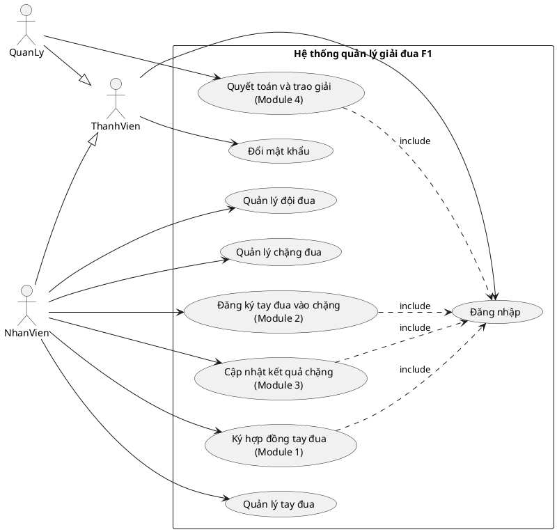

# Biểu đồ Use Case tổng quát — Quản lý giải đua xe F1

> Sản phẩm chung của nhóm. Vẽ lại trong Visual Paradigm từ blueprint dưới đây.

## 1. Actor

| Actor | Mô tả | Kế thừa |
|---|---|---|
| `ThanhVien` | Người dùng đã có tài khoản (trừu tượng) | — |
| `NhanVien` | Nhân viên vận hành giải đấu | `ThanhVien` |
| `QuanLy` | Quản lý giải đấu | `ThanhVien` |

## 2. Danh sách Use Case

| Use case | Actor | Ghi chú |
|---|---|---|
| Đăng nhập | ThanhVien | chung |
| Đổi mật khẩu | ThanhVien | chung |
| Quản lý tay đua | NhanVien | danh mục (hỗ trợ) |
| Quản lý đội đua | NhanVien | danh mục (hỗ trợ) |
| Quản lý chặng đua | NhanVien | danh mục (hỗ trợ) |
| **Ký hợp đồng tay đua** | NhanVien | **Module 1 (Quan)** |
| **Đăng ký tay đua vào chặng** | NhanVien | **Module 2 (Kin)** |
| **Cập nhật kết quả chặng** | NhanVien | **Module 3 (Kiet)** |
| **Quyết toán và trao giải** | QuanLy | **Module 4 (Thanh)** |

## 3. Quan hệ

- `NhanVien` và `QuanLy` **kế thừa** (generalization) `ThanhVien` ⇒ dùng được Đăng nhập, Đổi mật khẩu.
- Các use case nghiệp vụ đều **include** "Đăng nhập" (bắt buộc đăng nhập trước).
- Không có quan hệ extend ở mức tổng quát (để dành cho biểu đồ UC chi tiết của từng module).

## 4. Blueprint PlantUML

> Trong Visual Paradigm: nếu hỗ trợ PlantUML thì import; nếu không, vẽ lại theo đúng các phần tử/quan hệ trên.

