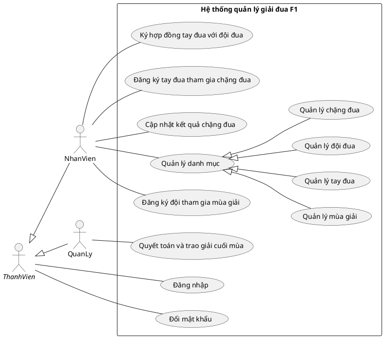

# Biểu đồ Use Case tổng quát — Quản lý giải đua xe F1

> Sản phẩm chung của nhóm. Vẽ lại trong Visual Paradigm từ blueprint ở mục 4, export ra `hinh/uc-tongquat.png`.

## 0. Ba bước xây dựng biểu đồ UC tổng quan

Theo B1, biểu đồ UC tổng quan được xây theo đúng 3 bước: **đề xuất actor → đề xuất use case → mịn hóa**. Dưới đây là lập luận của nhóm ở từng bước; kết quả chốt lại của từng bước nằm ở các mục 1, 2, 3.

### Bước 1 — Đề xuất actor

Đọc mục **Phạm vi hệ thống** trong [01-dac-ta-yeu-cau.md](01-dac-ta-yeu-cau.md), hệ thống chỉ được dùng bởi hai vai người dùng thật: người vận hành giải hằng ngày (ký hợp đồng, đăng ký chặng, nhập kết quả) và người quản lý giải (quyết toán, trao giải cuối mùa). Nhóm đặt tên hai vai này là `NhanVien` và `QuanLy`.

Hai vai này có **đặc điểm chung**: đều phải có tài khoản trong hệ thống, đều đăng nhập và đổi mật khẩu. B1 quy định khi nhiều actor có đặc điểm chung thì **tách phần chung thành một actor trừu tượng làm cha** rồi cho các actor còn lại kế thừa. Vì vậy nhóm bổ sung actor trừu tượng `ThanhVien` giữ hai use case dùng chung (`Đăng nhập`, `Đổi mật khẩu`), còn `NhanVien` và `QuanLy` kế thừa `ThanhVien`.

Lợi ích: biểu đồ không phải vẽ lặp hai lần cùng một cặp liên kết tới `Đăng nhập` / `Đổi mật khẩu`, nhưng người đọc vẫn thấy rõ hệ thống có đúng hai loại người dùng thật.

B1 còn yêu cầu **xét cả actor gián tiếp** — phần này trình bày ở mục 1.1.

### Bước 2 — Đề xuất use case

Nguyên tắc: **mỗi chức năng nằm trong phạm vi hệ thống → 1 use case**. Đối chiếu danh sách chức năng ở [01-dac-ta-yeu-cau.md](01-dac-ta-yeu-cau.md), nhóm thu được 11 use case thô (bảng ở mục 2).

Khi đặt tên, nhóm bám quy tắc thầy nhấn mạnh: **tên use case phải là động từ chỉ hành động của ACTOR, không phải động từ chỉ hành động của HỆ THỐNG**. Vì quy tắc này, 3 tên đặt ban đầu bị sửa lại:

| Tên đặt ban đầu | Vì sao phải sửa | Tên chốt |
|---|---|---|
| Cập nhật kết quả **và tính điểm** chặng đua | "tính điểm" là việc hệ thống tự làm sau khi nhân viên bấm nút, không phải hành động của nhân viên | **Cập nhật kết quả chặng đua** |
| Tổng hợp xếp hạng | "tổng hợp", "xếp hạng" đều là việc hệ thống làm; quản lý chỉ mở màn hình để xem | **Xem bảng tổng sắp** (UC con của Module 4) |
| Đăng ký tay đua vào chặng | thiếu chủ thể nghiệp vụ, không khớp tên module đã phân công | **Đăng ký tay đua tham gia chặng đua** |

### Bước 3 — Mịn hóa

B1 quy định: nếu **hai use case trở lên trùng nhau thì gộp lại**; nếu việc gộp làm người đọc hiểu nhầm số lượng actor thì **dùng use case trừu tượng làm cha**.

**(a) Bốn use case danh mục.** `Quản lý mùa giải`, `Quản lý tay đua`, `Quản lý đội đua`, `Quản lý chặng đua` có kịch bản gần như giống hệt nhau: mở danh mục → xem danh sách → thêm / sửa / xóa một bản ghi → lưu. Chúng chỉ khác nhau ở **đối tượng dữ liệu** được thao tác.

- Nếu **để rời cả 4**: biểu đồ lặp bốn lần cùng một hình mẫu liên kết, rườm rà; thầy cũng đã cảnh báo các use case kiểu "thêm sửa xóa đơn giản" đứng riêng thì bị đánh giá thấp.
- Nếu **gộp cứng thành 1 use case duy nhất**: mất thông tin hệ thống đang quản lý những danh mục nào.
- ⇒ Nhóm chọn phương án thứ ba của B1: thêm **use case trừu tượng `Quản lý danh mục`** làm **cha (generalization)** của 4 use case trên. Actor `NhanVien` chỉ nối tới use case cha; theo quy tắc "kế thừa thì gộp lại", cả 4 use case con vẫn tồn tại đường đi tới actor nên không vi phạm điều kiện "mỗi use case phải tương tác với ít nhất một actor".

**(b) Không gộp 4 use case nghiệp vụ của 4 module** (`Ký hợp đồng tay đua với đội đua`, `Đăng ký tay đua tham gia chặng đua`, `Cập nhật kết quả chặng đua`, `Quyết toán và trao giải cuối mùa`). Nhìn qua thì đều là "nhập dữ liệu rồi lưu", nhưng ràng buộc nghiệp vụ khác hẳn nhau (chống chồng lấn hợp đồng / tối đa 2 tay đua mỗi đội mỗi chặng / xếp hạng và tính điểm theo trạng thái Hoàn thành–DNF–DSQ / countback và tiền thưởng), số màn hình và kịch bản cũng khác nhau hoàn toàn. Gộp lại sẽ mất toàn bộ nghiệp vụ.

**(c) Không gộp `Đăng nhập` với `Đổi mật khẩu`**: khác mục đích, khác thời điểm sử dụng, khác kết quả để lại trong cơ sở dữ liệu.

**(d) Bỏ quan hệ `include` tới `Đăng nhập` ở mức TỔNG QUÁT — nhưng GIỮ ở biểu đồ UC chi tiết từng module.** Bản trước của biểu đồ tổng quát vẽ 4 use case nghiệp vụ `include` use case `Đăng nhập`. Nhóm bỏ 4 quan hệ này khỏi **biểu đồ tổng quát** vì `Đăng nhập` đã nối trực tiếp với actor `ThanhVien` — vẽ thêm 4 đường `include` chỉ làm biểu đồ rối mà không thêm thông tin.

Tuy nhiên, ở **biểu đồ UC chi tiết của từng module**, giáo trình PDF (mục 3.1.3) quy định khi phân rã use case chính thì đề xuất UC con `Đăng nhập` và **UC chính `include` UC này** — vì vậy cả 4 module đều vẽ UC con `Đăng nhập` với quan hệ `include` từ UC chính. UC con `Đăng nhập` này **không sinh màn hình / lớp biên / trang `.jsp` riêng** trong module (đăng nhập là giao diện dùng chung của toàn hệ thống, đặc tả ở [04-dac-ta-danh-muc-va-auth.md](04-dac-ta-danh-muc-va-auth.md)); kịch bản của module vẫn mở đầu "sau khi đăng nhập" và dòng Tiền điều kiện vẫn ghi "đã đăng nhập".

⇒ Kết quả sau mịn hóa: biểu đồ tổng quát **không còn quan hệ `include` / `extend` nào**. Các quan hệ `include` / `extend` (trong đó có `include` tới `Đăng nhập`) chỉ xuất hiện ở biểu đồ UC chi tiết của từng module.

## 1. Actor

| Actor | Loại | Mô tả | Kế thừa |
|---|---|---|---|
| `ThanhVien` | **trừu tượng** | Người dùng đã có tài khoản trong hệ thống. Không có người dùng thật nào chỉ là `ThanhVien` — lớp actor này chỉ giữ phần chung (đăng nhập, đổi mật khẩu). | — |
| `NhanVien` | cụ thể | Nhân viên vận hành giải: ký hợp đồng, đăng ký tay đua vào chặng, cập nhật kết quả chặng, quản lý các danh mục. | `ThanhVien` |
| `QuanLy` | cụ thể | Quản lý giải: quyết toán và trao giải cuối mùa. | `ThanhVien` |

> Trong Visual Paradigm: chọn actor `ThanhVien` → đặt thuộc tính **Abstract = true** (tên sẽ hiển thị *in nghiêng*).

### 1.1. Actor gián tiếp

B1 yêu cầu xét cả actor gián tiếp. Nhóm rà soát các bên liên quan xuất hiện trong mô tả bài toán và kết luận như sau:

| Bên liên quan | Tham gia gián tiếp vào use case nào | Kết luận |
|---|---|---|
| **Đội đua** | `Ký hợp đồng tay đua với đội đua` (đội gửi yêu cầu ký hợp đồng với tay đua), `Đăng ký tay đua tham gia chặng đua` (đội gửi danh sách tay đua dự chặng), `Quyết toán và trao giải cuối mùa` (đội là bên nhận giải đồng đội) | Là **actor gián tiếp**. Đội đua không có tài khoản, không có màn hình nào trong hệ thống — mọi thao tác đều do `NhanVien` nhập hộ theo văn bản đội gửi. ⇒ **Ghi nhận trong tài liệu, không vẽ vào biểu đồ** để tránh hiểu nhầm đội đua là người dùng phần mềm. |
| **Ban tổ chức** | `Đăng ký tay đua tham gia chặng đua`, `Cập nhật kết quả chặng đua`, `Xem bảng tổng sắp` | "Ban tổ chức" chính là **tên gọi nghiệp vụ của vai `NhanVien`** mà nhóm đang dùng. ⇒ **Không tách thành actor riêng** vì sẽ trùng vai, làm biểu đồ có hai actor cùng làm một việc. |
| **Tay đua** | `Ký hợp đồng tay đua với đội đua` (là một bên của hợp đồng), `Quyết toán và trao giải cuối mùa` (là bên nhận giải cá nhân và tiền thưởng) | Là **actor gián tiếp**. Tay đua là **đối tượng được quản lý** (lớp thực thể `TayDua`), không đăng nhập, không thao tác trên hệ thống. ⇒ **Ghi nhận trong tài liệu, không vẽ vào biểu đồ.** |

> Cả ba bên trên đều không tự thao tác với phần mềm nên không sinh thêm màn hình, không sinh thêm lớp biên. Việc ghi rõ ở đây là để chứng minh nhóm đã xét actor gián tiếp chứ không bỏ sót.

## 2. Danh sách Use Case

| Use case | Actor | Ghi chú |
|---|---|---|
| Đăng nhập | `ThanhVien` | chung — đặc tả gọn ở [04-dac-ta-danh-muc-va-auth.md](04-dac-ta-danh-muc-va-auth.md) |
| Đổi mật khẩu | `ThanhVien` | chung — đặc tả gọn ở `docs/04` |
| **Quản lý danh mục** | `NhanVien` | **use case trừu tượng** — cha (generalization) của 4 use case danh mục ngay dưới |
| Quản lý mùa giải | *(kế thừa `Quản lý danh mục`)* | danh mục (hỗ trợ) |
| Quản lý tay đua | *(kế thừa `Quản lý danh mục`)* | danh mục (hỗ trợ) |
| Quản lý đội đua | *(kế thừa `Quản lý danh mục`)* | danh mục (hỗ trợ) |
| Quản lý chặng đua | *(kế thừa `Quản lý danh mục`)* | danh mục (hỗ trợ) |
| Đăng ký đội tham gia mùa giải | `NhanVien` | hỗ trợ — sinh dữ liệu `ThamGia` |
| **Ký hợp đồng tay đua với đội đua** | `NhanVien` | **Module 1 (Quan)** |
| **Đăng ký tay đua tham gia chặng đua** | `NhanVien` | **Module 2 (Kin)** |
| **Cập nhật kết quả chặng đua** | `NhanVien` | **Module 3 (Kiet)** |
| **Quyết toán và trao giải cuối mùa** | `QuanLy` | **Module 4 (Thanh)** |

> Tên 4 use case module ở bảng này là **tên chuẩn duy nhất**, phải dùng y hệt trong `docs/BAO-CAO.md` và trong `noi-dung.md` của từng module.

## 3. Quan hệ

**Kế thừa giữa các actor (generalization):**
- `NhanVien` kế thừa `ThanhVien`
- `QuanLy` kế thừa `ThanhVien`

⇒ Cả hai đều dùng được `Đăng nhập` và `Đổi mật khẩu` mà không cần vẽ liên kết riêng.

**Kế thừa giữa các use case (generalization):**
- `Quản lý mùa giải` kế thừa `Quản lý danh mục`
- `Quản lý tay đua` kế thừa `Quản lý danh mục`
- `Quản lý đội đua` kế thừa `Quản lý danh mục`
- `Quản lý chặng đua` kế thừa `Quản lý danh mục`

⇒ Đây là kết quả của bước mịn hóa (mục 0, bước 3a).

**Liên kết actor – use case:** vẽ bằng **đường kẻ trơn `--`, không có đầu mũi tên**, đúng như hình mẫu của thầy. (Bản trước dùng `-->` là sai.)

**Không có quan hệ `include` và `extend` ở mức tổng quát:**
- 4 quan hệ `include` tới `Đăng nhập` đã bị bỏ khỏi biểu đồ **tổng quát** — lý do đầy đủ ở mục 0, bước 3d (`Đăng nhập` đã nối trực tiếp với actor `ThanhVien`).
- `include` / `extend` chỉ dùng ở biểu đồ UC chi tiết của từng module: theo giáo trình PDF mục 3.1.3, **UC chính của mỗi module `include` UC con `Đăng nhập`**; ngoài ra ví dụ Module 1 có `Thêm tay đua` extend `Tìm tay đua`, Module 4 có `Xem chi tiết theo chặng` extend `Xem bảng tổng sắp`.

**Biên hệ thống:** toàn bộ use case nằm trong khung `rectangle "Hệ thống quản lý giải đua F1"`; các actor nằm ngoài khung. Quy ước này áp dụng thống nhất cho cả biểu đồ UC tổng quát và biểu đồ UC chi tiết của 4 module.

## 4. Blueprint PlantUML

> Trong Visual Paradigm: nếu hỗ trợ PlantUML thì import; nếu không, vẽ lại theo đúng các phần tử và quan hệ ở mục 1–3.

```plantuml
@startuml
left to right direction

actor "<i>ThanhVien</i>" as ThanhVien
actor NhanVien
actor QuanLy

ThanhVien <|-- NhanVien
ThanhVien <|-- QuanLy

rectangle "Hệ thống quản lý giải đua F1" {
  usecase "Đăng nhập" as UCDN
  usecase "Đổi mật khẩu" as UCMK
  usecase "Quản lý danh mục" as UCDM
  usecase "Quản lý mùa giải" as UCMG
  usecase "Quản lý tay đua" as UCTD
  usecase "Quản lý đội đua" as UCDD
  usecase "Quản lý chặng đua" as UCCD
  usecase "Đăng ký đội tham gia mùa giải" as UCTG
  usecase "Ký hợp đồng tay đua với đội đua" as UC1
  usecase "Đăng ký tay đua tham gia chặng đua" as UC2
  usecase "Cập nhật kết quả chặng đua" as UC3
  usecase "Quyết toán và trao giải cuối mùa" as UC4
}

UCDM <|-- UCMG
UCDM <|-- UCTD
UCDM <|-- UCDD
UCDM <|-- UCCD

ThanhVien -- UCDN
ThanhVien -- UCMK
NhanVien -- UCDM
NhanVien -- UCTG
NhanVien -- UC1
NhanVien -- UC2
NhanVien -- UC3
QuanLy -- UC4
@enduml
```

**Lưu ý khi vẽ lại trong Visual Paradigm:**

1. Actor `ThanhVien` và use case `Quản lý danh mục` phải đặt **Abstract = true** (tên hiển thị *in nghiêng*). (PlantUML không có cú pháp `abstract actor` — blueprint thể hiện bằng tên in nghiêng `<i>ThanhVien</i>`; trong Visual Paradigm dùng thuộc tính Abstract.)
2. Liên kết actor – use case vẽ bằng **Association** (đường kẻ trơn), **tắt đầu mũi tên**.
3. Quan hệ kế thừa vẽ bằng **Generalization** (tam giác rỗng ▷ trỏ về phía cha: `ThanhVien`, `Quản lý danh mục`).
4. Không vẽ bất kỳ mũi tên `<<include>>` hay `<<extend>>` nào trong biểu đồ này.
5. Export ảnh ra `docs/hinh/uc-tongquat.png`.
