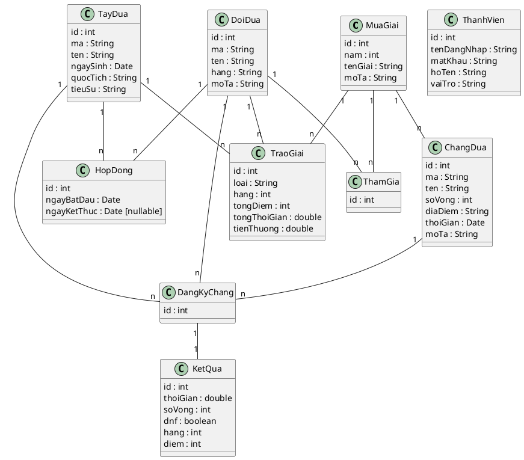

# Biểu đồ lớp thực thể & Thiết kế CSDL — Quản lý giải đua xe F1

> Sản phẩm chung của nhóm. Rút ra bằng phương pháp trích danh từ từ đề bài (theo lecture B2/B3).

## 1. Các lớp thực thể (pha phân tích → thiết kế)

| Lớp | Thuộc tính (pha thiết kế, kèm kiểu) | Ghi chú |
|---|---|---|
| `MuaGiai` | id:int, nam:int, tenGiai:String, moTa:String | Một mùa giải / năm |
| `ChangDua` | id:int, ma:String, ten:String, soVong:int, diaDiem:String, thoiGian:Date, moTa:String | Thuộc 1 mùa giải |
| `DoiDua` | id:int, ma:String, ten:String, hang:String, moTa:String | |
| `TayDua` | id:int, ma:String, ten:String, ngaySinh:Date, quocTich:String, tieuSu:String | |
| `HopDong` | id:int, ngayBatDau:Date, ngayKetThuc:Date (**nullable**) | Trung gian TayDua–DoiDua (M1). `ngayKetThuc` để trống (NULL) = hợp đồng đang hiệu lực |
| `DangKyChang` | id:int | Trung gian ChangDua–TayDua–DoiDua (M2) |
| `KetQua` | id:int, thoiGian:double, soVong:int, dnf:boolean, hang:int, diem:int | 1-1 với DangKyChang (M3) |
| `TraoGiai` | id:int, loai:String, hang:int, tongDiem:int, tongThoiGian:double, tienThuong:double | Kết quả quyết toán (M4) |
| `ThamGia` | id:int | Trung gian MuaGiai–DoiDua (đội tham gia mùa giải). Dữ liệu do UC "Đăng ký đội tham gia mùa giải" sinh ra |
| `ThanhVien` | id:int, tenDangNhap:String, matKhau:String, hoTen:String, vaiTro:String {NhanVien\|QuanLy} | Tài khoản đăng nhập + phân quyền (nền cho UC Đăng nhập) |

## 2. Quan hệ số lượng

- 1 `MuaGiai` — n `ChangDua` (1-n)
- `MuaGiai` — `DoiDua` là **n-n** ⇒ tách bằng `ThamGia` (1 đội tham gia 1 mùa)
- `TayDua` — `DoiDua` là **n-n theo thời gian** ⇒ tách bằng `HopDong` (mỗi hợp đồng: 1 tay đua – 1 đội – khoảng thời gian)
- `ChangDua` — `TayDua` là **n-n** ⇒ tách bằng `DangKyChang` (kèm đội đăng ký)
- 1 `DangKyChang` — 1 `KetQua` (1-1, có thể gộp)
- 1 `MuaGiai` — n `TraoGiai`; mỗi `TraoGiai` trỏ tới 1 `TayDua` **hoặc** 1 `DoiDua` tùy `loai`
- `ThanhVien` là lớp độc lập (tài khoản); thuộc tính `vaiTro` phân biệt NhanVien / QuanLy (tương ứng 2 actor)

## 3. Thiết kế CSDL (bảng, khóa)

| Bảng | Cột | PK / FK |
|---|---|---|
| `tblMuaGiai` | id, nam, tenGiai, moTa | PK: id |
| `tblDoiDua` | id, ma, ten, hang, moTa | PK: id |
| `tblTayDua` | id, ma, ten, ngaySinh, quocTich, tieuSu | PK: id |
| `tblChangDua` | id, ma, ten, soVong, diaDiem, thoiGian, moTa, **muaGiaiId** | PK: id · FK: muaGiaiId→tblMuaGiai |
| `tblThamGia` | id, **muaGiaiId**, **doiDuaId** | PK: id · FK→tblMuaGiai, tblDoiDua |
| `tblHopDong` | id, **tayDuaId**, **doiDuaId**, ngayBatDau, ngayKetThuc(**NULL-able**) | PK: id · FK→tblTayDua, tblDoiDua |
| `tblDangKyChang` | id, **changDuaId**, **tayDuaId**, **doiDuaId** | PK: id · FK→tblChangDua, tblTayDua, tblDoiDua · **UNIQUE(changDuaId, tayDuaId)** |
| `tblKetQua` | id, **dangKyChangId**, thoiGian, soVong, dnf, hang, diem | PK: id · FK→tblDangKyChang |
| `tblTraoGiai` | id, **muaGiaiId**, loai, **tayDuaId**(null), **doiDuaId**(null), hang, tongDiem, tongThoiGian, tienThuong | PK: id · FK→tblMuaGiai, tblTayDua, tblDoiDua |
| `tblThanhVien` | id, tenDangNhap, matKhau, hoTen, vaiTro | PK: id |

> **Ghi chú ràng buộc:**
> - `tblDangKyChang` có `UNIQUE(changDuaId, tayDuaId)` để đảm bảo "mỗi tay đua chỉ đăng ký 1 lần trong 1 chặng" (đề bài M2) ở tầng CSDL. Ràng buộc "≤ 2 tay đua/đội/chặng" là ràng buộc **nghiệp vụ**, kiểm ở tầng Control (`demSoTayDua`), không thể hiện bằng khóa.
> - `tblHopDong.ngayKetThuc` NULL = hợp đồng đang hiệu lực (đề bài M1: "dòng có ngày kết thúc trống là hợp đồng đang hiệu lực").
> - `tblKetQua` quan hệ 1-1 với `tblDangKyChang` nên có thể gộp các cột kết quả thẳng vào `tblDangKyChang` để giảm bảng — tùy nhóm.

## 4. Blueprint PlantUML (lớp thực thể pha thiết kế)

