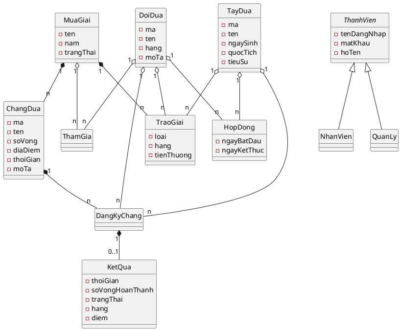
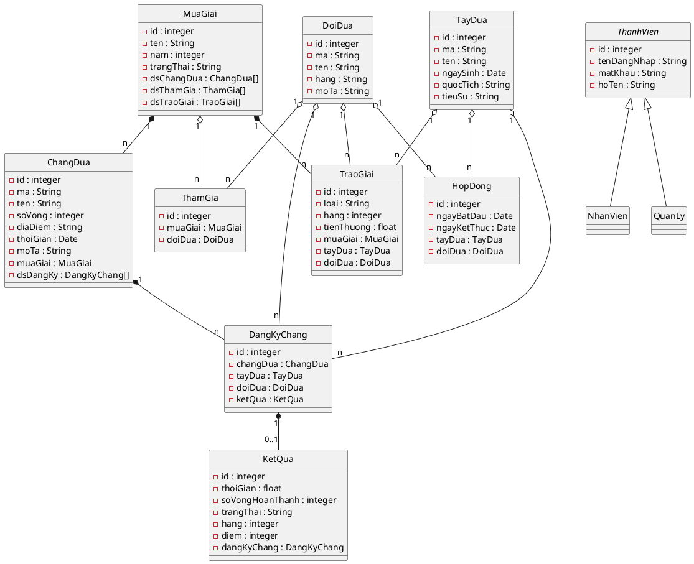
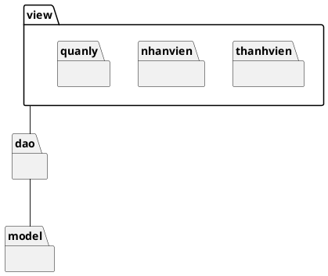
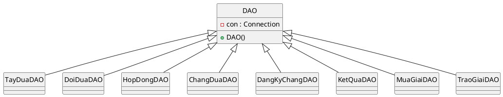

# Biểu đồ lớp thực thể & Thiết kế CSDL — Quản lý giải đua xe F1

> Sản phẩm chung của nhóm (Phần 1 của báo cáo). Xây dựng theo đúng quy trình trong lecture:
> **B2 — Lớp thực thể pha phân tích, 5 bước** (tổng hợp đoạn văn mô tả → trích danh từ → đánh giá danh từ → quan hệ số lượng → quan hệ đối tượng) và
> **B3 — Thiết kế, 4 bước lớp thực thể + 5 bước CSDL**.
>
> Bố cục file: mục 0 (trích danh từ) → mục 1 (mô tả các lớp thực thể) → mục 2 (quan hệ) → mục 3 (hai biểu đồ lớp thực thể: phân tích và thiết kế) → mục 4 (thiết kế CSDL) → mục 5 (bộ dữ liệu mẫu dùng chung cho mọi kịch bản và test case) → mục 6 (thiết kế triển khai).
>
> Các khối `plantuml` chỉ là **blueprint**; bản nộp dùng hình vẽ lại bằng Visual Paradigm.

---

## 0. Trích danh từ (B2 — bước 1, 2, 3)

### 0.1. Bước 1 — Đoạn văn mô tả hệ thống

Đoạn văn dưới đây tổng hợp lại từ mô tả bài toán (`de-bai-f1.md`). Các **danh từ** được in đậm để tiện trích ở bước 2.

Mỗi **năm** có một **mùa giải** (giải vô địch) mang một **tên giải** riêng và có **trạng thái** cho biết mùa giải đang diễn ra, đã kết thúc hay đã quyết toán. Một mùa giải gồm nhiều **chặng đua** diễn ra khắp **thế giới**; mỗi chặng đua có **mã chặng đua**, **tên chặng**, **số vòng đua**, **địa điểm**, **thời gian** diễn ra và **mô tả**. Mỗi mùa giải có nhiều **đội đua** đăng ký **tham gia**; mỗi đội đua có **mã đội**, **tên đội**, **hãng** và **mô tả**.

Mỗi đội đua có nhiều **tay đua**; mỗi tay đua có **mã**, **tên**, **ngày sinh**, **quốc tịch** và **tiểu sử**. Một tay đua có thể thi đấu cho nhiều đội đua ở các **thời điểm** khác nhau nhưng tại một thời điểm chỉ thi đấu cho một đội; mỗi giai đoạn thi đấu được ghi nhận bằng một **hợp đồng** có **ngày bắt đầu** và **ngày kết thúc** (bỏ trống nghĩa là đang hiệu lực). Toàn bộ hợp đồng của một tay đua tạo thành **lịch sử thi đấu** của tay đua đó. Sau khi ký, hệ thống in **phiếu xác nhận hợp đồng**.

Trước mỗi chặng đua, **nhân viên** thực hiện **đăng ký** tay đua tham gia chặng theo **yêu cầu của đội đua**; mỗi đội chỉ được cho tối đa hai tay đua tham gia một chặng và mỗi tay đua chỉ được đăng ký một lần trong một chặng — đây là các **ràng buộc** nghiệp vụ. Hệ thống hiển thị **trạng thái đăng ký** của từng tay đua và in **danh sách xuất phát** gửi **ban tổ chức**.

Sau khi chặng đua kết thúc, nhân viên nhập **kết quả** của chặng: **thời gian hoàn thành**, **số vòng chạy được** và **trạng thái** (hoàn thành, **bỏ cuộc**/**tai nạn** — DNF, hoặc bị loại do **vi phạm kỹ thuật** — DSQ). Hệ thống xếp **thứ hạng** theo thời gian về đích và gán **điểm** cho **top 10** theo thứ tự 25, 18, 15, 12, 10, 8, 6, 4, 2, 1.

Cuối mùa, **quản lý** quyết toán mùa giải: hệ thống cộng dồn **tổng điểm** và **tổng thời gian** của từng tay đua, từng đội qua tất cả các chặng để lập **bảng xếp hạng cuối mùa** gồm **xếp hạng cá nhân** và **xếp hạng đội**; khi bằng điểm thì phân định bằng **countback**, nếu countback vẫn bằng thì theo **tổng thời gian** tăng dần. Quản lý nhập **mức tiền thưởng** cho từng hạng, hệ thống tính **tiền thưởng** và lưu **quyết định trao giải** cho **giải cá nhân** và **giải đồng đội**, sau đó in **danh sách trao giải**.

Người sử dụng **hệ thống** là các **thành viên** có **tên đăng nhập**, **mật khẩu** và **họ tên**; thành viên gồm hai loại là nhân viên và quản lý.

### 0.2. Bước 2 và bước 3 — Bảng trích danh từ và đánh giá

Mỗi danh từ chỉ tính một lần. Cột "Nhóm" phân loại theo người / vật / thông tin. Cột "Kết luận" là kết quả bước 3: thành lớp thực thể, thành thuộc tính của một lớp, hoặc bị loại.

| Danh từ | Nhóm (người / vật / thông tin) | Kết luận |
|---|---|---|
| mùa giải (giải vô địch) | Vật (sự kiện) | → lớp thực thể `MuaGiai` |
| giải đấu | Vật (sự kiện) | Loại vì trùng nghĩa với "mùa giải" — mỗi danh từ chỉ tính một lần |
| năm | Thông tin | → thuộc tính `nam` của `MuaGiai` |
| tên giải | Thông tin | → thuộc tính `ten` của `MuaGiai` |
| trạng thái mùa giải | Thông tin | → thuộc tính `trangThai` của `MuaGiai` (đang diễn ra / đã kết thúc / đã quyết toán) |
| chặng đua | Vật (sự kiện) | → lớp thực thể `ChangDua` |
| mã chặng đua | Thông tin | → thuộc tính `ma` của `ChangDua` |
| tên chặng | Thông tin | → thuộc tính `ten` của `ChangDua` |
| số vòng đua | Thông tin | → thuộc tính `soVong` của `ChangDua` |
| địa điểm | Thông tin | → thuộc tính `diaDiem` của `ChangDua` |
| thời gian diễn ra chặng | Thông tin | → thuộc tính `thoiGian` của `ChangDua` |
| mô tả chặng | Thông tin | → thuộc tính `moTa` của `ChangDua` |
| thế giới | Vật | Loại vì ngoài phạm vi — hệ thống không quản lý thông tin địa lý |
| đội đua | Vật (đơn vị tổ chức) | → lớp thực thể `DoiDua` |
| mã đội | Thông tin | → thuộc tính `ma` của `DoiDua` |
| tên đội | Thông tin | → thuộc tính `ten` của `DoiDua` |
| hãng | Vật (đơn vị tổ chức) | → thuộc tính `hang` của `DoiDua` (biện luận ở mục 0.4) |
| mô tả đội | Thông tin | → thuộc tính `moTa` của `DoiDua` |
| tay đua | Người | → lớp thực thể `TayDua` |
| mã tay đua | Thông tin | → thuộc tính `ma` của `TayDua` |
| tên tay đua | Thông tin | → thuộc tính `ten` của `TayDua` |
| ngày sinh | Thông tin | → thuộc tính `ngaySinh` của `TayDua` |
| quốc tịch | Thông tin | → thuộc tính `quocTich` của `TayDua` |
| tiểu sử | Thông tin | → thuộc tính `tieuSu` của `TayDua` |
| tham gia (đội tham gia mùa giải) | Thông tin | → lớp thực thể trung gian `ThamGia` (tách quan hệ n-n `MuaGiai` – `DoiDua`) |
| hợp đồng | Thông tin | → lớp thực thể `HopDong` (tách quan hệ n-n theo thời gian `TayDua` – `DoiDua`) |
| ngày bắt đầu | Thông tin | → thuộc tính `ngayBatDau` của `HopDong` |
| ngày kết thúc | Thông tin | → thuộc tính `ngayKetThuc` của `HopDong` (để trống = đang hiệu lực) |
| thời điểm | Thông tin | Loại vì trừu tượng — đã được cụ thể hoá bằng `ngayBatDau` / `ngayKetThuc` |
| lịch sử thi đấu | Thông tin | Loại — chính là tập các `HopDong` của một tay đua, không sinh thực thể mới |
| phiếu xác nhận hợp đồng | Thông tin | Loại — là bản in kết xuất từ `HopDong`, không lưu trữ riêng |
| đăng ký (tham gia chặng) | Thông tin | → lớp thực thể trung gian `DangKyChang` (tách quan hệ n-n `ChangDua` – `TayDua`) |
| yêu cầu của đội đua | Thông tin | Loại vì trừu tượng — là lý do nghiệp vụ, không lưu trữ |
| ràng buộc | Thông tin | Loại vì trừu tượng — cài đặt bằng phương thức kiểm tra của lớp thực thể |
| trạng thái đăng ký | Thông tin | Loại — dẫn xuất, tra cứu trực tiếp trên `DangKyChang` khi hiển thị |
| danh sách xuất phát (start list) | Thông tin | Loại — bản in kết xuất từ `DangKyChang` |
| ban tổ chức | Người | Loại vì ngoài phạm vi — actor gián tiếp nhận bản in, hệ thống không quản lý hồ sơ ban tổ chức |
| kết quả | Thông tin | → lớp thực thể `KetQua` |
| thời gian hoàn thành | Thông tin | → thuộc tính `thoiGian` của `KetQua` |
| số vòng chạy được | Thông tin | → thuộc tính `soVongHoanThanh` của `KetQua` |
| trạng thái kết quả (bỏ cuộc, tai nạn, vi phạm kỹ thuật) | Thông tin | → thuộc tính `trangThai` của `KetQua` (HoanThanh / DNF / DSQ) |
| thứ hạng về đích | Thông tin | → thuộc tính `hang` của `KetQua` |
| điểm | Thông tin | → thuộc tính `diem` của `KetQua` |
| top 10 | Thông tin | Loại vì trừu tượng — là luật tính điểm 25…1, cài trong `KetQua.xepHangVaTinhDiem()` |
| tổng điểm | Thông tin | Loại — thuộc tính dẫn xuất, cộng dồn từ `KetQua` (xem mục 4.5) |
| tổng thời gian | Thông tin | Loại — thuộc tính dẫn xuất, cộng dồn từ `KetQua` (xem mục 4.5) |
| bảng xếp hạng cuối mùa (xếp hạng cá nhân, xếp hạng đội) | Thông tin | Loại — bảng tổng hợp dẫn xuất, tính lúc chạy từ `KetQua` |
| countback | Thông tin | Loại vì trừu tượng — là tầng 2 của quy tắc xếp hạng ba tầng, cài trong `KetQua.sapXepBangXepHang()` |
| trao giải (quyết định trao giải) | Thông tin | → lớp thực thể `TraoGiai` |
| giải cá nhân / giải đồng đội | Thông tin | → thuộc tính `loai` của `TraoGiai` |
| hạng được trao giải | Thông tin | → thuộc tính `hang` của `TraoGiai` |
| mức tiền thưởng / tiền thưởng | Thông tin | → thuộc tính `tienThuong` của `TraoGiai` |
| danh sách trao giải | Thông tin | Loại — bản in kết xuất từ `TraoGiai` |
| thành viên | Người | → lớp thực thể trừu tượng `ThanhVien` |
| tên đăng nhập | Thông tin | → thuộc tính `tenDangNhap` của `ThanhVien` |
| mật khẩu | Thông tin | → thuộc tính `matKhau` của `ThanhVien` |
| họ tên | Thông tin | → thuộc tính `hoTen` của `ThanhVien` |
| nhân viên | Người | → lớp thực thể `NhanVien`, kế thừa `ThanhVien` |
| quản lý | Người | → lớp thực thể `QuanLy`, kế thừa `ThanhVien` |
| hệ thống, giao diện, danh sách thả xuống, cơ sở dữ liệu | Vật | Loại vì ngoài phạm vi — thuộc về phần mềm/kỹ thuật, không phải đối tượng nghiệp vụ |

### 0.3. Kết quả bước 3 — Danh sách lớp thực thể

Sau khi đánh giá, hệ thống có **12 lớp thực thể**, trong đó 9 lớp nghiệp vụ, 1 lớp trừu tượng và 2 lớp kế thừa:

`MuaGiai` · `ChangDua` · `DoiDua` · `TayDua` · `ThamGia` · `HopDong` · `DangKyChang` · `KetQua` · `TraoGiai` · `ThanhVien` (trừu tượng) · `NhanVien` · `QuanLy`.

Ba lớp `ThamGia`, `HopDong`, `DangKyChang` là **lớp trung gian** sinh ra ở bước 4 để tách quan hệ n-n (xem mục 2.1).

### 0.4. Hai quyết định cần biện luận rõ

**(a) Thuộc tính lấy từ mô tả bài toán.** Mô tả đối tượng ghi rõ: *Chặng đua (mã, tên, số vòng đua, **địa điểm**, thời gian, **mô tả**)*, *Đội đua (mã, tên, **hãng**, **mô tả**)*, *Tay đua (mã, tên, ngày sinh, quốc tịch, **tiểu sử**)*. Vì vậy nhóm bổ sung:

| Lớp | Thuộc tính thêm | Lý do |
|---|---|---|
| `DoiDua` | `hang`, `moTa` | Khớp mô tả đối tượng "Đội đua (mã, tên, hãng, mô tả)"; `hang` còn được dùng làm một cột của bảng xếp hạng đội ở Module 4 |
| `TayDua` | `tieuSu` | Khớp mô tả "Tay đua (mã, tên, ngày sinh, quốc tịch, tiểu sử)"; hiển thị ở màn hình tìm và hồ sơ tay đua của Module 1 |
| `ChangDua` | `diaDiem`, `moTa` | Khớp mô tả "Chặng đua (mã chặng đua, tên, số vòng đua, địa điểm, thời gian, mô tả)"; `diaDiem` dùng ở màn chọn chặng của Module 2, Module 3 |

**(b) Vì sao KHÔNG tạo lớp thực thể `Hang` riêng.** Không có chức năng nào trong phạm vi hệ thống (`docs/01`) thao tác trên danh mục hãng: không thêm/sửa/xoá hãng, không tra cứu theo hãng, không có màn hình nào của hãng. Theo bước 3 của phương pháp trích danh từ, một danh từ chỉ trở thành lớp thực thể khi hệ thống cần quản lý vòng đời của nó; ở đây "hãng" chỉ xuất hiện như **một thông tin mô tả kèm theo đội đua** (hiển thị trên bảng xếp hạng đội). Vì vậy nhóm giữ `hang` là **thuộc tính kiểu chuỗi của `DoiDua`**. Nếu sau này mở rộng thêm modul quản lý hãng đua thì chỉ cần tách `hang` thành lớp `Hang` và thay bằng quan hệ `Hang "1" o-- "n" DoiDua`, không ảnh hưởng các module hiện có.

---

## 1. Mô tả các lớp thực thể (thuộc tính + phương thức)

### 1.1. Thuộc tính — pha phân tích

Theo lưu ý của thầy ở B2: *"thuộc tính chưa cần kiểu dữ liệu"* và *"các lớp thực thể chưa cần thuộc tính id trong pha phân tích"*. Bảng dưới đây là **đầu vào của pha thiết kế** (mục 3.2).

| Lớp | Thuộc tính (pha phân tích) | Ý nghĩa |
|---|---|---|
| `MuaGiai` | `ten`, `nam`, `trangThai` | Một mùa giải ứng với một năm. `trangThai`: đang diễn ra / đã kết thúc / đã quyết toán |
| `ChangDua` | `ma`, `ten`, `soVong`, `diaDiem`, `thoiGian`, `moTa` | Một chặng đua thuộc đúng một mùa giải |
| `DoiDua` | `ma`, `ten`, `hang`, `moTa` | Đội đua tham gia giải |
| `TayDua` | `ma`, `ten`, `ngaySinh`, `quocTich`, `tieuSu` | Tay đua, tồn tại độc lập với đội |
| `ThamGia` | (không có thuộc tính riêng) | Lớp trung gian `MuaGiai` – `DoiDua`: một đội tham gia một mùa giải |
| `HopDong` | `ngayBatDau`, `ngayKetThuc` | Lớp trung gian `TayDua` – `DoiDua` (Module 1). `ngayKetThuc` để trống = hợp đồng đang hiệu lực |
| `DangKyChang` | (không có thuộc tính riêng) | Lớp trung gian `ChangDua` – `TayDua` – `DoiDua` (Module 2) |
| `KetQua` | `thoiGian`, `soVongHoanThanh`, `trangThai`, `hang`, `diem` | Kết quả của một lượt đăng ký sau khi chặng đua kết thúc (Module 3). `trangThai` khác `HoanThanh` (DNF/DSQ) thì xếp cuối và nhận 0 điểm |
| `TraoGiai` | `loai`, `hang`, `tienThuong` | Quyết định trao giải cuối mùa (Module 4). `loai`: giải cá nhân hoặc giải đồng đội |
| `ThanhVien` | `tenDangNhap`, `matKhau`, `hoTen` | **Lớp trừu tượng** — tài khoản đăng nhập chung |
| `NhanVien` | (kế thừa `ThanhVien`) | Thực hiện Module 1, 2, 3 |
| `QuanLy` | (kế thừa `ThanhVien`) | Thực hiện Module 4 và các chức năng danh mục |

**Vì sao tách `ThanhVien` thành cây kế thừa.** Nhân viên và quản lý dùng chung ba thuộc tính `tenDangNhap`, `matKhau`, `hoTen` và dùng chung use case `Đăng nhập`, `Đổi mật khẩu`, nhưng khác nhau về quyền thực hiện chức năng. Theo B2 bước 5 (quan hệ kế thừa) và đúng mẫu của thầy (`Thanhvien` là cha của `Sinhvien` / `Nhanvien`), nhóm khai báo `ThanhVien` là **lớp trừu tượng** làm cha, `NhanVien` và `QuanLy` kế thừa. Cách này bỏ được thuộc tính `vaiTro` kiểu chuỗi (vốn là cách mô phỏng kế thừa bằng dữ liệu) và tạo ra quan hệ generalization mà biểu đồ trước đây còn thiếu. Theo B3 bước 1, **hai lớp con kế thừa không được bổ sung thuộc tính `id`**.

### 1.2. Phương thức nghiệp vụ gán cho lớp thực thể

B2 bước 3 yêu cầu: mỗi chức năng phải thực hiện ở tầng dưới tầng giao diện thì đề xuất một phương thức, xác định tham số vào/ra và **gán hành động đó cho một lớp thực thể**. Hệ thống **không có lớp Control** — toàn bộ nghiệp vụ nằm ở lớp thực thể, đúng như mẫu của thầy (`Dangkihoc{+getDangKiCuaSV(), +luuDangKi()}`).

| Lớp | Phương thức | Module dùng |
|---|---|---|
| `TayDua` | `getTayDuaTheoTen(ten)`, `themTayDua()` | M1 |
| `DoiDua` | `getDSDoiDua()` | M1, M2 |
| `HopDong` | `getHopDongCuaTayDua(tayDuaId)`, `kiemTraChongLan(tayDuaId, ngayBatDau)`, `dongHopDongCu(tayDuaId, ngayBatDau)`, `luuHopDong()`, `getTayDuaHieuLuc(doiDuaId, thoiGianChang)` | M1, M2 |
| `ChangDua` | `getDSChangDua()` | M2, M3 |
| `DangKyChang` | `demSoTayDua(changDuaId, doiDuaId)`, `daDangKy(changDuaId, tayDuaId)`, `luuDangKy()`, `getDangKyCuaChang(changDuaId)` | M2, M3 |
| `KetQua` | `kiemTraKetQuaCu(changDuaId)`, `xoaKetQuaCu(changDuaId)`, `xepHangVaTinhDiem(changDuaId)`, `luuKetQua()`, `tongHopCaNhan(muaGiaiId)`, `tongHopDoi(muaGiaiId)`, `sapXepBangXepHang(ds)`, `getChiTietTheoTayDua(muaGiaiId, tayDuaId)`, `getChiTietTheoDoi(muaGiaiId, doiDuaId)` | M3, M4 |
| `MuaGiai` | `getMuaGiaiHienTai()` | M4 |
| `TraoGiai` | `tinhTienThuong(hang, mucThuong)`, `luuTraoGiai()` | M4 |

**Quy tắc gán phương thức cho lớp thực thể** (giáo trình PDF mục 3.2.3 bước 3): xét **tham số đầu ra** trước — đầu ra thuộc lớp thực thể nào thì gán phương thức cho lớp đó; nếu đầu ra không gắn với thực thể nào thì xét **tham số đầu vào** — chỉ liên quan một thực thể thì gán cho thực thể đó; liên quan nhiều thực thể thì chọn **thực thể nhỏ nhất chứa được nhiều tham số nhất**. Sang pha thiết kế, lớp thực thể pha phân tích cần phương thức nào thì lớp `XxxDAO` tương ứng nhận đúng phương thức đó (giáo trình PDF mục 4.3.1 bước 3). Ví dụ biện luận theo quy tắc:

- `xepHangVaTinhDiem(changDuaId)` — đầu ra là danh sách kết quả đã xếp hạng và gán điểm, thuộc `KetQua` ⇒ gán cho `KetQua`.
- `getChiTietTheoTayDua(muaGiaiId, tayDuaId)` và `getChiTietTheoDoi(muaGiaiId, doiDuaId)` (bảng chi tiết theo chặng ở Module 4) — đầu ra là danh sách bản ghi `KetQua` của từng chặng ⇒ gán cho `KetQua`, dù tham số vào là mùa giải và tay đua/đội.
- `getTayDuaHieuLuc(doiDuaId, thoiGianChang)` — đầu ra là danh sách tay đua nhưng được lọc theo điều kiện hợp đồng; cả hai tham số vào đều so khớp trên dữ liệu của hợp đồng (`doiDua`, `ngayBatDau`/`ngayKetThuc`) ⇒ gán cho `HopDong`, thực thể nhỏ nhất chứa được nhiều tham số nhất.

**Ghi chú `sapXepBangXepHang(ds)` — quy tắc xếp hạng ba tầng:** (1) tổng điểm giảm dần; (2) nếu bằng điểm → **countback**: so số lần về nhất, rồi về nhì, về ba… cho đến khi phân định được (tầng bổ sung theo luật FIA thật); (3) nếu countback vẫn bằng → **tổng thời gian tăng dần** (quy tắc gốc theo mô tả bài toán, giữ làm tiêu chí cuối cùng). Tổng thời gian luôn được hiển thị trên bảng xếp hạng.

> Hai biểu đồ lớp thực thể ở mục 3 **không vẽ phương thức** (đúng hình mẫu B2 và B3 của thầy: hộp lớp thực thể chỉ có thuộc tính). Phương thức chỉ xuất hiện ở **biểu đồ lớp phân tích của từng module** (mục 4 trong `noi-dung.md` của mỗi thành viên).

---

## 2. Quan hệ giữa các lớp thực thể

### 2.1. Bước 4 — Quan hệ số lượng

Liệt kê theo dạng "Một X có nhiều Y":

- Một **mùa giải** có nhiều **chặng đua**; một chặng đua thuộc đúng một mùa giải. (1-n)
- Một **mùa giải** có nhiều **đội đua** tham gia; một **đội đua** tham gia nhiều **mùa giải**. (**n-n**)
- Một **tay đua** thi đấu cho nhiều **đội đua** ở các thời điểm khác nhau; một **đội đua** có nhiều **tay đua**. (**n-n theo thời gian**)
- Một **chặng đua** có nhiều **tay đua** đăng ký; một **tay đua** đăng ký nhiều **chặng đua**. (**n-n**)
- Một **mùa giải** có nhiều bản ghi **tham gia**; một **đội đua** có nhiều bản ghi **tham gia**. (1-n, 1-n)
- Một **tay đua** có nhiều **hợp đồng**; một **đội đua** có nhiều **hợp đồng**. (1-n, 1-n)
- Một **chặng đua** có nhiều **đăng ký chặng**; một **tay đua** có nhiều **đăng ký chặng**; một **đội đua** có nhiều **đăng ký chặng**. (1-n, 1-n, 1-n)
- Một **đăng ký chặng** có nhiều nhất một **kết quả**. (**1 – 0..1**)
- Một **mùa giải** có nhiều bản ghi **trao giải**; một **tay đua** có nhiều bản ghi **trao giải** (qua nhiều mùa); một **đội đua** có nhiều bản ghi **trao giải**. (1-n, 1-n, 1-n)
- Một **thành viên** là một **nhân viên** hoặc một **quản lý**. (quan hệ kế thừa, không phải quan hệ số lượng)

**Ba quan hệ n-n phải tách bằng lớp trung gian.** B2 bước 4 nêu rõ: quan hệ n-n thì đề xuất lớp trung gian để tách thành ít nhất hai quan hệ 1-n.

| Quan hệ n-n | Lớp trung gian | Tách thành | Ý nghĩa của một bản ghi |
|---|---|---|---|
| `MuaGiai` – `DoiDua` | **`ThamGia`** | `MuaGiai "1" – "n" ThamGia` và `DoiDua "1" – "n" ThamGia` | Một đội đua đăng ký tham gia một mùa giải (do UC "Đăng ký đội tham gia mùa giải" sinh ra) |
| `TayDua` – `DoiDua` | **`HopDong`** | `TayDua "1" – "n" HopDong` và `DoiDua "1" – "n" HopDong` | Một giai đoạn tay đua thi đấu cho một đội, có `ngayBatDau` và `ngayKetThuc` (Module 1) |
| `ChangDua` – `TayDua` | **`DangKyChang`** | `ChangDua "1" – "n" DangKyChang`, `TayDua "1" – "n" DangKyChang` và `DoiDua "1" – "n" DangKyChang` | Một tay đua được một đội đăng ký thi đấu ở một chặng (Module 2) |

> `DangKyChang` thực chất tách một quan hệ **ba ngôi** `ChangDua` – `TayDua` – `DoiDua` thành ba quan hệ 1-n. Phải giữ `DoiDua` ở đây (chứ không tra ngược qua `HopDong`) vì tay đua có thể **đổi đội giữa mùa**: điểm của chặng phải cộng cho đội tại **thời điểm diễn ra chặng**, tức đội ghi trong `DangKyChang`, không phải đội hiện tại.

Sau bước 4, **không còn quan hệ n-n nào** giữa các lớp thực thể — điều kiện cần để sang bước thiết kế CSDL (B3, bước 3 phần CSDL).

### 2.2. Bước 5 — Quan hệ đối tượng

Chuyển các liên kết ở bước 4 thành quan hệ đối tượng: **hợp thành (composition, `*--`, hình thoi đặc)**, **thành phần (aggregation, `o--`, hình thoi rỗng)** và **kế thừa (`<|--`, tam giác rỗng)**. Biểu đồ **không dùng mũi tên định hướng**.

```plantuml
MuaGiai "1" *-- "n" ChangDua
MuaGiai "1" o-- "n" ThamGia
DoiDua  "1" o-- "n" ThamGia
TayDua  "1" o-- "n" HopDong
DoiDua  "1" o-- "n" HopDong
ChangDua "1" *-- "n" DangKyChang
TayDua  "1" o-- "n" DangKyChang
DoiDua  "1" o-- "n" DangKyChang
DangKyChang "1" *-- "0..1" KetQua
MuaGiai "1" *-- "n" TraoGiai
TayDua  "1" o-- "n" TraoGiai
DoiDua  "1" o-- "n" TraoGiai
ThanhVien <|-- NhanVien
ThanhVien <|-- QuanLy
```

**Biện luận từng quan hệ:**

| Quan hệ | Loại | Lý do |
|---|---|---|
| `MuaGiai` – `ChangDua` | **Hợp thành `*--`** | Một chặng đua **không tồn tại độc lập**: chặng "Australian Grand Prix 2025" chỉ có nghĩa bên trong mùa giải 2025. Xoá mùa giải thì toàn bộ chặng của mùa đó mất theo. Vòng đời chặng đua bị vòng đời mùa giải bao trọn |
| `ChangDua` – `DangKyChang` | **Hợp thành `*--`** | Một bản đăng ký chỉ tồn tại gắn với đúng một chặng; xoá chặng thì các bản đăng ký của chặng đó vô nghĩa và bị xoá theo |
| `DangKyChang` – `KetQua` | **Hợp thành `*--`, bội số 1 – 0..1** | Kết quả là kết quả **của một lượt đăng ký**; không có đăng ký thì không thể có kết quả. Xoá đăng ký thì kết quả bị xoá theo |
| `MuaGiai` – `TraoGiai` | **Hợp thành `*--`** | Quyết định trao giải là kết quả quyết toán **của một mùa giải cụ thể**, không có ý nghĩa tách rời mùa giải đó |
| `MuaGiai` – `ThamGia`, `DoiDua` – `ThamGia` | **Thành phần `o--`** | `ThamGia` là bản ghi ghép nối; **đội đua vẫn tồn tại độc lập** dù chưa đăng ký tham gia mùa giải nào. Phía `MuaGiai` dùng `o--` cho đối xứng với `DoiDua`, vì bản ghi tham gia thuộc về cả hai phía chứ không thuộc riêng phía nào |
| `TayDua` – `HopDong`, `DoiDua` – `HopDong` | **Thành phần `o--`** | **Tay đua và đội đua tồn tại độc lập** với hợp đồng: một tay đua mới được thêm vào hệ thống (Module 1, luồng "thêm tay đua mới") chưa có hợp đồng nào vẫn là một thực thể hợp lệ; một đội đua chưa ký ai vẫn tồn tại |
| `TayDua` – `DangKyChang`, `DoiDua` – `DangKyChang` | **Thành phần `o--`** | Cùng lý do: tay đua/đội đua không "chứa" bản đăng ký, chúng chỉ tham chiếu vào bản đăng ký. Xoá một bản đăng ký không làm mất tay đua hay đội đua |
| `TayDua` – `TraoGiai`, `DoiDua` – `TraoGiai` | **Thành phần `o--`** | Bản ghi trao giải thuộc về mùa giải (đã là `*--`), tay đua/đội đua chỉ là bên nhận giải và vẫn tồn tại độc lập |
| `ThanhVien` – `NhanVien`, `ThanhVien` – `QuanLy` | **Kế thừa `<\|--`** | Hai lớp con dùng chung toàn bộ thuộc tính và use case đăng nhập/đổi mật khẩu của lớp cha, chỉ khác quyền thực hiện chức năng |

**Vì sao KHÔNG gộp `KetQua` vào `DangKyChang` dù bội số là 1-1?**

B3 (thiết kế CSDL, bước 3) nói quan hệ **1-1 thì nên gộp** hai bảng thành một. Tuy nhiên `DangKyChang` – `KetQua` **không phải 1-1 thật**, mà là **1 – 0..1**:

1. **Hai thời điểm khác nhau.** Bản ghi `DangKyChang` được tạo **trước** ngày đua (Module 2), còn `KetQua` chỉ ra đời **sau** khi chặng đua kết thúc (Module 3). Trong suốt khoảng thời gian giữa hai mốc đó, mọi bản đăng ký đều **chưa có kết quả**. Nếu gộp bảng thì tất cả các cột `thoiGian`, `soVongHoanThanh`, `trangThai`, `hang`, `diem` đều phải để NULL — đúng kiểu dư thừa mà bước 5 muốn tránh.
2. **Hai nghiệp vụ, hai chủ thể ghi khác nhau.** Đăng ký do Module 2 ghi và có thể **sửa lại trước ngày đua** (thay tay đua); kết quả do Module 3 ghi, có thể bị **ghi đè và tính lại toàn chặng**. Tách bảng cho phép `KetQua.xoaKetQuaCu(changDuaId)` xoá và nhập lại kết quả mà **không đụng tới danh sách đăng ký** — nếu gộp bảng thì thao tác này biến thành cập nhật một loạt cột về NULL, dễ sai sót.
3. **Truy vấn tổng hợp của Module 4** chỉ đọc `tblKetQua`; giữ riêng bảng giúp câu lệnh cộng dồn điểm và countback gọn hơn.

Vì vậy nhóm **giữ hai lớp và hai bảng riêng**, thể hiện bằng bội số `"1" *-- "0..1"`. Đây là quyết định có chủ đích, không phải bỏ sót bước gộp bảng.

---

## 3. Biểu đồ lớp thực thể

Tách làm **hai bản** đúng theo hai pha của quy trình.

### 3.1. Pha phân tích (B2)

Đặc điểm: **không có `id`**, **không có kiểu dữ liệu**, **không có phương thức**; quan hệ đã có hình thoi rỗng ◇, hình thoi đặc ♦ và tam giác rỗng ▷; **không có mũi tên định hướng**.

Hình xuất ra: `docs/hinh/lop-thucthe-phantich.png`.

```plantuml
@startuml
hide circle
class MuaGiai {
  -ten
  -nam
  -trangThai
}
class ChangDua {
  -ma
  -ten
  -soVong
  -diaDiem
  -thoiGian
  -moTa
}
class DoiDua {
  -ma
  -ten
  -hang
  -moTa
}
class TayDua {
  -ma
  -ten
  -ngaySinh
  -quocTich
  -tieuSu
}
class ThamGia {
}
class HopDong {
  -ngayBatDau
  -ngayKetThuc
}
class DangKyChang {
}
class KetQua {
  -thoiGian
  -soVongHoanThanh
  -trangThai
  -hang
  -diem
}
class TraoGiai {
  -loai
  -hang
  -tienThuong
}
abstract class ThanhVien {
  -tenDangNhap
  -matKhau
  -hoTen
}
class NhanVien {
}
class QuanLy {
}

MuaGiai "1" *-- "n" ChangDua
MuaGiai "1" o-- "n" ThamGia
DoiDua "1" o-- "n" ThamGia
TayDua "1" o-- "n" HopDong
DoiDua "1" o-- "n" HopDong
ChangDua "1" *-- "n" DangKyChang
TayDua "1" o-- "n" DangKyChang
DoiDua "1" o-- "n" DangKyChang
DangKyChang "1" *-- "0..1" KetQua
MuaGiai "1" *-- "n" TraoGiai
TayDua "1" o-- "n" TraoGiai
DoiDua "1" o-- "n" TraoGiai
ThanhVien <|-- NhanVien
ThanhVien <|-- QuanLy
@enduml
```

### 3.2. Pha thiết kế (B3 — 4 bước)

Đầu vào là biểu đồ lớp thực thể pha phân tích ở mục 3.1. Ngôn ngữ lập trình đã chọn: **Java**.

**Bước 1 — Bổ sung thuộc tính `id`.** Thêm `id` cho 10 lớp: `MuaGiai`, `ChangDua`, `DoiDua`, `TayDua`, `ThamGia`, `HopDong`, `DangKyChang`, `KetQua`, `TraoGiai`, `ThanhVien`. **Không thêm `id` cho `NhanVien` và `QuanLy`** vì hai lớp này kế thừa từ `ThanhVien` và dùng chung định danh của lớp cha — đúng lưu ý *"bổ sung thuộc tính id, trừ các lớp có kế thừa từ lớp khác"*.

**Bước 2 — Bổ sung kiểu dữ liệu** theo kiểu của Java: `integer`, `String`, `float`, `Date`.

| Thuộc tính | Kiểu | Ghi chú |
|---|---|---|
| mọi `id` | `integer` | khoá chính |
| `ten`, `ma`, `trangThai`, `moTa`, `hang` (hãng của `DoiDua`), `quocTich`, `tieuSu`, `loai`, `tenDangNhap`, `matKhau`, `hoTen` | `String` | |
| `nam`, `soVong`, `soVongHoanThanh`, `hang` (thứ hạng của `KetQua` và `TraoGiai`), `diem` | `integer` | Hai thuộc tính cùng tên `hang` khác nghĩa và khác kiểu: `DoiDua.hang` là hãng xe, `KetQua.hang` / `TraoGiai.hang` là thứ hạng |
| `thoiGian` của `KetQua`, `tienThuong` | `float` | thời gian hoàn thành tính bằng giây, có phần thập phân |
| `ngaySinh`, `ngayBatDau`, `ngayKetThuc` | `Date` | |
| `thoiGian` của `ChangDua` | `Date` | ngày giờ diễn ra chặng |

**Bước 3 — Chuyển association thành aggregation/composition.** Đã làm ở mục 2.2; biểu đồ thiết kế dùng đúng bộ quan hệ đó, không còn liên kết trơn nào.

**Bước 4 — Bổ sung thuộc tính kiểu đối tượng.** Lớp nào chứa lớp kia thì khai báo tường minh thuộc tính có kiểu là lớp kia; số nhiều (kiểu mảng `[]`) nếu phía bên kia là "n", số ít nếu là "1" hoặc "0..1".

| Lớp | Thuộc tính kiểu đối tượng |
|---|---|
| `MuaGiai` | `dsChangDua : ChangDua[]`, `dsThamGia : ThamGia[]`, `dsTraoGiai : TraoGiai[]` |
| `ThamGia` | `muaGiai : MuaGiai`, `doiDua : DoiDua` |
| `HopDong` | `tayDua : TayDua`, `doiDua : DoiDua` |
| `ChangDua` | `muaGiai : MuaGiai`, `dsDangKy : DangKyChang[]` |
| `DangKyChang` | `changDua : ChangDua`, `tayDua : TayDua`, `doiDua : DoiDua`, `ketQua : KetQua` |
| `KetQua` | `dangKyChang : DangKyChang` |
| `TraoGiai` | `muaGiai : MuaGiai`, `tayDua : TayDua`, `doiDua : DoiDua` |

Hình xuất ra: `docs/hinh/lop-thucthe-thietke.png`. Biểu đồ thiết kế **vẫn không vẽ phương thức** (đúng hình mẫu B3 của thầy).

```plantuml
@startuml
hide circle
class MuaGiai {
  -id : integer
  -ten : String
  -nam : integer
  -trangThai : String
  -dsChangDua : ChangDua[]
  -dsThamGia : ThamGia[]
  -dsTraoGiai : TraoGiai[]
}
class ChangDua {
  -id : integer
  -ma : String
  -ten : String
  -soVong : integer
  -diaDiem : String
  -thoiGian : Date
  -moTa : String
  -muaGiai : MuaGiai
  -dsDangKy : DangKyChang[]
}
class DoiDua {
  -id : integer
  -ma : String
  -ten : String
  -hang : String
  -moTa : String
}
class TayDua {
  -id : integer
  -ma : String
  -ten : String
  -ngaySinh : Date
  -quocTich : String
  -tieuSu : String
}
class ThamGia {
  -id : integer
  -muaGiai : MuaGiai
  -doiDua : DoiDua
}
class HopDong {
  -id : integer
  -ngayBatDau : Date
  -ngayKetThuc : Date
  -tayDua : TayDua
  -doiDua : DoiDua
}
class DangKyChang {
  -id : integer
  -changDua : ChangDua
  -tayDua : TayDua
  -doiDua : DoiDua
  -ketQua : KetQua
}
class KetQua {
  -id : integer
  -thoiGian : float
  -soVongHoanThanh : integer
  -trangThai : String
  -hang : integer
  -diem : integer
  -dangKyChang : DangKyChang
}
class TraoGiai {
  -id : integer
  -loai : String
  -hang : integer
  -tienThuong : float
  -muaGiai : MuaGiai
  -tayDua : TayDua
  -doiDua : DoiDua
}
abstract class ThanhVien {
  -id : integer
  -tenDangNhap : String
  -matKhau : String
  -hoTen : String
}
class NhanVien {
}
class QuanLy {
}

MuaGiai "1" *-- "n" ChangDua
MuaGiai "1" o-- "n" ThamGia
DoiDua "1" o-- "n" ThamGia
TayDua "1" o-- "n" HopDong
DoiDua "1" o-- "n" HopDong
ChangDua "1" *-- "n" DangKyChang
TayDua "1" o-- "n" DangKyChang
DoiDua "1" o-- "n" DangKyChang
DangKyChang "1" *-- "0..1" KetQua
MuaGiai "1" *-- "n" TraoGiai
TayDua "1" o-- "n" TraoGiai
DoiDua "1" o-- "n" TraoGiai
ThanhVien <|-- NhanVien
ThanhVien <|-- QuanLy
@enduml
```

> Hai hình `lop-thucthe-phantich.png` và `lop-thucthe-thietke.png` **thay thế** hình cũ `docs/hinh/lop-thucthe.png` (hình cũ chỉ có một bản, đã lẫn `id` và kiểu dữ liệu vào pha phân tích).

---

## 4. Thiết kế CSDL (B3 — 5 bước)

### 4.1. Bước 1 — Mỗi lớp thực thể thành một bảng

Đặt tên bảng theo quy ước `tblXxx`: `tblMuaGiai`, `tblChangDua`, `tblDoiDua`, `tblTayDua`, `tblThamGia`, `tblHopDong`, `tblDangKyChang`, `tblKetQua`, `tblTraoGiai`, `tblThanhVien`, `tblNhanVien`, `tblQuanLy`.

Cây kế thừa `ThanhVien` được ánh xạ thành **bảng cha + hai bảng con**: `tblNhanVien` và `tblQuanLy` không có `id` riêng mà dùng khoá ngoại `tblThanhVienid` vừa làm khoá chính vừa tham chiếu `tblThanhVien` (đúng cách thầy vẽ `tblThanhvienid` ở hình mẫu B3, và khớp với B3 bước 1 "lớp kế thừa không thêm id").

### 4.2. Bước 2 — Bỏ qua thuộc tính kiểu đối tượng

Các thuộc tính kiểu đối tượng thêm ở mục 3.2 bước 4 **không trở thành cột**: `dsChangDua`, `dsThamGia`, `dsTraoGiai`, `dsDangKy`, `muaGiai`, `doiDua`, `tayDua`, `changDua`, `dangKyChang`, `ketQua`. Chúng sẽ được thay bằng **khoá ngoại** ở bước 4.

### 4.3. Bước 3 — Đối chiếu quan hệ số lượng

- Toàn bộ quan hệ **1-n** ở mục 2.1 được giữ nguyên thành cặp bảng cha – bảng con.
- **Không còn quan hệ n-n** nào (đã tách bằng `ThamGia`, `HopDong`, `DangKyChang` ngay từ pha phân tích) nên không phải quay lại sửa biểu đồ lớp.
- Quan hệ **1 – 0..1** giữa `tblDangKyChang` và `tblKetQua`: **giữ hai bảng riêng**, biện luận đầy đủ ở mục 2.2.

### 4.4. Bước 4 — Bổ sung khoá chính và khoá ngoại

Quy ước: khoá chính là cột `id`; với quan hệ 1 `tblA` – n `tblB` thì `tblB` có khoá ngoại **`tblAid`** tham chiếu tới `tblA.id` (khi vẽ thì in nghiêng tên khoá ngoại).

| Bảng | Cột và kiểu dữ liệu | Khoá |
|---|---|---|
| `tblMuaGiai` | `id integer(10)`, `ten varchar(255)`, `nam integer(10)`, `trangThai varchar(255)` | PK: `id` |
| `tblDoiDua` | `id integer(10)`, `ma varchar(255)`, `ten varchar(255)`, `hang varchar(255)`, `moTa varchar(255)` | PK: `id` |
| `tblTayDua` | `id integer(10)`, `ma varchar(255)`, `ten varchar(255)`, `ngaySinh date`, `quocTich varchar(255)`, `tieuSu varchar(255)` | PK: `id` |
| `tblChangDua` | `id integer(10)`, `ma varchar(255)`, `ten varchar(255)`, `soVong integer(10)`, `diaDiem varchar(255)`, `thoiGian datetime`, `moTa varchar(255)`, `tblMuaGiaiid integer(10)` | PK: `id` · FK: `tblMuaGiaiid` → `tblMuaGiai.id` |
| `tblThamGia` | `id integer(10)`, `tblMuaGiaiid integer(10)`, `tblDoiDuaid integer(10)` | PK: `id` · FK: `tblMuaGiaiid` → `tblMuaGiai.id`, `tblDoiDuaid` → `tblDoiDua.id` |
| `tblHopDong` | `id integer(10)`, `ngayBatDau date`, `ngayKetThuc date` (cho phép NULL), `tblTayDuaid integer(10)`, `tblDoiDuaid integer(10)` | PK: `id` · FK: `tblTayDuaid` → `tblTayDua.id`, `tblDoiDuaid` → `tblDoiDua.id` |
| `tblDangKyChang` | `id integer(10)`, `tblChangDuaid integer(10)`, `tblTayDuaid integer(10)`, `tblDoiDuaid integer(10)` | PK: `id` · FK: `tblChangDuaid` → `tblChangDua.id`, `tblTayDuaid` → `tblTayDua.id`, `tblDoiDuaid` → `tblDoiDua.id` · UNIQUE (`tblChangDuaid`, `tblTayDuaid`) |
| `tblKetQua` | `id integer(10)`, `thoiGian float(10)`, `soVongHoanThanh integer(10)`, `trangThai varchar(255)`, `hang integer(10)`, `diem integer(10)`, `tblDangKyChangid integer(10)` | PK: `id` · FK: `tblDangKyChangid` → `tblDangKyChang.id` |
| `tblTraoGiai` | `id integer(10)`, `loai varchar(255)`, `hang integer(10)`, `tienThuong float(10)`, `tblMuaGiaiid integer(10)`, `tblTayDuaid integer(10)` (NULL nếu là giải đồng đội), `tblDoiDuaid integer(10)` (NULL nếu là giải cá nhân) | PK: `id` · FK: `tblMuaGiaiid` → `tblMuaGiai.id`, `tblTayDuaid` → `tblTayDua.id`, `tblDoiDuaid` → `tblDoiDua.id` |
| `tblThanhVien` | `id integer(10)`, `tenDangNhap varchar(255)`, `matKhau varchar(255)`, `hoTen varchar(255)` | PK: `id` · UNIQUE (`tenDangNhap`) |
| `tblNhanVien` | `tblThanhVienid integer(10)` | PK đồng thời là FK: `tblThanhVienid` → `tblThanhVien.id` |
| `tblQuanLy` | `tblThanhVienid integer(10)` | PK đồng thời là FK: `tblThanhVienid` → `tblThanhVien.id` |

> **Ghi chú ràng buộc:**
> - `tblDangKyChang` có `UNIQUE(tblChangDuaid, tblTayDuaid)` để đảm bảo ở tầng CSDL rằng "mỗi tay đua chỉ đăng ký một lần trong một chặng" (đề bài Module 2).
> - Ràng buộc "tối đa 2 tay đua/đội/chặng" là **ràng buộc nghiệp vụ**, không thể hiện được bằng khoá. Hệ thống kiểm ràng buộc này trong **phương thức `demSoTayDua(changDuaId, doiDuaId)` của lớp thực thể `DangKyChang`** (hệ thống không có lớp Control — theo B2, hành động nghiệp vụ được gán cho lớp thực thể). Tương tự, `daDangKy(changDuaId, tayDuaId)` kiểm tra trùng đăng ký trước khi lưu để báo lỗi thân thiện thay vì để CSDL ném lỗi UNIQUE.
> - `tblHopDong.ngayKetThuc` để NULL nghĩa là hợp đồng đang hiệu lực (đề bài Module 1: "dòng có ngày kết thúc trống là hợp đồng đang hiệu lực"). Ràng buộc "một tay đua tại một thời điểm chỉ thuộc một đội" được kiểm bằng `HopDong.kiemTraChongLan(tayDuaId, ngayBatDau)`.
> - `tblKetQua.trangThai` nhận một trong ba giá trị `HoanThanh`, `DNF`, `DSQ`; hai giá trị sau kéo theo `hang` xếp cuối và `diem` = 0.
> - `tblTraoGiai.loai` nhận `CaNhan` hoặc `Doi`; đúng một trong hai cột `tblTayDuaid` / `tblDoiDuaid` có giá trị, cột còn lại để NULL.
> - Vì `tblNhanVien` và `tblQuanLy` hiện chưa có cột riêng nào, có thể cài đặt rút gọn thành một bảng `tblThanhVien` duy nhất kèm cột `vaiTro varchar(255)`. Nhóm vẫn vẽ đủ ba bảng để CSDL phản ánh đúng quan hệ kế thừa ở biểu đồ lớp và để mở rộng về sau (ví dụ nhân viên có thêm mã nhân viên, phòng ban) mà không phải sửa cấu trúc.

### 4.5. Bước 5 — Loại bỏ thuộc tính gây dư thừa dữ liệu (thuộc tính dẫn xuất)

Đây là bước thầy nhấn mạnh khi bỏ điểm trung bình môn và bỏ hết các bảng thống kê trong ví dụ mẫu.

**Đã loại bỏ:**

| Thuộc tính bỏ đi | Bảng | Lý do |
|---|---|---|
| `tongDiem` | `tblTraoGiai` | Thuần dẫn xuất — bằng tổng `tblKetQua.diem` của tay đua (hoặc của đội) trong mùa. Nếu lưu lại thì mỗi lần sửa kết quả một chặng (Module 3 có luồng ghi đè kết quả cũ) là số liệu này sai ngay |
| `tongThoiGian` | `tblTraoGiai` | Thuần dẫn xuất — bằng tổng `tblKetQua.thoiGian`. Tổng thời gian **luôn hiển thị trên bảng xếp hạng** và là tiêu chí phân định **cuối cùng (tầng 3)** khi countback vẫn bằng, nhưng luôn tính lại được từ `tblKetQua` nên không lưu |
| Bảng xếp hạng cá nhân, bảng xếp hạng đội | — | Không tạo bảng nào cho hai bảng xếp hạng cuối mùa; chúng được tổng hợp lúc chạy bằng `KetQua.tongHopCaNhan(muaGiaiId)` và `KetQua.tongHopDoi(muaGiaiId)`; bảng chi tiết theo chặng của một tay đua/đội (drill-down ở Module 4) cũng tổng hợp lúc chạy bằng `KetQua.getChiTietTheoTayDua(muaGiaiId, tayDuaId)` / `KetQua.getChiTietTheoDoi(muaGiaiId, doiDuaId)` |

Cách tính lúc chạy: tổng điểm cá nhân = `SUM(tblKetQua.diem)` gộp theo `tblDangKyChang.tblTayDuaid`; tổng điểm đội = `SUM(tblKetQua.diem)` gộp theo `tblDangKyChang.tblDoiDuaid` (gộp theo đội ghi trong bản đăng ký nên tay đua đổi đội giữa mùa vẫn cộng đúng cho đội tại thời điểm chặng). Tie-break cũng tính lúc chạy, không lưu cột nào — theo **quy tắc xếp hạng ba tầng**: bằng điểm thì **countback** (đếm `COUNT(tblKetQua.hang = 1)`, nếu bằng nhau thì `COUNT(tblKetQua.hang = 2)`, rồi `COUNT(tblKetQua.hang = 3)`…); nếu countback vẫn bằng thì so `SUM(tblKetQua.thoiGian)` tăng dần.

**Cố ý GIỮ lại, có biện luận:**

| Thuộc tính giữ | Bảng | Lý do giữ |
|---|---|---|
| `hang`, `diem` | `tblKetQua` | Đây là **kết quả chính thức đã công bố** của chặng đua, mang giá trị pháp lý — ban tổ chức căn cứ vào nó để trao cúp chặng. Nếu tính lại lúc chạy thì một thay đổi luật tính điểm trong tương lai (F1 từng nhiều lần đổi thang điểm) sẽ **làm sai lệch lịch sử các mùa cũ**. Việc tính lại chỉ được phép xảy ra có kiểm soát, qua chức năng ghi đè kết quả của Module 3 (`xoaKetQuaCu()` rồi `xepHangVaTinhDiem()`), chứ không âm thầm mỗi lần đọc dữ liệu |
| `hang`, `tienThuong`, `loai` | `tblTraoGiai` | Đây là **quyết định trao giải đã chốt sổ** của mùa giải, không phải giá trị tính lại được: `tienThuong` phụ thuộc mức thưởng do quản lý nhập tại thời điểm quyết toán (mỗi mùa một mức khác nhau, hệ thống không lưu bảng mức thưởng), còn `hang` và `loai` là nội dung của quyết định đó. Xoá đi thì không thể in lại danh sách trao giải của các mùa trước |

Nói cách khác: dữ liệu **suy ra được và luôn suy ra đúng** thì bỏ (`tongDiem`, `tongThoiGian`, các bảng xếp hạng); dữ liệu là **bản chốt tại một thời điểm** thì giữ (`tblKetQua.hang/diem`, `tblTraoGiai.hang/tienThuong/loai`).

---

## 5. Bộ dữ liệu mẫu (mùa giải 2025 thật)

> Toàn nhóm dùng chung bộ dữ liệu này khi phác thảo giao diện và viết test case, để báo cáo mang tính thực tế (dựa trên mùa giải F1 2025 có thật). Không bắt buộc đầy đủ 24 chặng / 10 đội — chỉ cần trích một phần đủ minh họa.

**MuaGiai:** `2025 — FIA Formula One World Championship` (24 chặng), `trangThai = Đang diễn ra` (chuyển sang `Đã kết thúc` rồi `Đã quyết toán` khi chạy Module 4).

**DoiDua & TayDua (trích 6 đội tiêu biểu):**

| Mã đội | Tên đội (`DoiDua.ten`) | Hãng (`DoiDua.hang`) | Tay đua 1 | Tay đua 2 |
|---|---|---|---|---|
| FER | Ferrari | Ferrari | Charles Leclerc (LEC) | Lewis Hamilton (HAM) |
| RBR | Red Bull | Honda RBPT | Max Verstappen (VER) | Yuki Tsunoda (TSU) |
| MER | Mercedes | Mercedes | George Russell (RUS) | Andrea Kimi Antonelli (ANT) |
| MCL | McLaren | Mercedes | Lando Norris (NOR) | Oscar Piastri (PIA) |
| AST | Aston Martin | Mercedes | Fernando Alonso (ALO) | Lance Stroll (STR) |
| WIL | Williams | Mercedes | Alexander Albon (ALB) | Carlos Sainz (SAI) |

> **Chốt giá trị dùng chung.** Hai cột `ten` và `hang` ở bảng trên là **bộ giá trị duy nhất** của lớp `DoiDua`, dùng y hệt trong mọi kịch bản, phác thảo giao diện và test case của cả 4 module cũng như trong `docs/01` và `docs/04`. Cụ thể: `ten` là tên ngắn (`Ferrari`, `Red Bull`, `Mercedes`, `McLaren`, `Aston Martin`, `Williams`), **không** dùng tên thương mại dài (`Scuderia Ferrari`, `McLaren F1 Team`, `Mercedes-AMG`…); `hang` là tên hãng động cơ ngắn (`Ferrari`, `Honda RBPT`, `Mercedes`), **không** ghép chuỗi kiểu `Red Bull Racing – Honda RBPT`. Tên thương mại dài chỉ được dùng ở cột `moTa`.

**ChangDua (trích một số chặng, thoiGian tăng dần theo lịch mùa 2025):**

| Mã | Tên chặng | Địa điểm | Số vòng |
|---|---|---|---|
| R01 | Australian Grand Prix | Melbourne | 58 |
| R02 | Chinese Grand Prix | Thượng Hải | 56 |
| R06 | Monaco Grand Prix | Monte Carlo | 78 |
| R10 | British Grand Prix | Silverstone | 52 |
| R16 | Italian Grand Prix | Monza | 53 |
| R24 | Abu Dhabi Grand Prix | Yas Marina | 58 |

**Sự kiện thật gắn với nghiệp vụ (dùng cho test case):**
- **M1 (chuyển đội):** Lewis Hamilton rời **Mercedes** sang **Ferrari** từ mùa 2025 → minh họa tự động đóng hợp đồng cũ khi ký hợp đồng mới.
- **M3 (DNF):** một tay đua đang ở nhóm đầu gặp sự cố kỹ thuật/tai nạn giữa chặng → DNF, nhận 0 điểm dù đang chạy tốt.
- **M4 (tie-break ba tầng):** khi hai tay đua bằng điểm cuối mùa, người có nhiều lần về nhất hơn xếp trên — countback (như mùa 2021, Verstappen và Hamilton vào chặng cuối bằng điểm và được phân định bằng số lần thắng chặng); nếu countback vẫn bằng thì xếp theo tổng thời gian tăng dần.

---

## 6. Thiết kế triển khai (biểu đồ package)

Theo B3 phần "thiết kế triển khai": lớp thực thể vào gói **`model`**, lớp truy xuất dữ liệu vào gói **`dao`**, trang jsp vào gói **`view`** (chia nhỏ theo nhóm người dùng). Ba gói nối với nhau bằng **đường kẻ trơn**, không dùng mũi tên.

Hình xuất ra: `docs/hinh/package-trienkhai.png`.

```plantuml
@startuml
package view {
  package "view.thanhvien" {
  }
  package "view.nhanvien" {
  }
  package "view.quanly" {
  }
}
package dao {
}
package model {
}

view -- dao
dao -- model
@enduml
```

**Nội dung từng gói:**

| Gói | Thành phần |
|---|---|
| `view.thanhvien` | `gdDangNhap.jsp`, `gdDoiMatKhau.jsp` (các trang dùng chung) |
| `view.nhanvien` | `gdChinhNV.jsp` (trang chính của nhân viên) · `gdTimTayDua.jsp`, `gdNhapHopDong.jsp`, `doLuuHopDong.jsp` (M1) · `gdChonChangDoi.jsp`, `gdDangKyTayDua.jsp`, `doLuuDangKy.jsp` (M2) · `gdChonChang.jsp`, `gdNhapKetQua.jsp`, `doLuuKetQua.jsp` (M3) |
| `view.quanly` | `gdChinhQL.jsp` (trang chính của quản lý) · `gdXepHang.jsp`, `gdChiTietXepHang.jsp`, `gdTraoGiai.jsp`, `doLuuTraoGiai.jsp` (M4) · các trang quản lý danh mục |
| `dao` | `DAO` (lớp cha) · `TayDuaDAO`, `DoiDuaDAO`, `HopDongDAO`, `ChangDuaDAO`, `DangKyChangDAO`, `KetQuaDAO`, `MuaGiaiDAO`, `TraoGiaiDAO` |
| `model` | `MuaGiai`, `ChangDua`, `DoiDua`, `TayDua`, `ThamGia`, `HopDong`, `DangKyChang`, `KetQua`, `TraoGiai`, `ThanhVien`, `NhanVien`, `QuanLy` |

**Lớp cha `DAO`.** Mọi lớp `XxxDAO` đều kế thừa lớp `DAO`; lớp cha này giữ **cơ chế kết nối cơ sở dữ liệu dùng chung** (mở kết nối, đóng kết nối, thực thi câu lệnh) để các lớp con không phải lặp lại đoạn mã kết nối. Đây đúng là cách giáo trình chương 8 mô tả: *"UserDAO là lớp truy cập dữ liệu xử lí thông tin liên quan đến thành viên hệ thống. RoomDAO là lớp truy cập dữ liệu xử lí thông tin liên quan đến phòng. Hai lớp này đều kế thừa lớp DAO để xử lí cơ chế dùng chung truy cập vào cơ sở dữ liệu."*

```plantuml
@startuml
hide circle
class DAO {
  -con : Connection
  +DAO()
}
class TayDuaDAO {
}
class DoiDuaDAO {
}
class HopDongDAO {
}
class ChangDuaDAO {
}
class DangKyChangDAO {
}
class KetQuaDAO {
}
class MuaGiaiDAO {
}
class TraoGiaiDAO {
}

DAO <|-- TayDuaDAO
DAO <|-- DoiDuaDAO
DAO <|-- HopDongDAO
DAO <|-- ChangDuaDAO
DAO <|-- DangKyChangDAO
DAO <|-- KetQuaDAO
DAO <|-- MuaGiaiDAO
DAO <|-- TraoGiaiDAO
@enduml
```

**Chuẩn chung cho biểu đồ lớp thiết kế của 4 module** (theo giáo trình PDF, Hình 4.4 và Hình 4.12 — áp dụng thống nhất trong mục 6 và mục 7 của cả bốn file `noi-dung.md`):

1. **Lớp view (trang `.jsp`) khai báo thuộc tính kèm kiểu control:** `Select` (danh sách thả xuống), `Table` (bảng), `link` (liên kết/click một dòng), `submit` (nút), `Text` (ô nhập), `Reset`; kèm **thuộc tính ẩn** là đối tượng phiên (`-nv : NhanVien`, `-ql : QuanLy`) và dữ liệu truyền giữa các trang (`-tayDua : TayDua`, `-listKQ : KetQua[]`…). Ví dụ (M1): `gdTimTayDua.jsp { -tenTayDua : Text, -btnTim : submit, -tblTayDua : Table, -chonTayDua : link, -btnThemMoi : submit, -nv : NhanVien }`.
2. **Lớp `XxxDAO` có constructor `+XxxDAO()` và mọi phương thức ghi đầy đủ chữ ký** (tên tham số : kiểu, kiểu trả về): `+getTayDuaTheoTen(ten : String) : TayDua[]`, `+luuHopDong(hd : HopDong) : boolean`… Kiểu trả về là mảng `Xxx[]` với thao tác đọc danh sách và `boolean` với thao tác ghi. Mọi `XxxDAO` kế thừa lớp cha `DAO` ở trên.
3. **Luồng lưu trong biểu đồ tuần tự dùng mẫu `setter()`:** trang xử lý `doLuuXxx.jsp` gọi lớp thực thể, lớp thực thể self-call `setter()` để **đóng gói dữ liệu nhập** rồi trả về; sau đó `doLuuXxx.jsp` mới gọi `XxxDAO`, DAO self-call `luuXxx()` ghi xuống CSDL rồi trả về; kết thúc bằng thông báo thành công → actor click OK → quay về trang chính của actor. Luồng **đọc** giữ nguyên chuỗi 7 message (DAO self-call hàm nghiệp vụ, lớp thực thể self-call constructor để đóng gói thông tin).

**Ánh xạ sang mô hình MVC.** Kiến trúc trên vẫn là MVC, với cách phân vai đúng như giáo trình:

| Thành phần MVC | Trong hệ thống | Giải thích |
|---|---|---|
| **M** — Model | Các lớp thực thể trong gói `model` | Mang dữ liệu và các phương thức nghiệp vụ ở mục 1.2; đóng gói thông tin lấy từ CSDL |
| **V** — View | Các trang `.jsp` trong gói `view` | Nhận dữ liệu người dùng nhập và hiển thị kết quả. Trang `gdXxx.jsp` là **màn hình hiển thị**; trang `doXxx.jsp` chỉ **xử lý** rồi chuyển tiếp, không phải màn hình |
| **C** — Control | Các lớp `XxxDAO` trong gói `dao` | Giáo trình gọi đây là *"các lớp tầng điều khiển"*: nhận yêu cầu từ trang jsp, gọi phương thức nghiệp vụ, truy xuất CSDL rồi trả kết quả về cho jsp |

**Hệ thống không có lớp `XxxController` riêng.** Vai trò điều khiển do các lớp `XxxDAO` đảm nhiệm, đúng theo cấu trúc mẫu trong giáo trình và slide B3. Vì vậy trong toàn bộ tài liệu của nhóm: biểu đồ lớp phân tích chỉ có hai tầng (lớp biên `GDxxx` và lớp thực thể), biểu đồ lớp thiết kế có ba tầng (`jsp` – `DAO` – `model`), và biểu đồ tuần tự **không có lifeline Controller, không có lifeline cơ sở dữ liệu**.
